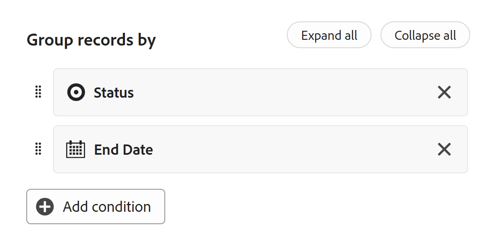
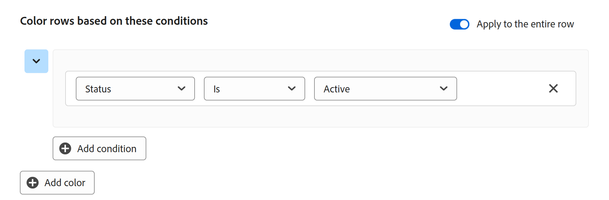

# 테이블 보기 관리

<!--The information highlighted on this page refers to functionality not yet generally available. It is available only in the Preview environment for all customers. After the monthly releases to Production, the same features are also available in the Production environment for customers who enabled fast releases.    

For information about fast releases, see [Enable or disable fast releases for your organization](/help/quicksilver/administration-and-setup/set-up-workfront/configure-system-defaults/enable-fast-release-process.md). -->

{{planning-important-intro}}

Adobe Systems Workfront Planning의 레코드 유형 페이지 페이지에 액세스할 때 테이블 보기에서 레코드와 해당 필드를 표시할 수 있습니다.

레코드 보기 및 관리 방법에 대한 자세한 내용은 [레코드 보기 관리](/help/quicksilver/planning/views/manage-record-views.md)를 참조하세요.

이 문서에서는 다음 정보에 대해 설명합니다.

* [테이블 보기에서 열과 행 만들기 또는 편집](#manage-a-table-view)
* [테이블 보기에 대한 실시간 현재 상태 표시기 활성화](#enable-the-real-time-presence-indicator)

테이블 보기를 Excel 또는 CSV 파일로 내보내는 방법에 대한 자세한 내용은 [테이블 보기에서 레코드 내보내기](/help/quicksilver/planning/records/export-records-from-the-table-view.md)를 참조하십시오.

## 액세스 요구 사항

+++ 액세스 요구 사항을 보려면 확장합니다.

<table style="table-layout:auto"> 
<col> 
</col> 
<col> 
</col> 
<tbody> 
    <tr> 
<tr> 
<td> 
   
 제품
 </td> 
   <td> 
   <ul><li>
 Adobe Workfront
</li> 
   <li>
 Adobe Workfront Planning
</li></ul></td> 
  </tr>   
<tr> 
   <td role="rowheader">
Adobe Systems Workfront 플랜*
</td> 
   <td> 

다음 Workfront 플랜 중 하나:
 
<ul><li>선택</li> 
<li>Prime</li> 
<li>Ultimate</li></ul> 

Workfront Planning은 기존 Workfront 플랜에 사용할 수 없습니다
 
   </td> 
<tr> 
   <td role="rowheader">
Adobe Systems Workfront 계획 패키지*
</td> 
   <td> 

어떤 
 

각 Workfront Planning 플랜에 포함된 항목에 대한 자세한 내용은 Workfront 계정 관리자 관리자에게 문의하십시오. 
 
   </td> 
 <tr> 
   <td role="rowheader">
Adobe Systems Workfront 플랫폼
</td> 
   <td> 

Workfront Planning에 액세스하려면 조직의 Workfront 인스턴스가 Adobe Systems 통합 환경에 온보딩되어 있어야 합니다.
 

자세한 내용은 Adobe Systems Unified Experience for Workfront<a href="/help/quicksilver/workfront-basics/navigate-workfront/workfront-navigation/adobe-unified-experience.md">를 참조하십시오</a>. 
 
   </td> 
   </tr> 
  </tr> 
    <td role="rowheader">
Adobe Systems Workfront 라이선스*
</td> 
   <td>
 보기 작성 및 삭제를 위한 표준

   
보기 요소를 업데이트하는 기여자 이상

   
Workfront Planning은 기존 Workfront 라이선스에 사용할 수 없습니다
 
  </td> 
  </tr> 
  <tr> 
   <td role="rowheader">
액세스 수준 구성
</td> 
   <td> 
Adobe Systems Workfront Planning에 대한 액세스 수준 컨트롤은 없습니다
   
</td> 
  </tr> 
<tr> 
   <td role="rowheader">
개체 사용 권한
</td> 
   <td>   
보기에 대한 사용 권한 관리
  
   
보기 설정을 임시로 변경하거나 복제할 수 있는 보기에 대한 보기 권한
 </td> 
  </tr> 
<tr>
   <td role="rowheader">
레이아웃 템플릿
</td>
   <td> Light 또는 Contributor 라이센스가 있는 사용자에게는 Planning이 포함된 레이아웃 템플릿 정보가 지정되어야 합니다.
   
표준 사용자 및 시스템 관리자는 기본적으로 계획 영역을 사용하도록 설정되어 있습니다.

</li></ul>
</td>
  </tr>
</tbody> 
</table>

*Workfront 액세스 요구 사항에 대한 자세한 내용은 Workfront 설명서[의 액세스 요구 사항을 참조하십시오](/help/quicksilver/administration-and-setup/add-users/access-levels-and-object-permissions/access-level-requirements-in-documentation.md).

+++

## 테이블 보기를 사용하여 레코드 편집

테이블 보기에서만 레코드 정보를 편집할 수 있습니다.

테이블 보기에서 레코드를 편집하는 방법에 대한 자세한 내용은 레코드[ 편집 섹션을 참조하세요](/help/quicksilver/planning/records/edit-records.md).

## 테이블 보기 관리 {#manage-a-table-view}

테이블 뷰를 만들 때 선택한 유형의 모든 레코드가 테이블에 표시됩니다. 각 행은 고유한 레코드이고 각 열은 레코드 필드입니다. 기본적으로 모든 필드와 모든 레코드가 표시됩니다.

테이블 뷰를 관리하려면 다음을 수행합니다.

1. 레코드 보기[ 관리 문서에 ](/help/quicksilver/planning/views/manage-record-views.md)설명된 대로 테이블 보기를 만들기 합니다.

   

1. (선택 사항) 행 높이&#x200B;**를 클릭한**&#x200B;후 다음 옵션 중에서 선택하여 테이블 행의 높이를 수정합니다.
   * 짧음
   * 중간
   * 높음

1. 아래 하위 섹션에 설명된 대로 다음 보기 요소를 업데이트합니다.
   * [열(또는 필드)](#add-columns-or-fields)
   * [행(또는 레코드)](#add-rows-or-records)
   * [필터](#add-filters)
   * [종류](#add-a-sort)
   * [그룹화](#add-groupings)
   * [행 색상](#add-row-colors)
   * [실시간 현재 상태 표시기](#enable-the-real-time-presence-indicator)

### 열 추가 {#add-columns}

테이블 보기의 열 머리글에는 보기의 레코드와 연결된 필드가 표시됩니다. 테이블 보기에 표시된 필드는 레코드의 세부 정보 섹션에도 표시됩니다.

자세한 내용은 레코드[ 편집 섹션을 참조하세요](/help/quicksilver/planning/records/edit-records.md).

<!--this is not available yet:You can display record fields (or columns) in both a table and a timeline view. However, the number of columns displayed in the table of the timeline view is limited and you cannot add columns in addition to those selected by default.-->

뷰에 열을 추가하는 것은 레코드 종류에 필드를 추가하는 것과 동일합니다.

테이블 보기에서 최대 500개의 필드(또는 열)를 추가할 수 있습니다.

1. 레코드 유형 페이지로 이동하여 테이블 보기 탭을 클릭하거나 **+ 보기**&#x200B;를 클릭하여 새 보기를 추가한 다음 **테이블**&#x200B;을 선택합니다.

1. [필드 만들기](/help/quicksilver/planning/fields/create-fields.md) 문서에 설명된 대로 필드(또는 열)를 추가하기 시작합니다.

   추가하는 열은 레코드 유형에 액세스하고 레코드 페이지에서 새 필드로 추가되는 모든 사용자에게 표시됩니다.

1. 다음 중 하나를 수행하여 테이블의 열 순서를 변경합니다.

   * 열 머리글을 잡고 원하는 위치에 끌어서 놓습니다. 이동한 열은 테이블을 다른 방식으로 조정할 때까지 파란색 배경으로 잠깐 표시됩니다.

   * 테이블 도구 모음에서 필드를&#x200B;**클릭한**&#x200B;다음, 원하는 순서로 필드를 드래그 앤 드롭한 다음, 필드 가시성 및 순서&#x200B;**상자 바깥쪽**&#x200B;을 클릭하여 닫습니다.

     

     >[!TIP]
     >
     >* 이름 필드는 기본적으로 항상 테이블 뷰의 첫 번째 필드입니다. 이 필드는 기본 필드로 간주됩니다.
     >
     >* 다른 필드를 기본 필드로 지정하지 않으면 이름 필드를 다른 위치로 이동할 수 없습니다. 자세한 내용은 4단계를 계속 진행합니다. <!--accurate?-->
     >
     >

   * 기본 필드를 변경하여 첫 번째 열의 필드를 다른 필드로 바꾸기. 자세한 내용은 4단계로 진행하십시오. <!--accurate?-->

1. (선택 사항) 테이블의 첫 번째 열에 표시되지 않는 필드의 열 헤더에 있는 필드 이름 위에 마우스를 놓고 필드 이름 오른쪽에 있는 아래쪽 화살표를 클릭한 다음 기본 필드&#x200B;**로 설정을 클릭합니다**.

   

1. 필드&#x200B;**설정을 클릭하여**&#x200B;확인합니다.

   필드는 기본 필드가 되어 테이블 뷰의 첫 번째 열로 표시됩니다. 이전 기본 필드가 두 번째 열로 이동합니다.

   기본 필드는 레코드의 제목이 되어 레코드 페이지 머리글 영역과 레코드가 표시되는 모든 곳에 표시됩니다. 예를 들어, 레코드 제목은 연결된 필드 및 모든 보기에 표시됩니다. 기본 필드에 대한 자세한 내용은 기본 필드 개요를[ 참조하십시오](/help/quicksilver/planning/fields/primary-field-overview.md).

1. 열 구분선을 클릭하고 끌어 원하는 지점에 놓으면 열 너비가 늘어납니다.

   >[!TIP]
   >
   >열 너비 및 순서에 대한 변경 내용은 영구적이며 레코드 종류에 액세스하는 모든 사용자가 볼 수 있습니다.

1. 열 헤더 위로 마우스를 가져간 후 아래쪽을 가리키는 화살표를 클릭하고 필드 숨기기를 클릭합니다 ****

   또는

   테이블 도구 모음에서 필드를&#x200B;**클릭하고**&#x200B;숨기기 필드(또는 열)와 연관된 토글을 비활성화합니다. **필드 가시성 및 순서** 상자가 표시됩니다.

   >[!TIP]
   >
   >숨김 필드의 개수는 도구 모음의 [필드] 아이콘 왼쪽에 표시됩니다.

1. **필드** 아이콘을 클릭하고 테이블 열에 표시할 필드와 연관된 토글을 활성화합니다. 기본적으로 모든 필드가 표시됩니다.

1. 키워드 일치 레코드를 빠르게 찾으려면 다음을 수행하십시오.

   1. **Search** 아이콘  클릭하고 화면에 표시되는 레코드의 필드와 연결된 키워드 입력하기 시작합니다. 검색 항목 옆에 올바른 일치 항목 수가 표시되고 올바른 일치 항목이 있는 필드가 강조 표시됩니다.

      

      화면에 표시되는 단어나 특수 문자를 사용할 수 있습니다.

      테이블 보기에서 숨겨진 필드와 연결된 키워드는 사용할 수 없습니다.

   1. 키보드에서 Enter **키를 눌러**&#x200B;찾은 다음 필드로 이동합니다.

   1. (선택 사항) 일치 항목이 두 개 이상 있는 경우 검색 키워드 오른쪽에 있는 위쪽 및 아래쪽 화살표를 클릭하여 테이블에서 모든 일치 항목을 찾습니다.

   1. **검색 상자에서 x** 아이콘을 클릭하여 검색 키워드를 지웁니다.

### 행(또는 레코드) 추가 {#add-rows}

테이블 보기의 행에는 선택한 레코드 유형의 개별 레코드가 표시됩니다.

레코드 종류에 대해 최대 50,000개의 레코드(또는 행)를 가질 수 있습니다.

1. 레코드 유형 페이지로 이동하여 테이블 보기 탭을 클릭하거나 + 보기&#x200B;**를 클릭하여**&#x200B;새 보기를 추가한 다음 테이블을&#x200B;**선택합니다**.

1. 레코드[ 만들기 문서에 ](/help/quicksilver/planning/records/create-records.md)설명된 대로 레코드(또는 행) 추가 시작

   테이블 보기에 추가한 레코드는 즉시 저장되며 작업 영역에 대해 보기 이상의 사용 권한이 있는 모든 사용자가 볼 수 있습니다.

1. (선택 사항) 각 레코드에 썸네일을 추가하고 테이블의 오른쪽 상단 모서리에 있는 필드를&#x200B;**클릭한**&#x200B;다음 썸네일&#x200B;**필드의**&#x200B;토글을 선택하여 기본 필드 왼쪽에 표시합니다. 기본적으로 선택 취소되어 있습니다.

   자세한 내용은 레코드[에 썸네일 추가를 참조하십시오](/help/quicksilver/planning/records/add-thumbnails-to-records.md).

1. (선택 사항) 행에서 하나 이상의 레코드를 선택한 다음 핸들&#x200B;**아이콘**&#x200B;핸들 아이콘을아 행의 순서를 조정합니다.

   >[!NOTE]
   >
   >테이블 뷰에 하나 이상의 정렬을 적용하는 경우에는 행의 순서를 재정렬할 수 없습니다.
   >
   >행 순서에 대한 변경 사항은 레코드 종류에 액세스하는 모든 사용자가 볼 수 있습니다

<!-- this section below links from the timeline view; consider splitting them if they become different-->

### 필터 추가 {#add-filters}

필터를 사용하면 화면에 표시되는 정보의 양을 줄일 수 있습니다.

테이블 뷰에서 필터 작업을 수행할 때 다음 사항을 고려합니다.

<!-- this list is almost identical to the one for the table view - update both-->

* 테이블 뷰에 대해 만든 필터는 동일한 레코드 종류에 적용될 때 타임라인 보기의 필터와 독립적으로 작동합니다.

* 필터는 사용자가 선택하는 보기에 고유합니다. 동일한 레코드 유형의 두 테이블 뷰에 서로 다른 필터가 적용될 수 있습니다. 동일한 테이블 뷰를 보고 있는 두 사용자는 현재 적용된 동일한 필터를 볼 수 있습니다.

* 빌드 한 필터의 이름을 지정하고 테이블 뷰에 적용 할 수 없습니다.

* 필터를 제거하면 사용자와 동일한 레코드 종류에 액세스하는 모든 사용자로부터 필터가 제거되고 사용하는 것과 동일한 보기가 사용됩니다.

* 연결된 레코드 필드 또는 조회 필드를 기준으로 필터링할 수 있습니다.

* 여러 값을 표시하는 조회 필드를 기준으로 필터링할 수 있습니다.

* 현재 레코드 종류에서 최대 4수준 떨어진 필드를 참조할 수 있습니다. 예를 들어 활동 레코드 종류에 대한 필터를 만들고 활동이 Workfront 프로젝트에 연결된 Campaign 레코드 종류에 연결된 제품 레코드 종류에 연결되어 있는 경우 활동 레코드 종류에 대해 만드는 필터에서 프로젝트의 예산을 참조할 수 있습니다.

테이블 뷰에 필터를 추가하려면:

1. 레코드 보기[ 관리 문서에 설명된 대로 레코드 종류 페이지에 대한 테이블 보기를 만들기 합니다](/help/quicksilver/planning/views/manage-record-views.md).
1. 표 보기를 선택한 다음 표의 오른쪽 상단 모서리에서 **필터**&#x200B;를 클릭합니다.
1. **조건 추가**&#x200B;를 클릭하고 다음 정보를 추가하십시오.

   * **(으)로 필터링할**&#x200B;필드 선택<!-- the tip below might change-->

   * **옵션**(또는 필터 수정자)을 선택하여 필드가 충족해야 하는 조건 종류를 정의합니다.

     아래 표에는 각 필드 유형에 사용할 수 있는 수정자가 표시되어 있습니다.

     <table>
        <thead>
        <tr>
            <th><b>필드 유형</b></th>
            <th><b>한정자</b></th>
        </tr>
        </thead>
        <tbody>
        <tr>
            <td>한 줄, 단락, 수식 </td>
            <td>
다음 포함

            
다음을 포함하지 않음

            
다음과 같음

            
다음이 아님

            
비어 있음

            
비어 있지 않음
</td>
        </tr>
        <tr><td>단일 선택</td>
            <td>
다음과 같음

            
다음이 아님

            
다음 중 하나

            
다음에 해당하지 않음

            
비어 있음

            
비어 있지 않음
</td>
        </tr>
        <tr>
            <td>다중 선택, 사람</td>
            <td>
다음 중 하나 포함

            
다음을 모두 포함

            
다음이 정확함

            
다음 중 어느 것도 포함하지 않음

            
비어 있음

            
비어 있지 않음
</td>
        </tr>
        <tr>
            <td>숫자, 백분율, 통화</td>
            <td>
=

            
≠

            
 &lt; 

            
&gt;

            
≤

            
≥

            
비어 있음

            
비어 있지 않음
</td>
        </tr>
        <tr>
            <td>일자</td>
            <td>
다음과 같음

            
다음이 아님

            
다음 이후

            
다음 이전

            
다음 사이에 있음

다음 사이에 없음

            
비어 있음

비어 있지 않음
</td>
        </tr>

     <tr>
            <td>확인란</td>
            <td>
다음과 같음

        </tr>
        </tbody>
        </table>

   * 선택한 필드의 값을 선택합니다.

   

   추가할 수 있는 필터링 조건 수에는 제한이 없습니다.

1. (선택 사항) 조건&#x200B;**추가를 클릭하여**&#x200B;다른 필터링 옵션을 추가하고 위의 단계를 반복합니다. 적용된 필터 수가 필터 아이콘 왼쪽에 표시됩니다.
1. 다음 연산자를 클릭하여 필터 조건이 결합되고 적용되는 방식을 나타냅니다.

   * **AND**: 지정된 모든 조건이 충족되어야 합니다.
   * **또는**: 지정된 조건 중 하나를 충족해야 합니다. 기본 옵션입니다.

   1. (선택 사항) 여러 조건 그룹 사이에 AND 또는 OR **연산자를 추가합니다**.****

      

   레코드 목록은 자동으로 필터링됩니다.  <!--at this time, you can't name and save the filter - but will this change?!-->
   <!-- asked on the task for the simple filters whether there is a limitation for how many statements a filter can have?!-->

1. (선택 사항) **x** 아이콘을 클릭하여 필터 조건을 제거합니다.
1. (선택 사항) 필터 상자를 닫으려면 **필터**&#x200B;를 클릭합니다. <!--right now you cannot "clear all" for filters, but this might come later-->

### 정렬 추가 {#sort-information}

정렬을 적용하여 주어진 순서로 정보를 구성할 수 있습니다.

다음 정보를 정렬할 수 있습니다.

* 테이블 보기의 모든 레코드. <!--or timeline view. ***********verify this is the case for the timeline view*********************-->
  <!--* All groupings. - this is not available yet-->

테이블 뷰에서 레코드를 정렬할 때 다음 사항을 고려합니다.

<!-- if this is available for the timeline view, update both when you update one-->

* 정렬은 사용자가 선택하는 보기에만 적용됩니다. 동일한 레코드 유형의 두 테이블 뷰에는 서로 다른 정렬 기준이 적용될 수 있습니다. 동일한 테이블 뷰를 보고 있는 두 사용자는 현재 적용된 것과 동일한 정렬을 볼 수 있습니다.

* 빌드 정렬의 이름을 지정하고 테이블 뷰에 적용할 수 없습니다.

* 만든 정렬은 다른 곳으로 이동할 때 유지됩니다.

* 레코드 종류의 테이블 보기에 표시되는 수만큼 필드를 기준으로 정렬할 수 있습니다.

* 연결된 레코드 필드를 기준으로 정렬할 수는 없지만 연결된 레코드 종류의 조회 필드를 기준으로 정렬할 수 있습니다.

* 여러 값(집계에 의해 요약되지 않은)이 있는 조회 필드를 기준으로 정렬하는 경우 첫 번째 값이 정렬에 사용됩니다.

* 정렬 기준을 제거하면 동일한 레코드 종류에 액세스하는 모든 사용자로부터 정렬 기준이 제거되고 사용하는 것과 동일한 보기가 사용됩니다.

* 현재 레코드 종류에서 최대 4수준 떨어진 필드를 참조할 수 있습니다. 예를 들어, 활동 레코드 종류에 대한 정렬을 만들고 활동이 Workfront 프로젝트에 연결된 Campaign 레코드 종류에 연결된 제품 레코드 종류에 연결되어 있는 경우, 활동 레코드 종류에 대해 만드는 정렬에서 프로젝트의 상태 를 참조할 수 있습니다.

레코드를 정렬 <!--ungrouped (add this when sorting for groupings will be available--> 하려면 다음을 수행합니다.

1. 레코드 보기[ 관리 문서에 ](/help/quicksilver/planning/views/manage-record-views.md)설명된 대로 테이블 보기를 만들기 합니다.
1. **테이블의 오른쪽 상단 모서리에 있는 정렬** 아이콘 정렬 아이콘을  클릭합니다

   또는

   테이블 보기에서 열 이름 위에 마우스를 올려 놓고 열 머리글 이름 오른쪽에 있는 아래쪽 화살표를 클릭한 다음 이 필드&#x200B;**로 정렬을 클릭합니다**. 필드가 테이블 뷰의 오른쪽 상단 모서리에 있는 정렬 아이콘에 정렬 선택으로 추가됩니다.

1. (조건부) **레코드 정렬 기준** 상자에서 제안된 필드 중 하나를 클릭하거나 **다른 필드를** 선택하고 다른 필드 검색 다음 목록에 표시되면 클릭합니다.

   정렬은 테이블 보기에 자동으로 적용되며 선택한 기준에 따라 정렬된 레코드가 표시됩니다.

   <!-- add a step that you can rearrange the sorting fields here, when this will be possible-->

1. (선택 사항) 조건&#x200B;**추가를 클릭하고**&#x200B;위의 단계를 반복하여 추가 필드를 기준으로 정렬합니다.

   정렬 기준이 되는 필드 수는 도구 모음의 오른쪽 위 모서리에 있는 정렬 아이콘 왼쪽에 표시됩니다. 테이블 뷰의 열에 표시되는 필드만 선택할 수 있습니다.

1. (선택 사항) **레코드 정렬 기준** 상자에서 정렬 필드 오른쪽에 있는 x **아이콘을 클릭하여**&#x200B;정렬을 제거합니다

   또는

   정렬에서 모든 필드를 제거하려면 모두&#x200B;**지우기를 클릭합니다**.

1. 레코드 정렬 기준&#x200B;**상자 바깥쪽을**&#x200B;클릭하여 닫습니다.

   

   테이블에 표시되는 정보는 선택한 기준에 따라 정렬됩니다.

   정렬을 위해 선택한 필드에는 정렬 아이콘 뒤에 정렬이 적용되는 순서를 나타내는 숫자가 표시됩니다.

### 그룹화 추가 {#add-groupings}

<!--this section exists in the timeline view too, but the display is slightly different, so I kept both steps; consider updating both sections if any updates to groupings are introduced-->

뷰에 그룹화를 적용할 때 유사한 정보로 레코드를 그룹 그룹화할 수 있습니다.

고려해야 합니다.

* 테이블 보기와 타임라인 보기 모두에서 그룹화를 적용할 수 있습니다. 테이블 뷰의 그룹화는 동일한 레코드 유형의 타임라인 뷰에 있는 그룹화와 독립적입니다.
* 하나의 뷰에 3가지 수준의 그룹화를 적용할 수 있습니다. 레코드는 선택한 그룹화 순서대로 그룹화됩니다.
&lt;!--* API 사용 시 최대 4개 수준의 그룹화를 적용할 수 있습니다. --지금은 이것을 확인-->
* 그룹화는 사용자가 선택하는 보기에 고유합니다. 동일한 레코드 유형의 두 테이블 뷰에는 서로 다른 그룹화가 적용될 수 있습니다. 동일한 테이블 뷰를 보고 있는 두 사용자는 현재 적용된 동일한 그룹화를 볼 수 있습니다.
* 테이블 뷰용으로 빌드 한 그룹의 이름을 지정할 수 없습니다.
* 그룹화를 제거하면 사용자와 동일한 레코드 종류에 액세스하고 동일한 보기를 표시하는 모든 사용자로부터 그룹화가 제거됩니다.
* 그룹화 아래에 나열된 레코드를 편집할 수 있습니다.
* 연결된 레코드 필드 또는 조회 필드별로 그룹 그룹화할 수 있습니다.
* 여러 값(집계자에 의해 요약되지 않은)이 있는 필드를 조회하여 그룹 그룹화하는 경우 레코드는 필드 값의 각 고유한 조합으로 그룹화됩니다.
* 현재 레코드 종류에서 최대 4수준 떨어진 필드를 참조할 수 있습니다. 예를 들어, 활동 레코드 종류에 대한 그룹화를 작성하고 활동이 Workfront 프로젝트에 연결된 Campaign 레코드 유형에 연결된 제품 레코드 유형에 연결된 경우, 활동 레코드 종류에 대해 작성하는 그룹화에서 프로젝트의 상태 를 참조할 수 있습니다.
<!--checking into this: * You can apply up to 4 levels of grouping when using the API. -->
<!-- checking also into this: * You cannot group by a Paragraph-type field.-->

그룹화를 추가하려면 다음을 수행하십시오.

1. 레코드 보기[ 관리 문서에 설명된 대로 레코드 종류에 대한 타임라인 보기를 만들기 합니다](/help/quicksilver/planning/views/manage-record-views.md).
1. 테이블 뷰의 오른쪽 위 모서리에서 그룹화&#x200B;**를 클릭합니다**.

   

1. 제안된 필드 중 하나를 클릭하거나 **다른 필드** 선택, 다른 필드 검색, 목록에 표시되면 클릭합니다.

   그룹화는 테이블에 자동으로 적용되며 레코드는 그룹화 구분선 아래에 표시됩니다.

1. (선택 사항) 조건&#x200B;**추가를 클릭하고**&#x200B;위의 단계를 반복하여 최대 3개의 그룹을 추가합니다.

   그룹화를 위해 선택한 필드 수가 그룹화 아이콘 옆에 표시됩니다.

   

1. (선택 사항) **레코드 그룹화 기준** 상자 내에서 그룹화를 위해 선택한 필드의 오른쪽에 있는 x **아이콘을 클릭하여**&#x200B;그룹화를 제거합니다

   또는

   모든 필드를 제거하려면 모두&#x200B;**지우기를 클릭합니다**.

1. **레코드 그룹화 기준** 상자 바깥쪽을 클릭하여 닫습니다.
1. (선택 사항) 그룹화 끝에 있는 **+ 새 레코드**&#x200B;을 클릭하여 새 레코드를 추가한 다음 페이지를 새로 고쳐 새 레코드를 적절한 그룹화에 추가합니다. <!--this might need to be changed when they add the Refresh button on the toolbar of the table view-->

1. 그룹화를 확장하거나 축소하려면 다음 중 하나를 수행합니다.

   1. **그룹화** 아이콘을 클릭한 다음 **모두** 확장 또는 **모두** 축소를 클릭합니다. 이렇게 하면 테이블 뷰의 모든 그룹화 및 하위 그룹이 확장됩니다.

      

   1. 테이블 보기에서 그룹화 머리글 중 하나를 마우스 오른쪽 단추로 클릭한 후 다음 옵션 중 하나를 클릭합니다.
      * **그룹 확장**
      * **그룹 축소**
      * **모두 펼치기**
      * **모두 축소**
      * **하위 그룹 확장**
      * **부분군 축소**

      뷰에 적용하는 그룹화 수에 따라 일부 옵션을 사용하지 못할 수 있습니다.

<!-- this is not available yet: 

To sort grouped records: 

1. Create a view, as described in [Create or edit record views](#create-or-edit-record-views). 
1. ************************* add steps here for sorting grouped records****************

-->

### 행 색상 추가

1. (선택 사항) 행 색상(Row colors **)을 클릭하여**&#x200B;조건을 정의하고 테이블 행에 대한 다른 색상 구성(configure differentent colors for table rows)을 선택합니다.

1. Add color(색상&#x200B;**추가)를 클릭한 다음** Select a field whose value you want to determined the row(행의 색상을 결정할 값을 가진 필드&#x200B;**선택)를 클릭합니다**.

   예를 들어 활성 상태의 캠페인을 녹색으로 표시하려면 상태&#x200B;**를 선택한**&#x200B;다음 수정자와 필드 값을 선택합니다.

   

1. 선택한 조건의 왼쪽 위 모서리에 있는 색상 선택기의 드롭다운 메뉴를 클릭하여 조건의 색상을 선택한 다음 색상 선택기 상자 바깥쪽을 클릭하여 닫습니다.

   

1. (선택 사항) 조건&#x200B;**추가를 클릭하여**&#x200B;첫 번째 조건 세트에 필드와 값을 더 추가합니다

   또는

   색상&#x200B;**추가를 클릭하여**&#x200B;새 조건 세트를 추가하고 새 색상을 식별합니다.

   예를 들어, 새로운 조건 세트를 정의하여 계획 상태의 캠페인을 노란색으로 표시할 수 있습니다.

   

1. (선택 사항) 행 색상 상자의 오른쪽 위 모서리에 있는 전체 행&#x200B;**에 적용 설정을 켭**&#x200B;니다. 조건이 충족되는 전체 행이 선택한 색상으로 자동 표시됩니다.

   >[!NOTE]
   >
   >* 전체 행에 적용 설정이 꺼져 있으면 기본 필드의 왼쪽에만 선택한 색상의 좁은 색상 표시기가 표시됩니다. 이 설정은 기본적으로 꺼져 있습니다.
   >
   >* 테이블 뷰에서 하나 이상의 그룹화를 선택한 경우에는 전체 행에 행 색상을 적용할 수 없습니다.

1. 행 색상&#x200B;**상자 바깥쪽을**&#x200B;클릭하여 닫습니다. 색상이 자동으로 적용됩니다.

### 실시간 현재 상태 표시기 활성화

기본적으로 모든 레코드 보기의 오른쪽 위 모서리에 표시되는 것과 동시에 레코드 정보를 편집하는 다른 사용자의 아바타입니다.

테이블 보기를 표시하면 레코드를 볼 때 다른 사용자 사용자가 편집 중인 필드도 볼 수 있습니다.

1. 레코드 종류 페이지 로 이동하여 보기를 엽니다.
1. (조건부) 선택한 유형의 레코드를 동시에 편집하는 다른 사용자가 있는 경우 해당 아바타가 보기의 오른쪽 상단 모서리에 표시됩니다.
1. 아바타 옆에 있는 드롭다운 메뉴를 클릭하고 공동 작업자&#x200B;**보기 토글을 선택합니다**. 토글은 기본적으로 선택되어 있습니다.

   

1. (조건부) 테이블 뷰를 열면 다른 사용자가 활발하게 편집 중인 필드가 테이블 뷰에서 해당 아바타의 윤곽선에 해당하는 색상으로 강조 표시됩니다.

   아바타의 강조 표시 색상이 회색이면 사용자 30초 이상 전에 레코드 편집을 중지한 것입니다.

   

   >[!TIP]
   >
   >모든 보기에서 공동 작업자&#x200B;**보기 토글을 선택할**&#x200B;수 있습니다. 다른 사용자가 현재 편집한 필드는 테이블 뷰에만 윤곽이 표시됩니다.

