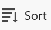

# 표 보기 관리

이 페이지에서 강조 표시된 정보는 아직 일반적으로 사용할 수 없는 기능을 참조합니다. 모든 고객을 위한 미리보기 환경에서만 사용할 수 있습니다. 월별 프로덕션 릴리스 이후 빠른 릴리스를 활성화한 고객을 위해 프로덕션 환경에서도 동일한 기능을 사용할 수 있습니다. 

빠른 릴리스에 대한 자세한 내용은 [조직의 빠른 릴리스 사용 또는 사용 안 함](/help/quicksilver/administration-and-setup/set-up-workfront/configure-system-defaults/enable-fast-release-process.md)을 참조하세요. 

{{planning-important-intro}}

Adobe Workfront Planning의 레코드 유형 페이지에 액세스할 때 테이블 보기에 레코드와 해당 필드를 표시할 수 있습니다.

레코드 보기 및 관리 방법에 대한 자세한 내용은 [레코드 보기 관리](/help/quicksilver/planning/views/manage-record-views.md)를 참조하세요.

이 문서에서는 다음 정보에 대해 설명합니다.

* [테이블 보기에서 열과 행 만들기 또는 편집](#manage-a-table-view)
* [테이블 보기에 대한 실시간 현재 상태 표시기 활성화](#enable-the-real-time-presence-indicator)
* [CSV 또는 Excel 파일로 표 보기 내보내기](#export-the-table-view)

## 액세스 요구 사항

+++ 를 확장하여 액세스 요구 사항을 확인합니다.

<table style="table-layout:auto"> 
<col> 
</col> 
<col> 
</col> 
<tbody> 
    <tr> 
<tr> 
<td> 
   
 제품
 </td> 
   <td> 
   <ul><li>
 Adobe Workfront
</li> 
   <li>
 Adobe Workfront 계획
</li></ul></td> 
  </tr>   
<tr> 
   <td role="rowheader">
Adobe Workfront 플랜*
</td> 
   <td> 

다음 Workfront 플랜 중 하나:
 
<ul><li>선택</li> 
<li>Prime</li> 
<li>Ultimate</li></ul> 

Workfront Planning은 기존 Workfront 플랜에 사용할 수 없습니다.
 
   </td> 
<tr> 
   <td role="rowheader">
Adobe Workfront 계획 패키지*
</td> 
   <td> 

임의 
 

각 Workfront Planning 계획에 포함된 사항에 대한 자세한 내용은 Workfront 계정 관리자에게 문의하십시오. 
 
   </td> 
 <tr> 
   <td role="rowheader">
Adobe Workfront 플랫폼
</td> 
   <td> 

Workfront Planning에 액세스하려면 조직의 Workfront 인스턴스가 Adobe 통합 경험에 온보딩되어야 합니다.
 

자세한 내용은 <a href="/help/quicksilver/workfront-basics/navigate-workfront/workfront-navigation/adobe-unified-experience.md">Workfront용 Adobe 통합 환경</a>을 참조하십시오. 
 
   </td> 
   </tr> 
  </tr> 
  <tr> 
   <td role="rowheader">
Adobe Workfront 라이센스*
</td> 
   <td>
 표준 

   
기존 Workfront 라이선스에는 Workfront Planning을 사용할 수 없습니다.
 
  </td> 
  </tr> 
  <tr> 
   <td role="rowheader">
액세스 수준 구성
</td> 
   <td> 
Adobe Workfront Planning에 대한 액세스 수준 제어가 없습니다.
   
</td> 
  </tr> 
<tr> 
   <td role="rowheader">
개체 권한
</td> 
   <td>   
보기에 대한 권한 관리
  
   
보기에 대한 사용 권한을 보고 보기 설정을 일시적으로 변경하거나, 복제하거나, 하거나, 내보내십시오
 </td> 
  </tr> 
<tr> 
   <td role="rowheader">
레이아웃 템플릿
</td> 
   <td> 
프로덕션 환경에서는 시스템 관리자를 포함한 모든 사용자를 계획 영역이 포함된 레이아웃 템플릿에 할당해야 합니다.

미리보기 환경에서 표준 사용자 및 시스템 관리자는 기본적으로 계획 영역을 사용할 수 있습니다.
</td> 
  </tr> 
</tbody> 
</table>

*Workfront 액세스 요구 사항에 대한 자세한 내용은 Workfront 설명서의 [액세스 요구 사항](/help/quicksilver/administration-and-setup/add-users/access-levels-and-object-permissions/access-level-requirements-in-documentation.md)을 참조하십시오.

+++

## 표 보기를 사용하여 레코드 편집

표 보기에서만 레코드 정보를 편집할 수 있습니다.

표 보기에서 레코드를 편집하는 방법에 대한 자세한 내용은 [레코드 편집](/help/quicksilver/planning/records/edit-records.md)을 참조하십시오.

## 표 보기 관리 {#manage-a-table-view}

테이블 뷰를 만들 때 선택한 유형의 모든 레코드가 테이블에 표시됩니다. 각 행은 고유한 레코드이며 각 열은 레코드 필드입니다. 기본적으로 모든 필드와 모든 레코드가 표시됩니다.

테이블 뷰를 관리하려면 다음을 수행합니다.

1. 문서 [레코드 보기 관리](/help/quicksilver/planning/views/manage-record-views.md)에 설명된 대로 테이블 보기를 만듭니다. 

   

   

1. (선택 사항) **행 높이**&#x200B;를 클릭한 후 다음 옵션 중에서 선택하여 테이블 행의 높이를 수정합니다.
   * 짧음
   * 중간
   * 높음

1. 아래 하위 섹션에 설명된 대로 다음 보기 요소를 업데이트합니다.
   * [열(또는 필드)](#add-columns-or-fields)
   * [행(또는 레코드)](#add-rows-or-records)
   * [필터](#add-filters)
   * [정렬](#add-a-sort)
   * [그룹화](#add-groupings)
   * [행 색](#add-row-colors)
   * [실시간 존재 표시기](#enable-the-real-time-presence-indicator)

### 열(또는 필드) 추가 {#add-columns}

테이블 보기의 열 머리글에는 보기의 레코드와 관련된 필드가 표시됩니다. 표 보기에 표시되는 필드는 레코드의 세부 정보 섹션에도 표시됩니다.

자세한 내용은 [레코드 편집](/help/quicksilver/planning/records/edit-records.md)을 참조하세요.

<!--this is not available yet:You can display record fields (or columns) in both a table and a timeline view. However, the number of columns displayed in the table of the timeline view is limited and you cannot add columns in addition to those selected by default.-->

보기에 열을 추가하는 것은 레코드 유형에 필드를 추가하는 것과 같습니다.

테이블 보기에서 최대 500개의 필드(또는 열)를 추가할 수 있습니다.

1. 레코드 유형 페이지로 이동하여 테이블 보기 탭을 클릭하거나 **+ 보기**&#x200B;를 클릭하여 새 보기를 추가한 다음 **테이블**&#x200B;을 선택합니다.

1. [필드 만들기](/help/quicksilver/planning/fields/create-fields.md) 문서에 설명된 대로 필드(또는 열)를 추가하기 시작합니다.

   추가하는 열은 레코드 유형에 액세스하고 레코드 페이지에서 새 필드로 추가되는 모든 사용자에게 표시됩니다.

1. 다음 중 하나를 수행하여 테이블의 열 순서를 변경합니다.

   * 열 머리글을 잡고 원하는 위치에 끌어서 놓습니다. 테이블을 다시 조정할 때까지 이동한 열이 파란색 배경에 잠시 표시됩니다.

   * 표의 도구 모음에서 **필드**&#x200B;를 클릭한 다음 원하는 순서로 필드를 끌어다 놓은 다음 **필드 표시 및 순서** 상자 외부를 클릭하여 닫습니다.

     

     >[!TIP]
     >
     >* 이름 필드는 기본적으로 항상 테이블 보기의 첫 번째 필드입니다. 이는 기본 필드로 간주됩니다.
     >
     >* 다른 필드를 기본 필드로 지정하지 않는 한 이름 필드를 다른 위치로 이동할 수 없습니다. 자세한 내용을 보려면 4단계를 계속하십시오. <!--accurate?-->
     >
     >

   * 기본 필드를 변경하여 첫 번째 열의 필드를 다른 필드로 바꿉니다. 자세한 내용은 4단계를 계속하십시오. <!--accurate?-->

1. (선택 사항) 테이블의 첫 번째 열에 표시되지 않는 필드의 열 머리글에 있는 필드 이름을 마우스로 가리키고 필드 이름의 오른쪽에 있는 아래쪽 화살표를 클릭한 다음 **기본 필드로 설정**&#x200B;을 클릭합니다.

   

1. 확인하려면 **필드 설정**&#x200B;을 클릭하세요.

   필드는 기본 필드가 되어 테이블 보기의 첫 번째 열로 표시됩니다. 이전 기본 필드가 두 번째 열로 이동합니다.

   기본 필드는 레코드의 제목이 되어 레코드 페이지의 헤더 영역에 표시되고 레코드가 표시되는 모든 곳에 표시됩니다. 예를 들어 레코드 제목은 연결된 필드 및 모든 보기에 표시됩니다. 기본 필드에 대한 자세한 내용은 [기본 필드 개요](/help/quicksilver/planning/fields/primary-field-overview.md)를 참조하십시오.

1. 열 구분선을 클릭하고 드래그하여 원하는 위치에 놓아 열의 너비를 늘립니다.

   >[!TIP]
   >
   >열 너비 및 순서에 대한 변경 사항은 영구적이며 레코드 유형에 액세스하는 모든 사용자에게 표시됩니다.

1. 열 머리글 위로 마우스를 가져간 다음 아래쪽을 가리키는 화살표를 클릭한 다음 **필드 숨기기**&#x200B;를 클릭합니다

   또는

   표 도구 모음에서 **필드**&#x200B;를 클릭하고 숨길 필드와 연결된 토글을 비활성화합니다. **필드 표시 및 순서** 상자가 표시됩니다.

   >[!TIP]
   >
   >도구 모음의 필드 아이콘 왼쪽에 숨겨진 필드 수가 표시됩니다.

1. **필드** 아이콘을 클릭하고 테이블의 열에 표시할 필드와 관련된 토글을 활성화합니다. 기본적으로 모든 필드가 표시됩니다.

1. 키워드와 일치하는 레코드를 빠르게 찾으려면 다음을 수행하십시오.

   1. **검색** 아이콘 을 클릭하고 화면에 표시되는 레코드의 필드와 관련된 키워드를 입력하십시오. 검색 항목 옆에 올바른 일치 항목 수가 표시되고 올바른 일치 항목이 있는 필드가 강조 표시됩니다.

      

      화면에 표시되는 모든 단어 또는 특수 문자를 사용할 수 있습니다.

      테이블 보기에서 숨겨진 필드와 연결된 키워드는 사용할 수 없습니다.

   1. 키보드에서 **Enter**&#x200B;를 눌러 다음 찾은 필드로 이동합니다.

   1. (선택 사항) 일치 항목이 두 개 이상 있는 경우 검색 키워드 오른쪽에 있는 위쪽 및 아래쪽 화살표를 클릭하여 테이블에서 모든 일치 항목을 찾습니다.

   1. 검색 키워드를 지우려면 검색 상자에서 **x** 아이콘을 클릭합니다.

### 행(또는 레코드) 추가 {#add-rows}

테이블 뷰의 행에는 선택한 레코드 유형의 개별 레코드가 표시됩니다.

레코드 유형에 대해 최대 50,000개의 레코드(또는 행)를 가질 수 있습니다.

1. 레코드 유형 페이지로 이동하여 테이블 보기 탭을 클릭하거나 **+ 보기**&#x200B;를 클릭하여 새 보기를 추가한 다음 **테이블**&#x200B;을 선택합니다.

1. [레코드 만들기](/help/quicksilver/planning/records/create-records.md) 문서에 설명된 대로 레코드(또는 행)를 추가하기 시작합니다.

   테이블 보기에서 추가하는 레코드는 즉시 저장되며 작업 공간에 대한 보기 이상의 권한이 있는 모든 사용자에게 표시됩니다.

1. (선택 사항) 각 레코드에 썸네일을 추가하고 표의 오른쪽 상단 모서리에서 **필드**&#x200B;를 클릭한 다음, **썸네일** 필드에 대한 토글을 선택하여 기본 필드의 왼쪽에 표시합니다. 기본적으로 선택되어 있지 않습니다.

   자세한 내용은 [레코드에 썸네일 추가](/help/quicksilver/planning/records/add-thumbnails-to-records.md)를 참조하십시오.

1. (선택 사항) 한 행에서 하나 이상의 레코드를 선택한 다음 레코드 왼쪽에 **handle** 아이콘 을(를) 끌어다 놓아 행 순서를 변경합니다.

   >[!NOTE]
   >
   >테이블 뷰에 정렬을 하나 이상 적용하면 행 순서를 재정렬할 수 없습니다.
   >
   >행 순서에 대한 변경 내용은 레코드 유형에 액세스하는 모든 사용자에게 표시됩니다

<!-- this section below links from the timeline view; consider splitting them if they become different-->

### 필터 추가 {#add-filters}

필터는 화면에 표시되는 정보의 양을 줄이는 데 도움이 됩니다.

표 보기에서 필터를 사용하여 작업할 때는 다음 사항을 고려하십시오.

<!-- this list is almost identical to the one for the table view - update both-->

* 테이블 보기에 대해 만든 필터는 동일한 레코드 유형에 적용될 때 타임라인 보기의 필터와는 독립적으로 작동합니다.

* 필터는 사용자가 선택한 보기에 고유합니다. 동일한 레코드 종류의 두 테이블 보기에는 서로 다른 필터가 적용될 수 있습니다. 동일한 테이블 보기를 보는 두 명의 사용자에게 현재 적용된 동일한 필터가 표시됩니다.

* 테이블 보기에 빌드하고 적용하는 필터의 이름을 지정할 수 없습니다.

* 필터를 제거하면 사용자와 동일한 레코드 유형에 액세스하는 모든 사람에서 필터가 제거되며 사용하는 것과 동일한 보기를 사용합니다.

* 연결된 레코드 필드 또는 조회 필드를 기준으로 필터링할 수 있습니다.

* 여러 값을 표시하는 조회 필드를 기준으로 필터링할 수 있습니다.

* 현재 레코드 유형에서 최대 4개 수준까지 떨어진 필드를 참조할 수 있습니다. 예를 들어 활동 레코드 유형에 대한 필터를 만드는 경우 활동이 Workfront 프로젝트에 연결된 캠페인 레코드 유형에 연결된 제품 레코드 유형에 연결된 경우 활동 레코드 유형에 대해 만들고 있는 필터에서 프로젝트의 예산을 참조할 수 있습니다.

테이블 보기에 필터를 추가하려면 다음 작업을 수행하십시오.

1. [레코드 보기 관리](/help/quicksilver/planning/views/manage-record-views.md) 문서에 설명된 대로 레코드 유형 페이지에 대한 테이블 보기를 만듭니다.
1. 표 보기를 선택한 다음 표의 오른쪽 상단 모서리에서 **필터**&#x200B;를 클릭합니다.
1. **조건 추가**&#x200B;를 클릭하고 다음 정보를 추가하십시오.

   * **(으)로 필터링할**&#x200B;필드 선택<!-- the tip below might change-->

   * **옵션**(또는 필터 수정자)을 선택하여 필드가 충족해야 하는 조건 종류를 정의합니다.

     아래 표에는 각 필드 유형에 사용할 수 있는 수정자가 표시됩니다.

     <table>
        <thead>
        <tr>
            <th><b>필드 유형</b></th>
            <th><b>수정자</b></th>
        </tr>
        </thead>
        <tbody>
        <tr>
            <td>한 줄, 단락, 공식 </td>
            <td>
다음 포함

            
다음을 포함하지 않음

            
다음과 같음

            
다음이 아님

            
비어 있음

            
비어 있지 않음
</td>
        </tr>
        <tr><td>단일 선택</td>
            <td>
다음과 같음

            
다음이 아님

            
다음 중 하나

            
다음에 해당하지 않음

            
비어 있음

            
비어 있지 않음
</td>
        </tr>
        <tr>
            <td>다중 선택, 사람</td>
            <td>
다음 중 하나 포함

            
다음을 모두 포함

            
다음이 정확함

            
다음 중 어느 것도 포함하지 않음

            
비어 있음

            
비어 있지 않음
</td>
        </tr>
        <tr>
            <td>숫자, 백분율, 통화</td>
            <td>
=

            
≠

            
 &lt; 

            
&gt;

            
≤

            
≥

            
비어 있음

            
비어 있지 않음
</td>
        </tr>
        <tr>
            <td>일자</td>
            <td>
다음과 같음

            
다음이 아님

            
다음 이후

            
다음 이전

            
다음 사이에 있음

다음 사이에 없음

            
비어 있음

비어 있지 않음
</td>
        </tr>

     <tr>
            <td>확인란</td>
            <td>
다음과 같음

        </tr>
        </tbody>
        </table>

   * 선택한 필드의 값을 선택합니다.

   

   추가할 수 있는 필터링 조건 수에는 제한이 없습니다.

1. (선택 사항) 다른 필터링 옵션을 추가하고 위의 단계를 반복하려면 **조건 추가**&#x200B;를 클릭하십시오. 적용된 필터 수는 필터 아이콘 왼쪽에 표시됩니다.
1. 다음 연산자를 클릭하여 필터 조건이 조인되고 적용되어야 하는 방식을 나타냅니다.

   * **AND**: 지정한 조건을 모두 충족해야 합니다.
   * **OR**: 지정한 조건을 모두 충족해야 합니다. 기본 옵션입니다.

   1. (선택 사항) 여러 조건 그룹화 사이에 **AND** 또는 **OR** 연산자를 더 추가합니다.

      

   레코드 목록은 자동으로 필터링됩니다.  <!--at this time, you can't name and save the filter - but will this change?!-->
   <!-- asked on the task for the simple filters whether there is a limitation for how many statements a filter can have?!-->

1. (선택 사항) 필터 조건을 제거하려면 **x** 아이콘을 클릭하십시오.
1. (선택 사항) 필터 상자를 닫으려면 **필터**&#x200B;를 클릭합니다. <!--right now you cannot "clear all" for filters, but this might come later-->

### 정렬 추가 {#sort-information}

정렬을 적용하여 주어진 순서로 정보를 구성할 수 있습니다.

다음 정보를 정렬할 수 있습니다.

* 테이블 보기의 모든 레코드. <!--or timeline view. ***********verify this is the case for the timeline view*********************-->
  <!--* All groupings. - this is not available yet-->

표 보기에서 레코드를 정렬할 때는 다음 사항을 고려하십시오.

<!-- if this is available for the timeline view, update both when you update one-->

* 정렬은 선택하는 보기에 고유합니다. 동일한 레코드 종류의 두 테이블 보기에는 서로 다른 정렬 기준이 적용될 수 있습니다. 동일한 테이블 보기를 보는 두 명의 사용자에게 현재 적용된 동일한 정렬이 표시됩니다.

* 작성하여 테이블 보기에 적용하는 정렬 이름은 지정할 수 없습니다.

* 정렬은 이동할 때 유지됩니다.

* 레코드 유형의 테이블 보기에 표시되는 수만큼 필드를 정렬할 수 있습니다.

* 연결된 레코드 필드별로 정렬할 수는 없지만 연결된 레코드 유형에서 조회 필드별로 정렬할 수는 있습니다.

* 집계기에 의해 요약되지 않은 여러 값이 있는 조회 필드를 기준으로 정렬하면 첫 번째 값이 정렬에 사용됩니다.

* 정렬 기준을 제거하면 사용자와 동일한 레코드 유형에 액세스하는 모든 사람에서 정렬 기준이 제거되며 사용하는 것과 동일한 보기를 사용합니다.

* 현재 레코드 유형에서 최대 4개 수준까지 떨어진 필드를 참조할 수 있습니다. 예를 들어 활동 레코드 유형에 대한 정렬을 생성하고 활동이 Workfront 프로젝트에 연결된 캠페인 레코드 유형에 연결된 제품 레코드 유형에 연결된 경우 활동 레코드 유형에 대해 생성 중인 정렬에서 프로젝트의 상태를 참조할 수 있습니다.

<!--ungrouped (add this when sorting for groupings will be available-->개의 레코드를 정렬하려면 다음을 수행하십시오.

1. [레코드 보기 관리](/help/quicksilver/planning/views/manage-record-views.md) 문서에 설명된 대로 테이블 보기를 만듭니다.
1. 표의 오른쪽 위 모서리에 있는 **정렬** 아이콘 을 클릭합니다

   또는

   테이블 보기의 열 이름 위에 마우스를 놓고 열 머리글 이름 오른쪽에 있는 아래쪽 화살표를 클릭한 다음 **이 필드별로 정렬**&#x200B;을 클릭합니다. 필드는 표 보기의 오른쪽 위 모서리에 있는 정렬 아이콘에서 정렬 선택 항목으로 추가됩니다.

1. (조건부) **레코드 정렬 기준** 상자에서 제안된 필드 중 하나를 클릭하거나 **다른 필드를 선택하고**&#x200B;다른 필드를 검색하여 찾은 다음 목록에 표시될 때 클릭합니다.

   정렬은 테이블 보기에 자동으로 적용되며 선택한 기준에 따라 정렬된 레코드가 표시됩니다.

   <!-- add a step that you can rearrange the sorting fields here, when this will be possible-->

1. (선택 사항) **조건 추가**&#x200B;를 클릭하고 위의 단계를 반복하여 추가 필드를 기준으로 정렬합니다.

   정렬하려는 필드 수는 도구 모음의 오른쪽 위 모서리에 있는 정렬 아이콘 왼쪽에 표시됩니다. 테이블 뷰의 열에 표시되는 필드만 선택할 수 있습니다.

1. (선택 사항) **레코드 정렬 기준** 상자에서 정렬 필드 오른쪽의 **x** 아이콘을 클릭하여 정렬을 제거합니다

   또는

   정렬에서 모든 필드를 제거하려면 **모두 지우기**&#x200B;를 클릭하십시오.

1. 닫으려면 **레코드 정렬 기준** 상자 외부를 클릭합니다.

   

   표에 표시된 정보는 선택한 기준에 따라 정렬됩니다.

   정렬하기 위해 선택한 필드에는 정렬 아이콘이 표시되고 그 뒤에 정렬이 적용되는 순서를 나타내는 숫자가 표시됩니다.

### 그룹화 추가 {#add-groupings}

<!--this section exists in the timeline view too, but the display is slightly different, so I kept both steps; consider updating both sections if any updates to groupings are introduced-->

보기에 그룹화를 적용할 때 유사한 정보별로 레코드를 그룹화할 수 있습니다.

다음 사항을 고려하십시오.

* 표 및 타임라인 보기에서 그룹화를 적용할 수 있습니다. 테이블 보기의 그룹화는 동일한 레코드 유형의 타임라인 보기의 그룹화와는 독립적입니다.
* 보기에서 3가지 수준의 그룹화를 적용할 수 있습니다. 선택한 그룹화 순서대로 레코드가 그룹화됩니다.
&lt;!—* API를 사용할 때 최대 4가지 수준의 그룹화를 적용할 수 있습니다. —현재 이 항목을 확인하고 있습니다—>
* 그룹화는 선택하는 보기에 대해 고유합니다. 동일한 레코드 종류의 두 테이블 보기에는 서로 다른 그룹화가 적용될 수 있습니다. 동일한 테이블 보기를 보는 두 명의 사용자에게 현재 적용된 동일한 그룹화가 표시됩니다.
* 테이블 보기에 대해 빌드하는 그룹화의 이름을 지정할 수 없습니다.
* 그룹화를 제거하면 사용자와 동일한 레코드 유형에 액세스하거나 사용자와 동일한 보기를 표시하는 모든 사용자에게서 그룹화가 제거됩니다.
* 그룹화 아래에 나열된 레코드를 편집할 수 있습니다.
* 연결된 레코드 필드 또는 조회 필드를 기준으로 그룹화할 수 있습니다.
* 집계자가 요약하지 않은 여러 값이 있는 조회 필드를 기준으로 그룹화하면, 레코드는 각 필드 값의 고유한 조합으로 그룹화됩니다.
* 현재 레코드 유형에서 최대 4개 수준까지 떨어진 필드를 참조할 수 있습니다. 예를 들어, 활동 레코드 유형에 대한 그룹화를 만드는 중에 활동이 Workfront 프로젝트에 연결된 캠페인 레코드 유형에 연결된 제품 레코드 유형에 연결된 경우, 활동 레코드 유형에 대해 만들고 있는 그룹화에서 프로젝트의 상태를 참조할 수 있습니다.
<!--checking into this: * You can apply up to 4 levels of grouping when using the API. -->
<!-- checking also into this: * You cannot group by a Paragraph-type field.-->

그룹화를 추가하려면:

1. [레코드 보기 관리](/help/quicksilver/planning/views/manage-record-views.md) 문서에 설명된 대로 레코드 유형에 대한 타임라인 보기를 만듭니다.
1. 테이블 보기의 오른쪽 위 모서리에서 **그룹화**&#x200B;을 클릭합니다.

   

1. 제안된 필드 중 하나를 클릭하거나 **다른 필드 선택**&#x200B;을 클릭하고 다른 필드를 검색한 다음 목록에 표시될 때 해당 필드를 클릭합니다.

   그룹화가 테이블에 자동으로 적용되며 그룹화 구분선 아래에 레코드가 표시됩니다.

1. (선택 사항) **조건 추가**&#x200B;를 클릭하고 위의 단계를 반복하여 최대 3개의 그룹화를 추가합니다.

   그룹화를 위해 선택한 필드 수가 그룹화 아이콘 옆에 표시됩니다.

   

1. (선택 사항) **레코드 그룹화 기준** 상자 내에서 그룹화를 위해 선택한 필드 오른쪽에 있는 **x** 아이콘을 클릭하여 그룹화를 제거합니다

   또는

   모든 필드를 제거하려면 **모두 지우기**&#x200B;를 클릭하십시오.

1. **레코드 그룹화 기준** 상자 바깥쪽을 클릭하여 닫습니다.
1. (선택 사항) 그룹화 끝에 있는 **+ 새 레코드**&#x200B;을 클릭하여 새 레코드를 추가한 다음 페이지를 새로 고쳐 새 레코드를 적절한 그룹화에 추가합니다. <!--this might need to be changed when they add the Refresh button on the toolbar of the table view-->

1. 그룹화를 확장하거나 축소하려면 다음 중 하나를 실행하십시오.

   

   1. **그룹화** 아이콘을 클릭한 다음 **모두 확장** 또는 **모두 축소**&#x200B;을 클릭합니다. 이렇게 하면 테이블 보기의 모든 그룹화 및 하위 그룹화가 확장됩니다.

      

   1. 테이블 보기에서 그룹화 헤더를 마우스 오른쪽 단추로 클릭한 후 다음 옵션 중 하나를 클릭합니다.
      * **그룹 확장**
      * **그룹 축소**
      * **모두 확장**
      * **모두 축소**
      * **하위 그룹 확장**
      * **하위 그룹 축소**

      보기에 적용되는 그룹화 수에 따라 일부 옵션을 사용할 수 없습니다.

<!-- this is not available yet: 

To sort grouped records: 

1. Create a view, as described in [Create or edit record views](#create-or-edit-record-views). 
1. ************************* add steps here for sorting grouped records****************

-->

### 행 색상 추가

1. (선택 사항) **행 색**&#x200B;을 클릭하여 조건을 정의하고 표 행에 다른 색 구성을 선택합니다.

1. **색상 추가**&#x200B;를 클릭한 다음 **값을 지정할 필드 선택**&#x200B;을 클릭합니다.

   예를 들어 상태가 활성인 캠페인을 녹색으로 표시하려면 **상태**&#x200B;를 선택한 다음 필드에 대한 수정자와 값을 선택합니다.

   

1. 선택한 조건의 왼쪽 위 모서리에 있는 색상 피커에 대한 드롭다운 메뉴를 클릭하여 조건에 대한 색상을 선택한 다음 색상 피커 상자 외부를 클릭하여 닫습니다.

   

1. (선택 사항) **조건 추가**&#x200B;를 클릭하여 첫 번째 조건 집합에 더 많은 필드와 값을 추가합니다

   또는

   새 조건 집합을 추가하고 새 색을 식별하려면 **색 추가**&#x200B;를 클릭하세요.

   예를 들어 새 조건 세트를 정의하여 캠페인을 계획 상태에서 노란색으로 표시할 수 있습니다.

   

1. (선택 사항) [행 색상] 상자의 오른쪽 위 모서리에 있는 **전체 행에 적용** 설정을 켭니다. 조건이 충족되는 전체 행이 선택한 색상으로 자동으로 표시됩니다.

   >[!NOTE]
   >
   >* 전체 행에 적용 설정이 해제되어 있으면 기본 필드의 왼쪽에만 선택한 색상으로 좁은 색상 표시기가 표시됩니다. 이 설정은 기본적으로 꺼져 있습니다.
   >
   >* 테이블 보기에서 하나 이상의 그룹화를 선택한 경우 전체 행에 행 색상을 적용할 수 없습니다.

1. **행 색** 상자 바깥쪽을 클릭하여 닫습니다. 색상이 자동으로 적용됩니다.

### 실시간 현재 상태 표시기 활성화

기본적으로 모든 레코드 보기의 오른쪽 위 모서리에 표시함과 동시에 레코드 정보를 편집하는 다른 사용자의 아바타입니다.

표 보기를 표시할 때 레코드를 볼 때 다른 사용자가 편집하고 있는 필드를 볼 수도 있습니다.

1. 레코드 유형 페이지로 이동하여 보기를 엽니다.
1. (조건부) 선택한 유형의 레코드를 편집하는 다른 사용자가 동시에 있는 경우, 해당 아바타가 보기의 오른쪽 상단에 표시됩니다.
1. 아바타 옆에 있는 드롭다운 메뉴를 클릭하고 **공동 작업자 표시** 토글을 선택합니다. 기본적으로 토글이 선택됩니다.

   

1. (조건부) 표 보기를 열면 다른 사람이 활발하게 편집하고 있는 필드가 표 보기에서 아바타의 윤곽에 해당하는 색으로 강조 표시됩니다.

   아바타의 강조 색상이 회색이면 사용자는 30초 이상 전에 레코드 편집을 중지했습니다.

   

   >[!TIP]
   >
   >모든 보기에서 **공동 작업자 표시** 전환을 선택할 수 있습니다. 현재 다른 사용자가 편집한 필드는 테이블 보기에서만 윤곽선이 표시됩니다.

## 테이블 보기 내보내기

표 보기의 정보를 CSV 또는 Excel 파일로 내보낼 수 있습니다.

테이블 뷰를 내보낼 때는 다음 사항을 고려하십시오.

* Excel 파일로 내보낸 정보는 Workfront Planning의 테이블 보기에 적용된 필터, 그룹화 및 정렬을 유지합니다. 그룹화는 CSV 파일에 표시되지 않습니다.

* 내보낸 파일에는 축소판 및 사용자 정의 행 색상이 지원되지 않습니다.

* Workfront 인터페이스에 표시된 필드만 내보내집니다. 숨겨진 필드는 내보내지 않습니다.

테이블 뷰 또는 레코드 유형에서 정보를 내보내려면 다음을 수행합니다.

1. 레코드 유형 페이지로 이동하고 표 보기 탭을 클릭합니다.
1. 다음 중 하나를 수행하십시오.

   * 테이블 보기 탭의 이름을 마우스로 가리킨 다음 보기 이름의 오른쪽에 있는 **자세히** 메뉴 를 클릭한 다음 **내보내기**&#x200B;를 클릭합니다.

   

   * **공유** > **현재 보기 내보내기**&#x200B;를 클릭합니다. 이 옵션은 테이블 뷰를 표시하는 경우에만 사용할 수 있습니다.

   

1. 다음 형식 중 하나를 선택합니다.

   * **Excel**
   * **CSV**

   >[!IMPORTANT]
   >
   >다른 보기를 화면에 표시할 때는 표 보기에서 정보를 내보낼 수 없습니다. 기타 메뉴의 내보내기 옵션에 액세스하려면 내보낼 테이블 뷰를 표시해야 합니다.

   파일이 컴퓨터에 다운로드됩니다.

1. (선택 사항) 컴퓨터의 다운로드 폴더로 이동하여 다운로드한 파일을 찾습니다.

   내보낸 파일의 이름은 다음 형식을 따릅니다.

   `Name of the view - name of the record type`

   예를 들어 Campaigns 레코드 형식의 테이블 보기는 이름이 `Table view - Campaigns`인 파일을 생성합니다.

   파일에는 다음 정보가 표시됩니다.

   * 열 머리글은 Excel 파일에서 검은색으로 강조 표시됩니다
   * Workfront 인터페이스에 표시되는 모든 필드를 동일한 기준으로 정렬 및 필터링합니다
   * 그룹화는 Excel 파일에서 유지됩니다

   이제 내보낸 파일을 다른 사용자와 공유하거나 모든 통신에 첨부할 수 있습니다.

