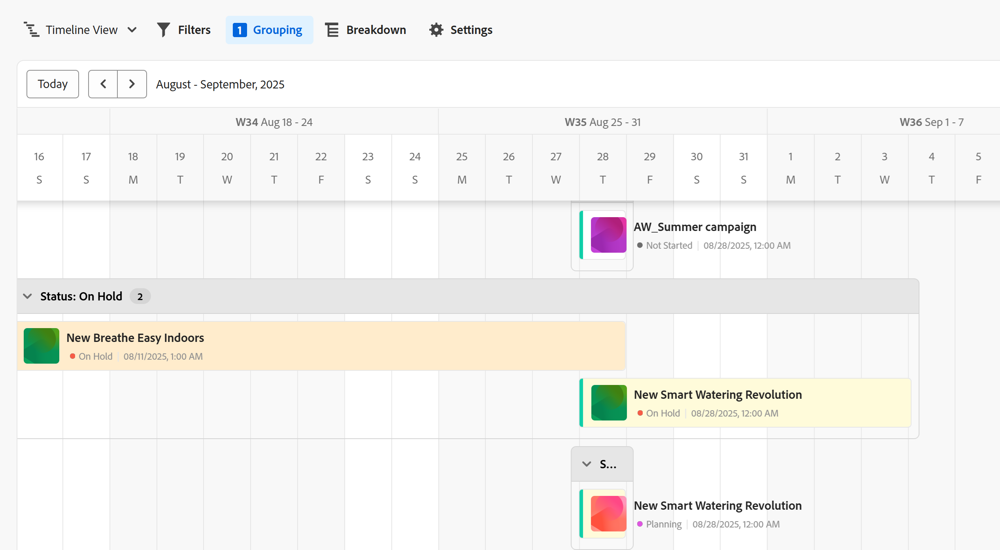
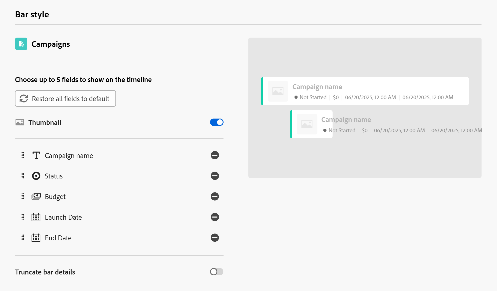
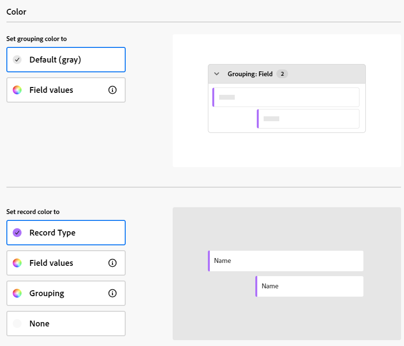
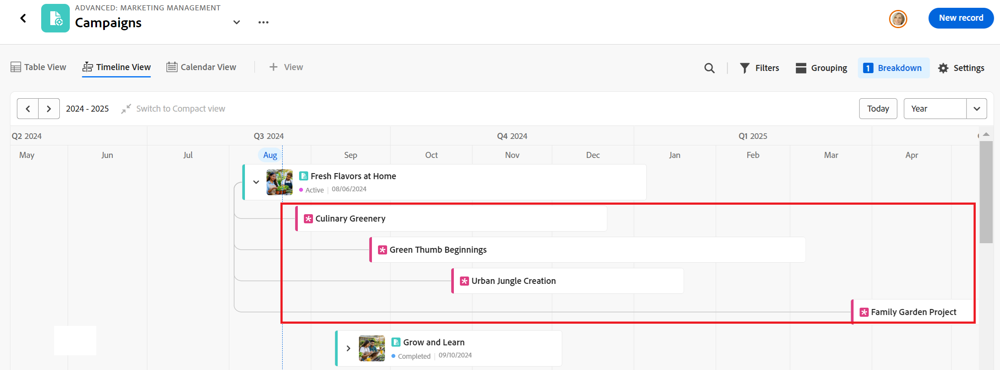

# 타임라인 보기 관리

이 페이지에서 강조 표시된 정보는 아직 일반적으로 사용할 수 없는 기능을 참조합니다. 모든 고객을 위한 미리보기 환경에서만 사용할 수 있습니다. 월별 프로덕션 릴리스 이후 빠른 릴리스를 활성화한 고객을 위해 프로덕션 환경에서도 동일한 기능을 사용할 수 있습니다. 

빠른 릴리스에 대한 자세한 내용은 [조직의 빠른 릴리스 사용 또는 사용 안 함](/help/quicksilver/administration-and-setup/set-up-workfront/configure-system-defaults/enable-fast-release-process.md)을 참조하세요. 

{{planning-important-intro}}

Adobe Workfront Planning의 레코드 유형 페이지에 액세스할 때 타임라인 보기에 레코드를 표시할 수 있습니다.

레코드 보기에 대한 자세한 내용은 [레코드 보기 관리](/help/quicksilver/planning/views/manage-record-views.md)를 참조하십시오.

## 액세스 요구 사항

+++ 를 확장하여 액세스 요구 사항을 확인합니다. 

<table style="table-layout:auto"> 
<col> 
</col> 
<col> 
</col> 
<tbody> 
    <tr> 
<tr> 
<td> 
   
 제품
 </td> 
   <td> 
   <ul><li>
 Adobe Workfront
</li> 
   <li>
 Adobe Workfront 계획
</li></ul></td> 
  </tr>   
<tr> 
   <td role="rowheader">
Adobe Workfront 플랜*
</td> 
   <td> 

다음 Workfront 플랜 중 하나:
 
<ul><li>선택</li> 
<li>Prime</li> 
<li>Ultimate</li></ul> 

Workfront Planning은 기존 Workfront 플랜에 사용할 수 없습니다.
 
   </td> 
<tr> 
   <td role="rowheader">
Adobe Workfront 계획 패키지*
</td> 
   <td> 

임의 
 

각 Workfront Planning 계획에 포함된 사항에 대한 자세한 내용은 Workfront 계정 관리자에게 문의하십시오. 
 
   </td> 
 <tr> 
   <td role="rowheader">
Adobe Workfront 플랫폼
</td> 
   <td> 

Workfront Planning에 액세스하려면 조직의 Workfront 인스턴스가 Adobe 통합 경험에 온보딩되어야 합니다.
 

자세한 내용은 <a href="/help/quicksilver/workfront-basics/navigate-workfront/workfront-navigation/adobe-unified-experience.md">Workfront용 Adobe 통합 환경</a>을 참조하십시오. 
 
   </td> 
   </tr> 
  </tr> 
    <td role="rowheader">
Adobe Workfront 라이센스*
</td> 
   <td>
 보기를 만들고 삭제하는 표준

   
기여자 이상: 보기 요소 업데이트

   
기존 Workfront 라이선스에는 Workfront Planning을 사용할 수 없습니다.
 
  </td> 
  </tr> 
  <tr> 
   <td role="rowheader">
액세스 수준 구성
</td> 
   <td> 
Adobe Workfront Planning에 대한 액세스 수준 제어가 없습니다.
   
</td> 
  </tr> 
<tr> 
   <td role="rowheader">
개체 권한
</td> 
   <td>   
보기에 대한 권한 관리
  
   
보기에 대한 권한을 보고 일시적으로 보기 설정을 변경하거나 복제합니다.
 </td> 
  </tr> 
<tr>
   <td role="rowheader">
레이아웃 템플릿
</td>
   <td> 라이트 또는 기여자 라이선스가 있는 사용자에게 Planning이 포함된 레이아웃 템플릿을 할당해야 합니다.
   
표준 사용자 및 시스템 관리자에게는 기본적으로 계획 영역이 활성화되어 있습니다.

</li></ul>
</td>
  </tr>
</tbody> 
</table>

*Workfront 액세스 요구 사항에 대한 자세한 내용은 Workfront 설명서의 [액세스 요구 사항](/help/quicksilver/administration-and-setup/add-users/access-levels-and-object-permissions/access-level-requirements-in-documentation.md)을 참조하십시오.

+++     

## 타임라인 보기 관리 {#manage-a-timeline-view}

타임라인 보기를 만들 때 선택한 레코드 유형의 모든 레코드가 시간 순서대로 표시됩니다.

다음 사항을 고려하십시오.

* 레코드 유형과 연결된 날짜 필드가 두 개 이상 있는 경우에만 타임라인 보기를 만들 수 있습니다. 레코드 유형과 연관된 날짜 필드가 하나 또는 하나도 없으면 타임라인 보기 옵션이 흐리게 표시됩니다.

  타임라인 보기를 작성할 때 다음 날짜 필드 중에서 선택할 수 있습니다.

   * 날짜 기록
   * 시스템 생성 필드 기록: 생성 날짜, 마지막 수정 날짜
   * 연결된 레코드 또는 개체 유형에서 날짜를 조회합니다(레코드 또는 개체 유형을 연결했을 때 집계자를 추가한 경우에만).
* 레코드와 연결된 날짜에 따라 다음 시나리오에서 일부 레코드가 타임라인 보기에 표시되지 않을 수 있습니다.

   * 시작 및 종료 날짜에 값이 없는 경우
   * 시작 또는 종료 날짜에 값이 없는 경우
   * 시작 일자가 종료 일자 이후인 경우

* 타임라인 보기에서 레코드를 만들고 편집할 수 있습니다. 자세한 내용은 [레코드 만들기](/help/quicksilver/planning/records/create-records.md)를 참조하세요.
* 을 클릭한 다음 새 위치에서 해당 레코드 막대를 끌어서 놓아 타임라인 보기에서 레코드 막대의 크기를 조정할 수 있습니다. 레코드 막대의 크기를 조정하면 시작 및 종료 날짜가 즉시 업데이트됩니다. 자세한 내용은 [레코드 편집](/help/quicksilver/planning/records/edit-records.md)을 참조하세요.

타임라인 보기를 관리하려면 다음을 수행합니다.

1. 타임라인을 보려는 레코드 유형 페이지로 이동합니다.
1. [레코드 보기 관리](/help/quicksilver/planning/views/manage-record-views.md) 문서에 설명된 대로 타임라인 보기를 만듭니다.

   

   선택한 레코드 유형과 연관된 레코드는 타임라인에 막대로 표시되며 기본적으로 시작 날짜의 시간순으로 정렬됩니다.

   >[!TIP]
   >
   >    타임라인에서 레코드 정렬이 약식 보기에 표시되지 않습니다.

1. (조건부) 관리자가 사용자 정의 분기를 활성화한 경우 Workfront에서 사용자 정의 분기가 구성되는 방식과 관련된 문제를 감지하면 타임라인 보기를 열 때 경고를 받을 수 있습니다.

   다음과 같은 시나리오가 있습니다.

   * 분기 날짜 사이에 공백이나 겹침이 발견되면 사용자 정의 분기를 설정할 수 있고 편집해야 한다는 알림이 표시될 수 있습니다.

     

     >[!TIP]
     >
     >이 메시지는 조직이 구매하기 전에 Planning 및 사용자 정의 분기가 이미 활성화된 직후에만 표시되어야 합니다. 조직에 대해 Workfront Planning을 활성화한 후에는 분기 간 중복 및 간격이 허용되지 않습니다.

   * 분기가 부분적으로 설정되어 있고 동일한 연도 내의 일부 월이 누락된 경우 스크롤하여 누락된 분기로 나머지 연도를 설정해야 한다는 누락된 분기를 표시할 때 알림을 받을 수 있습니다.

   

   사용자 정의 분기에 대한 경고 메시지는 각 사용자당 한 번씩 표시됩니다.

   >[!NOTE]
   >
   >사용자 정의 분기가 제대로 저장되지 않은 경우 타임라인 보기에 클래식 분기가 표시됩니다.
   >설정 영역에서 사용자 정의 분기를 설정하면 타임라인 보기에 클래식 분기 대신 사용자 정의 분기가 표시됩니다.
   >자세한 내용은 [사용자 정의 영역 사용](/help/quicksilver/administration-and-setup/set-up-workfront/configure-system-defaults/enable-custom-quarters-projects.md)을 참조하세요.

1. (조건부) Workfront 관리자인 경우 **설정으로 이동**&#x200B;을 클릭하여 분기를 설정합니다. 그렇지 않은 경우 **확인**&#x200B;을 클릭하고 Workfront 관리자에게 사용자 지정 분기를 설정하도록 요청하십시오.

   >[!TIP]
   >
   >설정으로 이동 버튼은 Workfront 관리자에 대해서만 표시됩니다.

1. (선택 사항 및 조건부) 레코드 이름이 잘리면 레코드 막대 위로 마우스를 가져가 레코드의 전체 이름 및 추가 정보를 표시합니다. 타임라인에서 레코드 막대 자르기 설정에 대한 자세한 내용은 이 문서의 [타임라인 보기 설정 편집](#edit-the-timeline-view-settings) 섹션을 참조하십시오.

1. 다음 중 하나를 수행하여 타임라인을 탐색합니다.

   * 왼쪽 위 모서리에서 왼쪽 및 오른쪽 아이콘을 클릭하거나 가로 스크롤을 사용하여 타임라인에서 앞뒤로 이동합니다. 페이지를 새로 고치면 선택한 시간대가 유지됩니다.
   * 타임라인을 오늘 날짜로 맞추려면 오른쪽 상단의 **오늘**&#x200B;을 클릭하세요.
   * 시간 증분을 업데이트하고 보기를 업데이트하려면 시간대 드롭다운 메뉴에서 다음 옵션 중 하나를 선택합니다.

      * **연도**: 연도 표시가 있는 분기와 월을 표시합니다.
      * **분기**: 분기가 표시된 월과 주를 표시합니다.
      * **월**: 주 및 일을 표시합니다.
1. (선택 사항) 날짜가 같은 줄에 겹치지 않는 레코드를 표시하려면 **작게 보기로 전환**&#x200B;을 클릭합니다. <!--check to see if they updated the name of the setting here-->
1. (조건부) 모드를 **작게**(으)로 변경한 경우 **표준 보기로 전환** 보기를 클릭하여 레코드를 별도의 줄로 표시합니다. **표준** 옵션이 기본값입니다.  <!--check to see if they updated the name of the setting here-->

1. 키워드와 일치하는 레코드를 빠르게 찾으려면 다음을 수행하십시오.

   1. **검색** 아이콘 을 클릭하고 화면에 표시되는 레코드의 필드와 관련된 키워드를 입력하십시오. 검색 항목 옆에 올바른 일치 수가 표시되고 올바른 일치 항목이 있는 레코드가 강조 표시됩니다.

      

      화면에 표시되는 모든 단어 또는 특수 문자를 사용할 수 있습니다.

      타임라인 보기에 표시되지 않는 필드와 연결된 키워드는 사용할 수 없습니다.

   1. 키보드에서 Enter 키를 눌러 다음 찾은 필드로 이동합니다.
   1. (선택 사항) 일치 항목이 두 개 이상 있는 경우 검색 키워드 오른쪽에 있는 위쪽 및 아래쪽 화살표를 클릭하여 테이블에서 모든 일치 항목을 찾습니다.
   1. 검색 키워드를 지우려면 검색 상자에서 **x** 아이콘을 클릭합니다.

   1. (선택 사항) **전체 화면** 아이콘 을 클릭하여 전체 화면에서 보기를 연 다음 **전체 화면 종료** 아이콘  또는 키보드에서 Esc 키를 눌러 전체 화면을 종료합니다.  

1. 아래 하위 섹션에 설명된 대로 다음 보기 요소를 업데이트합니다.
   * [필터](#add-filters)
   * [그룹화](#add-grouping)
   * [설정](#edit-the-timeline-view-settings)
     <!--* [Sort](#add-sort) not yet in timeline; also check the anchor and make sure it's correct-->

1. (선택 사항) 타임라인에 연결된 레코드를 표시하려면 **분류**&#x200B;를 클릭합니다.

   자세한 내용은 이 문서의 [분류 기능을 사용하여 타임라인 보기에서 연결된 레코드를 표시](#break-down-connected-records-in-the-timeline-view) 섹션을 참조하십시오.

### 필터 추가

필터를 사용하여 화면에 표시되는 정보의 양을 줄일 수 있습니다.

타임라인 보기에서 필터를 사용하여 작업할 때는 다음 사항을 고려하십시오.

<!-- this list is almost identical to the one for the table view - update both-->

* 타임라인 보기에 대해 만드는 필터는 동일한 레코드 유형에 적용되는 다른 보기의 필터와는 독립적으로 작동합니다.

* 필터는 사용자가 선택한 보기에 고유합니다. 동일한 레코드 종류의 두 타임라인 보기에는 서로 다른 필터가 적용될 수 있습니다.

* 동일한 타임라인 보기를 보는 두 명의 사용자에게 현재 적용된 동일한 필터가 표시됩니다.

* 타임라인 보기를 위해 빌드하는 필터의 이름을 지정할 수 없습니다.

* 필터를 제거하면 사용자와 동일한 레코드 종류에 액세스하고 사용자와 동일한 보기를 표시하는 모든 사용자에서 필터가 제거됩니다.

* 연결된 레코드 필드 또는 조회 필드를 기준으로 필터링할 수 있습니다.
* 여러 값을 표시하는 조회 필드를 기준으로 필터링할 수 있습니다.

타임라인 보기에 필터를 추가하려면 다음을 수행합니다.

1. [레코드 보기 관리](/help/quicksilver/planning/views/manage-record-views.md) 문서에 설명된 대로 레코드 유형 페이지에 대한 타임라인 보기를 만듭니다.
1. 타임라인 보기를 선택한 다음 표의 오른쪽 상단에 있는 **필터**&#x200B;를 클릭합니다.
1. **조건 추가**&#x200B;를 클릭하고 다음 정보를 추가하십시오.

   * **(으)로 필터링할**&#x200B;필드 선택<!-- the tip below might change-->

   * **옵션**(또는 필터 수정자)을 선택하여 필드가 충족해야 하는 조건 종류를 정의합니다.

     아래 표에는 각 필드 유형에 사용할 수 있는 수정자가 표시됩니다.

     <table>
        <thead>
        <tr>
            <th><b>필드 유형</b></th>
            <th><b>수정자</b></th>
        </tr>
        </thead>
        <tbody>
        <tr>
            <td>한 줄, 단락, 공식 </td>
            <td>
다음 포함

            
다음을 포함하지 않음

            
다음과 같음

            
다음이 아님

            
비어 있음

            
비어 있지 않음
</td>
        </tr>
        <tr><td>단일 선택</td>
            <td>
다음과 같음

            
다음이 아님

            
다음 중 하나

            
다음에 해당하지 않음

            
비어 있음

            
비어 있지 않음
</td>
        </tr>
        <tr>
            <td>다중 선택, 사람</td>
            <td>
다음 중 하나 포함

            
다음을 모두 포함

            
다음이 정확함

            
다음 중 어느 것도 포함하지 않음

            
비어 있음

            
비어 있지 않음
</td>
        </tr>
        <tr>
            <td>숫자, 백분율, 통화</td>
            <td>
=

            
≠

            
 &lt; 

            
&gt;

            
≤

            
≥

            
비어 있음

            
비어 있지 않음
</td>
        </tr>
        <tr>
            <td>Date</td>
            <td>
다음과 같음

            
다음이 아님

            
다음 이후

            
다음 이전

            
다음 사이에 있음

다음 사이에 없음

            
비어 있음

비어 있지 않음
</td>
        </tr>

     <tr>
            <td>확인란</td>
            <td>
다음과 같음

        </tr>
        </tbody>
        </table>

   * 선택한 필드의 값을 선택합니다.

   

   추가할 수 있는 필터링 조건 수에는 제한이 없습니다.

1. (선택 사항) 다른 필터링 옵션을 추가하고 위의 단계를 반복하려면 **조건 추가**&#x200B;를 클릭하십시오. 적용된 필터 수는 **필터** 아이콘 왼쪽에 표시됩니다.
1. 왼쪽에 있는 다음 연산자를 클릭하여 필터 조건을 결합하고 적용해야 하는 방법을 나타냅니다.

   * **AND**: 지정한 조건을 모두 충족해야 합니다.
   * **OR**: 지정한 조건을 모두 충족해야 합니다.
기본 옵션입니다.

   1. (선택 사항) 필터 그룹화를 추가하고 **AND** 또는 **OR** 연산자로 결합하십시오.

      

   레코드 목록은 필터 조건에 따라 자동으로 필터링됩니다.  <!--at this time, you can't name and save the filter - but will this change?!-->
   <!-- asked on the task for the simple filters whether there is a limitation for how many statements a filter can have?!-->

1. (선택 사항) 필터 조건을 제거하려면 **x** 아이콘을 클릭하십시오.
1. (선택 사항) **필터** 또는 페이지의 다른 위치를 클릭하여 필터 상자를 닫습니다. <!--right now you cannot "clear all" for filters, but this might come later-->

### 그룹화 추가

<!-- groupings are almost identical between this view and table  but they display a little differently, so I kept the steps for both; update in both places if they make changes to groupings-->

보기에 그룹화를 적용할 때 유사한 정보별로 레코드를 그룹화할 수 있습니다.

타임라인 보기에서 그룹화를 사용하여 작업할 때 다음 사항을 고려하십시오.

* 표 및 타임라인 보기에서 그룹화를 적용할 수 있습니다. 테이블 보기의 그룹화는 동일한 레코드 유형의 타임라인 보기의 그룹화와는 독립적입니다.
* 보기에서 3가지 수준의 그룹화를 적용할 수 있습니다. 선택한 그룹화 순서대로 레코드가 그룹화됩니다.
&lt;!—* API를 사용할 때 최대 4가지 수준의 그룹화를 적용할 수 있습니다. —현재 이 항목을 확인하고 있습니다—>
* 그룹화는 선택하는 보기에 대해 고유합니다. 동일한 레코드 종류의 두 테이블 보기에는 서로 다른 그룹화가 적용될 수 있습니다. 동일한 테이블 보기를 보는 두 명의 사용자에게 현재 적용된 동일한 그룹화가 표시됩니다.
* 테이블 보기에 대해 빌드하는 그룹화의 이름을 지정할 수 없습니다.
* 그룹화를 제거하면 사용자와 동일한 레코드 유형에 액세스하거나 사용자와 동일한 보기를 표시하는 모든 사용자에게서 그룹화가 제거됩니다.
* 그룹화 아래에 나열된 레코드를 편집할 수 있습니다.
* 연결된 레코드 필드 또는 조회 필드를 기준으로 그룹화할 수 있습니다.
* 집계자가 요약하지 않은 여러 값이 있는 조회 필드를 기준으로 그룹화하면, 레코드는 각 필드 값의 고유한 조합으로 그룹화됩니다.
* 현재 레코드 유형에서 최대 4개 수준까지 떨어진 필드를 참조할 수 있습니다. 예를 들어, 활동 레코드 유형에 대한 그룹화를 만드는 중에 활동이 Workfront 프로젝트에 연결된 캠페인 레코드 유형에 연결된 제품 레코드 유형에 연결된 경우, 활동 레코드 유형에 대해 만들고 있는 그룹화에서 프로젝트의 상태를 참조할 수 있습니다.
* 그룹화는 값의 알파벳 순서로 나열됩니다.
<!--checking into this: * You can apply up to 4 levels of grouping when using the API. -->
<!-- checking also into this: * You cannot group by a Paragraph-type field.-->

타임라인 보기에서 그룹화를 추가하려면 다음을 수행합니다.

1. [레코드 보기 관리](/help/quicksilver/planning/views/manage-record-views.md) 문서에 설명된 대로 레코드 유형에 대한 타임라인 보기를 만듭니다.
1. 타임라인 보기의 오른쪽 상단 모서리에서 **그룹화**&#x200B;을(를) 클릭합니다.

   

1. 제안된 필드 중 하나를 클릭하거나 **다른 필드 선택**&#x200B;을 클릭하고 다른 필드를 검색한 다음 목록에 표시될 때 해당 필드를 클릭합니다.

   그룹화는 타임라인에 자동으로 적용되며 그룹화 상자 내에 레코드가 표시됩니다.

   <!-- add a step that you can rearrange the groupings here, when this will be possible-->

1. (선택 사항) 위의 단계를 반복하여 최대 3개의 그룹화를 추가합니다.

   그룹화를 위해 선택한 필드 수가 그룹화 아이콘 옆에 표시됩니다.

   <!-- update screen shot with view redesign-->

   

1. (선택 사항) **레코드 그룹화 기준** 상자 내에서 그룹화를 위해 선택한 필드 오른쪽에 있는 **x** 아이콘을 클릭하여 그룹화를 제거합니다

   또는

   모든 필드를 제거하려면 **모두 지우기**&#x200B;를 클릭하십시오.

1. **레코드 그룹화 기준** 상자 바깥쪽을 클릭하여 닫습니다.
1. (선택 사항) **설정**&#x200B;을 클릭한 다음 **색상**&#x200B;을 클릭하여 색상 코드 그룹화합니다. 자세한 내용은 이 문서의 [타임라인 보기 설정 편집](#edit-the-timeline-view-settings) 섹션을 참조하십시오.

<!-- 

### Add sort

this is not possible right now; if this is the same functionality as the table view, document it there and link from here. 

-->

### 타임라인 보기 설정 편집 {#edit-the-timeline-view-settings}

타임라인 보기 설정을 업데이트하여 보기의 타임라인 섹션에 표시되는 정보와 방법을 나타냅니다.

1. [레코드 보기 관리](/help/quicksilver/planning/views/manage-record-views.md) 문서에 설명된 대로 레코드 유형에 대한 타임라인 보기를 만듭니다.
1. **설정**&#x200B;을 클릭합니다.
1. 왼쪽 패널에서 **날짜 및 시간**&#x200B;을 클릭한 다음 타임라인에 표시할 **시작 날짜** 및 **종료 날짜**&#x200B;를 선택하십시오. 기본 시작 및 종료 날짜를 선택하거나 사용 가능한 날짜 필드를 선택할 수 있습니다.

   레코드를 나타내는 막대는 시작 날짜에 해당하는 날짜에 시작하여 종료 날짜에 해당하는 날짜에 끝납니다.

   >[!NOTE]
   >
   >* 시작 또는 종료 날짜에 대한 값이 없거나 시작 날짜가 종료 날짜보다 늦은 레코드는 타임라인 보기에 표시되지 않습니다.
   >
   >* 분류 옵션을 사용하여 추가 레코드를 표시하는 경우 시작 및 종료 날짜는 기본 레코드의 날짜가 됩니다. 이 영역에서 연결된 레코드에 대한 시작 및 종료 날짜를 선택할 수 없습니다.

1. (조건부 및 선택 사항) 사용자가 Workfront 관리자인 경우 **사용자 정의 영역 사용** 상자에서 **설정으로 이동**&#x200B;을 클릭하여 설정 영역으로 이동하여 사용자 정의 영역을 설정합니다. 사용자 정의 분기를 설정한 후 기본 분기 대신 타임라인 보기에 표시할 수 있습니다. Workfront 관리자가 아닌 경우 관리자에게 조직에 대해 사용자 정의 분기를 활성화하도록 요청할 수 있습니다.

   자세한 내용은 [사용자 정의 영역 사용](/help/quicksilver/administration-and-setup/set-up-workfront/configure-system-defaults/enable-custom-quarters-projects.md)을 참조하세요.

   

   >[!TIP]
   >
   >설정으로 이동 버튼은 Workfront 관리자에 대해서만 표시됩니다.

1. 왼쪽 패널에서 **막대 스타일**&#x200B;을 클릭하여 레코드 막대에 표시할 정보를 표시합니다.

   표준 보기에서 분류 옵션을 사용할 때 연결된 레코드뿐만 아니라 기본 레코드의 막대 스타일을 정의할 수 있습니다.

   레코드의 테이블 보기에서 정의된 레코드의 기본 필드(또는 제목)는 기본적으로 선택됩니다.
   <!--adjust this when the primary field is released??-->

1. (선택 사항 및 조건부) 레코드에 썸네일을 추가한 경우 **썸네일** 옵션을 선택하여 레코드와 연결된 이미지를 레코드 표시줄에 표시합니다.

   >[!NOTE]
   >
   >    축소판을 타임라인 보기에 표시하려면 먼저 표 보기에 축소판을 추가해야 합니다. 자세한 내용은 [레코드에 썸네일 추가](/help/quicksilver/planning/records/add-thumbnails-to-records.md)를 참조하십시오.

1. **필드 추가**&#x200B;를 클릭한 다음 **필드 검색** 상자 안을 클릭하고 추가할 필드를 클릭합니다.

   >[!TIP]
   >
   >   * 필드를 레코드 표시줄에 추가하려면 먼저 필드를 만들어야 합니다.
   > 
   >   * 하나 이상의 필드를 선택해야 합니다. 기본적으로 **이름**&#x200B;이(가) 선택되어 있습니다.
   >
   >   * 최대 5개의 필드를 추가할 수 있습니다.

   타임라인에서 막대가 어떻게 보이는지에 대한 미리보기가 오른쪽에 표시됩니다.

   미리 보기로 

1. (선택 사항 및 조건부) 표준 모드에서 타임라인을 표시하는 경우 **막대 세부 정보 자르기** 설정을 선택합니다. 선택하면 레코드 막대의 정보가 잘리며 막대를 마우스로 가리키면 완전히 표시됩니다. 이 설정은 기본적으로 선택 취소되며 레코드 정보가 막대에 완전히 표시됩니다.

   

   >[!TIP]
   >
   >축소 모드로 타임라인 보기를 표시할 때는 막대 세부 사항 자르기 설정을 사용할 수 없습니다.
   >

1. 타임라인에서 레코드와 그룹화의 색상을 사용자 지정하려면 왼쪽 패널에서 **색상**&#x200B;을 클릭합니다.

   

   표준 보기에서 분류 옵션을 사용할 때 연결된 레코드뿐만 아니라 기본 레코드의 색상을 정의할 수 있습니다.

1. (조건부 및 선택 사항) 타임라인 보기에 그룹화를 추가한 경우 **그룹화 색상 설정** 섹션에서 그룹화에 대한 색상을 설정하려면 다음 옵션 중 하나를 선택하십시오.

   * **기본(회색)**: 그룹화의 색상이 회색으로 설정되어 있습니다. 이것이 기본값입니다.
   * **필드 값**: 그룹화의 색상은 그룹화하는 필드의 색과 일치합니다.

     >[!NOTE]
     >
     >    * 색상을 색상으로 구분된 옵션이 있는 필드에만 일치시킬 수 있습니다. 예를 들어 색상을 상태 필드 또는 색상과 연관된 옵션이 있는 필드와 일치시킬 수 있습니다.
     >    
     >    * 연결된 레코드 또는 개체 유형의 조회 필드에 색상을 일치시킬 수 없습니다.

   예를 들어 다중 선택 또는 단일 선택 필드에는 색상으로 구분된 옵션이 있을 수 있습니다.

   색상으로 구분된 옵션이 없는 필드를 기준으로 그룹화하면 그룹화 색상이 회색으로 유지됩니다.

   >[!TIP]
   >
   >타임라인 보기에 그룹화를 추가하지 않은 경우 이 섹션이 표시되지 않습니다.

1. **레코드 색 설정** 섹션에서 다음 옵션 중 하나를 선택하여 레코드의 색을 설정합니다.

   * **레코드 종류**: 레코드 색이 선택한 레코드 종류의 색과 일치합니다. 기본 옵션입니다.
   * **필드 값**: 레코드 색이 지정한 필드 색과 일치합니다. 10단계를 계속합니다. <!--ensure this stays accurate-->
   * **그룹화**: 레코드 색이 그룹화에 지정한 색과 일치합니다. 타임라인 보기에 적용된 그룹화가 없으면 이 옵션은 흐리게 표시됩니다.
   * **없음**: 레코드가 흰색 막대에 표시됩니다.

1. (조건부) 레코드 색으로 **필드 값**&#x200B;을(를) 선택한 경우 **레코드 색과 일치** 드롭다운 메뉴에서 필드를 선택합니다.

   

   색상 코드 옵션이 있는 필드만 드롭다운 메뉴에 표시됩니다.

   예를 들어 다중 선택 또는 단일 선택 필드에는 색상으로 구분된 옵션이 있을 수 있습니다.

   선택한 레코드 유형에 대해 색상으로 구분된 옵션이 있는 필드가 없는 경우 이 옵션은 흐리게 표시됩니다.

1. (선택 사항) **분류** 옵션을 사용하는 경우 타임라인에 표시된 연결된 각 레코드에 대해 4단계부터 시작하는 단계를 반복합니다.

1. **저장**&#x200B;을 클릭합니다.

   선택한 사양과 함께 레코드가 타임라인 보기에 표시됩니다.

### 타임라인 보기에서 연결된 레코드 분류

분류 기능을 사용하여 레코드의 타임라인 보기에 연결된 레코드를 표시할 수 있습니다. 레코드와 연결을 분류할 경우 연결된 다른 레코드의 타임라인을 보고 해당 레코드가 성능과 기한에 어떤 영향을 미칠 수 있는지 이해할 수 있습니다.

#### 분류 기능을 사용할 때의 고려 사항

* 타임라인 보기에서 선택한 레코드 유형의 레코드 아래에 연결된 레코드나 개체를 표시할 수 있습니다.
* 표준 모드에서 레코드를 볼 때만 연결된 레코드를 타임라인 보기에 표시할 수 있습니다. 타임라인 보기의 압축 모드에서는 분류 옵션을 사용할 수 없습니다.
* 분류 기능을 사용하여 타임라인 보기에 다음을 표시할 수 있습니다.
   * 선택한 레코드 유형에 연결된 Workfront Planning 레코드입니다.
   * Workfront 개체 유형 또는 선택한 레코드 유형에 연결된 Experience Manager 에셋.
   * Workfront Planning 레코드 또는 선택한 레코드 유형에 연결된 레코드에 연결된 다른 응용 프로그램의 객체

     예를 들어 캠페인을 포트폴리오에 연결할 수 있습니다. 또한 다른 레코드 유형인 제품을 캠페인뿐만 아니라 프로젝트와 연결할 수도 있습니다. 캠페인 타임라인 보기를 작성할 때 포트폴리오, 제품 및 프로젝트별로 캠페인을 분류할 수 있습니다.

* Workfront의 Workfront 개체에만 연결되어 있지만 Workfront Planning 레코드 유형에는 연결되어 있지 않은 개체 유형은 표시할 수 없습니다. Workfront Planning에서 연결된 객체 또는 레코드 유형만 표시할 수 있습니다.

  예를 들어 작업은 Workfront의 프로젝트에 연결됩니다. 분류 기능을 사용하면 Planning의 캠페인에 연결되어 있지만 Workfront의 프로젝트에 연결된 작업은 아닌 프로젝트를 표시할 수 있습니다.

  Workfront Planning 레코드 유형의 타임라인 보기에 포트폴리오와 프로젝트를 모두 표시하려면 포트폴리오와 프로젝트가 모두 Planning 레코드나 관리하는 Planning 레코드의 타임라인 보기에 연결된 레코드에 연결되어 있어야 합니다.
* 두 개 이상의 날짜 필드와 연결된 레코드 유형만 표시할 수 있습니다.
* 타임라인 보기에 표시할 레코드 종류의 날짜 필드는 선택한 레코드 종류의 표 보기에서 조회 필드로 표시되어야 합니다.
* 타임라인 보기에 표시할 레코드 유형의 시작 날짜와 종료 날짜는 시간 순서대로 표시되어야 합니다. 예를 들어 레코드에 시작 날짜가 1월 31일이고 종료 날짜가 1월 1일인 경우 타임라인 보기에 표시되지 않습니다. 자세한 내용은 이 문서의 [타임라인 보기 관리](#manage-a-timeline-view) 섹션을 참조하십시오.
* 레코드 분류에 포함할 수 있는 레코드 유형은 5개로 제한됩니다.

#### 연결된 레코드 분류

1. [레코드 보기 관리](/help/quicksilver/planning/views/manage-record-views.md) 문서에 설명된 대로 레코드 유형에 대한 타임라인 보기를 만듭니다.
1. **Standard** 또는 **Compact** 모드에서 타임라인 보기의 오른쪽 상단에 있는 **분류**&#x200B;를 클릭합니다.
1. **연결된 레코드 종류 선택** 상자를 확장하고 연결된 레코드 종류를 선택합니다. <!--add a new screen shot - submitted a bug to remove the "the"-->

   

   >[!TIP]
   >
   >    연결된 레코드가 없거나 연결된 레코드에 둘 이상의 날짜 필드가 없는 경우 **연결된 레코드 종류 선택** 상자를 사용할 수 없습니다.

1. **시작 날짜** 및 **종료 날짜 필드**&#x200B;를 선택하세요.

   >[!TIP]
   >
   >    시작 및 종료 날짜는 순차적이어야 합니다. 종료 날짜가 시작 날짜 이전이면 타임라인에 레코드가 표시되지 않습니다.

   다른 레코드와 연결된 경우 타임라인에서 선택한 레코드의 막대에 오른쪽 방향 화살표가 표시됩니다.
1. 레코드 유형을 확장하고 해당 연결을 표시하려면 오른쪽 화살표를 클릭합니다.

   

   >[!IMPORTANT]
   >
   >    분류에 연결된 여러 레코드를 표시할 때 계층 구조 순서가 아닙니다.
   >
   >예를 들어, 캠페인 타임라인을 보고 제품 을 추가한 다음 분류에 프로그램을 추가하는 경우 프로그램이 먼저 제품에 연결되어 있을 필요는 없습니다.
   >
   >두 제품 및 프로그램 모두 분류 선택 사항으로 표시할 캠페인에 연결되어 있어야 하며 순서에 관계없이 분류에 추가할 수 있습니다.

1. (조건부) 압축 모드에서 타임라인을 보고 있으면 **보기 전환**&#x200B;을 클릭합니다. **압축** 모드에서 분류가 표시되지 않습니다.

   >[!TIP]
   >
   >**표준 보기로 전환에서**&#x200B;다시 표시 안 함&#x200B;**을(를) 선택하십시오.** 상자, 보기를 전환하기 전
   >
   >이 환경 설정은 현재 브라우저에만 기억됩니다. 브라우저나 컴퓨터를 변경하는 경우 이 환경 설정을 다시 선택해야 합니다.
   >
   >뷰를 표준으로 전환하고 뷰에 연결된 레코드를 표시한 후에는 컴팩트 모드로 되돌릴 수 없습니다.
1. (선택 사항) 연결된 레코드를 더 추가하려면 위의 단계를 반복합니다.

