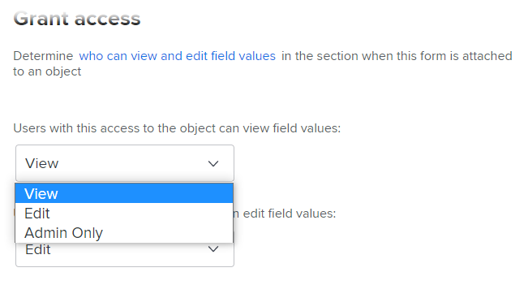

# 사용자 정의 양식 개선 사항

22.2 릴리스에서 사용자 정의 양식 관리에 대해 다음과 같은 중요한 개선이 이루어졌습니다.

## 자산 위젯 추가

사용자 정의 양식에 이미지를 포함할 수 있습니다. 이렇게 하면 사용자 정의 양식 사용자와 보다 대화형이고 시각적인 방식으로 통신할 수 있습니다. 추가적인 위젯 유형이 곧 제공될 예정입니다.


위젯이 포함된 사용자 정의 양식을 오브젝트에 첨부할 때 오브젝트로 작업하는 사용자는 다음 영역에서 해당 양식을 볼 수 있습니다.

* 객체의 세부 정보 영역(예: 프로젝트의 경우 프로젝트 세부 정보 영역)&#x200B;

  

* 새로운 Adobe Workfront 경험 모양과 느낌이 있는 객체의 편집 상자(예: 프로젝트 편집 및 작업 편집 상자)&#x200B;.

  

현재 사용자는 다음 영역에서 위젯을 볼 수 없습니다&#x200B;.

* 목록 및 보고서
* 홈 및 요약
* 새로운 Adobe Workfront 경험 룩앤필이 없는 객체의 편집 상자(예: 경비 편집 상자)입니다
* &#x200B; Workfront 모바일 앱

## 사용자 정의 양식을 여러 객체 유형과 연결

여러 객체 유형을 새 사용자 정의 양식과 연결할 수 있습니다.


또는 기존 사용자 정의 양식:


이를 통해 프로젝트, 작업, 문제 및 사용자 정의 양식에 대해 지원되는 다른 유형의 오브젝트에서 사용할 단일 사용자 정의 양식을 만들 수 있습니다.

이 기능은 사용자 정의 양식과 해당 데이터를 변환된 오브젝트로 전달할 수 있으므로 문제나 작업을 변환할 때 특히 유용합니다. 더 이상 다양한 오브젝트 유형에 대해 동일한 사용자 정의 양식의 정확한 사본을 만들고 유지 관리할 필요가 없으며 사용자 정의 양식을 프로젝트에 수동으로 추가하십시오.

>[!INFO]
>
>**예:**
>
>누군가가 내부 IT 요청(문제)을 제출하고 필요한 사항에 대한 세부 정보를 첨부된 사용자 정의 양식에 제공합니다.
>
>이 문제를 작업할 사용자의 프로젝트로 전환합니다.
>
>제출자의 세부 사항이 포함된 사용자 정의 양식은 문제 및 프로젝트 오브젝트 유형 모두와 연관되므로 전환 중에 사용자 정의 양식 및 이러한 모든 세부 사항이 프로젝트로 이월됩니다.

>[!NOTE]
>
>변환이 수행되면 사용자 정의 양식이 변환 중인 오브젝트 유형과 이미 연결되어 있어야 합니다.

다중 개체 사용자 정의 양식을 만들거나 편집할 때 다음 사항을 고려하십시오.

* [섹션 구분에 대한 권한 옵션](#permission-options-for-section-breaks)
* [계산된 사용자 정의 필드 호환성](#calculated-custom-field-compatibility)
* [사용자 정의 양식에서 오브젝트 유형 삭제에 대한 주의](#caution-about-deleting-an-object-type-from-a-custom-form)

### 섹션 구분에 대한 권한 옵션

문제, 작업, 프로젝트 및 사용자 객체 유형에 사용할 수 있는 섹션 구분 권한 옵션 세트에는 다른 모든 객체 유형에 대한 권한 옵션 세트인 제한 편집보다 하나 이상의 권한 옵션이 있습니다.


다른 모든 객체 유형(Portfolio, 문서, 프로그램, 경비, 회사, 반복, 청구 기록 및 그룹)에 사용할 수 있는 섹션 구분 권한 집합에는 제한된 편집이 포함되지 않습니다.



이러한 두 그룹의 객체 유형과 연관된 사용자 정의 양식에서 시스템은 모든 객체 유형에 대해 작동하는 공통 섹션 구분 권한 집합을 사용합니다. 특히, 이 공통 세트는 [제한된 편집] 권한 옵션을 사용하는 대신 [제한된 편집] 권한 옵션에 대한 [편집] 권한 옵션을 대체합니다. 편집 옵션은 모든 객체 유형과 호환됩니다.

사용자 정의 양식에 이미 있는 다른 객체 유형과 다른 사용 권한 옵션을 사용하는 객체 유형을 연결하면, 해당 양식에 사용될 공통 사용 권한 옵션 집합으로 전환할 수 있는 메시지가 표시됩니다. 이 변경 사항은 섹션 구분 아래에 없는 경우에도 모든 필드에 적용됩니다.

### 계산된 사용자 정의 필드 호환성

다중 개체 사용자 지정 양식에서 계산된 필드가 양식의 모든 연결된 개체 유형(예: 여러 개체 유형에 사용할 수 있는 {name}, {description} 및 {entryDate})에서 사용할 수 있는 필드를 참조하는 경우 데이터를 첨부한 개체에 관계없이 데이터가 올바르게 계산됩니다.

예를 들어 프로젝트 및 문제에 대한 다중 개체 양식이 있고 {name} 식을 포함하는 계산된 필드를 추가하는 경우 양식을 프로젝트에 추가할 때 필드에 프로젝트 이름이 표시되고 양식을 작업에 추가하는 작업 이름이 표시됩니다.

그러나 양식의 계산된 필드가 양식의 모든 오브젝트 유형과 호환되지 않는 필드를 참조하는 경우, 조정을 실시하라는 메시지가 표시됩니다.

>[!INFO]
>
>**예:** Task 개체 형식과 연결된 사용자 정의 양식에서 기본 제공 필드 Assigned To: Name을 참조하는 계산된 사용자 정의 필드를 만들어 양식을 작업에 첨부할 때마다 담당 주 할당자의 이름을 표시할 수 있도록 합니다.
>
>```
>Assigned To: Name{assignedTo}.{name}
>```
>
>나중에 프로젝트 개체 유형을 사용자 정의 양식에 추가합니다. 프로젝트 오브젝트 유형이 계산된 사용자 정의 필드와 호환되지 않는다는 경고 메시지가 표시됩니다. 할당 대상 필드를 프로젝트에 사용할 수 없기 때문입니다.

이 경우 다음 중 하나를 수행할 수 있습니다.

* 사용자 정의 양식에서 호환되지 않는 두 항목 중 하나(오브젝트 유형 또는 참조된 필드)를 제거합니다.
* 두 항목을 모두 유지하고 와일드카드 필터 변수 `$$OBJCODE`을(를) IF 식의 조건으로 사용하여 [충전 중] 필드의 두 가지 다른 버전을 만듭니다. 이렇게 하면 양식이 첨부된 오브젝트 유형에 관계없이 필드가 정상적으로 작동할 수 있습니다.

  위의 예를 사용하면 프로젝트에 대한 기본 제공 할당 대상: 이름 필드가 없지만 기본 제공 소유자 필드가 있습니다(누군가 수동으로 변경하지 않는 한 프로젝트를 만든 사람의 이름으로 자동으로 채워짐). 따라서 사용자 정의 담당 필드에서 아래와 같이 사용자 정의 양식을 프로젝트에 첨부할 때 `$$OBJCODE`을(를) 사용하여 소유자 필드를 참조하고, 양식을 작업에 첨부할 때 할당 대상: 이름 필드를 참조할 수 있습니다.

  ```
  IF($$OBJCODE="PROJ",{owner}.{name},{assignedTo}.{name})
  ```

>[!NOTE]
>
>  필드 이름 앞에 개체 형식을 추가하면 해당 개체가 개체의 부모 개체를 참조하므로 프로젝트에 `{project}.{name}`을(를) 사용할 수는 없지만 작업에 사용할 수는 있습니다.


`$$OBJCODE`과(와) 같은 변수에 대한 자세한 내용은 [와일드카드 필터 변수 개요](/help/quicksilver/reports-and-dashboards/reports/reporting-elements/understand-wildcard-filter-variables.md)를 참조하십시오.

### 사용자 정의 양식에서 오브젝트 유형 삭제에 대한 주의

언제든지 사용자 정의 양식의 오브젝트 유형을 삭제할 수 있지만 이 작업은 주의해서 수행해야 합니다. 사용자가 삭제하려는 유형의 객체에 사용자 정의 양식을 이미 첨부하고 데이터를 추가한 경우, 양식에서 해당 객체 유형을 삭제하면 해당 데이터가 영구적으로 삭제됩니다.

또한 사용자 정의 양식을 사용하는 사람에게 삭제된 것을 경고하기 위한 알림 시스템이 없습니다.

자세한 내용은 [시스템에서 사용자 지정 필드 또는 위젯 삭제](/help/quicksilver/administration-and-setup/customize-workfront/create-manage-custom-forms/delete-a-custom-field.md)를 참조하십시오.
