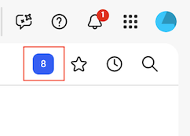
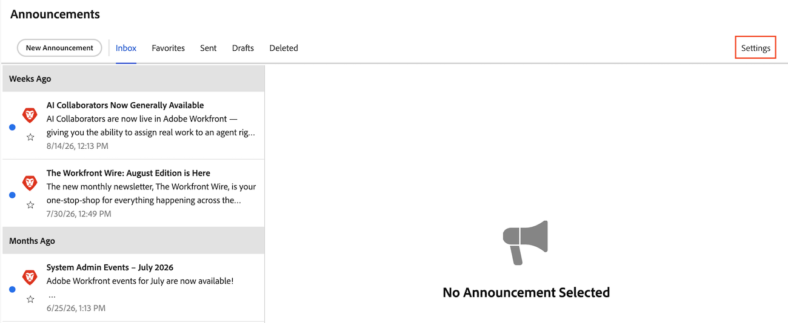

# 알림 센터 메시지 구독 취소

Announcement Center 메시지는 Adobe Workfront에서 Workfront 고객 기반으로 보내는 메시지입니다. 다음 유형의 알림 센터 메시지에서 구독을 취소할 수 있습니다.

* 이러한 주요 릴리스 외부에서 기능별로 릴리스된 기능에 대한 공지 사항.

  Workfront 플랫폼에 도입된 대부분의 새로운 기능은 매년 4개의 주요 릴리스 중 하나와 함께 릴리스됩니다. 그러나 일부 기능은 이러한 주요 릴리스 외부에서 기능별로 릴리스됩니다. 주요 릴리스 외부에서 기능이 릴리스될 때마다 공지 센터를 통해 메시지를 받게 됩니다. 공지 센터에 대한 자세한 내용은 [공지 보내기](../../administration-and-setup/get-started-wf-administration/view-send-announcements.md)를 참조하십시오.

* 예정된 교육 제공 및 이벤트에 대한 공지 사항.

알림 센터 메시지 수신을 취소하려면 다음 작업을 수행하십시오.

1. Workfront의 오른쪽 위 모서리에 있는 번호 매기기 아이콘을 클릭하여 알림 목록을 연 다음 목록 맨 아래에 있는 **모든 공지**&#x200B;를 클릭합니다.

   

1. 공지 페이지의 오른쪽 위 모서리에 있는 **설정**&#x200B;을 클릭합니다.

   

1. **알림 센터 설정** 대화 상자에서 구독을 취소하려는 알림 센터 메시지 유형의 확인란을 선택 취소합니다.

   

1. **설정 저장**&#x200B;을 클릭합니다.

   이 유형의 공지 사항에 대한 공지 센터 메시지가 더 이상 수신되지 않습니다.
