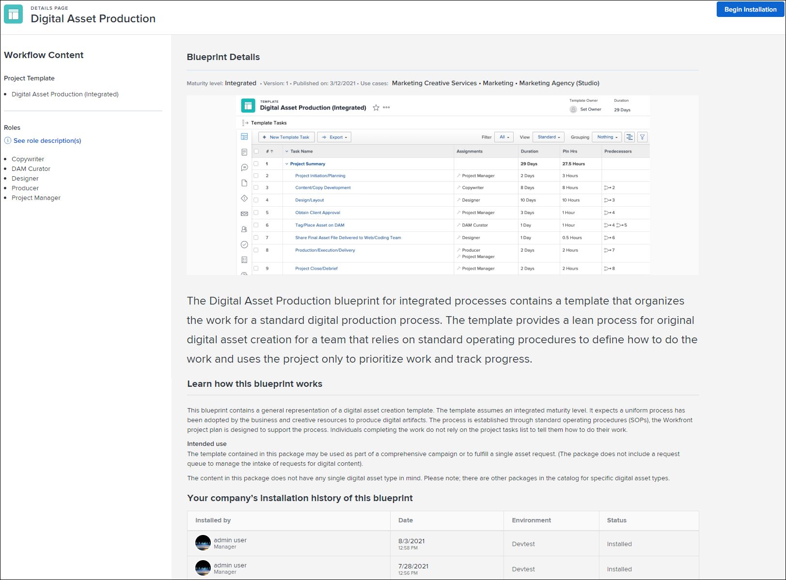

# 21.4 관리자 개선 사항

이 페이지에서는 미리보기 환경에 대한 21.4 릴리스의 모든 관리자 개선 사항에 대해 설명합니다. 이러한 개선 사항은 2021년 10월 4일이 있는 주에 프로덕션 환경에서 사용할 수 있습니다.

21.4 릴리스에서 사용할 수 있는 모든 변경 사항 목록을 보려면 [21.4 릴리스 개요](../../../product-announcements/product-releases/21.4-release-activity/21-4-release-overview.md)를 참조하십시오.

## 관리자의 경우: 승인 프로세스와 연결된 그룹을 확인하십시오

시스템의 승인 프로세스와 연결된 그룹을 찾기 위해 설정에서 승인 페이지의 표준 보기에 그룹 이름 열을 추가했습니다. 이제 사용자 지정 보기를 만들지 않고도 이 정보를 볼 수 있습니다.

승인 프로세스에 대한 자세한 내용은 [승인 프로세스 개요](../../../review-and-approve-work/manage-approvals/approval-process-in-workfront.md)를 참조하십시오.

그룹 승인 프로세스 관리에 대한 자세한 내용은 [그룹 수준 승인 프로세스](../../../administration-and-setup/manage-groups/work-with-group-objects/create-and-modify-groups-approval-processes.md)를 참조하십시오.

## 관리자용 새로운 기능: 그룹은 자신의 타임시트 및 시간 환경 설정을 구성할 수 있습니다.

>[!NOTE]
>
>처음에는 프로덕션에서 이 기능은 클러스터 4의 고객에 대해서만 단계별 롤아웃의 일부로 사용할 수 있습니다. 이 참고 사항은 다른 클러스터에서 기능을 사용할 수 있게 됨에 따라 업데이트됩니다.

대규모 조직의 경우, 일부 그룹은 시스템 수준에서 관리자가 구성한 환경 설정을 상속하지 않고 고유 워크플로우에 맞게 타임시트 및 시간 환경 설정을 독립적으로 구성해야 할 수 있습니다. 이제 Workfront 관리자는 시스템의 모든 그룹에 대한 타임시트 및 시간 기본 설정을 잠금 해제하여 직접 구성할 수 있습니다.

이 기능은 프로젝트 환경 설정 및 작업 및 문제 환경 설정에 대해서도 최근에 추가되었습니다.

Workfront 관리자가 타임시트 및 시간 환경 설정을 잠금 해제하는 방법에 대한 자세한 내용은 문서 [타임시트 및 시간 환경 설정 구성](../../../administration-and-setup/set-up-workfront/configure-timesheets-schedules/timesheet-and-hour-preferences.md)의 [그룹에 대한 타임시트 및 시간 환경 설정 잠금 해제](../../../administration-and-setup/set-up-workfront/configure-timesheets-schedules/timesheet-and-hour-preferences.md#lock) 섹션을 참조하십시오.

그룹 관리자가 잠금 해제된 작업 및 문제 환경 설정을 그룹에 대해 구성하는 방법에 대한 자세한 내용은 [그룹에 대한 타임시트 및 시간 환경 설정 구성](../../../administration-and-setup/manage-groups/create-and-manage-groups/configure-timesheet-hour-preferences-group.md)을 참조하십시오.

## Workfront 관리자를 위한 새로운 기능: 새 Workfront 경험에서 자동 프로비저닝된 사용자를 위한 레이아웃 템플릿을 구성합니다

이제 자동 프로비저닝된 사용자를 위해 새 Workfront 경험에서 레이아웃 템플릿을 구성할 수 있습니다. 사용자 속성을 매핑하는 Workfront 사용자 속성 드롭다운 메뉴([설정] > [시스템] > [Single Sign-On])에서 이제 새로운 &quot;NWE 레이아웃 템플릿&quot; 메뉴 항목을 사용하여 이 구성을 수행할 수 있습니다. 이전에는 Workfront Classic에서만 자동 프로비저닝된 사용자에 대한 레이아웃 템플릿을 구성할 수 있었습니다.

사용자 특성 매핑에 대한 지침은 [사용자 특성 매핑 및 새 사용자 자동 프로비저닝](../../../administration-and-setup/add-users/create-and-manage-users/map-user-attributes.md)을 참조하십시오.

## 새 필드에는 사용자가 속한 그룹이 표시됩니다.

이제 사용자가 속한 그룹을 쉽게 찾을 수 있습니다. 사용자를 나열하는 보고서 또는 보기에서 새 기타 그룹 필드를 사용하여 열을 만들 수 있습니다. 이 필드에는 각 사용자가 구성원으로 있는 그룹이 나열됩니다.

보고서 및 보기 사용에 대한 자세한 내용은 [사용자 지정 보고서 만들기](../../../reports-and-dashboards/reports/creating-and-managing-reports/create-custom-report.md) 및 [Adobe Workfront의 보기 개요](../../../reports-and-dashboards/reports/reporting-elements/views-overview.md)를 참조하십시오.

## 이제 블루프린트 세부 사항 페이지에 이미지가 표시됩니다.

이제 각 블루프린트에 대한 세부 정보 페이지에 블루프린트와 함께 설치된 프로젝트 템플릿의 이미지가 표시됩니다. 이 이미지는 설치하려는 내용을 알 수 있도록 블루프린트 콘텐츠 미리보기를 제공합니다. 필요한 경우 브라우저에서 전체 이미지를 미리 보거나 이미지를 다운로드할 수 있습니다.

자세한 내용은 [블루프린트 개요](../../../administration-and-setup/blueprints/blueprints-overview.md)를 참조하십시오.

## 새 문제에 대한 블루프린트 환경 설정

이제 일부 블루프린트에 새 문제 환경 설정을 사용할 수 있습니다. 기본적으로 설치되지만, 설치 세부 정보를 구성할 때 환경 설정 설치를 거부할 수 있습니다.

기본 설정에는 문제 또는 요청이 제출될 때 올바른 정보를 수집하고 문제 또는 요청을 올바른 작업 역할 또는 팀으로 보내기 위한 대기열 주제 그룹, 대기열 주제 및 라우팅 규칙이 포함됩니다. 환경 설정을 사용하면 프로젝트에서 새로운 문제 또는 요청을 캡처하는 방식으로 일관성을 유지하는 데 도움이 됩니다.

이러한 환경 설정을 사용하면 템플릿에서 만든 프로젝트가 요청 대기열로 만들어지지 않습니다.

자세한 내용은 [블루프린트 구성](../../../administration-and-setup/blueprints/configure-template-package.md)을 참조하세요.

## 그룹 관리자를 위한 새로운 기능: 최근에 삭제되고 복원된 그룹의 항목 보기 및 관리

>[!NOTE]
>
>이 기능은 새로운 Adobe Workfront 환경에서만 사용할 수 있습니다.

그룹과 관련 개체를 한 곳에서 더 쉽게 관리할 수 있도록 계속해서 노력하고 있습니다. 이제 그룹 영역에서 최근에 삭제되고 복원된 그룹의 항목을 보고 작업할 수 있습니다. 이렇게 하면 해당 항목을 관리하기 위해 설치에서 최근에 삭제됨 또는 최근에 복원됨 영역으로 이동하지 않아도 됩니다. 또한 작업 중인 그룹 항목 목록을 시스템의 다른 삭제 및 복원 항목과 별도로 유지합니다.

자세한 내용은 [최근 삭제된 그룹 항목 보기 및 관리](../../../administration-and-setup/manage-groups/work-with-group-objects/view-manage-groups-recently-deleted-objects.md) 및 [최근 복원된 그룹 항목 보기 및 관리](../../../administration-and-setup/manage-groups/work-with-group-objects/view-manage-groups-recently-restored-objects.md)를 참조하십시오.

## 그룹 관리자를 위한 새로운 기능: 그룹 환경 설정은 그룹 템플릿에 영향을 미칩니다

이제 그룹의 프로젝트 템플릿이 그룹의 요구 사항을 충족하는지 확인하는 것이 더 쉽습니다. 새 프로젝트 템플릿을 만들 때 그룹에 할당하면 해당 템플릿은 그룹의 프로젝트 및 작업 환경 설정에서 다음 설정을 상속합니다.

* 성과 지수 방법
* 상태 유형
* 일정 출처:
* 사용자 휴무
* 업데이트 유형
* 액세스 섹션 설정

그룹과 연결된 프로젝트 템플릿 내에서 새 템플릿 작업을 만들 때 템플릿 작업은 그룹의 작업 환경 설정에서 다음 설정을 상속합니다.

* 기간 유형
* 수익 유형
* 비용 유형

이전에는 프로젝트 템플릿 및 프로젝트 템플릿 작업이 시스템 수준에서 설정된 프로젝트 및 작업 환경 설정에서 이러한 설정을 상속받았습니다.

그룹 없이 템플릿 또는 템플릿 작업을 생성하는 경우(예: 기본 템플릿 페이지에서) 위의 설정은 시스템 수준 프로젝트 및 작업 기본 설정에서 상속됩니다. 그러나 나중에 템플릿 또는 템플릿 작업에 그룹을 할당해도 그룹의 환경 설정이 영향을 주지 않습니다.

자세한 내용은 문서 [그룹의 프로젝트 템플릿 만들기 및 수정](../../../administration-and-setup/manage-groups/work-with-group-objects/create-and-modify-a-groups-templates.md)에서 템플릿 및 템플릿 작업에 환경 설정을 적용하는 방법 섹션을 참조하십시오.

## 관리자용 새로운 기능: 사용자 정의 필드를 사용하는 사용자 정의 양식 확인

이제 사용자 정의 양식에서 사용자 정의 필드를 보다 쉽게 변경할 수 있습니다. 사용자 정의 양식을 한 번 클릭하면 필드를 사용하는 다른 사용자 정의 양식에 대해 확인할 수 있습니다. 변경한 후에도 제대로 작동하기 위해 이러한 양식에 조정이 필요한지 여부를 평가하는 것이 중요합니다.

자세한 내용은 [특정 사용자 정의 필드 또는 위젯을 사용하는 모든 사용자 정의 양식 보기](../../../administration-and-setup/customize-workfront/create-manage-custom-forms/view-all-custom-forms-that-use-a-particular-custom-field.md)를 참조하십시오.

## 그룹 관리자의 새로운 기능: 그룹에 대한 프로젝트, 작업 및 문제 환경 설정 잠금 및 잠금 해제

이제 그룹 아래의 하위 그룹의 모든 사용자가 동일한 환경 설정을 사용하고 있는지 확인하거나 그룹의 고유한 워크플로우에 대한 환경 설정 구성을 허용할 수 있습니다.

* Workfront 관리자가 시스템 수준에서 환경 설정을 잠금 해제한 후 그룹 아래의 모든 하위 그룹에 대해 기본 설정을 구성한 다음 잠글 수 있습니다. 잠긴 기본 설정을 다시 구성할 수는 있지만 하위 그룹의 관리자는 해당 그룹에 대해 다시 구성할 수 없습니다.

  반대로 그룹에 대한 환경 설정을 잠금 해제할 수 있습니다. 이를 통해 하위 그룹 관리자는 사용자의 고유한 프로젝트, 작업 또는 문제 워크플로 요구 사항에 맞게 구성할 수 있습니다.

  자세한 내용은 [하위 그룹에 대한 프로젝트, 작업 또는 문제 환경 설정 잠금 또는 잠금 해제](../../../administration-and-setup/manage-groups/create-and-manage-groups/lock-or-unlock-a-group-preference.md)를 참조하십시오.

* Workfront 관리자인 경우 그룹 영역으로 이동하여 하위 그룹의 환경 설정을 구성할 필요가 없습니다. 기본 프로젝트 환경 설정, 작업 및 문제 환경 설정 또는 타임시트 및 시간 환경 설정 영역에서 페이지 상단에 있는 검색 상자를 사용하여 하위 그룹을 찾고 해당 환경 설정을 구성할 수 있습니다.

  자세한 내용은 [그룹에 대한 프로젝트 환경 설정 구성](../../../administration-and-setup/manage-groups/create-and-manage-groups/configure-project-preferences-group.md) 및 [그룹에 대한 작업 및 문제 환경 설정 구성](../../../administration-and-setup/manage-groups/create-and-manage-groups/configure-task-issue-preferences-group.md)을 참조하십시오.

## 그룹 관리자의 새로운 기능: 그룹 영역에서 템플릿을 만들고 편집합니다

>[!NOTE]
>
>이 기능은 새로운 Workfront 환경에서만 사용할 수 있습니다.

그룹과 관련 개체를 한 곳에서 더 쉽게 관리할 수 있도록 계속 노력하고 있습니다. 이제 설정의 그룹 영역에서 그룹 템플릿을 보고 작업할 수 있습니다. 이렇게 하면 그룹의 템플릿을 관리하기 위해 템플릿 영역으로 이동할 필요가 없습니다. 작업 중인 그룹 템플릿 목록이 시스템 전체의 다른 템플릿과 별도로 유지됩니다.

자세한 내용은 [그룹의 프로젝트 템플릿 만들기 및 수정](../../../administration-and-setup/manage-groups/work-with-group-objects/create-and-modify-a-groups-templates.md)을 참조하세요.

## 첨부된 하나의 사용자 정의 양식에 정보를 한 번에 입력 및 저장

>[!NOTE]
>
>이 기능은 새로운 Adobe Workfront 환경에서만 사용할 수 있습니다.

이제 오브젝트에 대한 세부 정보 섹션의 정보를 더 쉽게 제공할 수 있습니다. 오브젝트에 대한 다른 사용자 정의 양식의 필수 필드가 아직 채워지지 않은 경우에도 단일 사용자 정의 필드 또는 확장 가능 영역(예: 개요 및 재무)에 정보를 입력하고 저장할 수 있습니다.

이전에는, 한 사용자 정의 양식 또는 객체에 대한 확장 가능 영역에 정보를 입력하면 객체에 첨부된 모든 사용자 정의 양식이 편집 모드로 전환되고 변경 사항을 저장하기 전에 해당 필수 필드를 모두 작성해야 했습니다. 다른 사용자를 위한 필수 필드이므로 필수 필드를 완료할 수 없는 경우 문제가 발생했습니다.

오브젝트에 대한 세부 정보 섹션에서 사용자 정의 양식 및 확장 가능한 영역을 모두 편집하려면 편집 아이콘에 추가한 새 편집 메뉴에서 모두 편집 을 클릭할 수 있습니다. 또는 같은 메뉴에서 이름을 클릭하여 변경할 사용자 정의 양식 또는 섹션으로 스크롤할 수 있습니다

>[!NOTE]
>
>이 기능은 원래 21.3 릴리스와 함께 미리보기에 릴리스되었습니다.

조직의 모든 수준이 워크플로우를 독립적으로 관리하고 제어할 수 있도록 하위 그룹의 상태를 만들고 관리하는 기능을 도입했습니다. 이제 설정의 그룹 섹션에서 모든 수준에서 관리하는 그룹에 대해 다음 작업을 수행할 수 있습니다.

* 그룹 상태 만들기, 편집, 삭제 및 숨기기
* 아래의 모든 하위 그룹이 동일한 방식으로 사용할 수 있도록 모든 그룹의 상태를 잠급니다.
* 하위 그룹의 관리자가 고유한 요구 사항에 맞게 그룹의 상태를 사용자 지정할 수 있도록 모든 그룹의 상태 잠금 해제
* 그룹 상태를 기본 상태로 설정
* 오브젝트의 그룹 상태 표시 순서 바꾸기 및 숨기기

Workfront 관리자는 (모든 그룹에 대해) 이러한 작업을 수행할 수도 있습니다.

이전에는 이 기능을 최상위 그룹에만 사용할 수 있었습니다.

자세한 내용은 [그룹 상태 관리](../../../administration-and-setup/manage-groups/manage-group-statuses/manage-group-statuses.md)를 참조하십시오.

## Workfront 관리자를 위한 새로운 기능: 레이아웃 템플릿을 Workfront Classic에서 새로운 Workfront 환경으로 직접 마이그레이션

>[!NOTE]
>
>이 기능은 2021년 7월 1일에 미리보기 환경에 릴리스되었습니다. 프로덕션 환경에 2021년 7월 15일에 릴리스됩니다.

사용자가 새로운 Workfront 환경으로 전환하는 동안 레이아웃 템플릿을 관리하는 데 도움이 되도록, Workfront 고객 지원에 의존하지 않고 Workfront Classic에서 새로운 환경으로 레이아웃 템플릿을 마이그레이션하는 데 사용할 수 있는 단추를 만들었습니다.

이전에는 Workfront 고객 지원 팀만 레이아웃 템플릿을 Workfront Classic에서 새 Workfront 환경으로 마이그레이션할 수 있었습니다.

## 템플릿을 그룹과 연결할 때 대기열 세부 정보 및 대기열 항목에서 그룹 승인 프로세스를 선택합니다

템플릿을 그룹과 연결하는 프로세스에 새 옵션을 추가했습니다. 이제 템플릿의 대기열 세부 정보 또는 대기열 주제 중 하나에서 문제에 대한 그룹별 승인 프로세스를 선택할 수 있습니다.

21.3에서 그룹 템플릿을 그룹과 연결하는 기능을 추가했으므로 템플릿에서 그룹별 승인 프로세스를 선택할 수 있지만 템플릿의 대기열 세부 정보 또는 대기열 주제에서는 이를 선택할 수 없습니다.

자세한 내용은 [새 승인 프로세스 또는 기존 승인 프로세스와 작업 연결](../../../review-and-approve-work/manage-approvals/associate-approval-with-work.md)을 참조하십시오.
