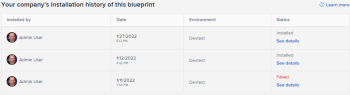

# 22.2 관리자 개선 사항

이 페이지에서는 미리 보기 환경에 대한 22.2 릴리스로 향상된 모든 관리자 기능을 설명합니다. 이러한 개선 사항은 프로덕션 환경에서 사용할 수 있습니다

<!--
<MadCap:conditionalText data-mc-conditions="QuicksilverOrClassic.Draft mode">
in January 2022
</MadCap:conditionalText>
-->

2022년 4월 4일이 있는 주. 22.2 릴리스에서 사용할 수 있는 모든 변경 사항 목록에 대해서는 다음을 참조하십시오 [22.2 릴리스 개요](../../../product-announcements/product-releases/22.2-release-activity/22-2-release-overview.md).

## 여러 개체 유형에서 작동하도록 사용자 지정 양식 구성

이제 여러 개체 유형을 사용할 수 있도록 새 사용자 지정 양식이나 기존 사용자 지정 양식을 구성하여 양식을 보다 광범위하게 유용하게 만들 수 있습니다. 사용자는 양식을 구성하는 모든 유형의 객체에 양식을 첨부하고 채울 수 있습니다.

이전에는 하나의 개체 유형에서만 작동하도록 사용자 지정 양식을 구성할 수 있었습니다.

이 기능은 Workfront 시스템에서 이전에 만든 모든 사용자 지정 양식에서 작동합니다. 예를 들어 작업 개체 유형에 대해 만들어진 사용자 지정 양식이 이미 있는 경우 이제 Project 및 Issue와 같은 다른 개체 유형에서도 작동하도록 양식을 구성할 수 있습니다.

자세한 내용은 섹션을 참조하십시오 [사용자 지정 양식 만들기 시작](../../../administration-and-setup/customize-workfront/create-manage-custom-forms/create-or-edit-a-custom-form.md#start) 기사 [사용자 지정 양식 만들기 또는 편집](../../../administration-and-setup/customize-workfront/create-manage-custom-forms/create-or-edit-a-custom-form.md).

>[!NOTE]
>
>* 이 기능의 초기 미리 보기 릴리스 시점에 다중 개체 사용자 지정 양식을 복사하는 기능을 일시적으로 비활성화했습니다. 이 기능은 3월 24일에 활성화되었습니다. 사용자 지정 양식 복사에 대한 자세한 내용은 [사용자 지정 양식을 복사하여 새 양식 만들기](../../../administration-and-setup/customize-workfront/create-manage-custom-forms/copy-custom-form-to-create-a-new-one.md).
>* 계산된 사용자 지정 필드에서 참조하는 일부 필드는 양식에 대해 구성된 개체 유형과 호환되지 않을 수 있습니다. Adobe 솔루션은 양식이 첨부된 객체에 따라 계산이 다른 값을 출력하도록 허용하는 와일드카드 입니다. 우리는 3월 24일에 와일드카드를 추가했다. 사용 방법에 대한 자세한 내용은 섹션을 참조하십시오 [다중 개체 사용자 지정 양식의 계산된 사용자 지정 필드](../../../administration-and-setup/customize-workfront/create-manage-custom-forms/add-calculated-data-to-custom-form.md#calculat) 기사 [사용자 지정 양식에 계산된 데이터 추가](../../../administration-and-setup/customize-workfront/create-manage-custom-forms/add-calculated-data-to-custom-form.md).
>* 사용자 지정 양식의 섹션 나누기에 대해 양식에 구성할 수 있는 모든 개체 유형에 대해 작동하는 공통 보기 및 편집 권한 집합을 만들었습니다. 한 시나리오에서 이 권한 중 하나인 제한된 편집으로 인해 양식에 오류가 발생할 수 있음을 발견했습니다. 이 오류는 3월 24일에 수정되었습니다. 섹션 브레이크에 대한 자세한 내용은 [사용자 지정 양식에 섹션 브레이크 추가](../../../administration-and-setup/customize-workfront/create-manage-custom-forms/add-a-section-break-to-a-custom-form.md).
>

## Blueprint 카탈로그는 모든 사용자가 사용할 수 있으며 관리자는 요청을 허용할 수 있습니다

이제 모든 Adobe Workfront 사용자가 사용 가능한 청사진 카탈로그를 찾아볼 수 있습니다. 자세한 내용은 [블루프린트 카탈로그를 찾아보고 블루프린트 설치를 요청합니다](../../../administration-and-setup/blueprints/browse-catalog.md).

또한 시스템 관리자는 사용자가 Blueprint 설치를 요청할 수 있도록 액세스를 활성화할 수 있습니다. 요청을 저장할 요청 큐를 할당하면 사용자가 블루프린트 카탈로그에서 요청을 수행할 수 있습니다. 자세한 내용은 [블루프린트에 대한 액세스 구성](../../../administration-and-setup/blueprints/configure-access-to-blueprints.md).

## 사용자 지정 양식에 이미지 추가

이제 만들거나 편집하는 사용자 지정 양식에서 이미지를 추가하고 사용자가 마우스로 가리키면 읽을 수 있는 정보 또는 지침 도구 설명을 포함할 수 있습니다.

예를 들어, 새 제품에 대한 브랜딩을 표시하거나 양식을 작성할 때 필요한 시각적 정보를 제공하는 데 도움이 될 수 있습니다.

이전에는 사용자 지정 양식이 완전히 텍스트 기반이었습니다.

>[!NOTE]
>
>항목을 벌크 편집할 때 표시되는 상자 등 아직 현대화되지 않은 새로운 Adobe Workfront 경험 영역에서는 사용자 지정 양식 이미지가 표시되지 않습니다. 해당 영역을 계속 업데이트하면 표시됩니다.

자세한 내용은 [사용자 지정 양식에서 자산 위젯 추가 또는 편집](../../../administration-and-setup/customize-workfront/create-manage-custom-forms/add-widget-or-edit-its-properties-in-a-custom-form.md).

## 새 기본 액세스 수준 구성

새 액세스 수준을 생성하는 대부분의 관리자의 요구에 더 잘 맞추기 위해 아래에 나열된 &quot;설정 세부 조정&quot; 옵션에 대한 기본 구성을 변경했습니다. 이러한 항목은 톱니바퀴 아이콘을 클릭하면 표시됩니다  편집 단추를 클릭합니다.

이러한 모든 변경 사항으로 인해 기본적으로 이전에 활성화되었던 옵션이 비활성화됩니다. 조직의 요구 사항에 맞지 않는 경우 새 액세스 수준을 설정할 때 또는 나중에 언제든지 활성화할 수 있습니다.

>[!IMPORTANT]
>
>이 기본 구성 변경 사항은 이전에 만든 액세스 수준에는 영향을 주지 않고 지금으로부터 만든 액세스 수준에만 영향을 줍니다.

* 계획 라이센스 유형을 사용하는 새 액세스 수준에서

   * 이제 프로젝트, 작업, 문제, 포트폴리오, 프로그램, 보고서, 필터, 문서 및 템플릿에 대해 시스템 전체 공유를 사용할 수 없습니다.
   * 기본 제공 보고서 보기 및 공개적으로 보고서 공유 도 보고서에 비활성화됩니다.
   * 문서 공개정보 공유도 사용할 수 없습니다.

* 작업 라이선스 유형이 있는 새 액세스 수준에서

   * 이제 필터 및 문서에 대해 시스템 전체 공유 가 비활성화됩니다.
   * 문서 공개정보 공유도 사용할 수 없습니다.

* Request 또는 Review 라이센스 유형이 있는 새로운 액세스 수준에서

   * 이제 필터에 대해 시스템 전체 공유 가 비활성화됩니다.

## 그룹 비활성화

내부 조직이 변경될 때 Workfront에서 특정 그룹 사용을 중단하고 새 그룹을 만들어야 할 수 있습니다. 이를 돕기 위해 이전 데이터를 잃지 않고 그룹을 비활성화하는 기능을 추가했습니다. 볼 필요가 없는 일반 사용자의 경우, 비활성 그룹은 그룹 미리 보기 필드에서 지워집니다.

관리하는 비활성 그룹에 대한 옵션, 환경 설정 및 개체 연결을 찾고 구성할 수 있습니다. 그룹을 비활성화해도 해당 그룹이 연결된 객체에 대한 내용은 변경되지 않습니다.

이전에는 그룹을 비활성화할 수 없었습니다.

자세한 내용은 [그룹 비활성화 또는 다시 활성화](../../../administration-and-setup/manage-groups/create-and-manage-groups/deactivate-or-reactivate-a-group.md).

## Blueprint 설치 내역 개선 사항

블루프린트를 설치하면 이제 블루프린트와 함께 성공적으로 설치된 특정 개체(예: 역할, 팀 또는 그룹)와 설치하지 못한 개체가 메시지에 표시됩니다. 설치 기록 테이블에서 특정 설치 옆에 있는 세부 정보 보기를 눌러 블루프린트 세부 정보 페이지에 설치된 객체 목록을 볼 수도 있습니다.

자세한 내용은 [블루프린트 설치](../../../administration-and-setup/blueprints/blueprints-install.md).

## 이제 프로덕션에서 미리 보기 전용 블루프린트를 설치할 때 경고가 표시됩니다

특정 블루프린트는 테스트 목적으로 미리 보기 환경에서만 설치할 수 있습니다.

프로덕션 환경, Sandbox 1 또는 Sandbox 2에서 미리 보기 전용 컨텐츠에 액세스하는 경우 설치 버튼이 활성화되지 않으며 경고 메시지가 표시될 수 있습니다.

자세한 내용은 [블루프린트 설치](../../../administration-and-setup/blueprints/blueprints-install.md).
