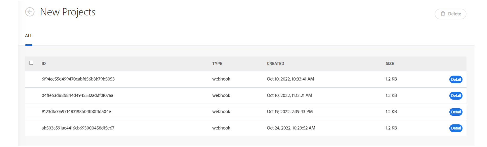

# Workfront Fusion 릴리스 활동: 2022년 11월 7일 주

**Webhook 큐 최적화**

Fusion의 웹후크 큐가 이번 릴리스에서 최적화되었습니다. 웹후크를 허용하는 서비스는 이제 대기열 및 기타 프로세스와 별개입니다. 이 변경 사항으로 인해 Fusion에서 웹후크 대기열을 보다 빠르고 일관된 속도로 처리할 수 있습니다.

이 변경 사항을 구현하는 동안 대기열에 추가된 웹후크 이벤트에 대한 예상 로그 처리 시간을 더 잘 이해할 수 있었습니다. Fusion의 웹후크 뷰어 페이지는 1분 미만이어야 합니다.

현재 대기 중인 웹후크 이벤트를 보려면 왼쪽 탐색에서 웹후크로 이동합니다. 숫자가 분자 내에 있는 트럭 아이콘은 해당 웹후크에 대한 대기열 이벤트를 나타냅니다. 트럭 아이콘을 클릭하면 큐에 있는 이벤트를 볼 수 있습니다.

**사용하지 않는 웹후크는 이제 비활성화되거나 삭제됩니다.**

Workfront Fusion에서 사용하지 않는 웹후크를 처리하는 방식이 일부 변경되었습니다. 이제 다음 중 하나가 적용되는 경우 웹후크가 자동으로 비활성화됩니다.

* 웹후크가 5일 이상 어떤 시나리오에도 연결되지 않았습니다.
* 웹후크는 30일 이상 비활성 상태인 비활성 시나리오에서만 사용됩니다.

비활성화된 웹후크는 시나리오에 연결되어 있지 않고 30일 이상 비활성화된 상태인 경우 자동으로 삭제 및 등록 취소됩니다.
