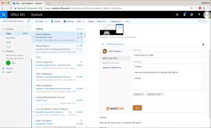
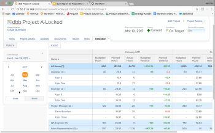
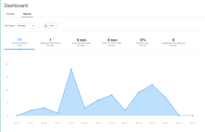

# Workfront R1 릴리스

## 모든 사용자의 참여와 효율성 유지

Workfront은 매년 3회 모든 제품 라인에 새 제품 기능을 출시합니다(릴리스 1, 릴리스 2 및 릴리스 3). 2017년 첫 번째 릴리스(R1,)에서는 Workfront, ProofHQ 및 Workfront DAM의 핵심 기능에 대한 몇 가지 개선 사항을 통해 지식 작업자가 생산성을 높이고, 작업을 관리하고, 더 많은 시간을 할애할 수 있습니다.

## 최신 릴리스의 새로운 기능

* [WORKFRONT 개선 사항](#workfront-enhancements)
* [PROOFHQ 개선 사항](#proofhq-enhancements)
* [WORKFRONT DAM 개선 사항](#workfront-dam-enhancements)

## WORKFRONT 개선 사항 {#workfront-enhancements}

\
**이메일에서 바로 작업 관리**
Outlook 365에 직접 통합하면 Outlook 365에서 직접 Workfront을 업데이트할 때 중복 작업을 제거할 수 있습니다. Outlook을 종료하지 않고도 이메일을 작업으로 전환하고, 이메일 대화 및 첨부 파일을 업데이트로 보내고, 댓글에 응답합니다.

자세한 내용은 다음을 참조하십시오.  [2016년 미리보기에서 사용할 수 있는 기능](../../../../product-announcements/product-releases/quarterly-release-archive/r1-release-activity/available-in-preview-in-2016.md)

\
**프로젝트 추적 및 예산 유지**
새로운 활용성 보고서를 사용하여 프로젝트를 예산 및 예산에 맞게 유지하면서 자원과 활용성을 관리합니다. 프로젝트 및 역할당 계획된 시간과 실제 시간을 비교하고 정기적으로 리소스 및 부서를 비교합니다.

자세한 내용은 다음을 참조하십시오.  [R1 미리 보기 3](../../../../product-announcements/product-releases/quarterly-release-archive/r1-release-activity/r1-preview-3.md)

\
**용어 및 알림 사용자 지정**
사용자 정의 용어 기능을 활용하여 &quot;Portfolio&quot; 또는 &quot;프로젝트&quot;와 같은 용어를 업계에 상관없이 원하는 링크에 맞게 변경함으로써 Workfront을 팀과 더욱 연관성 있게 만듭니다. 또한 이제 각 사용자는 다이제스트 빈도를 조정하여 수신하는 알림 유형을 사용자 지정할 수 있습니다.

자세한 내용은 다음을 참조하십시오.  [R1 미리 보기 3](../../../../product-announcements/product-releases/quarterly-release-archive/r1-release-activity/r1-preview-3.md)

**마일스톤 보기**
새 진행 상태 아이콘을 사용하면 마일스톤 보고서에서 더 많은 정보를 얻을 수 있습니다. 또한 이제 마일스톤 보기에서 직접 완료율을 편집할 수도 있습니다.

자세한 내용은 다음을 참조하십시오.  [R1 미리 보기 5](../../../../product-announcements/product-releases/quarterly-release-archive/r1-release-activity/r1-preview-5.md)

**Workfront 휴지통**
새로운 Workfront 휴지통을 사용하면 삭제 후 30일 이내에 프로젝트, 작업, 문제 및 모든 관련 문서, 양식 및 업데이트를 복원할 수 있습니다.

자세한 내용은 다음을 참조하십시오.  [R1 미리보기 1 및 2](../../../../product-announcements/product-releases/quarterly-release-archive/r1-release-activity/r1-peview-1-and-2.md)

### PROOFHQ 개선 사항 {#proofhq-enhancements}

\
**증명 검색 및 찾기**
ProofHQ의 새로운 검색 기능을 사용하면 검토하는 동안 증명에서 직접 단어 또는 구의 모든 인스턴스를 빠르고 쉽게 검색하고 찾을 수 있습니다. PDF 및 Microsoft Word 파일을 포함하여 모든 텍스트 기반 문서에 적용됩니다.

자세한 내용은 다음을 참조하십시오.  [R1 최종](../../../../product-announcements/product-releases/quarterly-release-archive/r1-release-activity/r1-final.md)

\
**시각적 보고 및 향상된 사용자 지정 보기**
ProofHQ의 새 보고 지표를 사용하면 반환 시간, 지연 백분율, 댓글 수 및 첫 번째 활동까지의 시간을 추적할 수 있습니다. 새로운 사용자 정의 보기는 고급 필터 논리를 만들어 필요할 때 정확한 데이터를 바로 얻을 수 있습니다.

자세한 내용은 다음을 참조하십시오.  [R1 최종](../../../../product-announcements/product-releases/quarterly-release-archive/r1-release-activity/r1-final.md)

**ProofHQ 미리보기**
이제 ProofHQ를 사용하여 모든 사용자에게 릴리스하기 전에 미리보기 환경에서 새로운 기능을 테스트할 수 있습니다.

## WORKFRONT DAM 개선 사항 {#workfront-dam-enhancements}

\
**DAM 임베드된 링크**
외부 플랫폼에 대한 디지털 에셋의 사용을 관리, 게시 및 추적하는 더 나은 방법이 필요한 마케팅 팀을 위해 임베드된 링크 기능은 적절한 시간에 적절한 콘텐츠를 공유하는 프로세스를 관리하는 데 필요한 제어 기능을 제공합니다.

**DAM 필수 메타데이터 필드**
에셋 공유를 보다 강력하게 제어할 수 있는 필수 메타데이터 필드를 사용하여 디지털 에셋 분류를 개선합니다.

**Workfront에 대한 모든 사용자의 참여와 효율성을 유지하십시오.**
Workfront은 최신 지식 근로자와 경영진이 다음과 같은 작업을 수행할 수 있는 엔터프라이즈 작업 관리 솔루션입니다.

* 개인 및 조직의 선호도에 맞게 작업을 조정하고 채택률을 높입니다.
* 어디에서나 보다 효율적으로 작업
* 예산과 인력 모두에서 리소스에 대한 보다 효과적이고 의미 있는 가시성 확보
* 이전보다 빠르게 올바른 작업 제공

**자세히 알아보기**

* R1 데이터시트를 다운로드하려면 다음 단계를 수행하십시오.  [https://resources.workfront.com/data-sheets/r1-release-datasheet](https://resources.workfront.com/data-sheets/r1-release-datasheet)
* R1 릴리스 FAQ는 여기에서 다운로드하십시오. [https://resources.workfront.com/data-sheets/r1-faq-for-customers](https://resources.workfront.com/data-sheets/r1-faq-for-customers)
* R1에서 사용할 수 있는 개선 사항의 전체 목록은 다음과 같습니다. [R1 릴리스 활동 개요](../../../../product-announcements/product-releases/quarterly-release-archive/r1-release-activity/r1-release-activity-overview.md)

Workfront. 일이 중요하니까
