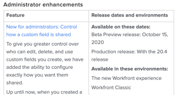

# Adobe Workfront 릴리스 일정 및 프로세스

## 미리 보기 일정 업데이트

미리 보기 환경은 새로운 기능을 사용하여 일주일에 한 번 업데이트됩니다. 이러한 기능은 향후 분기별 릴리스의 릴리스 노트에 나와 있습니다.

## 프로덕션에 대한 일정 업데이트

### 제품 기능

일반적으로 미리 보기의 기능은 다음 분기별 릴리스를 사용하여 프로덕션 환경에서 사용할 수 있습니다. 그러나 경우에 따라 분기별 릴리스 외에 프로덕션 환경에서 기능을 사용할 수 있습니다. 이러한 변경 사항은 변경 사항을 숙지할 적절한 시간을 제공하기 위해 최소 2주 동안 미리 보기에 남아 있습니다. 이러한 변경 사항은 미리 보기에 추가할 때 공지 센터를 통해 전달됩니다.

### 유지 관리 업데이트

Adobe Workfront 제품에 대한 문제 수정 사항은 매주 프로덕션 환경에서 사용할 수 있습니다. 자세한 내용은 [Workfront 유지 관리 업데이트](https://one.workfront.com/s/article/Workfront-Maintenance-Updates-1882317350) 페이지를 방문하여 최근에 수정된 내용을 확인하십시오.

## 분기별 릴리스에서 제거된 기능

주어진 분기별 릴리스와 연관된 모든 기능은 프로덕션에 대한 최종 릴리스 2~4주 전에 미리 보기에서 테스트할 수 있습니다. 이 시간 전에 분기별 릴리스에서 기능이 제거된 경우 고객에게 알리기 위해 다음 작업이 수행됩니다.

* 분기별 릴리스의 릴리스 노트(다음에서 찾을 수 있음) [제품 릴리스](../../product-announcements/product-releases/product-releases.md) 페이지)가 업데이트되어 기능이 제거되었음을 나타냅니다.

미리 보기에서 테스트할 수 있는 모든 기능이 분기별 릴리스에서 제거되면 고객에게 알리기 위해 다음 작업이 수행됩니다.

* 분기별 릴리스의 릴리스 노트(다음에서 찾을 수 있음) [제품 릴리스](../../product-announcements/product-releases/product-releases.md) 페이지)가 업데이트되어 기능이 제거되었음을 나타냅니다.
* 기능이 제거되었음을 알리는 게시물이 Workfront 커뮤니티에 추가됩니다.
* 공지 센터를 통해 모든 고객에게 기능이 제거되었다는 메시지가 전송됩니다. (알림 센터는 Workfront의 인앱 알림 센터입니다. 자세한 내용은 [공지 보내기](../../administration-and-setup/get-started-wf-administration/view-send-announcements.md))

## 릴리스 노트

향후 분기별 릴리스의 릴리스 노트를 사용하여 미리 보기에서 사용할 수 있는 새로운 기능과 언제 프로덕션에 출시되는지 확인하십시오.

다음 분기별 릴리스에 대한 릴리스 노트를 찾으려면 를 참조하십시오 [제품 릴리스](../../product-announcements/product-releases/product-releases.md)를 클릭한 다음 링크를 클릭하여 예정된 릴리스의 릴리스 개요 페이지로 이동합니다.

릴리스 노트는 왼쪽 열에 있는 기능 목록과 각 기능에 대한 간단한 설명을 보여주는 표를 제공합니다. 기능 링크를 클릭하여 새 기능의 데모 비디오와 새 기능에 대한 설명서에 액세스할 수 있습니다. 오른쪽 열에는 각 기능에 대한 다음 정보가 표시됩니다.

* 릴리스 날짜 미리 보기
* 프로덕션 릴리스 날짜
* 새로운 Adobe Workfront 환경 및/또는 Adobe Workfront Classic의 가용성

For example:

