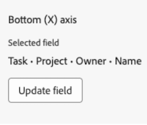

# 캔버스 대시보드에서 차트 보고서 작성

>[!IMPORTANT]
>
>캔버스 대시보드 기능은 현재 베타 단계에 참여하는 사용자만 사용할 수 있습니다. 이 단계에서 기능 일부가 완전하지 않거나 의도한 대로 작동하지 않을 수 있습니다. Canvas Dashboards Beta 개요 문서의 [피드백 제공](/help/quicksilver/product-announcements/betas/canvas-dashboards-beta/canvas-dashboards-beta-information.md#provide-feedback) 섹션에 있는 지침에 따라 경험에 대한 피드백을 제출하십시오. 
>&#x200B;>다음 클라우드 공급자에서는 이 Beta를 사용할 수 없습니다.
>
>* Amazon Web Services에 대한 자체 키 가져오기
>* Azure
>* Google Cloud 플랫폼

차트 보고서를 작성하고 캔버스 대시보드에 추가하여 데이터를 막대, 열, 선 또는 원형 차트로 시각화할 수 있습니다.

## 액세스 요구 사항

+++ 를 확장하여 액세스 요구 사항을 확인합니다. 

<table style="table-layout:auto"> 
<col> 
</col> 
<col> 
</col> 
<tbody> 
<tr> 
   <td role="rowheader">
Adobe Workfront 플랜
</td> 
   <td> 

임의 
 
   </td> 
<tr> 
 <tr> 
   <td role="rowheader">
Adobe Workfront 라이선스
</td> 
   <td> 

현재: 플랜 
 

새로운 기능: 표준
 
   </td> 
   </tr> 
  </tr> 
  <tr> 
   <td role="rowheader">
액세스 수준 구성
</td> 
   <td>
보고서, 대시보드 및 캘린더에 대한 액세스 편집

  </td> 
  </tr>  
</tbody> 
</table>

이 표의 정보에 대한 자세한 내용은 [Workfront 설명서의 액세스 요구 사항](/help/quicksilver/administration-and-setup/add-users/access-levels-and-object-permissions/access-level-requirements-in-documentation.md)을 참조하십시오.
+++

## 전제 조건

차트 보고서를 작성하려면 먼저 대시보드를 만들어야 합니다.

## 캔버스 대시보드에서 차트 보고서 작성

차트 보고서를 작성하는 데 사용할 수 있는 구성 옵션은 여러 가지가 있습니다. 이 섹션에서는 하나를 만드는 일반적인 프로세스를 안내합니다.

{{step1-to-dashboards}}

1. 왼쪽 패널에서 **캔버스 대시보드**&#x200B;를 클릭합니다.

1. 오른쪽 상단의 **새 대시보드**&#x200B;를 클릭합니다.

1. **대시보드 만들기** 상자에 대시보드의 **이름** 및 **설명**&#x200B;을 입력하십시오.

1. Click **Create**.

1. **보고서 추가** 상자에서 **보고서 만들기**&#x200B;를 선택합니다.

1. 왼쪽에서 **차트**&#x200B;를 선택합니다.

1. 오른쪽 상단 모서리에서 **보고서 만들기**&#x200B;를 클릭합니다.

1. (선택 사항) 아래 단계에 따라 **세부 정보** 섹션을 구성하십시오.

   1. 보고서 **이름**&#x200B;을(를) 입력하십시오.

   1. **설명** 보고서를 입력하십시오.

   1. 필요한 경우 **다른 시리즈를 &quot;기타&quot;** 상자로 표시 선택을 취소합니다.

      >[!NOTE]
      >
      >차트에 표시할 수 있는 최대 60개의 시리즈가 있습니다. 이 상자를 선택하면 제한을 초과하는 모든 계열은 차트에서 **기타** 그룹화로 통합됩니다.

1. **차트 빌드** 섹션을 구성하려면 아래 단계를 따르십시오.

   1. 왼쪽 패널에서 **차트 빌드**  아이콘을 클릭합니다.

   1. **차트 종류** 드롭다운에서 만들려는 차트 종류를 선택합니다.

      * **막대**
      * **열**
      * **Line**
      * **원형**

   1. **열 형식** 드롭다운에서 열 형식을 선택합니다.
      * **단순**
      * **다중 계열**
      * **스택**

   1. 첫 번째 섹션에서 **필드 업데이트** 단추를 선택한 다음 차트에서 요약할 데이터가 포함된 필드를 찾아 선택합니다.
   1. **집계 유형** 드롭다운에서 데이터를 롤업하여 차트 출력을 생성하는 방법을 선택합니다.

   1. 두 번째 섹션 아래에서 **필드 업데이트** 단추를 선택한 다음 차트에서 표시할 두 번째 필드를 찾아 선택합니다.

1. **필터** 섹션을 구성하려면 아래 단계를 따르십시오.

   1. 왼쪽 패널에서 **필터** 아이콘을 클릭합니다.
   1. **필터 편집**&#x200B;을 선택합니다.
   1. **조건 추가**&#x200B;를 클릭한 다음 필터링할 필드와 필드가 충족해야 하는 조건 종류를 정의하는 수정자를 지정합니다.
   1. (선택 사항) 다른 필터링 기준 집합을 추가하려면 **필터 그룹 추가**&#x200B;를 클릭합니다. 세트 사이의 기본 연산자는 AND입니다. 연산자를 클릭하여 OR로 변경합니다.

1. **드릴다운 열 설정** 섹션을 구성하려면 아래 단계를 따르십시오.

   1. 왼쪽 패널에서 **드릴다운 열**  아이콘을 클릭합니다. 차트의 필드는 오른쪽의 미리보기 섹션에 자동으로 열로 표시됩니다.

   1. (선택 사항) 기존 열 구성을 업데이트하려면 **현재 열** 섹션에서 업데이트할 열을 선택한 다음 원하는 정보(예: 레이블, 연결된 상태 및 조건)를 업데이트합니다.

   1. **열 추가**&#x200B;를 클릭한 다음 테이블에 열로 표시할 필드를 선택합니다. 추가할 각 열에 대해 이 프로세스를 반복합니다.

1. **드릴다운 그룹 설정** 섹션을 구성하려면 아래 단계를 따르십시오.

   1. 왼쪽 패널에서 **그룹 설정**  아이콘을 클릭합니다.

   1. **그룹화 추가** 단추를 클릭한 다음 그룹화로 만들 필드를 선택합니다.

1. 보고서를 만들고 대시보드에 추가하려면 **저장**&#x200B;을 클릭하세요.

## 차트 보고서 예제 작성

이 섹션에서는 프로젝트 소유자별 지연 작업을 표시하는 열 차트를 생성하는 단계를 살펴봅니다.

{{step1-to-dashboards}}

1. 왼쪽 패널에서 **캔버스 대시보드**&#x200B;를 클릭합니다.

1. 오른쪽 상단의 **새 대시보드**&#x200B;를 클릭합니다.

1. **대시보드 만들기** 상자에 대시보드의 **이름** 및 **설명**&#x200B;을 입력하십시오.

1. Click **Create**.

1. **보고서 추가** 상자에서 **보고서 만들기**&#x200B;를 선택합니다.

1. 왼쪽에서 **차트**&#x200B;를 선택합니다.

1. 오른쪽 상단 모서리에서 **보고서 만들기**&#x200B;를 클릭합니다.

1. **세부 정보** 섹션을 구성하려면 아래 단계를 따르십시오.

   1. 보고서 **이름**(예: 프로젝트 소유자의 *지연된 작업*)을 입력하십시오.

   1. **설명** 보고서를 입력하십시오.

1. **차트 빌드** 섹션을 구성하려면 아래 단계를 따르십시오.

   1. 왼쪽 패널에서 **차트 빌드** 아이콘을 클릭합니다.

   1. **차트 종류** 드롭다운에서 **열**&#x200B;을 선택합니다.

   1. **열 형식** 드롭다운에서 **단순**&#x200B;을 선택합니다.

   1. **아래쪽(X) 축** 섹션 아래에서 **필드 업데이트** 단추를 선택한 다음 **작업** > **프로젝트** > **소유자** > **이름** 필드를 찾아 선택합니다.

      

   1. **왼쪽(Y) 축** 섹션 아래의 **필드 선택** 단추를 클릭한 다음 **작업** > **이름** 필드를 찾아 선택합니다.

   1. **집계 유형** 드롭다운에서 **개수**&#x200B;를 선택합니다.

      

1. **필터** 섹션을 구성하려면 아래 단계를 따르십시오.

   1. 왼쪽 패널에서 **필터** 아이콘을 클릭합니다.

   1. **필터 편집**&#x200B;을 선택합니다.

   1. **조건 추가**&#x200B;를 클릭합니다.

   1. 빈 조건 영역을 클릭한 다음 **필드 선택**&#x200B;을 선택합니다.

   1. **완료율** 필드를 선택합니다.

   1. **연산자** 드롭다운에서 **다음보다 작음**&#x200B;을 선택한 다음 평가기 필드에 *100*&#x200B;을(를) 입력합니다.

   1. **조건 추가**&#x200B;를 클릭한 다음 **필드 선택**&#x200B;을 클릭합니다.

   1. **계획된 완료 일자** 필드를 선택합니다.

   1. **연산자** 드롭다운에서 **다음보다 작음**&#x200B;을 선택합니다.

   1. **상대적 날짜 설정**&#x200B;을 **설정**(으)로 전환합니다.

   1. 평가기 필드에 *$$TODAY*&#x200B;을(를) 입력합니다.

      와일드카드에 대한 자세한 내용은 [캔버스 대시보드의 보고서 필터 편집](/help/quicksilver/reports-and-dashboards/canvas-dashboards/manage-reports/edit-report-filters.md) 문서에서 날짜 기반 와일드카드 필터 변수 섹션을 참조하십시오.

      

1. **드릴다운 열 설정** 섹션을 구성하려면 아래 단계를 따르십시오.

   1. 왼쪽 패널에서 **드릴다운 열**  아이콘을 클릭합니다. 차트의 필드는 오른쪽의 미리보기 섹션에 자동으로 열로 표시됩니다.

   1. **열 추가**&#x200B;를 클릭한 다음 **할당 대상** > **이름** 필드를 선택합니다.

   1. **열 추가**&#x200B;를 클릭한 다음 **계획된 시작 일자** 필드를 선택합니다.

   1. **열 추가**&#x200B;를 클릭한 다음 **계획된 완료 일자** 필드를 선택합니다.

   1. **열 추가**&#x200B;를 클릭한 다음 **마지막 업데이트 날짜** 필드를 선택합니다.

   1. (선택 사항) 업데이트 시간을 표시하려면 **현재 열** 필드에서 **마지막 업데이트 날짜** 옵션을 선택한 다음 **날짜 형식** 드롭다운에서 시간 값 옵션을 선택합니다.

1. **드릴다운 그룹 설정** 섹션을 구성하려면 아래 단계를 따르십시오.

   1. 왼쪽 패널에서 **그룹 설정**  아이콘을 클릭합니다.

   1. **그룹화 추가** 단추를 클릭한 다음 **프로젝트** > **이름** 필드를 선택합니다.

1. 보고서를 만들고 대시보드에 추가하려면 **저장**&#x200B;을 클릭하세요.

## 차트 보고서 작성 시 고려 사항

### 필드 선택기 활용

**차트 작성** 섹션의 **섹션** 드롭다운은 테이블 보고서를 작성할 때 개체를 더 쉽게 찾을 수 있도록 필드 선택기에서 선택 항목의 범위를 좁히도록 설계되었습니다. 시작하려면 기본 엔티티 객체를 선택합니다.

* **모든 섹션**: Workfront Workflow 및 Workfront Planning의 모든 개체 유형.
* **Workfront 개체**: 기본 Workfront 워크플로 개체.
* **계획 레코드 종류**: Workfront Planning에 정의된 사용자 지정 레코드 종류.

기본 엔터티 개체를 선택하면 **섹션** 드롭다운이 업데이트되며 선택할 수 있는 필드 형식 옵션이 제공됩니다.

* **모든 섹션**: 네이티브 필드, 사용자 지정 필드 및 관련 개체.
* **모든 필드**: 기본 필드와 사용자 지정 필드 모두(관계 제외).
* **사용자 정의 필드**: 사용자 정의 양식 또는 Planning 레코드의 고객 정의 필드.
* **Workfront 필드**: 기본 필드만.
* **관계**: 연결된 레코드입니다.

### 자식 개체 참조

추가 열, 필터 옵션 및 그룹화 속성에 대해 사용할 수 있는 관계는 일반적으로 Workfront 개체 계층 구조의 상위 개체로 제한되거나 보고서의 기본 엔티티 개체를 한 번만 선택합니다. 여기에는 다음과 같은 몇 가지 예외가 있습니다.

* 프로젝트 > 작업
* 문서 승인 > 문서 승인 단계
* 문서 승인 단계 > 문서 승인 단계 참가자

위에 나열된 상위-하위 관계를 활용하는 경우 상위 객체에 연결된 각 하위 레코드에 대한 행이 테이블에 표시됩니다.