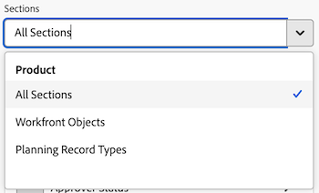
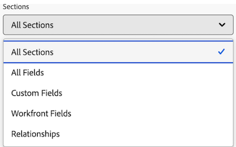

# 캔버스 대시보드에서 피벗 테이블 보고서 작성

>[!IMPORTANT]
>
>캔버스 대시보드 기능은 현재 베타 단계에 참여하는 사용자만 사용할 수 있습니다. 이 단계에서 기능 일부가 완전하지 않거나 의도한 대로 작동하지 않을 수 있습니다. Canvas Dashboards Beta 개요 문서의 [피드백 제공](/help/quicksilver/product-announcements/betas/canvas-dashboards-beta/canvas-dashboards-beta-information.md#provide-feedback) 섹션에 있는 지침에 따라 경험에 대한 피드백을 제출하십시오. 
>가능한 버그 또는 기술 문제에 대한 피드백이 있는 경우 Workfront 지원에 티켓을 제출하십시오. 자세한 내용은 [고객 지원 센터에 문의](/help/quicksilver/workfront-basics/tips-tricks-and-troubleshooting/contact-customer-support.md)를 참조하세요. 
>다음 클라우드 공급자에서는 이 Beta를 사용할 수 없습니다.
>
>* Amazon Web Services에 대한 자체 키 가져오기
>* Azure
>* Google Cloud 플랫폼

피벗 테이블 보고서를 캔버스 대시보드에 추가하여 합계, 개수 및 평균과 같은 데이터에 대한 집계된 합계를 테이블 형식으로 볼 수 있습니다. 피벗 테이블은 여러 개의 집계된 값 또는 카운트를 여러 차원에 비교할 때 유용합니다.

## 액세스 요구 사항

+++ 이 문서의 기능에 대한 액세스 요구 사항을 보려면 확장하십시오.

<table style="table-layout:auto"> 
<col> 
</col> 
<col> 
</col> 
<tbody> 
<tr> 
   <td role="rowheader">
Adobe Workfront 패키지
</td> 
   <td> 

Any 
 
   </td> 
<tr> 
 <tr> 
   <td role="rowheader">
Adobe Workfront 라이선스
</td> 
   <td> 

표준
 

플랜
 
   </td> 
   </tr> 
  </tr> 
  <tr> 
   <td role="rowheader">
액세스 수준 구성
</td> 
   <td>
보고서, 대시보드 및 캘린더에 대한 액세스 편집

  </td> 
  </tr>  
</tbody> 
</table>

이 표의 정보에 대한 자세한 내용은 [Workfront 설명서의 액세스 요구 사항](/help/quicksilver/administration-and-setup/add-users/access-levels-and-object-permissions/access-level-requirements-in-documentation.md)을 참조하십시오.
+++

## 전제 조건

피벗 테이블 보고서를 작성하려면 먼저 대시보드를 만들어야 합니다. 자세한 내용은 [캔버스 대시보드 만들기](/help/quicksilver/reports-and-dashboards/canvas-dashboards/create-dashboards/create-dashboards.md)를 참조하세요.

## 캔버스 대시보드에서 피벗 테이블 보고서 작성

피벗 테이블 보고서를 작성하는 데 사용할 수 있는 구성 옵션은 여러 가지가 있습니다. 이 섹션에서는 하나를 만드는 일반적인 프로세스를 안내합니다.

{{step1-to-dashboards}}

1. 왼쪽 패널에서 **캔버스 대시보드**&#x200B;를 클릭한 다음 보고서를 추가할 대시보드 이름을 클릭합니다.

1. 페이지의 오른쪽 상단에 있는 **보고서 추가**&#x200B;를 클릭합니다.

1. **보고서 추가** 상자에서 **보고서 만들기**&#x200B;를 선택합니다.

1. 왼쪽에서 **피벗 테이블**&#x200B;을 선택합니다.

1. 오른쪽 상단 모서리에서 **보고서 만들기**&#x200B;를 클릭합니다.

1. (선택 사항) 아래 단계에 따라 **세부 정보** 섹션을 구성하십시오.

   1. 보고서에 대한 **루트 엔터티**&#x200B;를 선택하십시오.

      >[!NOTE]
      >
      > 루트 엔터티는 필드가 들어오는 개체를 설정합니다. 선택하면 이 보고서의 후반부에 사용하는 모든 필드 선택기가 해당 오브젝트에서 시작되므로 원하는 필드로 바로 이동할 수 있습니다.

   1. 보고서 **이름**&#x200B;을(를) 입력하십시오.

   1. **설명** 보고서를 입력하십시오.

   1. (선택 사항) **액세스 권한이**&#x200B;인 이 보고서 실행 필드에서 보고서를 사용할 권한을 가진 사용자의 이름을 입력한 다음 목록에 표시될 때 사용자를 선택합니다. 다른 사용자로 실행되도록 보고서를 구성할 때 대시보드의 모든 뷰어에는 자체 액세스 수준에 관계없이 동일한 데이터가 표시됩니다. 사용자를 선택하지 않으면 각 뷰어에 자체 권한에 따라 데이터가 표시됩니다.

      >[!IMPORTANT]
      >
      >선택한 사용자가 비활성화되거나 관련 작업 공간 또는 레코드 유형에 대한 액세스 권한이 없는 경우 보고서에 불완전한 데이터가 표시되거나 렌더링되지 않을 수 있습니다.

1. **지표** 섹션을 구성하려면 아래 단계를 따르십시오.

   1. 왼쪽 패널에서 **지표 표시**  아이콘을 클릭합니다.

   1. **지표 추가**&#x200B;를 클릭한 다음 원하는 필드를 선택합니다. 필드는 오른쪽의 미리보기 섹션에 열로 표시됩니다.

      >[!NOTE]
      >
      > 지표(측정이라고도 함)는 합계나 합계를 구하려는 숫자 필드입니다. 예를 들어 모든 비용을 합산하거나 작업 수를 계산할 수 있습니다.

   1. **열 레이블**&#x200B;을(를) 입력하십시오.

   1. **집계 유형** 드롭다운에서 해당 필드에 대한 데이터 롤업 방법을 선택합니다. 이 필드의 옵션은 선택한 필드 유형에 따라 달라집니다.

   1. 추가할 각 지표에 대해 위의 두 단계를 반복합니다.

1. **세그먼트** 섹션을 구성하려면 아래 단계를 따르십시오.

   1. 왼쪽 패널에서 **세그먼트**  아이콘을 클릭합니다.

   1. **세그먼트 추가**&#x200B;를 클릭한 다음 원하는 세그먼트를 선택하십시오. 필드는 오른쪽의 미리보기 섹션에 열로 표시됩니다.

      >[!NOTE]
      >
      >세그먼트는 상태 또는 소유자별로 작업을 그룹화하는 것과 같이 데이터를 그룹화하는 데 사용하는 카테고리입니다. 지표를 정렬하고 집계하는 방식입니다.

   1. 위의 두 단계를 반복하여 최대 2개의 세그먼트를 추가합니다.

1. **필터** 섹션을 구성하려면 아래 단계를 따르십시오.

   1. 왼쪽 패널에서 **필터**  아이콘을 클릭합니다.

   1. **필터 편집**&#x200B;을 선택합니다.

   1. **조건 추가**&#x200B;를 클릭한 다음 필터링할 필드와 필드가 충족해야 하는 조건 종류를 정의하는 수정자를 지정합니다.

   1. (선택 사항) 다른 필터링 기준 집합을 추가하려면 **필터 그룹 추가**&#x200B;를 클릭합니다. 세트 사이의 기본 연산자는 AND입니다. 연산자를 클릭하여 OR로 변경합니다.

1. **드릴다운 열 설정** 섹션을 구성하려면 아래 단계를 따르십시오.

   1. 왼쪽 패널에서 **드릴다운 열**  아이콘을 클릭합니다.

   1. **열 추가**&#x200B;를 클릭한 다음 드릴다운 테이블에 열로 표시할 필드를 선택합니다. 추가할 각 열에 대해 이 프로세스를 반복합니다.

1. 보고서를 만들고 대시보드에 추가하려면 **저장**&#x200B;을 클릭하세요.

## 피벗 테이블 보고서 예제 작성

이 섹션에서는 작업 완료 데이터를 요약하는 피벗 테이블 보고서를 작성하는 단계를 살펴봅니다.

{{step1-to-dashboards}}

1. 왼쪽 패널에서 **캔버스 대시보드**&#x200B;를 클릭한 다음 보고서를 추가할 대시보드 이름을 클릭합니다.

1. 페이지의 오른쪽 상단에 있는 **보고서 추가**&#x200B;를 클릭합니다.

1. **보고서 추가** 상자에서 **보고서 만들기**&#x200B;를 선택합니다.

1. 왼쪽에서 **피벗 테이블**&#x200B;을 선택합니다.

1. 오른쪽 상단 모서리에서 **보고서 만들기**&#x200B;를 클릭합니다.

1. **세부 정보** 섹션을 구성하려면 아래 단계를 따르십시오.

   1. **작업**&#x200B;을(를) **루트 엔터티**(으)로 선택하십시오.
   1. **이름** 필드에 *포트폴리오 및 프로젝트별로 계획된 작업과 실제 시간을 비교*&#x200B;합니다.
   1. **설명** 필드에 설명을 입력하십시오.

1. **지표** 섹션을 구성하려면 아래 단계를 따르십시오.

   1. 왼쪽 패널에서 **지표 표시**  아이콘을 클릭합니다.
   1. **지표 추가**&#x200B;를 클릭한 다음 **이름**&#x200B;을 선택합니다. **열 레이블** 필드에 *작업 개수*&#x200B;을(를) 입력하십시오. **집계 유형** 드롭다운에서 **개수**&#x200B;를 선택합니다.
   1. **지표 추가**&#x200B;를 클릭한 다음 **실제 시간**&#x200B;을 선택합니다. **열 레이블** 필드에 *실제 시간*&#x200B;을(를) 입력하십시오. **집계 유형** 드롭다운에서 **합계**&#x200B;를 선택합니다.
   1. **지표 추가**&#x200B;를 클릭한 다음 **계획된 시간**&#x200B;을 선택합니다. **열 레이블** 필드에 *총 계획된 시간*&#x200B;을(를) 입력하십시오. **집계 유형** 드롭다운에서 **합계**&#x200B;를 선택합니다.

1. **세그먼트** 섹션을 구성하려면 아래 단계를 따르십시오.

   1. 왼쪽 패널에서 **세그먼트**  아이콘을 클릭합니다.
   1. **세그먼트 추가**&#x200B;를 클릭한 다음 **프로젝트** > **Portfolio** > **이름**&#x200B;을 선택합니다.
   1. **세그먼트 추가**&#x200B;를 클릭한 다음 **프로젝트** > **이름**&#x200B;을 선택합니다.

1. **필터** 섹션을 구성하려면 아래 단계를 따르십시오.

   1. 왼쪽 패널에서 **필터**  아이콘을 클릭합니다.
   1. **필터 편집**&#x200B;을 선택한 다음 **조건 추가**&#x200B;를 선택하십시오.
   1. 빈 조건 필터를 클릭한 다음 **필드 선택**&#x200B;을 클릭합니다.
   1. **상태**&#x200B;를 선택하십시오.
   1. 연산자를 **같음**(으)로 변경한 다음 *진행 중*&#x200B;을 선택하십시오.

1. **드릴다운 열 설정** 섹션을 구성하려면 아래 단계를 따르십시오.

   1. 왼쪽 패널에서 **드릴다운 열**  아이콘을 클릭합니다.
   1. **열 추가**&#x200B;를 클릭한 다음 **이름**&#x200B;을 선택합니다.
   1. **열 추가**&#x200B;를 클릭한 다음 **할당 대상** > **이름**&#x200B;을 선택합니다.
   1. **열 추가**&#x200B;를 클릭한 다음 **계획된 완료 일자**&#x200B;를 선택합니다.

1. 화면 오른쪽 상단에서 **저장**&#x200B;을 클릭합니다.

## 피벗 테이블 보고서 작성 시 고려 사항

### 재무 데이터가 포함된 보고서

액세스 수준에서 재무 데이터에 대한 보기 또는 편집 액세스 권한이 있는 사용자는 작업 또는 프로젝트 수준에서 재무 보기 권한이 제거되더라도 여전히 캔버스 대시보드 시각화에 재무 데이터가 표시됩니다.

* 액세스 수준에서 재무 데이터 권한이 없는 사용자에게는 보고서에 재무 데이터가 표시되지 않습니다.
* 재무 데이터를 보는 사용자는 이미 볼 수 있는 권한이 있는 레코드(프로젝트, 작업, 문제 등)로 제한됩니다. 액세스할 수 없는 레코드에 대한 재무 값이 표시되지 않습니다.
* 보고서 작성자는 대시보드에 재무 데이터를 포함할 때 주의해야 하며 의도하지 않은 액세스를 방지하기 위해 대시보드를 공유하는 사용자를 염두에 두어야 합니다.

이는 알려진 제한이며 향후 이를 해결할 계획입니다.

### 필드 선택기 활용

**피벗 테이블 작성** 섹션의 **섹션** 드롭다운은 피벗 테이블 보고서를 작성할 때 개체를 더 쉽게 찾을 수 있도록 필드 선택기에서 선택 항목의 범위를 좁히도록 설계되었습니다. 시작하려면 기본 엔티티 객체를 선택합니다.

* **모든 섹션**: Workfront 및 Workfront Planning의 모든 개체 유형.
* **Workfront 개체**: 기본 Workfront 개체.
* **계획 레코드 종류**: Workfront Planning에 정의된 사용자 지정 레코드 종류.

기본 엔터티 개체를 선택하면 **섹션** 드롭다운이 업데이트되며 선택할 수 있는 필드 형식 옵션이 제공됩니다.

* **모든 섹션**: 네이티브 필드, 사용자 지정 필드 및 관련 개체.
* **모든 필드**: 기본 필드와 사용자 지정 필드 모두(관계 제외).
* **사용자 정의 필드**: 사용자 정의 양식 또는 Planning 레코드의 고객 정의 필드.
* **Workfront 필드**: 기본 필드만.
* **관계**: 연결된 레코드입니다.

### 관련 객체 참조

하위 객체를 피벗 테이블의 세그먼트로 선택하는 액세스를 제한합니다. 세그먼트 옵션은 레코드 자체 또는 1:many 또는 여러:many 관계를 나타내지 않는 기타 관련 레코드의 특성일 수 있습니다.

또한 이중 계산 또는 이중 요약 값이 발생할 가능성을 줄이기 위해 부모 또는 자식 속성을 지표로 참조하도록 액세스를 제한하여 실제 데이터의 잘못된 표시를 초래합니다.

