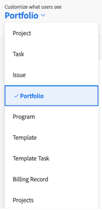

# 레이아웃 템플릿에 캔버스 대시보드 추가

>[!IMPORTANT]
>
>캔버스 대시보드 기능은 현재 베타 단계에 참여하는 사용자만 사용할 수 있습니다. 이 단계에서 기능 일부가 완전하지 않거나 의도한 대로 작동하지 않을 수 있습니다. Canvas Dashboards Beta 개요 문서의 [피드백 제공](/help/quicksilver/product-announcements/betas/canvas-dashboards-beta/canvas-dashboards-beta-information.md#provide-feedback) 섹션에 있는 지침에 따라 경험에 대한 피드백을 제출하십시오. 
>>가능한 버그 또는 기술 문제에 대한 피드백이 있는 경우 Workfront 지원에 티켓을 제출하십시오. 자세한 내용은 [고객 지원 센터에 문의](/help/quicksilver/workfront-basics/tips-tricks-and-troubleshooting/contact-customer-support.md) 를 참조하세요.
>>다음 클라우드 공급자에서는 이 Beta를 사용할 수 없습니다.
>
>* Amazon Web Services에 대한 자체 키 가져오기
>* Azure
>* Google Cloud 플랫폼

레이아웃 템플릿에 캔버스 대시보드를 추가하여 홈 랜딩 페이지를 대체하거나, 오브젝트의 왼쪽 패널에 나타나거나, Adobe Workfront 전체에서 맨 위 막대에 고정되도록 할 수 있습니다.

## 액세스 요구 사항

+++ 를 확장하여 액세스 요구 사항을 확인합니다. 

<table style="table-layout:auto"> 
<col> 
</col> 
<col> 
</col> 
<tbody> 
<tr> 
   <td role="rowheader">
Adobe Workfront 플랜
</td> 
   <td> 

임의 
 
   </td> 
<tr> 
 <tr> 
   <td role="rowheader">
Adobe Workfront 라이선스
</td> 
   <td> 

현재: 플랜 
 

새로운 기능: 표준
 
   </td> 
   </tr> 
  </tr> 
  <tr> 
   <td role="rowheader">
액세스 수준 구성
</td> 
   <td>
보고서, 대시보드 및 캘린더에 대한 액세스 편집

  </td> 
  </tr> 
    </tr>  
        <tr> 
   <td role="rowheader">
개체 권한
</td> 
   <td>
대시보드에 대한 권한 관리

  </td> 
  </tr> 
</tbody> 
</table>

이 표의 정보에 대한 자세한 내용은 [Workfront 설명서의 액세스 요구 사항](/help/quicksilver/administration-and-setup/add-users/access-levels-and-object-permissions/access-level-requirements-in-documentation.md)을 참조하십시오.
+++

## 왼쪽 패널에 캔버스 대시보드 추가

{{step-1-to-setup}}

1. 왼쪽 패널에서 **인터페이스**&#x200B;를 선택한 다음 **레이아웃 템플릿**&#x200B;을 선택합니다.

1. **레이아웃 템플릿** 페이지에서 템플릿을 선택합니다.

1. 템플릿 세부 정보 페이지에서 **사용자에게 표시되는 항목 사용자 지정** 드롭다운에서 대시보드를 추가할 개체를 선택합니다.

   

1. **왼쪽 패널** 섹션 아래쪽으로 스크롤한 다음 **대시보드 추가**&#x200B;를 클릭합니다.

1. **사용자 지정 대시보드 추가** 상자에 **빠른 링크** 이름을 입력하십시오.

1. **대시보드 선택** 드롭다운에서 **캔버스 대시보드**&#x200B;를 선택합니다.

1. **대시보드 선택**&#x200B;의 오른쪽에 있는 드롭다운에서 왼쪽 패널에 추가할 캔버스 대시보드를 선택합니다.

1. **추가**&#x200B;를 클릭합니다. 대시보드가 왼쪽 패널 섹션에 나타납니다.

1. **저장**&#x200B;을 클릭합니다.

   >[!NOTE]
   >
   >프로젝트, 작업, 문제, Portfolio 또는 프로그램과 같은 작업 개체에 배치할 때 각 보고서에 표시되는 결과는 해당 개체 내에서 사용할 수 있는 레코드로 제한됩니다.

## 상단 막대에 캔버스 대시보드 추가

{{step-1-to-setup}}

1. 왼쪽 패널에서 **인터페이스**&#x200B;를 선택한 다음 **레이아웃 템플릿**&#x200B;을 선택합니다.

1. **레이아웃 템플릿** 페이지에서 템플릿을 선택합니다.

1. **위쪽 탐색 영역** 섹션에서 **새 핀 추가**&#x200B;를 클릭한 다음 드롭다운에서 **대시보드 추가**&#x200B;를 선택합니다.

1. **페이지 고정** 상자에 **빠른 링크 이름**&#x200B;을 입력하십시오.

1. **대시보드 선택** 드롭다운에서 **캔버스 대시보드**&#x200B;를 선택합니다.

1. **대시보드 선택**&#x200B;의 오른쪽에 있는 드롭다운에서 상단 표시줄에 추가할 캔버스 대시보드를 선택합니다.

1. **추가**&#x200B;를 클릭합니다. 대시보드가 상단 막대에 나타납니다.

1. **저장**&#x200B;을 클릭합니다.

## 캔버스 대시보드를 홈 랜딩 페이지로 추가

{{step-1-to-setup}}

1. 왼쪽 패널에서 **인터페이스**&#x200B;를 선택한 다음 **레이아웃 템플릿**&#x200B;을 선택합니다.

1. **레이아웃 템플릿** 페이지에서 템플릿을 선택합니다.

1. **위쪽 탐색 영역** 섹션에서 **랜딩 페이지 선택**&#x200B;을 클릭한 다음 드롭다운에서 **대시보드 추가**&#x200B;를 선택합니다.

1. **사용자 지정 대시보드 추가** 상자에 **빠른 링크 이름**&#x200B;을 입력하십시오.

1. **대시보드 선택** 드롭다운에서 **캔버스 대시보드**&#x200B;를 선택합니다.

1. **대시보드 선택**&#x200B;의 오른쪽에 있는 드롭다운에서 홈 랜딩 페이지로 추가할 캔버스 대시보드를 선택합니다.

1. **추가를 클릭합니다**.

1. **저장**&#x200B;을 클릭합니다.
