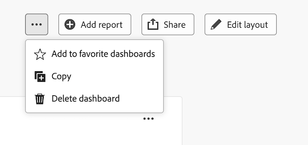

# 캔버스 대시보드 복사

{{highlighted-preview-article-level}}

>[!IMPORTANT]
>
>캔버스 대시보드 기능은 현재 베타 단계에 참여하는 사용자만 사용할 수 있습니다. 이 단계에서 기능 일부가 완전하지 않거나 의도한 대로 작동하지 않을 수 있습니다. Canvas Dashboards Beta 개요 문서의 [피드백 제공](/help/quicksilver/product-announcements/betas/canvas-dashboards-beta/canvas-dashboards-beta-information.md#provide-feedback) 섹션에 있는 지침에 따라 경험에 대한 피드백을 제출하십시오. 
>가능한 버그 또는 기술 문제에 대한 피드백이 있는 경우 Workfront 지원에 티켓을 제출하십시오. 자세한 내용은 [고객 지원 센터에 문의](/help/quicksilver/workfront-basics/tips-tricks-and-troubleshooting/contact-customer-support.md)를 참조하세요. 
>다음 클라우드 공급자에서는 이 Beta를 사용할 수 없습니다.
>
>* Amazon Web Services에 대한 자체 키 가져오기
>* Azure
>* Google Cloud 플랫폼

캔버스 대시보드를 복사하면 처음부터 다시 작성하지 않고도 경영진 대시보드의 디렉터 수준 복사본과 같이 다양한 대상을 위한 다양한 변형을 만들 수 있습니다.

## 액세스 요구 사항

+++ 이 문서의 기능에 대한 액세스 요구 사항을 보려면 확장하십시오.

<table style="table-layout:auto"> 
<col> 
</col> 
<col> 
</col> 
<tbody> 
<tr> 
   <td role="rowheader">
Adobe Workfront 패키지
</td> 
   <td> 

Any 
 
   </td> 
<tr> 
 <tr> 
   <td role="rowheader">
Adobe Workfront 라이선스
</td> 
   <td> 

표준 
 

플랜
 
   </td> 
   </tr> 
  </tr> 
  <tr> 
   <td role="rowheader">
액세스 수준 구성
</td> 
   <td>
대시보드에 대한 액세스 편집 또는 만들기

  </td> 
  </tr>  
    </tr>  
        <tr> 
   <td role="rowheader">
개체 권한
</td> 
   <td>
대시보드에 대한 액세스 보기

  </td> 
  </tr>
</tbody> 
</table>

이 표의 정보에 대한 자세한 내용은 [Workfront 설명서의 액세스 요구 사항](/help/quicksilver/administration-and-setup/add-users/access-levels-and-object-permissions/access-level-requirements-in-documentation.md)을 참조하십시오.
+++

## 전제 조건

대시보드를 복제하려면 먼저 대시보드를 만들어야 합니다.

자세한 내용은 [캔버스 대시보드 만들기](/help/quicksilver/reports-and-dashboards/canvas-dashboards/create-dashboards/create-dashboards.md)를 참조하세요.

## 대시보드 복사

>[!NOTE]
>
>공유 환경 설정은 새 대시보드에 복사되지 않습니다. 위젯에 **사용자로 실행** 구성이 있는 경우 지정된 사용자 또는 시스템 관리자인 경우에만 해당 구성이 복사본에 유지됩니다.

대시보드를 복사하려면 다음 작업을 수행하십시오.

{{step1-to-dashboards}}

1. 왼쪽 패널에서 **캔버스 대시보드**&#x200B;를 클릭합니다.

1. **캔버스 대시보드** 페이지에서 복사할 대시보드를 엽니다.

1. 오른쪽 상단 모서리에서 **자세히**  아이콘을 선택한 다음 **복사**&#x200B;를 선택합니다.
   

1. **대시보드 복사** 대화 상자에서 새 대시보드에 대한 **이름**&#x200B;을 입력합니다. 이 이름은 기본적으로 소스 대시보드의 이름 다음에 &quot;(복사)&quot;가 옵니다.

1. (선택 사항) **대시보드 세부 정보** 탭에서 새 대시보드에 대한 **설명** 또는 **통화**&#x200B;를 업데이트하십시오.
   

1. (선택 사항) **위젯** 탭을 클릭한 다음, 중복 대시보드에 포함하지 않을 위젯을 선택 취소합니다.
   

1. (선택 사항) **필터 및 프롬프트** 탭을 클릭한 다음 **대시보드 필터 복사** 또는 **대시보드 프롬프트 복사**&#x200B;를 해제하여 중복 대시보드에서 제외합니다.
   

1. **대시보드 복사**&#x200B;를 클릭합니다.

새 대시보드에 대한 링크가 포함된 확인 메시지가 표시됩니다.
