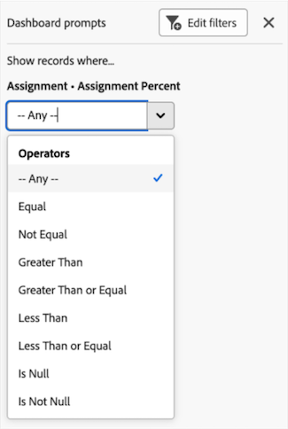

# 캔버스 대시보드 필터링

>[!IMPORTANT]
>
>캔버스 대시보드 기능은 현재 베타 단계에 참여하는 사용자만 사용할 수 있습니다. 이 단계에서 기능 일부가 완전하지 않거나 의도한 대로 작동하지 않을 수 있습니다. Canvas Dashboards Beta 개요 문서의 [피드백 제공](/help/quicksilver/product-announcements/betas/canvas-dashboards-beta/canvas-dashboards-beta-information.md#provide-feedback) 섹션에 있는 지침에 따라 경험에 대한 피드백을 제출하십시오. 
>>다음 클라우드 공급자에서는 이 Beta를 사용할 수 없습니다.
>
>* Amazon Web Services에 대한 자체 키 가져오기
>* Azure
>* Google Cloud 플랫폼

프롬프트가 포함된 캔버스 대시보드에 필터를 적용할 수 있습니다. 프롬프트는 추가 필터링 기준을 적용하는 필터 수정자 역할을 하므로 결과를 더 좁힐 수 있습니다. 이러한 프롬프트는 필터를 적용할 때마다 수정될 수 있으므로 대시보드나 각 개별 보고서의 기본 필터 기준을 편집할 필요 없이 표시된 결과를 조정할 수 있습니다.

## 액세스 요구 사항

+++ 를 확장하여 액세스 요구 사항을 확인합니다. 

<table style="table-layout:auto"> 
<col> 
</col> 
<col> 
</col> 
<tbody> 
<tr> 
   <td role="rowheader">
Adobe Workfront 플랜
</td> 
   <td> 

임의 
 
   </td> 
<tr> 
 <tr> 
   <td role="rowheader">
Adobe Workfront 라이선스
</td> 
   <td> 

현재: 플랜 
 

새로운 기능: 표준
 
   </td> 
   </tr> 
  </tr> 
  <tr> 
   <td role="rowheader">
액세스 수준 구성
</td> 
   <td>
보고서, 대시보드 및 캘린더에 대한 액세스 편집

  </td> 
  </tr> 
    </tr>  
        <tr> 
   <td role="rowheader">
개체 권한
</td> 
   <td>
대시보드에 대한 권한 관리

  </td> 
  </tr> 
</tbody> 
</table>

이 표의 정보에 대한 자세한 내용은 [Workfront 설명서의 액세스 요구 사항](/help/quicksilver/administration-and-setup/add-users/access-levels-and-object-permissions/access-level-requirements-in-documentation.md)을 참조하십시오.
+++

## 전제 조건

대시보드를 필터링하려면 먼저 만들어야 합니다.

자세한 내용은 [캔버스 대시보드 만들기](/help/quicksilver/reports-and-dashboards/canvas-dashboards/create-dashboards/create-dashboards.md)를 참조하세요.

## 대시보드 필터링

대시보드를 필터링하려면 나열된 순서로 다음 단계를 수행하십시오.

* [1부: 대시보드 필터 만들기](#part-1-create-a-dashboard-filter)
* [2부: 대시보드 프롬프트 만들기](#part-2-define-a-dashboard-prompt)
* [3부: 대시보드 프롬프트 적용](#step-3-apply-a-dashboard-prompt)

>[!NOTE]
>
>대시보드 필터는 대시보드 수준 필터가 비활성화되어 있지 않은 모든 보고서에 적용됩니다.  각 보고서에 대해 작업 메뉴를 확장하고 **필터 비활성화** 옵션을 선택하여 대시보드 수준 필터가 적용되지 않도록 개별 보고서를 제외할 수 있습니다.

### 1부: 대시보드 필터 만들기

대시보드 필터를 사용하면 각 개별 보고서에 대한 필터를 수정하지 않고도 대시보드에서 사용할 수 있는 모든 보고서에 공통 필터를 적용할 수 있습니다.

>[!NOTE]
>
>대시보드에 대한 관리 액세스 권한이 있는 사용자만 이러한 필터를 구성할 수 있습니다.

{{step1-to-dashboards}}

1. 왼쪽 패널에서 **캔버스 대시보드**&#x200B;를 클릭합니다.

1. **캔버스 대시보드** 페이지에서 필터를 적용할 대시보드를 선택합니다.

1. 대시보드 세부 정보 페이지의 왼쪽 상단 모서리에서 **필터**&#x200B;를 클릭합니다. 필터 사이드 패널이 열립니다.

1. **필터 편집**&#x200B;을 선택합니다. **대시보드 필터** 대화 상자가 열립니다.

1. (선택 사항) 규칙을 추가하려면 아래 단계를 수행합니다.

   1. 규칙 상자 오른쪽에 있는 **편집** 아이콘을 선택합니다.

      

   1. **조건 추가**&#x200B;를 클릭한 후 다음 정보를 추가하십시오.
      * 필터링 기준으로 사용할 필드를 선택합니다.
      * 옵션(또는 필터 수정자)을 선택하여 필드가 충족해야 하는 조건 종류를 정의합니다.

   1. (선택 사항) 다른 필터링 기준 집합을 추가하려면 **필터 그룹 추가**&#x200B;를 클릭합니다. 세트 사이의 기본 연산자는 AND입니다. 연산자를 클릭하여 OR로 변경합니다.

1. [파트 2: 대시보드 프롬프트 만들기](#part-2-define-a-dashboard-prompt)로 진행합니다.

### 2부: 대시보드 프롬프트 정의

대시보드 프롬프트는 사용자에게 대시보드에서 사용할 수 있는 보고서에 사용자 지정된 필터를 추가로 적용할 수 있는 옵션을 제공합니다.

>[!NOTE]
>
>대시보드에 대한 관리 액세스 권한이 있는 사용자만 대시보드 프롬프트 옵션을 구성할 수 있습니다.

1. 프롬프트를 추가하려면 아래 단계를 수행합니다.

   1. **프롬프트 추가**&#x200B;를 선택합니다. 새 필드가 화면 오른쪽에 나타납니다.

   1. **레이블 사용자 지정** 필드에 레이블을 입력합니다.

   1. 필드 이름을 입력한 다음 목록에 표시될 때 선택하여 프롬프트의 기반이 될 필드를 선택합니다. 

1. 사용자 지정 프롬프트를 추가하려면 아래 단계를 수행합니다.

   1. **사용자 지정 프롬프트 추가**&#x200B;를 선택합니다. 새 필드가 화면 오른쪽에 나타납니다.

   1. (선택 사항) **레이블 사용자 지정** 필드에 새 레이블을 입력합니다. 기본적으로 *새 사용자 지정 프롬프트* 레이블이 할당됩니다.

   1. **새 옵션 추가**&#x200B;를 클릭합니다.

   1. **옵션 값** 필드에 프롬프트 이름을 입력하십시오.

   1. **조건 추가**&#x200B;를 클릭한 다음 필터링할 필드와 필드가 충족해야 하는 조건 종류를 정의하는 수정자를 지정합니다.

      >[!NOTE]
      >
      >사용자 지정 프롬프트의 조건은 텍스트 모드를 사용해야만 편집할 수 있습니다. 이렇게 하면 단일 필드에 여러 조건을 적용할 수 있습니다.

   1. (선택 사항) 다른 필터링 기준 집합을 추가하려면 **필터 그룹 추가**&#x200B;를 클릭합니다. 세트 사이의 기본 연산자는 AND입니다. 연산자를 클릭하여 OR로 변경합니다.

1. 대시보드에 필터를 적용하려면 **저장**&#x200B;을 클릭하세요.

1. [파트3: 대시보드 프롬프트 적용](#step-3-apply-a-dashboard-prompt)으로 진행합니다.

### 3단계: 대시보드 프롬프트 적용

대시보드에 대한 액세스 권한이 있는 모든 사용자는 필터 및 프롬프트가 생성되면 대시보드 프롬프트를 캔버스 대시보드에 적용할 수 있습니다.

{{step1-to-dashboards}}

1. 왼쪽 패널에서 **캔버스 대시보드**&#x200B;를 클릭합니다.

1. **캔버스 대시보드** 페이지에서 프롬프트를 적용할 대시보드를 선택합니다.

1. 대시보드 세부 정보 페이지의 왼쪽 상단 모서리에서 **필터**&#x200B;를 클릭합니다. 필터 사이드 패널이 열립니다.

1. **레코드 표시 위치...** 섹션에서 표시된 하나 또는 모든 프롬프트에 대한 조건을 선택합니다. 프롬프트가 적용되고 **대시보드 필터가 적용됨** 태그가 보고서 위젯의 모서리에 나타납니다.
   

1. 패널을 숨기려면 오른쪽 상단의 **닫기** 아이콘 을 클릭합니다.
