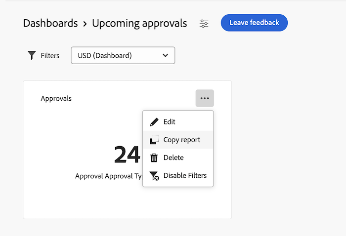

# 캔버스 대시보드에서 보고서 복사 및 이동

{{highlighted-preview}}

>[!IMPORTANT]
>
>캔버스 대시보드 기능은 현재 베타 단계에 참여하는 사용자만 사용할 수 있습니다. 이 단계에서 기능 일부가 완전하지 않거나 의도한 대로 작동하지 않을 수 있습니다. Canvas Dashboards Beta 개요 문서의 [피드백 제공](/help/quicksilver/product-announcements/betas/canvas-dashboards-beta/canvas-dashboards-beta-information.md#provide-feedback) 섹션에 있는 지침에 따라 경험에 대한 피드백을 제출하십시오. 
>가능한 버그 또는 기술 문제에 대한 피드백이 있는 경우 Workfront 지원에 티켓을 제출하십시오. 자세한 내용은 [고객 지원 센터에 문의](/help/quicksilver/workfront-basics/tips-tricks-and-troubleshooting/contact-customer-support.md)를 참조하세요. 
>다음 클라우드 공급자에서는 이 Beta를 사용할 수 없습니다.
>
>* Amazon Web Services에 대한 자체 키 가져오기
>* Azure
>* Google Cloud 플랫폼

KPI, 테이블 또는 차트 보고서를 만든 후에 캔버스 대시보드에서 복제할 수 있습니다. 복제되면 저장하기 전에 필요에 따라 보고서를 편집할 수 있습니다.

## 액세스 요구 사항

+++ 이 문서의 기능에 대한 액세스 요구 사항을 보려면 확장하십시오. 

<table style="table-layout:auto"> 
<col> 
</col> 
<col> 
</col> 
<tbody> 
<tr> 
   <td role="rowheader">
Adobe Workfront 패키지
</td> 
   <td> 

Any 
 
   </td> 
<tr> 
 <tr> 
   <td role="rowheader">
Adobe Workfront 라이선스
</td> 
   <td> 

표준 
 

플랜
 
   </td> 
   </tr> 
  </tr> 
  <tr> 
   <td role="rowheader">
액세스 수준 구성
</td> 
   <td>
보고서, 대시보드 및 캘린더에 대한 액세스 편집

  </td> 
  </tr>  
      <tr> 
   <td role="rowheader">
개체 권한
</td> 
   <td>
대시보드에 대한 권한 관리

  </td> 
  </tr>
</tbody> 
</table>

이 표의 정보에 대한 자세한 내용은 [Workfront 설명서의 액세스 요구 사항](/help/quicksilver/administration-and-setup/add-users/access-levels-and-object-permissions/access-level-requirements-in-documentation.md)을 참조하십시오.
+++

## 전제 조건

보고서를 복제하려면 먼저 대시보드에 추가해야 합니다.

자세한 내용은 [캔버스 대시보드 만들기](/help/quicksilver/reports-and-dashboards/canvas-dashboards/create-dashboards/create-dashboards.md)를 참조하세요.

## 프로덕션에서 보고서 복제

{{step1-to-dashboards}}

1. 왼쪽 패널에서 **캔버스 대시보드**&#x200B;를 클릭합니다.
1. **캔버스 대시보드** 페이지에서 복제할 보고서의 오른쪽 위 모서리에 있는 **자세히**  아이콘을 클릭한 다음 **복제**&#x200B;를 선택합니다.

   

1. (선택 사항) 표시되는 **구성** 상자에서 **세부 정보** 탭에 새 보고서 **이름**&#x200B;을(를) 입력합니다.

1. (선택 사항) 왼쪽의 탭을 사용하여 구성을 필요한 대로 조정합니다.

   >[!NOTE]
   >
   >이러한 탭은 KPI, 테이블 또는 차트 보고서를 복제했는지 여부에 따라 달라집니다.  자세한 내용은 [캔버스 대시보드에 KPI 보고서 빌드](/help/quicksilver/reports-and-dashboards/canvas-dashboards/add-reports/build-kpi-report.md), [캔버스 대시보드에 차트 보고서 빌드](/help/quicksilver/reports-and-dashboards/canvas-dashboards/add-reports/build-chart-report.md) 및 [캔버스 대시보드에 테이블 보고서 빌드](/help/quicksilver/reports-and-dashboards/canvas-dashboards/add-reports/build-table-report.md)를 참조하십시오.

1. **저장**&#x200B;을 클릭합니다. 복제된 보고서가 대시보드에 나타납니다.

## 미리보기에서 보고서 복사 또는 이동

보고서를 현재 대시보드에 복사하거나 다른 대시보드에 복사하거나 다른 대시보드로 이동할 수 있습니다. 복사하면 대상에 보고서의 복제본이 만들어집니다. 이동하면 현재 대시보드에서 이동합니다.

>[!IMPORTANT]
>
>* 보고서를 복사하려면 대상 대시보드에 대한 관리 권한이 필요합니다.
>* 보고서를 이동하려면 소스 및 대상 대시보드 모두에 대한 관리 액세스 권한이 필요합니다.
>* 보고서에 사용자로 실행 이 구성되어 있고 시스템 관리자나 사용자로 실행 사용자가 아닌 경우에도 보고서를 복사하거나 이동할 수 있지만 결과 보고서에서 사용자로 실행이 제거됩니다.

보고서를 복사하거나 이동하려면 다음을 수행합니다.

{{step1-to-dashboards}}

1. 왼쪽 패널에서 **캔버스 대시보드**&#x200B;를 클릭합니다.
1. 보고서가 포함된 대시보드를 엽니다.
1. 보고서의 오른쪽 상단에 있는 **자세히**  아이콘을 클릭한 다음 **보고서 복사**&#x200B;를 선택합니다.

   

1. **보고서 복사** 대화 상자에서 다음 옵션 중 하나를 선택합니다.

   <table>
   <tr>
   <td><strong>복사</strong></td>
   <td>보고서를 복사하려면 화면 하단의 <strong>복사</strong>를 클릭하십시오. 기본적으로 현재 대시보드가 선택되어 있습니다. 보고서를 복사하려면 대시보드에 대한 관리 액세스 권한이 필요합니다.</td>
   </tr>
   <tr>
   <td><strong>복사 및 이동</strong></td>
   <td>다른 대상 대시보드를 선택하여 보고서를 복사하고 새 대시보드로 이동합니다. 원본 보고서는 현재 대시보드에 있습니다.보고서를 복사하고 이동하려면 대상 대시보드에 대한 관리 액세스 권한이 필요합니다. </td>
   </tr>
   <tr>
   <td><strong>이동</strong></td>
   <td>보고서를 이동할 다른 대상 대시보드를 선택하십시오. 이렇게 하면 보고서가 대상 대시보드로 재배치되어 현재 대시보드에서 제거됩니다. 보고서를 이동하려면 소스 및 대상 대시보드 모두에 대한 관리 액세스 권한이 필요합니다.</td>
   </tr>
   </table>

   >[!NOTE]
   >
   >보고서에 사용자로 실행 이 구성되어 있고 시스템 관리자나 사용자로 설정된 사용자가 아닌 경우에도 보고서를 복사하거나 이동할 수 있습니다. 사용자로 실행 이 결과 보고서에서 제거됩니다.

1. **저장**&#x200B;을 클릭합니다.

   

