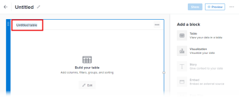

# 보고 캔버스에서 테이블 블록 추가 또는 편집

테이블에는 필터링, 그룹화 및 정렬 가능한 열의 필드 정보가 표시됩니다.

## 전제 조건

시작하기 전에 보고 캔버스 베타에 등록해야 합니다. 자세한 내용은 [보고 캔버스 베타: 개요](/help/quicksilver/product-announcements/betas/canvas-dashboards-beta/reporting-canvas-beta-overview.md)를 참조하십시오.

## 테이블 블록 추가 또는 편집

1. Adobe Workfront 오른쪽 상단의 **기본 메뉴** 아이콘 을(를) 클릭한 다음 **보고**&#x200B;를 클릭합니다.
1. **새 보고서**&#x200B;를 클릭합니다.

   또는

   기존 보고서로 이동하여 보고서 머리글에서 **자세히** 아이콘 을(를) 클릭한 다음 **편집**&#x200B;을(를) 클릭합니다.

1. **블록 추가** 아래 화면 오른쪽에서 다음 중 하나를 수행합니다.

   **테이블** 아이콘 을(를) 캔버스로 원하는 위치로 바로 끕니다.

   또는

   **테이블** 아이콘 을(를) 두 번 클릭하여 캔버스 맨 위에 테이블을 추가합니다.

   >[!TIP]
   >
   >블록 모서리 핸들을 드래그하여 블록을 배치한 후 블록 크기를 변경할 수 있습니다.

1. 테이블 헤더에서 **제목 없는 테이블**&#x200B;을 클릭한 다음 테이블의 제목을 입력합니다.

   

1. 표 블록의 중앙에 있는 **편집**&#x200B;을 클릭하여 표를 구성합니다.

   >[!NOTE]
   >
   >테이블이 이미 캔버스의 일부인 경우(예: 기존 보고서 편집 시) **편집** 단추가 블록의 중앙에 표시되지 않습니다. 표를 편집하려면 표 머리글에서 **편집** 아이콘 을(를) 대신 클릭합니다.
   >

1. 오른쪽의 **필드** 패널에서 테이블에 열로 추가할 필드를 찾은 다음 원하는 테이블로 끌거나 두 번 클릭하여 테이블의 마지막 열로 추가합니다.

   **검색** 상자에 텍스트를 입력하여 이름으로 특정 필드를 찾을 수 있습니다. 이 상자 아래의 두 드롭다운 메뉴를 사용하여 표시된 필드 목록을 다음 중 하나 또는 둘 다로 좁힐 수도 있습니다.

   * 원하는 필드와 연결된 개체 유형(예: 프로젝트 또는 작업)
   * 날짜 또는 통화와 같이 원하는 필드 유형입니다.

   열로 추가할 각 필드에 대해 이 단계를 반복합니다.

   >[!TIP]
   >
   >선택한 열을 새 위치로 끌어 테이블의 열 순서를 변경할 수 있습니다.

1. 표를 더 구성하려면 다음 중 하나를 수행하십시오.

   * **수식 필드 추가**: **필드** 목록의 맨 위에서 **새로 만들기 +**&#x200B;을 클릭합니다. 수식 필드를 만드는 방법에 대한 자세한 내용은 [보고 캔버스에서 수식 필드 만들기](../../../reports-and-dashboards/reporting-canvas/table-blocks/create-formula-field.md)를 참조하십시오.
   * **필터 추가**: 테이블을 필터링할 필드를 테이블 위의 **필터** 섹션으로 끌어옵니다. 필터 규칙 설정에 대한 자세한 내용은 [보고 캔버스에서 테이블 필터링](../../../reports-and-dashboards/reporting-canvas/table-blocks/configure-filter-rules-for-table.md)을 참조하십시오.
   * **특정 특성별로 행 그룹화**: 테이블을 그룹화할 필드를 테이블 위의 **그룹** 섹션으로 끌어옵니다. 행 그룹 만들기에 대한 자세한 내용은 [보고 캔버스에서 테이블 행 그룹화](../../../reports-and-dashboards/reporting-canvas/table-blocks/group-rows-in-table.md)를 참조하십시오.
