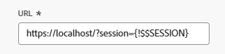

# 외부 웹 페이지를 대시보드에 포함

<!--Audited: 01/2025-->

외부 웹 페이지를 대시보드에 포함하여 다른 시스템 또는 Adobe Workfront 내에서 관련 정보에 대한 액세스를 제공할 수 있습니다.

예를 들어 조직에 URL을 통해 정기적으로 액세스하는 프로젝트 정보가 포함된 웹 기반 문서 저장소, Wiki 또는 기타 컨텐츠 관리 시스템이 있는 경우 대시보드에 외부 페이지를 만들어 해당 정보를 Workfront에 표시할 수 있습니다.

>[!IMPORTANT]
>
>* 보안상의 이유로 일부 웹 사이트에서는 웹 페이지를 iframe으로 포함할 수 없습니다. 대시보드에 임베드하려는 웹 페이지에서 이를 허용하지 않는 경우 페이지가 대시보드에 표시되지 않습니다. 그러나 대시보드 이름을 클릭하여 외부 페이지에 계속 액세스할 수 있습니다.\
>\
>소유한 웹 사이트에 포함을 허용하려면 웹 관리자와 함께 **X-Frame-Options** 설정을 조정하십시오. 자세한 내용은 [X-Frame-Options](https://developer.mozilla.org/en-US/docs/Web/HTTP/Headers/X-Frame-Options)을 참조하세요.
>
>
>* 대시보드 페이지는 더 이상 대시보드에 임베드된 외부 페이지로 지원되지 않습니다. 이러한 외부 페이지를 제거하기 위해 기존 대시보드가 자동으로 수정되지 않지만, 이러한 참조를 포함하는 대시보드에 대한 수정 사항은 참조를 제거하거나 변경할 때까지 저장할 수 없습니다.
>  &#x200B;> 특히 다음 Workfront.com 하위 도메인은 더 이상 지원되지 않습니다.
>
>     * /&#x200B;dashboards
>     * /dashboard/:ID&#x200B;
>     * /portfolio/:ID/content-dashboard__:dashboardID&#x200B;
>     * /program/:ID/content-dashboard__:dashboardID&#x200B;
>     * /project/:ID/content-dashboard__:dashboardID&#x200B;
>     * /task/:ID/content-dashboard__:dashboardID&#x200B;
>     * /template/:ID/content-dashboard__:dashboardID&#x200B;
>     * /templatetask/:ID/content-dashboard__:dashboardID&#x200B;
>     * /resourcemanagement/:ID/
>     * content-dashboard__:dashboardID&#x200B;
>     * /team/:ID/content-dashboard__:dashboardID&#x200B;
>     * /iteration/:ID/content-dashboard__:dashboardID&#x200B;
>     * /requests/:ID/content-dashboard__:dashboardID&#x200B;
>     * /group/:ID/content-dashboard__:dashboardID&#x200B;
>     * /billingrecord/:ID/content-dashboard__:dashboardID
>
>다른 해결 방법으로 [대시보드에 보고서 추가](/help/quicksilver/reports-and-dashboards/dashboards/creating-and-managing-dashboards/add-report-dashboard.md)에 설명된 대로 목록 보고서를 대시보드에 포함하는 것을 고려해 보십시오

## 액세스 요구 사항

+++ 을 확장하여 이 문서의 기능에 대한 액세스 요구 사항을 봅니다.

<table style="table-layout:auto"> 
 <col> 
 <col> 
 <tbody> 
  <tr> 
   <td role="rowheader">Adobe Workfront 패키지</td> 
   <td> 
임의
 </td> 
  </tr> 
  <tr> 
   <td role="rowheader">Adobe Workfront 라이선스</td> 
   <td> 
      
표준

      
플랜

   </td> 
  </tr> 
  <tr> 
   <td role="rowheader">액세스 수준 구성</td> 
   <td> 
보고서, 대시보드 및 캘린더에 대한 액세스 편집
</td> 
  </tr>  
  <tr> 
   <td role="rowheader">개체 권한</td> 
   <td> 
대시보드에 대한 액세스 편집
 </td> 
  </tr> 
 </tbody> 
</table>

이 표의 정보에 대한 자세한 내용은 [Workfront 설명서의 액세스 요구 사항](/help/quicksilver/administration-and-setup/add-users/access-levels-and-object-permissions/access-level-requirements-in-documentation.md)을 참조하십시오.

+++

## 전제 조건

외부 페이지를 포함하려면 먼저 대시보드를 만들어야 합니다.

대시보드를 만드는 방법에 대한 자세한 내용은 [대시보드 만들기](../../../reports-and-dashboards/dashboards/creating-and-managing-dashboards/create-dashboard.md)를 참조하십시오.

## 대시보드에 외부 페이지 포함

>[!IMPORTANT]
>
>더 이상 필요하지 않은 경우 대시보드에서 외부 페이지를 제거할 수 있습니다. 그러나 외부 페이지는 Workfront에서 만든 후에는 삭제할 수 없습니다. API를 사용해야만 외부 페이지를 삭제할 수 있습니다. 자세한 내용은 [대시보드에서 외부 페이지 제거](../../../reports-and-dashboards/dashboards/creating-and-managing-dashboards/remove-external-page-from-dashboard.md)를 참조하십시오.

1. Workfront에 표시할 페이지의 URL을 찾아 주소 표시줄에 있는 URL을 복사합니다.

   >[!NOTE]
   >
   >Workfront 개체에 대한 URL을 공유하는 경우 일부 URL은 시간이 지남에 따라 만료됩니다. 예를 들어 문서 URL은 열린 후에 만료됩니다. 이는 보안 수단으로 구성되며, 설계상 비 정적 URL로 간주되어 공유해서는 안 됩니다.

{{step1-to-dashboards}}

1. 기존 대시보드를 편집하려면 웹 사이트 페이지를 포함할 대시보드를 선택한 다음 **대시보드 작업**&#x200B;을 클릭한 다음 **편집**&#x200B;을 클릭합니다
또는\
   새 대시보드를 만들려면 **새 대시보드**&#x200B;를 클릭하세요.\
   대시보드를 만드는 방법에 대한 자세한 내용은 [대시보드 만들기](../../../reports-and-dashboards/dashboards/creating-and-managing-dashboards/create-dashboard.md)를 참조하세요.

1. **레이아웃 선택/ 보고서 추가/ 캘린더 추가** 영역에서 **외부 페이지 추가**&#x200B;를 클릭합니다.

   

   **외부 페이지 추가** 상자가 표시됩니다.

1. 외부 페이지에 대한 다음 정보를 지정합니다.

   * **이름**: 대시보드 이름을 추가합니다.
   * **설명**: 대시보드에 대한 정보를 추가하여 포함된 정보를 식별하십시오. 설명을 저장하면 볼 수 있는 액세스 권한이 있는 모든 사람이 대시보드에 표시됩니다.
   * **URL**: 이전에 복사한 URL을 이 필드에 붙여 넣습니다.

     다음 유형의 URL을 지정할 수 있습니다.

      * 웹 페이지에 대한 https(암호화된) URL입니다.\
        https(암호화된) 페이지만 URL을 사용하여 로드됩니다.\
        

      * 특정 웹 사이트에 대한 세션 정보가 포함된 템플릿 URL입니다.\
        예: *https://localhost/?session={!$$SESSION}*
외부 페이지를 표시하려면 지정된 웹 사이트에 로그인해야 합니다.\
        Workfront에서 SessionID를 얻는 방법에 대한 자세한 내용은 [API 기본 사항](../../../wf-api/general/api-basics.md)을 참조하십시오.\
        Workfront 관리자는 보안상의 이유로 외부 페이지에서 세션 정보의 사용을 허용하지 않는 방식으로 시스템 환경 설정을 구성할 수 있습니다. 이 경우 외부 페이지가 대시보드에 로드되지 않습니다.\
        시스템 보안 환경 설정에 대한 자세한 내용은 [시스템 보안 환경 설정 구성](../../../administration-and-setup/manage-workfront/security/configure-security-preferences.md)을 참조하십시오.\
        

     >[!WARNING]
     >
     >SessionID는 안전하지 않으므로 사용하지 않는 것이 좋습니다.
     >

   * **높이**: 대시보드에서 외부 페이지가 차지하는 공간을 정의하려면 0보다 큰 숫자를 입력하십시오. 기본 높이는 500입니다.

1. **저장**&#x200B;을 클릭합니다.

   페이지가 대시보드에 자동으로 추가됩니다.

   추가 대시보드를 만드는 경우 이 외부 페이지를 찾아 다른 대시보드에 추가할 수 있습니다. 대시보드를 만들거나 편집할 때 사용 가능한 보고서 및 캘린더 목록에서 기존 외부 페이지를 모두 찾을 수 있습니다.

   <!--
    *** This is linked to: Creating Dashboards, and Editing Dashboards.
   -->

## 대시보드에서 외부 페이지 업데이트

대시보드에 사용된 외부 페이지에 대한 정보를 업데이트하려면 다음 작업을 수행하십시오.

{{step1-to-dashboards}}

1. 업데이트할 대시보드 이름을 클릭하여 연 다음 **대시보드 작업**&#x200B;을 클릭한 다음 **편집**&#x200B;을 클릭합니다.

   **대시보드 세부 정보** 상자가 열립니다.

1. **대시보드 세부 정보** 상자의 **레이아웃 선택/보고서 추가** 영역에서 업데이트할 외부 페이지를 찾은 다음 마우스로 가리킨 다음 **편집** 아이콘을 클릭합니다.\
   

1. **외부 페이지 편집** 상자에서 변경할 필드를 업데이트한 다음 **저장**&#x200B;을 클릭합니다.
1. (선택 사항) 대시보드에서 외부 페이지를 제거하려면 **삭제** 아이콘 을 클릭합니다. 자세한 내용은 [대시보드에서 외부 페이지 제거](../../../reports-and-dashboards/dashboards/creating-and-managing-dashboards/remove-external-page-from-dashboard.md)를 참조하십시오.
1. **저장 및 닫기**&#x200B;를 클릭합니다.

## 보고서에서 외부 페이지 보기

외부 페이지 보고서에서 Workfront의 모든 외부 페이지를 볼 수 있습니다.

{{step1-to-reports}}

1. **새 보고서**&#x200B;를 클릭하고 **외부 섹션**&#x200B;을 선택합니다.

   

1. (선택 사항) 보고서의 보기, 필터 또는 그룹화 탭을 업데이트합니다.

   자세한 내용은 [사용자 지정 보고서 만들기](../../../reports-and-dashboards/reports/creating-and-managing-reports/create-custom-report.md)를 참조하세요.

1. **저장 및 닫기**&#x200B;를 클릭합니다.

   새 보고서에서 시스템의 외부 페이지와 연결된 이름 및 URL을 볼 수 있습니다.

