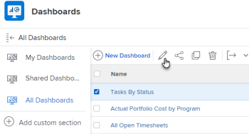

# 대시보드에 외부 웹 페이지 포함

외부 웹 페이지를 대시보드에 포함시켜 Adobe Workfront 내의 다른 시스템이나 다른 Workfront 페이지에 있는 관련 정보에 대한 액세스를 제공할 수 있습니다.

예를 들어, 조직에 URL을 통해 정기적으로 액세스하는 프로젝트 정보가 포함된 웹 기반 문서 저장소, Wiki 또는 기타 컨텐츠 관리 시스템이 있는 경우 대시보드에 외부 페이지를 만들어 Workfront에 해당 정보를 표시할 수 있습니다.

>[!IMPORTANT]
>
>보안상의 이유로 일부 웹 사이트에서는 웹 페이지를 iframe으로 포함할 수 없습니다. 대시보드에 포함할 웹 페이지에서 이 작업을 허용하지 않는 경우 페이지가 대시보드에 표시되지 않습니다. 그러나 대시보드 이름을 클릭하여 외부 페이지에 계속 액세스할 수 있습니다.\
>\
>소유한 웹 사이트에 대한 임베드를 허용하려면 웹 관리자와 함께 를 조정하십시오 **X-Frame-Options** 설정 자세한 내용은 [X-Frame-Options](https://developer.mozilla.org/en-US/docs/Web/HTTP/Headers/X-Frame-Options).

## 액세스 요구 사항

다음 항목이 있어야 합니다.

<table style="table-layout:auto"> 
 <col> 
 <col> 
 <tbody> 
  <tr> 
   <td role="rowheader"><strong>Adobe Workfront 플랜*</strong></td> 
   <td> 
모든
 </td> 
  </tr> 
  <tr> 
   <td role="rowheader"><strong>Adobe Workfront 라이선스*</strong></td> 
   <td> 
플랜 
 </td> 
  </tr> 
  <tr> 
   <td role="rowheader"><strong>액세스 수준 구성*</strong></td> 
   <td> 
보고서, 대시보드 및 달력에 대한 액세스 편집
 
참고: 여전히 액세스 권한이 없는 경우 Workfront 관리자에게 액세스 수준에서 추가 제한 사항을 설정하는지 문의하십시오. Workfront 관리자가 액세스 수준을 변경하는 방법에 대한 자세한 내용은 <a href="../../../administration-and-setup/add-users/configure-and-grant-access/create-modify-access-levels.md" class="MCXref xref">사용자 정의 액세스 수준 만들기 또는 수정</a>.
 </td> 
  </tr> 
  <tr> 
   <td role="rowheader"><strong>개체 권한</strong></td> 
   <td> 
대시보드에 대한 권한 관리
 
추가 액세스 요청에 대한 자세한 내용은 <a href="../../../workfront-basics/grant-and-request-access-to-objects/request-access.md" class="MCXref xref">개체에 대한 액세스 요청 </a>.
 </td> 
  </tr> 
 </tbody> 
</table>

&#42;어떤 계획, 라이선스 유형 또는 액세스 권한을 보유하고 있는지 알아보려면 Workfront 관리자에게 문의하십시오.

## 전제 조건

외부 페이지를 포함하려면 먼저 대시보드를 만들어야 합니다.

대시보드 만들기에 대한 자세한 내용은 [대시보드 만들기](../../../reports-and-dashboards/dashboards/creating-and-managing-dashboards/create-dashboard.md).

## 대시보드에 외부 페이지 포함

>[!IMPORTANT]
>
>외부 페이지가 더 이상 필요하지 않으면 대시보드에서 제거할 수 있습니다. 그러나 외부 페이지는 Workfront에서 만든 후에는 삭제할 수 없습니다. API만 사용하여 외부 페이지를 삭제할 수 있습니다. 자세한 내용은 [대시보드에서 외부 페이지 제거](../../../reports-and-dashboards/dashboards/creating-and-managing-dashboards/remove-external-page-from-dashboard.md).

1. Workfront에 표시할 페이지의 URL을 찾아 주소 표시줄에 있는 URL을 복사합니다.

   >[!NOTE]
   >
   >Workfront 개체에 URL을 공유하는 경우 일부 URL이 시간에 따라 만료된다는 점을 기억하십시오. 예를 들어 문서 URL은 열려 있으면 만료됩니다. 이는 보안 측정으로 구성되며, 디자인별로 비정적 URL로 간주되므로 공유해서는 안 됩니다.

1. 을(를) 클릭합니다. **기본 메뉴** 아이콘 를 클릭한 다음 **대시보드**.

1. 기존 대시보드를 편집하려면 웹 사이트 페이지를 포함할 대시보드를 선택한 다음 을 클릭합니다 **대시보드 작업**, 을(를) 선택하고 을(를) 선택합니다. **편집** 메뉴 아래의 제품에서 사용할 수 있습니다.\
   또는\
   새 대시보드를 만들려면 **새 대시보드**.\
   대시보드 만들기에 대한 자세한 내용은 [대시보드 만들기](../../../reports-and-dashboards/dashboards/creating-and-managing-dashboards/create-dashboard.md).

1. 클릭 **외부 페이지 추가**.

   

1. 을(를) 지정합니다 **이름** 외부 페이지를 검색합니다.
1. 을(를) 지정합니다 **설명**.
1. 앞에서 복사한 URL을 **URL** 필드.\
   다음 유형의 URL을 지정할 수 있습니다.

   * 웹 페이지에 대한 https(암호화된) URL입니다.\
      URL로 https(암호화된) 페이지만 로드됩니다.\
      

   * 특정 웹 사이트에 대한 세션 정보가 포함된 템플릿 URL입니다.\
      예: *https://localhost/?session={!$$SESSION}*
외부 페이지를 표시하려면 지정된 웹 사이트에 로그인해야 합니다.\
      Workfront에서 SessionID를 가져오는 방법에 대한 자세한 내용은 [API 기본 사항](../../../wf-api/general/api-basics.md).\
      Workfront 관리자는 보안상의 이유로 외부 페이지에서 세션 정보를 사용할 수 없도록 시스템 환경 설정을 구성할 수 있습니다. 이 경우 외부 페이지는 대시보드에 로드되지 않습니다.\
      시스템 보안 기본 설정에 대한 자세한 내용은 [시스템 보안 환경 설정 구성](../../../administration-and-setup/manage-workfront/security/configure-security-preferences.md).\
      

1. **저장**&#x200B;을 클릭합니다.\
   페이지가 자동으로 대시보드에 추가됩니다. 향후 대시보드를 만드는 경우 외부 페이지를 추가할 수 있습니다. 외부 페이지는 사용 가능한 보고서 중에서 찾을 수 있습니다.

   <!--
   <MadCap:conditionalText data-mc-conditions="QuicksilverOrClassic.Draft mode">
   (NOTE: Alina: *** This is linked to: Creating Dashboards, and Editing Dashboards.)
   </MadCap:conditionalText>
   -->

## 대시보드에서 외부 페이지 업데이트

대시보드에서 사용되는 외부 페이지에 대한 정보를 업데이트하려면:

1. 을(를) 클릭합니다. **기본 메뉴** 아이콘 를 클릭한 다음 **대시보드**.
1. 업데이트할 대시보드를 선택한 다음 **편집** .

   

1. 화면 오른쪽에서 업데이트할 외부 페이지를 찾아 을(를) 클릭합니다 **편집** 아이콘.\
   

1. 에서 **외부 페이지 편집** 대화 상자에서 변경할 필드를 업데이트한 다음 **저장**.
1. (선택 사항) **삭제** 아이콘  대시보드에서 외부 페이지를 제거하려면 다음을 수행하십시오. 자세한 내용은 [대시보드에서 외부 페이지 제거](../../../reports-and-dashboards/dashboards/creating-and-managing-dashboards/remove-external-page-from-dashboard.md).
1. 왼쪽 아래 모서리에서 **저장 + 닫기**.

## 보고서에서 외부 페이지 보기

외부 페이지 보고서에서 Workfront의 모든 외부 페이지를 볼 수 있습니다.

1. 로 이동합니다. **기본 메뉴** 아이콘  > **보고서**.
1. 클릭 **새 보고서** > 선택 **외부 페이지**.

   

1. (선택 사항) 보고서의 보기, 필터 또는 그룹화 탭을 업데이트합니다.

   자세한 내용은 [사용자 지정 보고서 만들기](../../../reports-and-dashboards/reports/creating-and-managing-reports/create-custom-report.md).

1. 클릭 **저장+닫기**.

   새 보고서에서 시스템의 외부 페이지와 연결된 URL과 이름을 볼 수 있습니다.

   
