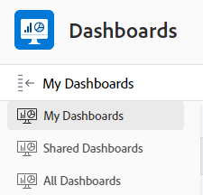

# 대시보드 시작하기

<!-- Audited: 1/2025 -->

대시보드의 목적은 여러 보고서에서 나오는 정보에 빠르게 액세스할 수 있도록 하는 것입니다. 먼저 보고서에서 정보를 수집한 다음 여러 보고서를 대시보드에 배치하여 정보에 보다 쉽게 액세스할 수 있습니다.

## 액세스 요구 사항

+++ 이 문서의 기능에 대한 액세스 요구 사항을 보려면 확장하십시오.

<table style="table-layout:auto"> 
 <col> 
 <col> 
 <tbody> 
  <tr> 
   <td role="rowheader">Adobe Workfront 패키지</td> 
   <td> 
Any
 </td> 
  </tr> 
  <tr> 
   <td role="rowheader">Adobe Workfront 라이선스</td> 
   <td> 
      
콘텐츠 작가 이상

      
검토 이상

   </td> 
  </tr> 
  <tr> 
   <td role="rowheader">액세스 레벨 구성</td> 
   <td> 
보고서, 대시보드 및 일정에 대한 액세스 보기
</td> 
  </tr>  
  <tr> 
   <td role="rowheader">개체 권한</td> 
   <td> 
대시보드에 대한 사용 권한 보기
 </td> 
  </tr> 
 </tbody> 
</table>

이 표의 정보에 대한 자세한 내용은 [Workfront 설명서의 액세스 요구 사항](/help/quicksilver/administration-and-setup/add-users/access-levels-and-object-permissions/access-level-requirements-in-documentation.md)을 참조하십시오.

+++

## 대시보드에 추가할 수 있는 객체

Adobe Workfront에서 최대 25개의 다음 항목으로 대시보드를 채울 수 있습니다.

* 보고서\
  보고서를 만드는 방법에 대한 자세한 내용은 [사용자 지정 보고서 만들기](../../../reports-and-dashboards/reports/creating-and-managing-reports/create-custom-report.md)를 참조하세요.

* 캘린더\
  일정 만들기에 대한 자세한 내용은 [일정 보고서 개요](../../../reports-and-dashboards/reports/calendars/calendar-reports-overview.md)를 참조하세요.

* 외부 페이지\
  외부 페이지를 만드는 방법에 대한 자세한 내용은 [대시보드에 외부 웹 페이지 포함](../../../reports-and-dashboards/dashboards/creating-and-managing-dashboards/embed-external-web-page-dashboard.md)을 참조하세요.

대시보드를 만드는 방법에 대한 자세한 내용은 [대시보드 만들기](../../../reports-and-dashboards/dashboards/creating-and-managing-dashboards/create-dashboard.md)를 참조하세요.

## 대시보드 공유

다음과 같은 방법으로 사용자와 대시보드를 공유할 수 있습니다.

* 개별 기반으로 공유.\
  대시보드 공유에 대한 자세한 내용은 [보고서, 대시보드 및 일정 공유](../../../workfront-basics/grant-and-request-access-to-objects/permissions-reports-dashboards-calendars.md) 및 [대시보드 공유](../../../reports-and-dashboards/dashboards/creating-and-managing-dashboards/share-dashboard.md)를 참조하세요.

* 왼쪽 패널에서 Workfront의 모든 영역 또는 개체에 대시보드를 추가합니다.\
  왼쪽 패널에 대시보드를 추가하는 방법에 대한 자세한 내용은 [Adobe Workfront의 왼쪽 탐색](../../../workfront-basics/the-new-workfront-experience/simplified-left-navigation.md)을 참조하세요.

* 사용자와 공유할 수 있는 레이아웃 템플릿에 대시보드를 배치합니다.\
  레이아웃 템플릿을 통해 대시보드를 공유하는 방법에 대한 자세한 내용은 [레이아웃 템플릿을 사용하여 왼쪽 패널 사용자 지정](../../../administration-and-setup/customize-workfront/use-layout-templates/customize-left-panel.md)을 참조하세요.

* 하드 카피를 인쇄하여 사용자와 공유합니다.\
  대시보드 인쇄에 대한 자세한 내용은 [대시보드 인쇄](../../../reports-and-dashboards/dashboards/creating-and-managing-dashboards/print-dashboard.md)를 참조하세요.

* PDF 파일로 내보내면 이메일로 사용자에게 전송할 수 있습니다.\
  대시보드를 PDF 파일로 내보내는 방법에 대한 자세한 내용은 [대시보드 내보내기](../../../reports-and-dashboards/dashboards/creating-and-managing-dashboards/export-dashboard.md)를 참조하세요.

대시보드를 사용자와 공유하면 대시보드에 있는 모든 보고서, 일정 및 외부 페이지도 기본적으로 동일한 사용자와 공유됩니다.

>[!IMPORTANT]
>
>사용자가 삭제되면 사용자가 만든 모든 대시보드에 더 이상 액세스할 수 없습니다. 자세한 내용은 [사용자 삭제](../../../administration-and-setup/add-users/create-and-manage-users/delete-a-user.md)를 참조하세요.

## 대시보드 표시

다음과 같은 방법으로 대시보드를 표시할 수 있습니다.

* 오브젝트의 왼쪽 패널을 통해 대시보드에 액세스합니다.
왼쪽 패널에 대시보드를 배치하는 방법에 대한 자세한 내용은 [Adobe Workfront의 왼쪽 탐색](../../../workfront-basics/the-new-workfront-experience/simplified-left-navigation.md)을 참조하세요.

* 대시보드를 검색하고 수동으로 액세스합니다.

## 대시보드에 액세스

1. Adobe Workfront 오른쪽 상단에서 **[!UICONTROL 메인 메뉴]** 아이콘 를 클릭하거나(사용 가능한 경우) 왼쪽 상단에서 **[!UICONTROL 메인 메뉴]** 아이콘 를 클릭한 다음 **대시보드**&#x200B;를 클릭합니다.
1. 왼쪽 사이드바 위로 마우스를 가져간 후 다음 중 하나를 선택합니다.

   * **내 대시보드**: 작성한 대시보드가 여기에 나열됩니다.

     >[!TIP]
     >
     >액세스 수준에 보고서, 대시보드 및 일정에 대한 편집 액세스 권한이 없으면 대시보드를 만들 수 없습니다. 이 경우 내 대시보드 목록이 비어 있습니다.

   * **공유 대시보드**: 다른 사용자가 만들고 나와 공유된 대시보드가 여기에 나열됩니다.
   * **모든 대시보드**: 대시보드와 다른 사용자가 공유한 대시보드가 모두 여기에 나열됩니다.

   

1. 대시보드의 이름을 눌러 표시합니다.\
   대시보드에는 보고서, 달력 또는 보고서를 채우는 외부 페이지에 포함된 정보가 표시됩니다.
1. (선택 및 조건부) 대시보드의 정보를 새로 고치려면 대시보드 오른쪽 위에 있는 **다시 로드** 아이콘을 클릭합니다.\
   대시보드의 정보는 처음 액세스할 때 실시간으로 동기화됩니다. 브라우저에 대시보드를 잠시 표시한 경우 대시보드의 보고서 정보가 오래될 수 있습니다. 대시보드를 마지막으로 새로 고친 날짜와 시간이 이 아이콘 왼쪽에 나열됩니다.\
   

## 대시보드 삭제

Workfront에서 대시보드를 제거하려는 경우 삭제할 수 있습니다.

자세한 내용은 [대시보드 삭제](../../../reports-and-dashboards/dashboards/creating-and-managing-dashboards/delete-dashboard.md)를 참조하세요.
