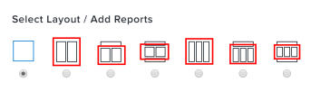

# 보고서가 대시보드에 표시되는 방식 이해

대시보드에 추가된 보고서가 대시보드에 표시되는 방식을 관리할 수 있습니다.

대시보드에서 보고서의 레이아웃을 편집하는 방법에 대한 자세한 내용은 [대시보드 만들기](../../../reports-and-dashboards/dashboards/creating-and-managing-dashboards/create-dashboard.md)를 참조하십시오.

보고서를 만들 때 대시보드에 표시할 보고서 열을 선택할 수 있습니다. 보고서의 모든 열을 항상 대시보드에 표시하려면 보고서를 만들 때 각 열에 대해 를 지정해야 합니다.

대시보드에 표시할 보고서 열을 선택하는 방법에 대한 자세한 내용은 [사용자 지정 보고서 만들기](../../../reports-and-dashboards/reports/creating-and-managing-reports/create-custom-report.md)를 참조하십시오.

## 대시보드에 보고서의 모든 열 표시

대시보드의 전체 너비를 차지하는 대시보드 영역에 대해 보고서를 선택하면 기본적으로 보고서의 모든 열이 대시보드에 표시됩니다.\

## 대시보드에 보고서의 첫 열만 표시

대시보드의 전체 너비보다 작은 대시보드 영역에 대해 보고서를 선택하면 기본적으로 보고서의 첫 번째 열만 대시보드에 표시됩니다.\

