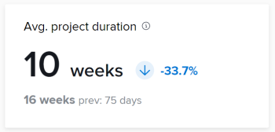

# KPI 쿼리

이 문서의 쿼리를 사용하여 고급 Analytics의 시각화와 유사한 데이터 시각화를 만들 수 있습니다.

>[!IMPORTANT]
>
>쿼리는 향상된 Analytics에 표시된 결과와 유사한 결과를 생성하지만 정확히 일치하지 않을 수 있습니다.


## 전제 조건

시작하기 전에 다음을 수행해야 합니다

1. Business Intelligence(BI) 도구와의 연결 설정:
   1. [Snowflake에 대한 Reader 계정 또는 연결 만들기](/help/quicksilver/reports-and-dashboards/data-lake/create-a-reader-account.md)
   1. [Workfront Data Connect에 연결 설정](/help/quicksilver/reports-and-dashboards/data-lake/share-data-externally.md)

연결을 설정한 후에는 이 문서의 쿼리를 사용하여 데이터를 추출하고 시각화할 수 있습니다.

## 프로젝트 완료됨

프로젝트 완료 KPI는 필터링된 기간 내에 완료된 프로젝트 수와 이전 기간 이후 증가하거나 감소된 백분율을 보여줍니다.

이전 기간에 완료된 프로젝트 수와 이전 기간의 일 수도 확인할 수 있습니다.


### 쿼리

```
WITH completedProjectsInRange as ( 
    SELECT 
        COUNT(t0.PROJECTID) as PROJECT_COUNT 
    FROM PROJECTS_CURRENT t0 
    WHERE t0.ACTUALCOMPLETIONDATE >= '2025-01-01' 
        AND t0.ACTUALCOMPLETIONDATE <= '2025-01-31' 
), completedProjectsPreviousRange as ( 
    SELECT 
        COUNT(t0.PROJECTID) as PROJECT_COUNT 
    FROM PROJECTS_CURRENT t0 
    WHERE t0.ACTUALCOMPLETIONDATE >= '2024-12-01' 
        AND t0.ACTUALCOMPLETIONDATE <= '2024-12-31' 
), rawChange as ( 
    SELECT 
        (a.PROJECT_COUNT - b.PROJECT_COUNT) as CHANGE_FROM_PREVIOUS_PERIOD 
    FROM completedProjectsInRange a, completedProjectsPreviousRange b 
), percentChange as ( 
    SELECT 
        CASE 
            WHEN a.PROJECT_COUNT = b.PROJECT_COUNT THEN 0.00 
            WHEN b.PROJECT_COUNT > 0 THEN ((a.PROJECT_COUNT - b.PROJECT_COUNT) / b.PROJECT_COUNT * 100) 
        END AS PERCENT_CHANGE_FROM_PREVIOUS_PERIOD 
    FROM completedProjectsInRange a, completedProjectsPreviousRange b 
) 
SELECT 
    a.PROJECT_COUNT, 
    b.PROJECT_COUNT as PREVIOUS_PROJECT_COUNT, 
    c.CHANGE_FROM_PREVIOUS_PERIOD, 
    d.PERCENT_CHANGE_FROM_PREVIOUS_PERIOD 
FROM completedProjectsInRange a, completedProjectsPreviousRange b, rawChange c, 
percentChange d
```

## 프로젝트가 정시에 완료됨

정시에 완료된 프로젝트 KPI는 필터링된 기간 내에 정시에 완료된 프로젝트의 백분율과 이전 기간 이후 백분율이 증가 또는 감소했는지 보여 줍니다.

이전 기간의 일수는 물론 이전 기간의 정시에 완료된 프로젝트의 백분율도 확인할 수 있습니다.


```
WITH completedProjectsInRange as ( 
    SELECT 
        COUNT(t0.PROJECTID) as PROJECT_COUNT 
    FROM PROJECTS_CURRENT t0 
    WHERE t0.ACTUALCOMPLETIONDATE >= '2025-01-01' 
        AND t0.ACTUALCOMPLETIONDATE <= '2025-01-31' 
), completedOntimeProjectsInRange as ( 
    SELECT 
        COUNT(t0.PROJECTID) as PROJECT_COUNT 
    FROM PROJECTS_CURRENT t0 
    WHERE t0.ACTUALCOMPLETIONDATE >= '2025-01-01' 
        AND t0.ACTUALCOMPLETIONDATE <= '2025-01-31' 
        AND t0.PROGRESSSTATUS = 'ON' 
), percentOntimeProjects as ( 
    SELECT 
        CASE 
            WHEN a.PROJECT_COUNT = 0 THEN 0 
            ELSE ROUND(b.PROJECT_COUNT/a.PROJECT_COUNT) * 100 
        END as ONTIMEPROJECTPERCENT 
    FROM completedProjectsInRange a, completedOntimeProjectsInRange b 
), completedProjectsPreviousRange as ( 
    SELECT 
        COUNT(t0.PROJECTID) as PROJECT_COUNT 
    FROM PROJECTS_CURRENT t0 
    WHERE t0.ACTUALCOMPLETIONDATE >= '2024-12-01' 
        AND t0.ACTUALCOMPLETIONDATE <= '2024-12-31' 
), completedOntimeProjectsPreviousRange as ( 
    SELECT 
        COUNT(t0.PROJECTID) as PROJECT_COUNT 
    FROM PROJECTS_CURRENT t0 
    WHERE t0.ACTUALCOMPLETIONDATE >= '2024-12-01' 
        AND t0.ACTUALCOMPLETIONDATE <= '2024-12-31' 
        AND t0.PROGRESSSTATUS = 'ON' 
), percentOntimeProjectsPreviousRange as ( 
    SELECT 
        CASE 
            WHEN a.PROJECT_COUNT = 0 THEN 0 
            ELSE ROUND(b.PROJECT_COUNT/a.PROJECT_COUNT) * 100 
        END as ONTIMEPROJECTPERCENT 
    FROM completedProjectsPreviousRange a, completedOntimeProjectsPreviousRange b 
), rawChange as ( 
    SELECT 
        (a.ONTIMEPROJECTPERCENT - b.ONTIMEPROJECTPERCENT) as CHANGE_FROM_PREVIOUS_PERIOD 
    FROM percentOntimeProjects a, percentOntimeProjectsPreviousRange b 
), percentChange as ( 
    SELECT  
        CASE 
            WHEN a.ONTIMEPROJECTPERCENT = b.ONTIMEPROJECTPERCENT THEN 0 
            WHEN b.ONTIMEPROJECTPERCENT > 0 THEN ((a.ONTIMEPROJECTPERCENT - b.ONTIMEPROJECTPERCENT) / b.ONTIMEPROJECTPERCENT * 100) 
        END AS PERCENT_CHANGE_FROM_PREVIOUS_PERIOD 
    FROM percentOntimeProjects a, percentOntimeProjectsPreviousRange b 
) 

SELECT 
    a.ONTIMEPROJECTPERCENT, 
    b.ONTIMEPROJECTPERCENT as PREVIOUS_ONTIMEPROJECTPERCENT, 
    c.CHANGE_FROM_PREVIOUS_PERIOD, 
    d.PERCENT_CHANGE_FROM_PREVIOUS_PERIOD 
FROM percentOntimeProjects a, percentOntimeProjectsPreviousRange b, rawChange c, 
percentChange d
```

## 평균 프로젝트 기간

평균 프로젝트 기간 KPI는 필터링된 기간 내에 실제 종료 일자가 있는 프로젝트의 평균 완료 시간(일, 주 또는 년)과 이전 기간 이후 백분율 증가 또는 감소를 표시합니다.

이전 기간의 일 수뿐만 아니라 이전 기간의 실제 종료 일자가 있는 프로젝트의 평균 완료 시간도 확인할 수 있습니다.

>[!NOTE]
>
>완료된 프로젝트의 기간만 설명합니다.




```
WITH averageProjectDurationInRange as ( 
    SELECT 
        AVG(t0.ACTUALDURATIONMINUTES) as AVERAGE_PROJECT_DURATION 
    FROM PROJECTS_CURRENT t0 
    WHERE t0.ACTUALCOMPLETIONDATE >= '2025-01-01' 
        AND t0.ACTUALCOMPLETIONDATE <= '2025-01-31' 
), averageProjectPreviousRange as ( 
    SELECT AVG (t0. ACTUALDURATIONMINUTES) as AVERAGE_PROJECT_DURATION FROM PROJECTS_CURRENT t0 
    WHERE t0.ACTUALCOMPLETIONDATE >= '2024-12-01' 
        AND t0.ACTUALCOMPLETIONDATE <= '2024-12-31' 
), rawChange as ( 
    SELECT ((a.AVERAGE_PROJECT_DURATION - b.AVERAGE_PROJECT_DURATION) / 480) as CHANGE_FROM_PREVIOUS_PERIOD FROM averageProjectDurationInRange a, averageProjectPreviousRange b 
), percentChange as ( 
    SELECT  
        CASE 
            WHEN a.AVERAGE_PROJECT_DURATION = b.AVERAGE_PROJECT_DURATION THEN 0 
            WHEN b.AVERAGE_PROJECT_DURATION > 0 THEN ((a.AVERAGE_PROJECT_DURATION - b.AVERAGE_PROJECT_DURATION)  / b.AVERAGE_PROJECT_DURATION) * 100 
        END AS PERCENT_CHANGE_FROM_PREVIOUS_PERIOD 
        FROM averageProjectDurationInRange a, averageProjectPreviousRange b 
) 
 
SELECT 
    a.AVERAGE_PROJECT_DURATION, 
    b.AVERAGE_PROJECT_DURATION as PREVIOUS_AVERAGE_PROJECT_DURATION, 
    c.CHANGE_FROM_PREVIOUS_PERIOD, 
    d.PERCENT_CHANGE_FROM_PREVIOUS_PERIOD 
FROM averageProjectDurationInRange a, averageProjectPreviousRange b, rawChange c, 
percentChange d
```

## 프로젝트별 평균 작업

Avg, Tasks per project KPI는 필터링된 기간 내에 프로젝트에 할당된 작업의 평균 수와 이전 기간 이후 증가하거나 감소된 백분율을 보여줍니다.

이전 기간의 평균 프로젝트 작업 수와 이전 기간의 일 수도 확인할 수 있습니다.


```
WITH tasksPerProjectInRange as ( 
    SELECT 
        COUNT(t0.TASKID) as TASK_COUNT 
    FROM TASKS_CURRENT t0 
        LEFT JOIN PROJECTS_CURRENT t1 ON t1.PROJECTID = t0.PROJECTID 
    WHERE 
        ( 
            t1.PLANNEDSTARTDATE >= '2025-01-01' 
            AND t1.PLANNEDSTARTDATE <= '2025-01-31' 
        ) 
        OR ( 
            t1.PLANNEDCOMPLETIONDATE >= '2025-01-01' 
            AND t1. PLANNEDCOMPLETIONDATE <= '2025-01-31' 
        ) 
        OR ( 
            t1.PLANNEDSTARTDATE <= '2025-01-01' 
            AND t1. PLANNEDCOMPLETIONDATE >= '2025-01-31' 
        ) 
    GROUP BY t0.PROJECTID 
), averageTasksPerProjectInRange as ( 
    SELECT AVG(TASK_COUNT) AS AVERAGE_TASK_COUNT FROM tasksPerProjectInRange 
), tasksPerProjectInPreviousRange as ( 
    SELECT 
        COUNT(t0.TASKID) as TASK_COUNT 
    FROM TASKS_CURRENT t0 
        LEFT JOIN PROJECTS_CURRENT t1 ON t1.PROJECTID = t0.PROJECTID 
    WHERE 
        ( 
            t1.PLANNEDSTARTDATE >= '2024-12-01' 
            AND t1.PLANNEDSTARTDATE <= '2024-12-31' 
        ) 
        OR ( 
            t1.PLANNEDCOMPLETIONDATE >= '2024-12-01' 
            AND t1. PLANNEDCOMPLETIONDATE <= '2024-12-31' 
        ) 
        OR ( 
            t1.PLANNEDSTARTDATE <= '2024-12-01' 
            AND t1. PLANNEDCOMPLETIONDATE >= '2024-12-31' 
        ) 
    GROUP BY t0.PROJECTID 
), averageTasksPerProjectInPreviousRange as ( 
    SELECT 
        AVG(TASK_COUNT) AS AVERAGE_TASK_COUNT 
        FROM tasksPerProjectInPreviousRange 
), rawChange as ( 
    SELECT 
        (a.AVERAGE_TASK_COUNT - b.AVERAGE_TASK_COUNT) as CHANGE_FROM_PREVIOUS_PERIOD 
    FROM averageTasksPerProjectInRange a, averageTasksPerProjectInPreviousRange b 
), percentChange as ( 
    SELECT 
        CASE 
            WHEN a.AVERAGE_TASK_COUNT = b.AVERAGE_TASK_COUNT THEN 0 
            WHEN b.AVERAGE_TASK_COUNT > 0 THEN ((a.AVERAGE_TASK_COUNT - b.AVERAGE_TASK_COUNT) / b.AVERAGE_TASK_COUNT) * 100  
        END as PERCENT_CHANGE_FROM_PREVIOUS_PERIOD 
    FROM averageTasksPerProjectInRange a, averageTasksPerProjectInPreviousRange b 
) 
 
SELECT 
    a.AVERAGE_TASK_COUNT, 
    b.AVERAGE_TASK_COUNT as PREVIOUS_AVERAGE_TASK_COUNT, 
    c.CHANGE_FROM_PREVIOUS_PERIOD, 
    d.PERCENT_CHANGE_FROM_PREVIOUS_PERIOD 
FROM averageTasksPerProjectInRange a, averageTasksPerProjectInPreviousRange b, rawChange c, percentChange d
```

## 문제 해결

* **결과 없음**: 쿼리에서 결과를 반환하지 않으면 큰따옴표와 작은따옴표가 올바르게 복사되었는지 확인하십시오.
