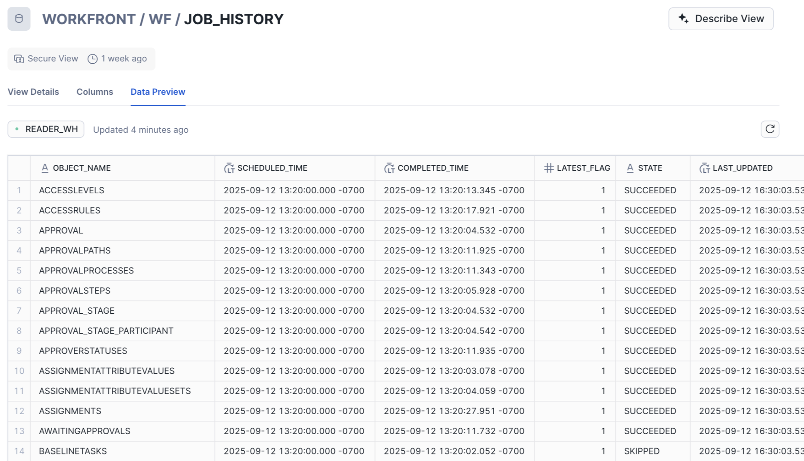

# Data Connect의 작업 내역 보기 사용

작업 내역 보기에서 Workfront 관리자는 각 데이터 새로 고침 작업의 세부 기록에 액세스할 수 있습니다. 이러한 레코드는 데이터를 최신 상태로 유지하고 프로세스를 실행하고 비즈니스 시각화를 새로 고치는 시기에 이상적인 기간을 설정하는 데 도움이 되는 작업에 중요한 insight을 제공합니다.

작업 내역 보기 열에는 다음 정보가 포함됩니다.

* **OBJECT_NAME**: 작업과 연결된 개체의 이름을 표시합니다.
* **SCHEDULED_TIME**: 작업의 시작 시간을 표시합니다.
* **COMPLETED_TIME**: 작업의 완료 시간을 표시합니다.
* **LATEST_FLAG**: 작업이 가장 최근 새로 고침의 일부인지 여부를 나타냅니다.
* **STATE**: 작업 상태를 표시합니다. 자세한 내용은 이 문서에서 다음 섹션을 참조하십시오. [사용 가능한 작업 상태](#available-job-statuses).
* **LAST_UPDATED**: 작업의 마지막 업데이트 타임스탬프.

>[!NOTE]
>
>작업 내역 보기에는 이전에 72시간 동안 예약된 작업에 대한 세부 정보가 포함됩니다.

## 사용 가능한 작업 상태

각 데이터 연결 작업에는 성공, 생략 또는 실패 여부를 나타내는 상태가 할당됩니다.

<table>
    <tr>
        <td><b>작업 상태</b></td>
        <td><b>정의</b></td>
    </tr>
    <tr>
        <td>성공</td>
        <td>작업이 사용 가능한 각 업데이트를 성공적으로 처리했으며 해당 레코드 유형에 대한 모든 업데이트가 이제 데이터 레이크에 반영됩니다.</td>
    </tr>
    <tr>
        <td>건너뜀</td>
        <td>레코드 유형에 대해 처리할 큐에 업데이트가 없으므로 작업을 건너뛰었습니다.</td>
    </tr>
    <tr>
        <td>실패</td>
        <td>작업을 실행하지 못했습니다. 이러한 경우 큐에 있는 데이터가 데이터 레이크에 커밋되지 않았을 수 있습니다. 대기열에 남아 있는 레코드는 해당 레코드 유형에 대해 다음으로 예약된 작업에서 처리됩니다. </td>
    </tr>
   </table>

## 작업 실행 및 로깅 동작에 대한 고려 사항

Snowflake에서는 작업 내역 보기에서 작업 실행이 처리 및 기록되는 방식에 영향을 줄 수 있는 작업 스케줄러 최적화 도구를 사용합니다. 이 로깅 동작은 처리할 데이터가 있는지 여부에 따라 달라질 수 있습니다.

예를 들어 주어진 객체에 대해 처리할 새 행이 없는 경우 다음 결과 중 하나가 발생할 수 있습니다.

* **작업이 실행되고 [건너뜀]으로 표시됨**: Snowflake이 처리할 행이 없음을 감지하고 작업을 실행하고 테이블에 [건너뜀] 상태로 기록합니다.

* **작업이 실행되지 않습니다**: Snowflake은 처리할 행이 없다고 확인하고 작업을 실행하지 않고 건너뜀 상태로 테이블에 기록합니다.

  >[!NOTE]
  >
  >작업이 실행되지 않는 두 번째 시나리오에서는 해당 개체에 대한 가장 최근 레코드가 예상 일정과 일치하지 않는 타임스탬프를 반영할 수 있습니다.

즉, 작업은 행이 처리되지 않더라도 실행된 것으로 간주될 수 있으며, 해당 특정 작업에 대한 작업 스케줄러의 동작에 따라 로깅되거나 로깅되지 않을 수 있습니다.