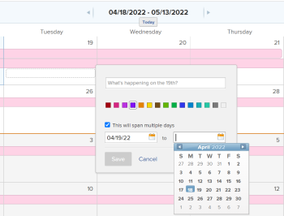

# 달력 보고서에 임시 이벤트 추가

이 페이지에서 강조 표시된 정보는 아직 일반적으로 사용할 수 없는 기능을 참조합니다. 미리 보기 샌드박스 환경에서만 사용할 수 있습니다.

캘린더에 임시 이벤트를 추가할 수 있습니다. 애드혹 이벤트는 달력에서 미리 알림 역할을 할 뿐 프로젝트, 작업 또는 문제와 연결되어 있지 않습니다.

## 액세스 요구 사항

+++ 을 확장하여 이 문서의 기능에 대한 액세스 요구 사항을 봅니다.

이 문서의 단계를 수행하려면 다음 액세스 권한이 있어야 합니다.

<table style="table-layout:auto"> 
 <col> 
 </col> 
 <col> 
 </col> 
 <tbody> 
  <tr> 
   <td role="rowheader">[!DNL Adobe Workfront plan]</td> 
   <td> 
임의
 </td> 
  </tr> 
  <tr> 
   <td role="rowheader">[!DNL Adobe Workfront] 라이센스</td> 
   <td>
새로운 기능: 표준

       
또는

       
현재: 플랜
</td> 
  </tr> 
  <tr> 
   <td role="rowheader">액세스 수준 구성</td> 
   <td> 
[!UICONTROL 보고서], [!UICONTROL 대시보드] 및 [!UICONTROL 달력]에 대한 [!UICONTROL 편집] 액세스 권한
</td> 
  </tr> 
  <tr> 
   <td role="rowheader">개체 권한</td> 
   <td>달력 보고서에 대한 [!UICONTROL 관리] 액세스</td> 
  </tr> 
 </tbody> 
</table>

이 표의 정보에 대한 자세한 내용은 [Workfront 설명서의 액세스 요구 사항](/help/quicksilver/administration-and-setup/add-users/access-levels-and-object-permissions/access-level-requirements-in-documentation.md)을 참조하십시오.

+++

## 프로덕션의 달력 보고서에 임시 이벤트 추가

1. 일정에서 임시 이벤트를 추가할 날짜로 이동한 다음 이벤트의 [!UICONTROL 시작] 날짜를 클릭합니다.
1. 이벤트 이름을 입력하고 원하는 경우 이벤트 색상을 선택합니다.
1. (조건부) 임시 이벤트가 여러 날에 걸쳐 발생하는 경우 **[!UICONTROL 여러 날에 걸쳐 진행됩니다]**&#x200B;를 선택한 다음 팝업 달력에서 종료 날짜를 선택합니다.

   

1. **[!UICONTROL 저장]**&#x200B;을 클릭합니다.
1. (선택 사항) 임시 이벤트를 수정하려면 다음을 수행합니다.

   1. 캘린더에서 이벤트를 클릭하여 이벤트에 대한 세부 정보 페이지를 엽니다.
   1. 편집 아이콘(연필)을 클릭하고 이벤트를 편집한 다음 **[!UICONTROL 저장]**&#x200B;을 클릭합니다.

1. (선택 사항) 임시 이벤트를 삭제하려면

   1. 캘린더에서 이벤트를 클릭하여 이벤트에 대한 세부 정보 페이지를 엽니다.
   1. 휴지통 아이콘을 클릭한 다음 **[!UICONTROL 예, 삭제]**&#x200B;를 클릭합니다.

## 미리보기에서 캘린더 보고서에 임시 이벤트 추가

1. 임시 이벤트를 추가할 달력으로 이동합니다.
1. 달력 맨 위에서 **추가**&#x200B;를 클릭합니다.
1. 오른쪽의 사이드 패널에서 이벤트를 **이름**&#x200B;합니다.
1. 이벤트의 색상을 선택합니다.
1. 이벤트가 여러 날에 걸쳐 진행되어야 하는지 여부를 선택합니다.
1. 달력 아이콘을 사용하여 날짜를 입력하거나 선택합니다.

