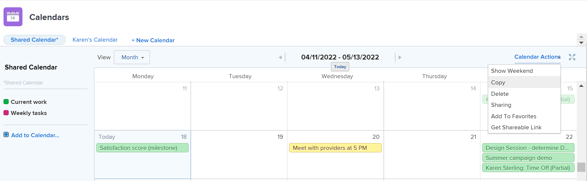

# 캘린더 보고서 복사

달력을 만든 경우 해당 달력을 복사하여 새 달력의 시작점으로 사용할 수 있습니다.

또한 소유자가 아닌 캘린더에 대해 [!UICONTROL 관리] 액세스 권한이 있는 경우 캘린더를 복사하여 복사된 캘린더의 소유자가 될 수 있습니다.

## 액세스 요구 사항

이 문서의 단계를 수행하려면 다음 액세스 권한이 있어야 합니다.

<table style="table-layout:auto"> 
 <col> 
 </col> 
 <col> 
 </col> 
 <tbody> 
  <tr> 
   <td role="rowheader"><strong>[!DNL Adobe Workfront plan*]</strong></td> 
   <td> 
임의
 </td> 
  </tr> 
  <tr> 
   <td role="rowheader"><strong>[!DNL Adobe Workfront] 라이센스*</strong></td> 
   <td> 
[!UICONTROL 계획] 
 </td> 
  </tr> 
  <tr> 
   <td role="rowheader"><strong>액세스 수준 구성*</strong></td> 
   <td> 
[!UICONTROL 보고서], [!UICONTROL 대시보드] 및 [!UICONTROL 달력]에 대한 [!UICONTROL 편집] 액세스 권한
 
참고: 여전히 액세스 권한이 없는 경우 [!DNL Workfront] 관리자에게 액세스 수준에 추가 제한을 설정했는지 문의하십시오. [!DNL Workfront] 관리자가 액세스 수준을 수정하는 방법에 대한 자세한 내용은 <a href="../../../administration-and-setup/add-users/configure-and-grant-access/create-modify-access-levels.md" class="MCXref xref">사용자 지정 액세스 수준 만들기 또는 수정</a>을 참조하십시오.
 </td> 
  </tr> 
  <tr> 
   <td role="rowheader"><strong>개체 권한</strong></td> 
   <td> 
달력 보고서에 대한 [!UICONTROL 관리] 액세스
 
추가 액세스 요청에 대한 자세한 내용은 <a href="../../../workfront-basics/grant-and-request-access-to-objects/request-access.md" class="MCXref xref">개체 </a>에 대한 액세스 요청 을 참조하십시오.
 </td> 
  </tr> 
 </tbody> 
</table>

&#42;플랜, 라이선스 유형 또는 액세스 권한을 확인하려면 [!DNL Workfront] 관리자에게 문의하세요.

## 캘린더 보고서 복사

1. 복사할 달력으로 이동합니다.
1. **[!UICONTROL 일정]** 도구 모음에서 **[!UICONTROL 일정 작업]**&#x200B;을 클릭한 다음 드롭다운 목록에서 **[!UICONTROL 복사]**&#x200B;를 선택합니다.\
   캘린더 복사본이 열립니다.

   

   원래 캘린더의 모든 프로젝트 및 캘린더 그룹화가 캘린더 복사본에 표시됩니다. 달력 필터로 배치된 객체만 새로 복사된 달력으로 내보냅니다. 원래 캘린더에 수동으로 추가된 모든 이벤트는 복사된 캘린더에 수동으로 추가해야 합니다.

   복사한 캘린더에 대한 액세스 권한은 사용자만 있습니다. 원래 캘린더에 대한 액세스 권한이 있는 사용자는 복사된 캘린더에 대한 액세스 권한이 없습니다. 다른 사용자와 공유하여 새로 만든 캘린더에 대한 액세스 권한을 부여할 수 있습니다. 일정 공유에 대한 자세한 내용은 [[!UICONTROL 일정 공유] 보고서](../../../reports-and-dashboards/reports/calendars/share-a-calendar-report.md)를 참조하세요.

1. (선택 사항) 달력 이름을 변경합니다.
