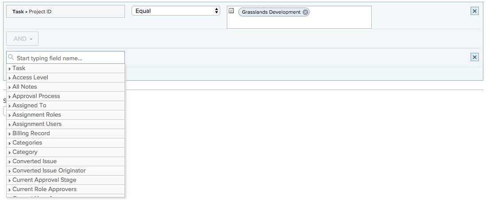

# 사용 [!UICONTROL 예상 날짜] 달력 보고서에서

달력 보고서는 작업의 시각적 표현을 제공하는 동적 보고서입니다. 달력 보고서에서 다음 객체에 대해 예상 일자 필드를 사용할 수 있습니다.

* 작업
* 문제
* 프로젝트

## 액세스 요구 사항

이 문서의 절차를 수행하려면 다음 액세스 권한이 있어야 합니다.

<table style="table-layout:auto"> 
 <col> 
 </col> 
 <col> 
 </col> 
 <tbody> 
  <tr> 
   <td role="rowheader"><strong>[!DNL Adobe Workfront plan*]</strong></td> 
   <td> 
모든
 </td> 
  </tr> 
  <tr> 
   <td role="rowheader"><strong>[!DNL Adobe Workfront] 라이센스*</strong></td> 
   <td> 
[!UICONTROL 계획] 
 </td> 
  </tr> 
  <tr> 
   <td role="rowheader"><strong>액세스 수준 구성*</strong></td> 
   <td> 
[!UICONTROL][!UICONTROL Reports], [!UICONTROL Dashboards] 및 [!UICONTROL Calendar]에 대한 액세스 편집
 
참고: 여전히 액세스할 수 없는 경우 [!DNL Workfront] 관리자가 액세스 수준에서 추가 제한을 설정한 경우 자세한 내용은 [!DNL Workfront] 관리자는 액세스 수준을 수정할 수 있습니다. <a href="../../../administration-and-setup/add-users/configure-and-grant-access/create-modify-access-levels.md" class="MCXref xref">사용자 정의 액세스 수준 만들기 또는 수정</a>.
 </td> 
  </tr> 
  <tr> 
   <td role="rowheader"><strong>개체 권한</strong></td> 
   <td> 
달력 보고서에 대한 [!UICONTROL Manage] 액세스
 
추가 액세스 요청에 대한 자세한 내용은 <a href="../../../workfront-basics/grant-and-request-access-to-objects/request-access.md" class="MCXref xref">개체에 대한 액세스 요청 </a>.
 </td> 
  </tr> 
 </tbody> 
</table>

&#42;어떤 계획, 라이센스 유형 또는 액세스 권한을 보유하고 있는지 확인하려면 [!DNL Workfront] 관리자

## 항목 그룹 설정

일정에 항목 그룹을 표시할 방법을 선택할 수 있습니다.

1. 을(를) 클릭합니다. **[!UICONTROL 기본 메뉴]** 아이콘  Adobe Workfront의 오른쪽 위 모서리에서 을(를) 클릭하고 **[!UICONTROL 달력]**.

1. 새 항목 그룹을 추가할 달력을 선택합니다.\
   또는\
   클릭 **[!UICONTROL + 새 달력]** 달력 이름을 입력합니다.

   >[!NOTE]
   >
   >다음을 수행해야 합니다. [!UICONTROL 편집] 액세스 [!UICONTROL 보고서], [!UICONTROL 대시보드], 및 [!UICONTROL 달력] 액세스 수준에서 달력 보고서를 만들 수 있습니다.

1. 왼쪽에서 **[!UICONTROL 달력에 추가]**&#x200B;를 클릭한 다음 **[!UICONTROL 고급 항목 추가]**.

1. 다음을 지정합니다.

   <table style="table-layout:auto">
    <col>
    <col>
    <tbody>
     <tr>
      <td role="rowheader"><strong>[!UICONTROL 이 항목 그룹의 이름을 지정합니다.]</strong></td>
      <td>항목 그룹의 이름을 입력합니다.</td>
     </tr>
     <tr>
      <td role="rowheader"><strong>[!UICONTROL Color]</strong></td>
      <td>항목 그룹의 색상을 선택합니다. 모든 항목이 달력 보고서에서 선택한 색상으로 표시됩니다.</td>
     </tr>
     <tr>
      <td role="rowheader"><strong>[!UICONTROL 날짜 필드]</strong></td>
      <td>
선택 <strong>[!UICONTROL 예상 날짜]</strong>. 예상 날짜에 대한 자세한 내용은 

       <ul>
        <li><a href="../../../manage-work/projects/planning-a-project/project-projected-start-date.md" class="MCXref xref">프로젝트 개요 예상 시작 일자</a></li>
        <li><a href="../../../manage-work/projects/planning-a-project/project-projected-completion-date.md" class="MCXref xref">프로젝트, 작업 및 문제에 대한 예상 완료 일자 개요</a> </li>
       </ul></td>
     </tr>
     <tr>
      <td role="rowheader"><strong>[!UICONTROL 달력에서 표시]</strong></td>
      <td>
날짜를 표시할 방법 선택:

       <ul>
        <li><strong>[!UICONTROL 시작 날짜만]</strong>: 달력은 단일 날짜에 객체를 표시합니다.</li>
        <li><strong>[!UICONTROL 종료 날짜만]</strong>: 달력은 단일 날짜에 객체를 표시합니다.</li>
        <li><strong>[!UICONTROL Duration](시작 후 종료)</strong>: 달력은 기간 동안 개체를 표시합니다.</li>
       </ul></td>
     </tr>
     <tr data-mc-conditions="">
      <td role="rowheader"><strong>[!UICONTROL 사용 가능한 경우 실제 날짜로 전환]</strong></td>
      <td>
달력은 사용 가능한 경우 실제 날짜로 자동 전환됩니다.  선택 <strong>[!UICONTROL Yes]</strong> 또는 <strong>[!UICONTROL No]</strong> 사용 가능한 경우 실제 날짜로 전환하려면 다음을 수행하십시오. 실제 날짜에 대한 자세한 내용은

       <ul>
        <li><a href="../../../manage-work/projects/planning-a-project/project-actual-start-date.md" class="MCXref xref">프로젝트 개요 실제 시작 날짜 </a></li>
        <li><a href="../../../manage-work/projects/planning-a-project/project-actual-completion-date.md" class="MCXref xref">프로젝트 실제 완료 일자 개요 </a></li>
       </ul></td>
     </tr>
    </tbody>
   </table>

1. 다음 섹션을 계속 진행합니다.

## 항목 그룹에 객체 추가

항목을 표시할 방법을 설정한 후에는 달력에 표시할 개체를 그룹화에 추가해야 합니다.

1. 에서 **[!UICONTROL 달력에 어떤 것을 추가하시겠습니까?]** 섹션,

   * **[!UICONTROL 작업]**
   * **[!UICONTROL 프로젝트]**
   * **[!UICONTROL 문제]**

1. 클릭 **[!UICONTROL 작업 추가]**, **[!UICONTROL 프로젝트 추가]**, 또는 **[!UICONTROL 문제 추가]**&#x200B;달력에 추가할 객체 유형에 따라\
   

1. 드롭다운 메뉴에서 필드 이름을 입력하고 달력에 표시할 개체의 필드 소스를 선택합니다(예: **[!UICONTROL 지연 작업]**).
1. 달력 그룹에 대한 조건 문을 설정합니다.

   

   조건 설정에 대한 자세한 내용은 [필터 및 조건 수정자](../../../reports-and-dashboards/reports/reporting-elements/filter-condition-modifiers.md).

1. (선택 사항) 1-4단계를 반복하여 달력 그룹화에 대한 추가 개체를 지정합니다.
1. 에서 **[!UICONTROL 작업/프로젝트/문제 레이블을 ... 로 설정합니다.]** 필드에서 이 달력 그룹의 객체가 달력에서 레이블이 지정되는 방식을 선택합니다.

   >[!NOTE]
   >
   >특정 객체에 대해 기본 레이블 옵션을 사용할 수 없으면 객체 이름이 대신 표시됩니다. 예를 들어 상위 작업 레이블을 선택하고 객체와 연관된 상위 작업이 없는 경우 [!DNL Adobe Workfront] 달력에서 보고 있는 개체 이름을 표시합니다.

1. **[!UICONTROL 저장]**&#x200B;을 클릭합니다.
