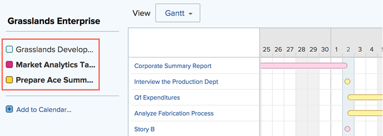

# 달력 보고서 및 이벤트 세부 정보 보기

Adobe Workfront에서 생성했거나 공유한 캘린더 보고서 및 이벤트 세부 사항을 볼 수 있습니다.

## 액세스 요구 사항

+++ 을 확장하여 이 문서의 기능에 대한 액세스 요구 사항을 봅니다.

이 문서의 단계를 수행하려면 다음 액세스 권한이 있어야 합니다.

<table style="table-layout:auto"> 
 <col> 
 </col> 
 <col> 
 </col> 
 <tbody> 
  <tr> 
   <td role="rowheader">[!DNL Adobe Workfront plan]</td> 
   <td> 
임의
 </td> 
  </tr> 
  <tr> 
   <td role="rowheader">[!DNL Adobe Workfront] 라이센스</td> 
   <td>
새로운 기능: 기여자

       
또는

       
현재: 요청
</td> 
  </tr> 
  <tr> 
   <td role="rowheader">액세스 수준 구성</td> 
   <td> 
[!UICONTROL 보고서], [!UICONTROL 대시보드] 및 [!UICONTROL 달력]에 대한 [!UICONTROL 보기] 이상 액세스
</td> 
  </tr> 
  <tr> 
   <td role="rowheader">개체 권한</td> 
   <td>달력 보고서에 대한 [!UICONTROL 보기] 이상의 권한</td> 
  </tr> 
 </tbody> 
</table>

이 표의 정보에 대한 자세한 내용은 [Workfront 설명서의 액세스 요구 사항](/help/quicksilver/administration-and-setup/add-users/access-levels-and-object-permissions/access-level-requirements-in-documentation.md)을 참조하십시오.

+++

## 캘린더 보고서 보기

<!--{{step1-to-calendars}}-->

1. Adobe Workfront의 오른쪽 상단에 있는 **[!UICONTROL 주 메뉴]** 아이콘 을 클릭하거나(가능한 경우) 왼쪽 상단에 있는 **[!UICONTROL 주 메뉴]** 아이콘 을 클릭한 다음 **[!UICONTROL 달력]**&#x200B;을 클릭합니다.

   액세스 수준에 따라 다음 캘린더가 표시될 수 있습니다.

   * 기본 [!DNL Adobe Workfront] 캘린더

     Workfront은 사용자에게 할당되거나 할당된 팀, 그룹 또는 역할에 할당된 프로젝트, 작업 및 문제를 기반으로 달력을 만듭니다.

   * 만든 캘린더

     일정 만들기에 대한 자세한 내용은 [일정 보고서 개요](../../../reports-and-dashboards/reports/calendars/calendar-reports-overview.md)를 참조하세요.

   * 다른 사용자가 귀하와 공유한 캘린더

     일정 공유에 대한 자세한 내용은 [[!UICONTROL 일정 공유] 보고서](../../../reports-and-dashboards/reports/calendars/share-a-calendar-report.md)를 참조하세요.

1. (조건부) **[!UICONTROL 보기]** 드롭다운을 클릭한 다음 보려는 일정 기간을 선택합니다.
   
다음 달력 보고서 보기 중에서 선택할 수 있습니다.

   * **[!UICONTROL 월]**: 달력의 4주를 표시합니다.
   * **[!UICONTROL 주]**: 달력의 1주일을 표시합니다.
   * **[!UICONTROL 간트]**: 캘린더의 연속 보기를 표시합니다.

     아래로 스크롤하거나 옆으로 스크롤하여 [!UICONTROL 간트] 보기에서 더 많은 이벤트를 볼 수 있습니다. 보기의 데이터가 채워질 때 로딩 기호가 나타납니다.

   >[!NOTE]
   >
   >[!UICONTROL 월] 및 [!UICONTROL 주] 보기에서 현재 또는 미래 이벤트(오늘 또는 미래 날짜가 포함된 경우 여러 날에 걸친 이벤트 포함)에는 프로젝트 또는 일정 그룹화의 색상에 해당하는 음영이 있습니다. 이전 이벤트에는 더 이상 최신 상태가 아님을 나타내는 더 밝은 음영이 표시되지만, 이러한 이벤트를 선택하여 볼 수 있습니다.

1. (선택 사항) [!UICONTROL 월] 또는 [!UICONTROL 주] 보기에서 캘린더를 보는 경우 다음 옵션을 사용하여 캘린더 보기를 변경할 수 있습니다.

<!--   * To include or exclude weekends:

      1. On the **[!UICONTROL Calendar]** toolbar, click **[!UICONTROL Calendar Actions]**, then from the drop-down list select either **[!UICONTROL Show Weekend]** or **[!UICONTROL Hide Weekend]**.-->

* 표시된 일자를 빠르게 변경하려면

   1. **[!UICONTROL 달력]** 도구 모음에서 날짜 표시기의 왼쪽 화살표를 클릭하여 달력에서 뒤로 이동하거나 오른쪽 화살표를 클릭하여 앞으로 이동합니다.

      날짜를 변경하려면 \
      표시되는 날짜는 현재 달력 보기에 따라 간격에 따라 조정됩니다. 예를 들어, [!UICONTROL 주] 보기에서 달력을 보는 경우 선택한 화살표에 따라 달력은 1주일 앞으로 또는 1주일 뒤로 표시됩니다.

   1. (선택 사항) 현재 날짜로 돌아가려면 [!UICONTROL **오늘**]&#x200B;을 클릭합니다.

1. (선택 사항) 전체 화면으로 달력을 보려면 **[!UICONTROL 달력]** 도구 모음의 오른쪽에 있는 전체 화면 화살표를 클릭합니다.
   날짜를 변경하려면 \
   캘린더의 일반 보기로 돌아가려면 Esc 키를 누릅니다.

1. (선택 사항) 달력에 연결된 프로젝트 또는 달력 그룹화에 대한 이벤트를 숨기려면 프로젝트 목록에서 프로젝트 또는 달력 그룹화를 지웁니다.
   
프로젝트 목록에서 [!UICONTROL 프로젝트] 또는 일정 그룹화를 선택하여 이벤트를 다시 표시할 수 있습니다.

## 달력 보고서 이벤트 세부 정보 보기

현재 이벤트와 과거 이벤트 모두에 대한 이벤트의 세부 정보를 달력에서 볼 수 있습니다.

1. 세부 정보를 알 이벤트로 이동한 다음 이벤트를 클릭합니다. 오른쪽의 패널에서 세부 정보가 열립니다.
1. (선택 사항) 연결된 프로젝트, 작업 또는 문제를 열려면 개체의 제목을 클릭합니다.
