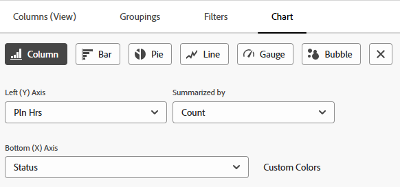
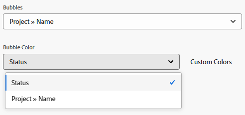
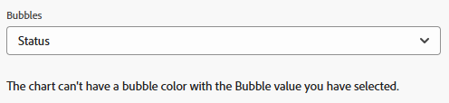
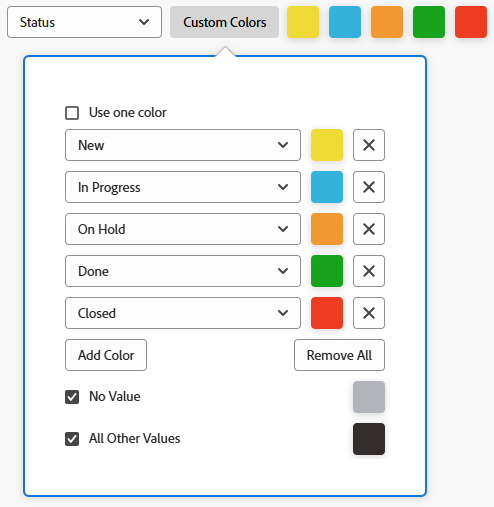

# 보고서에 차트 추가

<!--Audited: 11/2024-->

차트를 추가하여 보고서를 향상시킬 수 있습니다. 차트를 기존 보고서나 생성 중인 보고서에 추가할 수 있습니다.

보고서에 차트를 추가하기 전에 보고서에 대한 보기와 그룹화를 만들어야 합니다.

보고서에서 정보를 먼저 그룹화하지 않으면 대부분의 보고서에 차트를 추가할 수 없습니다. 그룹화하지 않고 추가할 수 있는 차트는 게이지 차트뿐입니다.

보기에 대한 자세한 내용은 [Adobe Workfront의 보기 개요](../../../reports-and-dashboards/reports/reporting-elements/views-overview.md)를 참조하십시오.

그룹화에 대한 자세한 내용은 Adobe Workfront의 [그룹화 개요](../../../reports-and-dashboards/reports/reporting-elements/groupings-overview.md)를 참조하십시오.

보고서에 너무 많은 항목이 표시되면 차트가 만들어지지 않습니다. 이 경우 보고서의 결과 수를 줄이려면 보고서에 필터를 추가해야 합니다.

필터에 대한 자세한 내용은 [필터 개요](../../../reports-and-dashboards/reports/reporting-elements/filters-overview.md)를 참조하세요.

## 액세스 요구 사항

+++ 이 문서의 기능에 대한 액세스 요구 사항을 보려면 확장하십시오.

<table style="table-layout:auto"> 
 <col> 
 <col> 
 <tbody> 
  <tr> 
   <td role="rowheader">Adobe Workfront 패키지</td> 
   <td> 
Any
 </td> 
  </tr> 
  <tr> 
   <td role="rowheader">Adobe Workfront 라이센스</td> 
   <td> 
      
표준

      
플랜

   </td>
  </tr> 
  <tr> 
   <td role="rowheader">액세스 수준 구성</td> 
   <td> 
보고서, 대시보드, 일정에 대한 액세스 편집
 
필터, 보기, 그룹에 대한 액세스 편집
 </td> 
  </tr> 
  <tr> 
   <td role="rowheader">개체 권한</td> 
   <td> 
보고서에 대한 권한 관리
  </td> 
  </tr> 
 </tbody> 
</table>

이 표의 정보에 대한 자세한 내용은 [Workfront 설명서의 액세스 요구 사항](/help/quicksilver/administration-and-setup/add-users/access-levels-and-object-permissions/access-level-requirements-in-documentation.md)을 참조하십시오.

+++

## 보고서에 차트 추가

1. 기존 보고서로 이동하거나 새 보고서를 만듭니다. 새 보고서를 만드는 방법에 대한 자세한 내용은 [사용자 지정 보고서 만들기](../../../reports-and-dashboards/reports/creating-and-managing-reports/create-custom-report.md)를 참조하세요.

1. (조건부) 기존 보고서로 이동한 경우 **보고서 동작** > **편집**&#x200B;을 클릭합니다.

1. 보고서에 차트로 표시할 정보가 표시되도록 **열(보기)** 탭이 업데이트되었는지 확인하십시오.

   보고서 보기를 만들거나 수정하는 방법에 대한 자세한 내용은 [Adobe Workfront에서 보기 만들기 또는 편집](/help/quicksilver/reports-and-dashboards/reports/reporting-elements/create-edit-views.md)을 참조하세요.

1. **그룹화** 탭을 클릭하고 그룹을 추가합니다.

   >[!TIP]
   >
   >* 보고서 결과를 그룹화할 때만 보고서에 차트를 추가할 수 있습니다.
   >* 텍스트 모드 그룹화는 차트에서 지원되지 않습니다. 텍스트 모드 그룹화에 대한 자세한 내용은 [텍스트 모드를 사용하여 그룹화 편집](../../../reports-and-dashboards/reports/text-mode/edit-text-mode-in-grouping.md)을 참조하십시오.
   >* 하나의 지표를 나타내는 단일 그룹화를 추가하면 파이 차트를 제외한 모든 차트에 그룹화의 각 결과가 동일한 색상으로 표시됩니다.

   그룹화 만들기에 대한 자세한 내용은 [Adobe Workfront에서 그룹화 만들기](/help/quicksilver/reports-and-dashboards/reports/reporting-elements/create-groupings.md)를 참조하십시오.

1. **차트** 탭을 선택합니다.

1. 차트 유형을 클릭하여 선택합니다.\
   

1. 다음 유형의 차트 중에서 선택합니다.

   * [열 차트](#column-chart)
   * [막대 차트](#bar-chart)
   * [원형 차트](#pie-chart)
   * [꺾은선형 차트](#line-chart)
   * [Gauge chart](#gauge-chart)
   * [버블 차트](#bubble-chart)

1. 차트와 보고서를 저장하려면 **저장 + 닫기**&#x200B;를 클릭하십시오.

### Column chart {#column-chart}

To add a **Column** chart to your report:

1. [보고서에 차트 추가](#add-a-chart-to-a-report)에 설명된 대로 보고서에 차트를 추가하기 시작합니다.

1. **왼쪽(Y) 축** 필드에서 차트의 Y 축에 포함할 값을 선택한 다음 **요약 기준** 필드에 정보를 요약할 방법을 선택합니다.

1. (선택 사항) **사용자 지정 색상**&#x200B;을 클릭하여 각 열에 기본 설정 색상을 할당합니다.\
   차트 색 사용자 지정에 대한 자세한 내용은 [차트 색 사용자 지정](#customize-chart-colors)을 참조하십시오.

1. **아래쪽(X) 축** 필드에서 차트에 포함할 그룹화를 선택합니다.

1. (선택 사항) 차트를 3차원 보기로 표시하려면 **3차원으로 표시**&#x200B;를 클릭합니다.

1. (Optional) **Group Columns**: Select this option to define how you want the columns to be grouped.\
   다음 옵션 중에서 선택합니다.

   * 다음 옵션 중 하나를 클릭하여 그룹화된 열이 표시되는 방식을 선택합니다.

      * **나란히**
      * **스택**
      * **100%로 스택**

   * **그룹 데이터 기준** 드롭다운 메뉴에서 차트에 포함할 그룹을 선택하십시오.
   * (선택 사항) 열의 색상을 사용자 지정하려면 **사용자 지정 색상**&#x200B;을 클릭하십시오.\
     차트 색 사용자 지정에 대한 자세한 내용은 [차트 색 사용자 지정](#customize-chart-colors)을 참조하십시오.

1. (선택 사항) 차트에 추가 값과 정보를 요약할 방법을 포함하려면 **조합 차트**&#x200B;를 클릭하십시오.\
   다음 옵션을 고려하십시오.

   * **보조 축에 그리기**: 데이터를 차트 오른쪽에 그리려면 이 옵션을 선택하십시오.
   * **차트 종류**: 이 추가 값을 줄로 표시할지 또는 세 번째 열로 표시할지를 선택합니다.

1. 차트와 보고서를 저장하려면 **저장 + 닫기**&#x200B;를 클릭하십시오.

### 막대 차트 {#bar-chart}

보고서에 **막대** 차트를 추가하려면:

1. [보고서에 차트 추가](#add-a-chart-to-a-report)에 설명된 대로 보고서에 차트를 추가합니다.

1. **아래쪽(X) 축** 필드에서 차트의 X 축에 포함할 값을 선택한 다음 **요약 기준** 필드에 정보를 요약할 방법을 선택합니다.

1. (선택 사항) **사용자 지정 색상**&#x200B;을 클릭하여 막대의 색상을 사용자 지정합니다.\
   차트 색상 사용자 지정에 대한 자세한 내용은 [차트 색상 사용자 지정](#customize-chart-colors)을 참조하세요.

1. **왼쪽(Y) 축** 필드에서 차트에 포함할 그룹을 선택합니다.

1. (선택 사항) 차트를 3차원 보기로 표시하려면 **3D로 표시**&#x200B;를 클릭하십시오.

1. (선택 사항) **그룹 모음**&#x200B;을 클릭하여 막대를 그룹화하는 방법을 정의합니다.\
   다음 옵션 중에서 선택합니다.

   * 다음 옵션 중 하나를 클릭하여 그룹화된 막대의 표시 방식을 선택합니다.

      * **나란히**
      * **스택됨**
      * **100%로 누적**

   * **데이터 그룹화 기준** 드롭다운 메뉴에서 차트의 정보를 그룹화할 방법을 선택합니다.
   * (선택 사항) **사용자 지정 색상**&#x200B;을 클릭하여 열의 색상을 사용자 지정합니다.\
     차트 색 사용자 지정에 대한 자세한 내용은 [차트 색 사용자 지정](#customize-chart-colors)을 참조하세요.

1. (선택 사항) 차트의 추가 값과 정보를 요약할 방법을 포함하려면 **조합 차트**&#x200B;를 클릭합니다.

1. **저장 + 닫기**&#x200B;를 클릭하여 차트와 보고서를 저장합니다.

>[!IMPORTANT]
>
>23개 이상의 막대를 포함하는 막대 차트에는 모든 막대 레이블이 제대로 표시되지 않으므로 막대 차트를 23개 이하의 막대로 제한합니다.

### 원형 차트 {#pie-chart}

보고서에 **원형** 차트를 추가하려면:

1. [보고서에 차트 추가](#add-a-chart-to-a-report)에 설명된 대로 보고서에 차트를 추가합니다.

1. **값** 필드에서 보고서에 표시할 값을 선택한 다음 **요약 기준** 필드에 정보를 요약하는 방법을 선택합니다.\
   **웨지** 필드에서 차트에 포함할 그룹화를 선택합니다. 그룹화는 차트의 쐐기로 표시됩니다.

1. (선택 사항) **사용자 지정 색**&#x200B;을 클릭하여 차트에 있는 웨지의 색을 사용자 지정합니다.\
   차트 색 사용자 지정에 대한 자세한 내용은 [차트 색 사용자 지정](#customize-chart-colors)을 참조하세요.

1. (선택 사항) 차트를 3차원 보기로 표시하려면 **3차원으로 표시**&#x200B;를 클릭합니다.

1. **다른 이름으로 결과 표시** 필드에서 결과를 차트에 표시할 방법을 선택합니다. 다음 옵션을 고려하십시오.

   * **백분율**: 차트 결과가 백분율로 표시됩니다.
   * **숫자**: 차트 결과가 숫자로 표시됩니다.

1. 차트와 보고서를 저장하려면 **저장 + 닫기**&#x200B;를 클릭하십시오.

### Line chart {#line-chart}

To add a **Line** chart to your report:

1. [보고서에 차트 추가](#add-a-chart-to-a-report)에 설명된 대로 보고서에 차트를 추가합니다.

1. **왼쪽(Y)축** 필드에서 차트의 Y축에 포함할 값을 선택한 다음 **요약 기준** 필드에 정보를 요약할 방법을 선택합니다.

1. **아래쪽(X) 축** 필드에서 차트에 포함할 그룹을 선택합니다.

1. (선택 사항) **줄 그룹화**&#x200B;를 클릭하여 차트에 대한 추가 그룹화를 선택합니다.\
   (선택 사항) **사용자 지정 색상**&#x200B;을 클릭하여 새 그룹에 맞는 색상을 사용자 지정합니다.\
   차트 색 사용자 지정에 대한 자세한 내용은 [차트 색 사용자 지정](#customize-chart-colors)을 참조하십시오.

1. (선택 사항) 라인을 추가 값으로 결합하려면 **조합 차트**&#x200B;를 클릭하십시오.\
   다음 옵션 중 하나를 고려하십시오.

   * 차트에 포함할 값과 정보를 요약할 방법을 선택합니다.
   * 차트의 오른쪽에 있는 데이터를 플롯하려면 **보조 축에 플롯** 필드를 클릭합니다.

1. 차트와 보고서를 저장하려면 **저장 + 닫기**&#x200B;를 클릭하십시오.

### Gauge chart {#gauge-chart}

A **Gauge** chart displays the number of records that meet a certain criteria in a gauge format. 측정 지표는 보고서의 보기 및 그룹화에서 선택한 기준을 충족하는 레코드 수를 가리킵니다. 측정 차트를 구성하는 데 보고서 그룹화가 필요하지 않습니다.

보고서에 **측정** 차트를 추가하려면:

1. [보고서에 차트 추가](#add-a-chart-to-a-report)에 설명된 대로 보고서에 차트를 추가하기 시작합니다.

1. **값** 필드에서 보고서에 표시할 값을 선택한 다음 **요약 기준** 필드에서 정보를 요약하는 방법을 선택합니다. If you select **Record Count**, the values displayed are the object of the report.

1. **표시기** 필드에서 차트에 포함할 그룹화를 선택합니다. 그룹화는 차트의 표시기 라인으로 표시됩니다.\
   두 개의 항목을 포함하는 그룹화가 있는 경우 두 개의 표시기가 차트에 표시됩니다.\
   예를 들어 프로젝트 상태 그룹이 있고 두 개의 프로젝트 상태(현재 및 보류 중)가 있는 경우 측정 차트에는 두 개의 측정 지표가 포함됩니다. 해당 상태에 있는 프로젝트 수를 가리킵니다.\
   (선택 사항) **지표** 필드에서 **합계**&#x200B;를 선택하여 **값** 필드에서 선택한 개체의 합계를 표시합니다.

1. (선택 사항) 차트에 값 범위를 추가하려면 **다른 값 범위 추가**&#x200B;를 클릭합니다.

1. (선택 사항) **값 범위** 필드에서 측정 차트에 표시할 값 범위와 값을 나타내는 색상을 지정합니다.

1. 차트와 보고서를 저장하려면 **저장 + 닫기**&#x200B;를 클릭하십시오.

### 버블 차트 {#bubble-chart}

**버블** 차트에 개체 하나에 대해 최대 3개의 필드를 표시할 수 있습니다. 버블 차트에 최대 4개의 데이터 포인트를 표시할 수 있습니다. 세 개의 관련 필드가 있는 각 엔티티는 X 및 Y 축 내 해당 위치 내에 있는 필드 중 두 개를 표현하는 원으로 표시됩니다. 세 번째 필드는 원의 크기로 표시됩니다.

보고서에 **버블** 차트를 추가하려면:

1. [보고서에 차트 추가](#add-a-chart-to-a-report)에 설명된 대로 보고서에 차트를 추가합니다.

1. **왼쪽(Y)축** 필드에서 차트의 Y축에 포함할 값을 선택합니다. 값은 보고서 보기에서 제공됩니다. **요약 기준** 필드에 정보를 요약할 방법을 지정합니다.

1. **아래쪽(X) 축 필드**&#x200B;에서 차트의 X 축에 포함할 값을 선택합니다. 값은 보고서 보기에서 제공됩니다. 정보를 요약할 방식을 지정합니다.

   >[!NOTE]
   >
   >이 필드를 활성화하도록 요약된 열이 하나 이상 있는지 확인합니다.\
   >보고서 열의 정보를 요약하는 방법에 대한 자세한 내용은 [사용자 지정 보고서 만들기](../../../reports-and-dashboards/reports/creating-and-managing-reports/create-custom-report.md)를 참조하세요.

1. **거품 크기** 필드에서 차트의 거품 크기로 나타낼 값을 선택합니다. 값은 보고서 보기에서 제공됩니다. 정보를 요약할 방식을 지정합니다.

   >[!NOTE]
   >
   >이 필드를 활성화하도록 요약된 열이 하나 이상 있는지 확인합니다.\
   >보고서 열의 정보를 요약하는 방법에 대한 자세한 내용은 [사용자 지정 보고서 만들기](../../../reports-and-dashboards/reports/creating-and-managing-reports/create-custom-report.md)를 참조하세요.

1. **버블** 필드에서 차트에 포함할 그룹을 선택합니다. 그룹화는 차트에서 버블의 배치로 표시됩니다.

1. **버블 색상** 필드에서 버블의 색상으로 표시할 필드를 선택합니다.

   **버블 색상**&#x200B;은 보고서에 정의한 그룹화일 수 있지만 이 옵션은 작업 보고서의 경우 **프로젝트 이름** 또는 프로젝트 보고서의 경우 **프로그램 이름**&#x200B;과 같이 보고서 개체에 상대적인 상위 개체의 **이름**&#x200B;을 포함하는 **버블** 필드에서 그룹화를 선택한 경우에만 사용할 수 있습니다.

   예를 들어 작업 보고서에서 **프로젝트 이름**&#x200B;을(를) 선택한 경우 **작업 상태**&#x200B;를 **거품 색** 필드로 추가할 수 있습니다.

   

   그러나 **버블** 필드에 대해 **작업 상태**&#x200B;을(를) 선택한 경우 **버블 색상** 필드를 선택할 수 없습니다. 또한 **버블** 필드에 **프로젝트 이름**&#x200B;을(를) 선택하더라도 **버블 색상** 필드에 **프로젝트 이름**&#x200B;을(를) 선택할 수 없습니다.

   

1. 인터페이스 빌더에 변경 사항을 저장하려면 **저장 + 닫기**&#x200B;를 클릭합니다.

## 차트 색상 사용자 정의 {#customize-chart-colors}

Workfront에서 차트의 요소 색상을 선택하도록 하거나, 보고서에 차트를 추가하는 동안 사용자 정의할 수 있습니다. 차트에 실제 완료 날짜별로 그룹화된 작업의 수를 표시하는 작업 보고서와 같이 한 지표를 나타내는 하나의 그룹화가 포함된 경우 그룹화의 각 결과는 동일한 색상으로 표시됩니다.

보고서 보기에 표시된 필드에 대해 하나의 색상만 선택할 수 있습니다. 보고서 그룹화에 표시되는 필드에 대해 각 옵션에 대해 하나씩 여러 색상을 선택할 수 있습니다.

>[!IMPORTANT]
>
>날짜 필드의 경우 차트 요소에 대해 색상을 하나만 선택할 수 있습니다.

차트 색상을 사용자 정의하려면 다음과 같이 하십시오.

1. 보고서를 작성하는 동안 보고서 작성기의 **차트** 탭으로 이동하세요.

1. 보고서에 추가할 차트 종류를 선택하십시오.\
   For more information about adding a chart to your report, see [Add a chart to a report](#add-a-chart-to-a-report).

1. Click **Custom Colors** when this field is available.\
   [사용자 정의 색상] 대화 상자가 표시됩니다.\
   

   >[!NOTE]
   >
   >사용자 정의 색상은 그룹화할 수 있는 모든 필드와 사용자 정의 필드를 포함하여 뷰에 표시될 수 있는 일부 필드와 연결할 수 있습니다. [사용자 정의 색상] 대화 상자에서 선택한 필드의 사용자 정의 필드 또는 사용자 정의 옵션은 대소문자를 구분합니다.

1. 다음 옵션 중 하나를 선택하는 것이 좋습니다.

   * **한 가지 색상을 사용합니다**: 차트의 모든 요소가 선택한 색상으로 표시됩니다.
   * **색상 추가**: 선택한 필드의 가능한 값에 대한 사용자 지정 색상을 추가합니다.
   * **모두 제거**: 위에 지정된 모든 필드 값과 색상을 제거하려면 이 옵션을 선택하십시오.
   * **값 없음**: &quot;값 없음&quot; 항목을 그룹화하는 차트 열을 표시하려면 이 필드와 사용자 지정 색을 선택하십시오. 이러한 항목은 그룹화에서 선택한 필드의 옵션으로 그룹화할 수 없는 항목입니다.
   * **다른 모든 값**: 위에 옵션이 정의되지 않은 다른 모든 차트 요소를 표시하려면 이 필드와 사용자 지정 색을 선택하십시오.

     >[!NOTE]
     >
     >가장 최근에 편집한 색상이 **사용자 지정 색상** 단추 오른쪽에 표시됩니다. 색상 위로 마우스를 가져가면 연결된 필드의 이름이 표시됩니다. You can also click a color to edit it without reopening **Custom Colors**.

1. 색상을 선택하려면 다음을 수행하십시오.
색상 피커 내부를 클릭하여 색상을 선택합니다.
또는
Specify a hexadecimal color value for your color.

1. [사용자 정의 색상] 대화 상자 외부의 아무 곳이나 클릭하여 닫습니다. 선택한 색상이 자동으로 저장됩니다.

1. 차트를 저장하고 보고서를 실행하려면 **저장 + 닫기**&#x200B;를 클릭하십시오.

## 차트 내보내기

차트를 .pdf 파일로 내보낼 수 있습니다.

차트를 내보내려면 다음을 수행합니다.

1. 보고서의 차트 탭에서 **내보내기**&#x200B;를 클릭하여 차트를 .pdf로 내보냅니다.\
   .pdf 파일이 컴퓨터에 다운로드됩니다.

1. .pdf 파일을 엽니다.\
   내보낸 파일에는 다음 정보가 포함되어 있습니다.

   * 차트의 이미지입니다.
   * 보고서 이름인 제목입니다.
   * 보고서 이름을 기반으로 하는 고유한 파일 이름입니다.
   * 보고서를 내보낸 날짜 및 시간과 페이지 번호가 포함된 바닥글

## 보고서에서 차트 제거

보고서에서 차트를 제거하려면 다음을 수행합니다.

1. 보고서 작성기의 **차트** 탭을 엽니다.

1. 차트를 제거하려면 차트 유형 오른쪽에 있는 &quot;x&quot; 단추를 누릅니다.

1. **저장 및 닫기**&#x200B;를 클릭합니다.

## 차트 작업 중 제한 사항

차트를 사용할 때는 다음 제한 사항을 알아 두십시오.

* 보고서 작성기의 오른쪽에 있는 **차트 미리 보기** 섹션에 보고서의 실제 데이터가 포함되어 있지 않습니다. 데이터가 포함된 차트를 보려면 차트를 저장하고 **차트** 탭에서 확인해야 합니다.

* 일부 차트 요소는 편집할 수 없습니다.

   * 각 요소의 값에 대한 글꼴 유형이나 크기를 변경할 수 없습니다.
   * 차트에서 축의 이름은 변경할 수 없습니다.

* 차트의 범례는 편집할 수 없습니다.
* 그룹화에 계산된 필드를 사용할 때 차트 요소를 클릭할 수 없습니다.
* 차트에 표시할 수 있는 가장 많은 데이터 포인트는 버블 차트의 4개입니다. 다른 모든 차트 유형에는 두 개 또는 최대 세 개의 데이터 포인트가 표시됩니다.
