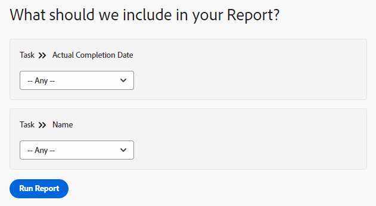

# 보고서에 프롬프트 추가

<!-- Audited: 11/2024 -->

## 프롬프트와 필터의 차이

필터와 프롬프트는 모두 보고서에 표시하는 정보의 양을 제한한다는 점에서 유사합니다.

보고서를 실행할 때마다 보고서에 표시된 정보를 동일한 기준으로 필터링하려면 필터를 빌드합니다. 필터는 한 번 빌드되며 보고서에서 하드 코딩됩니다. 필터 빌드에 대한 자세한 내용은 문서 [필터 개요](../../../reports-and-dashboards/reports/reporting-elements/filters-overview.md)를 참조하십시오.

프롬프트는 보고서를 실행할 때마다 사용자 지정하고 다르게 적용할 수 있는 열린 필터입니다.

보고서에 프롬프트를 추가할 때 보고서를 실행할 때마다 프롬프트 기준을 편집하여 필터링 정보를 사용자 지정할 수 있습니다. 보고서는 보고서의 필터에서 수정자를 한 번 하드 코딩하는 대신 선택한 수정자에 따라 매번 다른 필터로 실행됩니다.

프롬프트는 보고서를 실행하기 바로 전에 업데이트할 수 있는 보고서에서 사용자 지정 가능한 필터 역할을 합니다. 일반 보고서를 만든 다음 해당 날짜에 보려는 정보나 개별 기준 세트에 관련된 정보를 기반으로 결과 범위를 좁힐 수 있습니다. 예를 들어, 시간 보고서가 있고 다음 기준에 따라 보고서의 정보를 변경하려는 경우:

* 시간이 기록된 날짜
* 시간을 입력한 사용자
* 입력한 시간

조건이 필수 기준이고 실행할 때마다 프롬프트에 대해 선택한 정보에 따라 보고서가 다르게 표시되는 세 개의 프롬프트를 작성합니다.

필터는 Adobe Workfront에 올해 6월에서 8월 사이에 입력한 시간만 표시하도록 할 수 있습니다. 하지만 프롬프트에서 보고서를 실행할 때마다(예: 1월에서 2월 사이 또는 10월에서 12월 사이) 다른 시간대를 사용할 수 있습니다.

## 액세스 요구 사항

+++ 을 확장하여 이 문서의 기능에 대한 액세스 요구 사항을 봅니다.

이 문서의 단계를 수행하려면 다음 액세스 권한이 있어야 합니다.

<table style="table-layout:auto"> 
 <col> 
 <col> 
 <tbody> 
  <tr> 
   <td role="rowheader">Adobe Workfront 플랜*</td> 
   <td> <p>임의</p> </td> 
  </tr> 
  <tr> 
   <td role="rowheader">Adobe Workfront 라이센스*</td> 
    <td> 
      <p>신규:</p>
         <ul>
         <li><p>표준</p></li>
         </ul>
      <p>현재:</p>
         <ul>
         <li><p>플랜</p></li>
         </ul>
   </td>
  </tr> 
  <tr> 
   <td role="rowheader">액세스 수준 구성*</td> 
   <td> <p>보고서, 대시보드, 캘린더에 대한 액세스 편집</p> <p>필터, 보기, 그룹화에 대한 액세스 편집</p></td> 
  </tr> 
  <tr> 
   <td role="rowheader">개체 권한*</td> 
   <td> <p>보고서에 대한 권한 관리</p></td> 
  </tr> 
 </tbody> 
</table>

*자세한 내용은 [Workfront 설명서의 액세스 요구 사항](/help/quicksilver/administration-and-setup/add-users/access-levels-and-object-permissions/access-level-requirements-in-documentation.md)을 참조하십시오.

+++

## 전제 조건

보고서를 작성해야 프롬프트를 추가할 수 있습니다.

보고서 만들기에 대한 지침은 [보고서 만들기](../../../reports-and-dashboards/reports/creating-and-managing-reports/create-report.md)를 참조하세요.

## 프롬프트 만들기

1. 프롬프트를 추가할 보고서로 이동합니다.
1. **보고서 작업**&#x200B;을 확장한 다음 **편집**&#x200B;을 클릭합니다.

1. **보고서 설정** 단추를 클릭합니다.
1. **보고서 프롬프트** 탭을 클릭한 다음 **프롬프트 추가**&#x200B;를 클릭합니다.\
   

1. (조건부) 프롬프트의 기반이 될 필드를 선택합니다. 필드 이름을 입력한 다음 목록에 표시될 때 클릭하여 선택합니다.\
   보고서를 실행하는 사용자가 사용할 수 있는 옵션은 선택하는 필드에 따라 다릅니다.\
   예를 들어 작업 보고서에서 실제 완료 일자와 같은 날짜 필드를 선택하는 경우 &quot;실제 완료 일자&quot;가 프롬프트 이름입니다. 이 보고서를 실행할 때 이 프롬프트를 편집할 때 수정자 세트 중에서 선택하여 필터링 문을 작성할 수 있습니다. 이 프로세스는 필터를 빌드하는 것과 동일합니다. 수정자에 대한 자세한 내용은 [필터 및 조건 수정자](../../../reports-and-dashboards/reports/reporting-elements/filter-condition-modifiers.md)를 참조하십시오.

1. (조건부) 사용자 지정 프롬프트를 만들려면 **사용자 지정 프롬프트**&#x200B;를 클릭하십시오.

   사용자 지정 프롬프트는 보고서를 실행하기 전에 필터링 기준을 하드 코딩하는 미리 정의된 프롬프트입니다. 이러한 의미에서 사용자 지정 프롬프트는 프롬프트보다 필터에 더 가깝습니다.

   하지만 보고서에 하드코딩된 필터가 하나만 있는 것이 아니라 미리 정의된 여러 문 중에서 선택할 수 있으므로 프롬프트는 일반 프롬프트와 같이 유연하게 유지됩니다.

   사용자 지정 프롬프트에 대한 다음 정보를 지정하십시오. 사용자 지정 프롬프트의 조건은 텍스트 모드를 사용해서만 편집할 수 있습니다. 이렇게 하면 단일 필드에 여러 조건을 적용할 수 있습니다.

   * **필드 이름:** 보고서를 실행하기 전에 표시되는 프롬프트 이름입니다.
   * **드롭다운 항목 레이블:** 보고서를 실행하기 전에 표시되는 프롬프트 내의 옵션 중 하나의 이름입니다.
   * **조건:** 프롬프트를 정의하는 조건을 입력하십시오.
   * **기본값:** 이 프롬프트의 기본 옵션으로 한 항목을 선택할 수 있습니다.

   텍스트 모드 필터를 입력할 때 사용하는 것과 동일한 구문을 사용하고 &quot;&amp;&quot;로 문을 조인합니다. 텍스트 모드에서 필터를 편집하는 방법에 대한 자세한 내용은 [텍스트 모드를 사용하여 필터 편집](../../../reports-and-dashboards/reports/text-mode/edit-text-mode-in-filter.md)을 참조하십시오.

   예를 들어 다음 시나리오에 대한 사용자 지정 프롬프트의 **Condition** 필드는 다음과 같을 수 있습니다.

   * 프로젝트 상태가 아이디어, 요청됨, 계획됨 및 현재인 향후 프로젝트의 모든 작업:

     ```
     project:plannedStartDate=$$TODAY&project:plannedStartDate_Mod=gte&project:status=IDA,REQ,PLN,CUR&project:status_Mod=in
     ```

   * 프로젝트 상태가 완료됨 또는 정지인 완료된(이전) 프로젝트의 모든 작업:

     ```
     project:actualCompletionDate=$$TODAY&project:actualCompletionDate_Mod=lte&project:status=CPL,DED&project:status_Mod=in
     ```

   텍스트 모드 수정자에 대한 자세한 내용은 [필터 및 조건 수정자](../../../reports-and-dashboards/reports/reporting-elements/filter-condition-modifiers.md)를 참조하십시오.

   >[!NOTE]
   >
   >표준 프롬프트와 같이 보고서를 실행할 때 사용자 지정 프롬프트의 조건을 변경할 수 없습니다. 사용자 지정 프롬프트에 대해 사전 정의된 조건을 필요한 만큼 가질 수 있습니다.

1. (선택 사항) 4단계 또는 5단계를 반복하여 필요한 만큼 프롬프트를 작성합니다.
1. **완료**&#x200B;를 클릭한 다음 **저장+닫기**&#x200B;를 클릭하여 보고서를 저장합니다.

## 보고서에 프롬프트 적용

보고서에 프롬프트가 추가되면 보고서의 기본 탭은 항상 프롬프트 탭입니다.

프롬프트에서 보고서를 실행하려면

1. 프롬프트가 표시되면 보고서로 이동합니다.

   

1. **프롬프트** 탭에 표시되는 하나 또는 모든 프롬프트에 대한 조건을 선택합니다.\
   (선택 사항) 프롬프트를 비워 두고 프롬프트 조건으로 보고서를 필터링하지 않을 수 있습니다.

1. **보고서 실행**&#x200B;을 클릭합니다.\
   (조건부) 프롬프트를 채운 경우 보고서는 프롬프트에 대해 선택한 조건으로 필터링됩니다.\
   (조건부) 프롬프트를 비워 두면 보고서가 프롬프트 조건으로 필터링되지 않습니다. 보고서가 필터링되지 않은 것처럼 표시됩니다.

   >[!NOTE]
   >
   >프롬프트 외에 필터가 포함된 보고서는 필터에 정의된 기준과 결합된 프롬프트 모두에 따라 결과를 필터링합니다.

## 메시지가 표시된 보고서 공유의 제한 사항

>[!CAUTION]
>
>메시지가 표시된 보고서를 공유할 때 공개 공유 링크를 사용하여 보고서를 보는 로그인 사용자와 로그인하지 않은 사용자 모두 프롬프트를 사용하여 보고서를 실행할 수 없습니다. 이 경우 프롬프트를 적용하지 않고 보고서 결과가 표시되며, 대신 표시되는 정보는 사용자의 액세스 수준 및 권한을 기반으로 하거나, 하나가 설정된 경우 보고서의 사용자 실행 액세스 수준 및 권한을 기반으로 합니다.

다음은 Workfront에서 메시지가 표시된 보고서 공유에 대한 제한 사항입니다.

* 보고서를 공개적으로 공유할 때 사용자는 Workfront 자격 증명을 가지고 있고 먼저 로그인한 다음 공개 공유 링크를 통하지 않고 Workfront에서 직접 보고서로 이동하지 않는 한 적용된 프롬프트로 보고서를 실행할 수 없습니다.

  보고서 공유에 대한 자세한 내용은 문서 [Adobe Workfront에서 보고서 공유](../../../reports-and-dashboards/reports/creating-and-managing-reports/share-report.md)를 참조하십시오.

* 메시지가 표시된 보고서의 전달을 예약할 때 이메일 첨부 파일의 보고서에는 메시지가 표시되지 않은 보고서 데이터가 포함됩니다. 사용자가 보고서에 액세스하기 위해 이메일의 링크를 클릭하면 먼저 로그인해야 보고서를 보고 프롬프트를 직접 실행할 수 있습니다.

  배달된 보고서 예약에 대한 자세한 내용은 [자동 보고서 배달 예약](../../../reports-and-dashboards/reports/creating-and-managing-reports/set-up-automatic-report-delivery.md)을 참조하세요.
