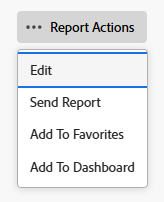

# 보고서 사본 만들기

<!-- Audited: 11/2024 -->

액세스 권한이 있는 보고서의 복사본을 만들 수 있습니다. 사용자 지정 보고서의 정확한 사본을 만들거나 기본 보고서의 새 버전을 저장할 수 있습니다. 보고서를 복사하면 복사한 보고서의 소유자가 되어 내 보고서 섹션에 표시됩니다.

## 액세스 요구 사항

+++ 을 확장하여 이 문서의 기능에 대한 액세스 요구 사항을 봅니다.

이 문서의 단계를 수행하려면 다음 액세스 권한이 있어야 합니다.

<table style="table-layout:auto"> 
 <col> 
 <col> 
 <tbody> 
  <tr> 
   <td role="rowheader">Adobe Workfront 플랜*</td> 
   <td> 
임의
 </td> 
  </tr> 
  <tr> 
   <td role="rowheader">Adobe Workfront 라이센스*</td> 
   <td> 
      
신규:

         <ul>
         <li>
표준
</li>
         </ul>
      
현재:

         <ul>
         <li>
플랜
</li>
         </ul>
   </td>
  </tr> 
  <tr> 
   <td role="rowheader">액세스 수준 구성*</td> 
   <td> 
보고서, 대시보드, 캘린더에 대한 액세스 편집
 
필터, 보기, 그룹화에 대한 액세스 편집
</td> 
  </tr> 
  <tr> 
   <td role="rowheader">개체 권한*</td> 
   <td>
보고서에 대한 권한 보기
</td> 
  </tr> 
 </tbody> 
</table>

*자세한 내용은 [Workfront 설명서의 액세스 요구 사항](/help/quicksilver/administration-and-setup/add-users/access-levels-and-object-permissions/access-level-requirements-in-documentation.md)을 참조하십시오.

+++

## 보고서의 정확한 복사본 만들기

사용자 지정 보고서의 복사본을 만들려면 다음을 수행하십시오.

1. Adobe Workfront의 오른쪽 상단에 있는 **[!UICONTROL 주 메뉴]** 아이콘 을 클릭하거나(가능한 경우) 왼쪽 상단에 있는 **[!UICONTROL 주 메뉴]** 아이콘 을 클릭한 다음 **[!UICONTROL 보고서]**&#x200B;를 클릭합니다.

1. **모든 보고서**&#x200B;를 클릭한 다음 보고서를 엽니다.

1. **보고서 동작**&#x200B;을 클릭한 다음 **복사**&#x200B;를 클릭합니다.

   >[!TIP]
   >
   >보고서가 기본 보고서인 경우 복사 옵션이 보고서 작업 메뉴에 나타나지 않습니다.\
   >기본 보고서의 복사본을 만드는 방법에 대한 자세한 내용은 [새 보고서 버전 만들기](#create-a-new-version-of-a-report)를 참조하십시오.

   

   원본 보고서의 복사본이 _[원본 보고서의 이름](복사본)_&#x200B;이라는 기본 이름으로 만들어집니다. 예를 들어 보고서 &quot;Q4 완료된 작업&quot;의 사본의 이름은 &quot;Q4 완료된 작업(복사본)&quot;으로 지정됩니다.

1. (선택 사항) 보고서 이름을 바꾸려면 **보고서 동작**&#x200B;을 클릭한 다음 **편집**&#x200B;을 클릭합니다. 왼쪽 상단 모서리의 텍스트 상자에 새 이름을 입력한 다음 완료되면 **저장 + 닫기**&#x200B;를 클릭하십시오.

1. (선택 사항) 새 버전의 보고서를 다른 사용자와 공유하려면 **보고서 작업**&#x200B;을 클릭한 다음 **공유**&#x200B;를 클릭합니다.

   >[!NOTE]
   >
   >공유 정보가 원본 버전에서 복사된 보고서로 전송되지 않습니다.\
   >이전 보고서를 누구와 공유했는지 확인하는 방법에 대한 자세한 내용은 [보고 활동에 대한 보고서 만들기](../../../reports-and-dashboards/reports/report-usage/create-report-reporting-activities.md#identify)를 참조하십시오.

1. (선택 사항) 원본 보고서에 대한 관리 권한이 있고 원본 보고서가 더 이상 필요하지 않은 경우 이를 삭제하여 Workfront에서 불필요한 중복 보고서를 제거할 수 있습니다.

   원본 보고서를 삭제하려면 다음 작업을 수행하십시오.

   1. 보고서로 이동합니다.

   1. **보고서 동작**&#x200B;을 클릭한 다음 **삭제**&#x200B;을 클릭합니다.

   1. 보고서를 삭제할 것인지 확인하려면 **예, 삭제**&#x200B;를 클릭하십시오.

## 보고서의 새 버전 만들기 {#create-a-new-version-of-a-report}

기본 보고서의 복사본을 만들려면 다음 작업을 수행하십시오.

1. Adobe Workfront 오른쪽 위 모서리에 있는 **주 메뉴** 아이콘 을 클릭합니다.

1. **보고서**&#x200B;를 클릭한 다음 **모든 보고서**&#x200B;를 클릭합니다.
1. 기본 보고서 이름을 클릭하여 엽니다.
1. **보고서 동작**&#x200B;을 클릭한 다음 **편집**&#x200B;을 클릭합니다.

   

1. 보고서의 다음 탭에서 필요한 사항을 수정합니다.

   * **열(보기)**: 보기 사용자 지정에 대한 자세한 내용은 문서 [Adobe Workfront의 보기 개요](../../../reports-and-dashboards/reports/reporting-elements/views-overview.md)를 참조하십시오.
   * **그룹화**: 그룹화를 사용자 지정하는 방법에 대한 자세한 내용은 문서 [Adobe Workfront의 그룹화 개요](../../../reports-and-dashboards/reports/reporting-elements/groupings-overview.md)를 참조하십시오.
   * **필터**: 필터 사용자 지정에 대한 자세한 내용은 [필터 개요](../../../reports-and-dashboards/reports/reporting-elements/filters-overview.md) 문서를 참조하십시오.
   * **차트**: 보고서 차트를 사용자 지정하는 방법에 대한 자세한 내용은 [보고서에 차트 추가](../../../reports-and-dashboards/reports/creating-and-managing-reports/add-chart-report.md) 문서를 참조하십시오.

1. 오른쪽 상단에서 **보고서 설정**&#x200B;을 클릭합니다.
1. **보고서 제목** 필드에서 보고서에 새 이름을 지정합니다.
1. **완료**&#x200B;를 클릭합니다.
1. **새 보고서로 저장**&#x200B;을 클릭합니다.

   

1. (선택 사항) 새 버전의 보고서를 다른 사용자와 공유하려면 **보고서 작업**&#x200B;을 클릭한 다음 **공유**&#x200B;를 클릭합니다.
