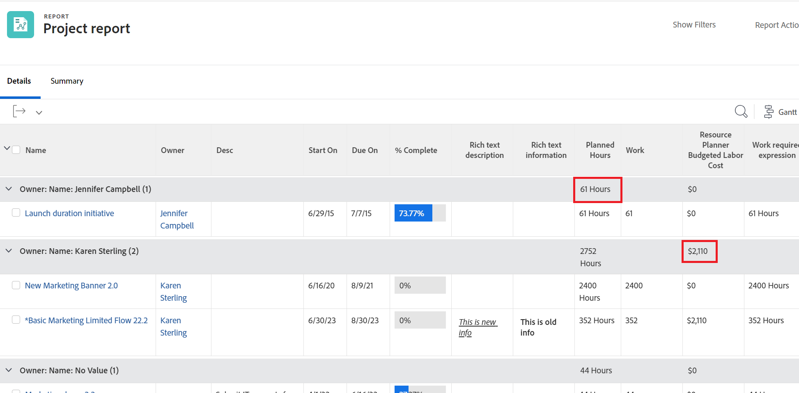
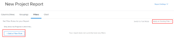

# 사용자 지정 보고서 만들기

<!--Audited: 10/2024-->

보고서를 만들어 Adobe Workfront에서 조직에 필요한 정보에 대한 액세스 권한을 제공할 수 있습니다. Workfront에서 사용할 수 있는 모든 기본 제공 보고서를 사용하거나 사용자 지정 보고서를 처음부터 빌드할 수 있습니다.

기본 제공 보고서에 대한 자세한 내용은 [Adobe Workfront 기본 제공 보고서 사용](../../../reports-and-dashboards/reports/using-built-in-reports/use-workfront-built-in-reports.md)을 참조하세요.

보고서를 복사하여 만드는 방법에 대한 자세한 내용은 [보고서 복사본 만들기](../../../reports-and-dashboards/reports/creating-and-managing-reports/create-copy-report.md)를 참조하십시오.

클래스, 비디오 및 튜토리얼을 포함하여 보고서를 만들고 관리하는 방법에 대한 자세한 내용은 Adobe Experience League 사이트의 학습 섹션을 참조하십시오.

## 액세스 요구 사항

+++ 을 확장하여 이 문서의 기능에 대한 액세스 요구 사항을 봅니다.

<table style="table-layout:auto"> 
 <col> 
 <col> 
 <tbody> 
  <tr> 
   <td role="rowheader">Adobe Workfront 패키지</td> 
   <td> 
임의
 </td> 
  </tr> 
  <tr> 
   <td role="rowheader">Adobe Workfront 라이선스</td> 
   <td> 
      
표준

      
플랜

   </td>
  </tr> 
  <tr> 
   <td role="rowheader">액세스 수준 구성</td> 
   <td> 
보고서, 대시보드, 캘린더에 대한 액세스 편집
 
필터, 보기, 그룹화에 대한 액세스 편집
 </td> 
  </tr> 
  <tr> 
   <td role="rowheader">개체 권한</td> 
   <td> 
작성한 보고서에 대한 관리 권한을 받습니다
  </td> 
  </tr> 
 </tbody> 
</table>

이 표의 정보에 대한 자세한 내용은 [Workfront 설명서의 액세스 요구 사항](/help/quicksilver/administration-and-setup/add-users/access-levels-and-object-permissions/access-level-requirements-in-documentation.md)을 참조하십시오.

+++

## 보고서 만들기 {#create-a-report}

{{step1-to-reports}}

1. **새 보고서**&#x200B;를 클릭한 다음 보고서에 사용할 개체 형식을 선택합니다.

   Report Builder가 로드됩니다.

   사용 가능한 개체 보고서에 대한 자세한 내용은 문서 [Adobe Workfront의 개체 이해](../../../workfront-basics/navigate-workfront/workfront-navigation/understand-objects.md#reporting-on-objects)의 [개체 보고서](../../../workfront-basics/navigate-workfront/workfront-navigation/understand-objects.md) 섹션을 참조하십시오.

   

   >[!TIP]
   >
   >기존 보고서의 복사본을 만들어 보고서를 만들 수도 있습니다. 자세한 내용은 [보고서 복사본 만들기](../../../reports-and-dashboards/reports/creating-and-managing-reports/create-copy-report.md)를 참조하세요.

1. (선택 사항) 새 보고서의 제목을 편집하려면 Report Builder의 왼쪽 상단 모서리에 있는 텍스트 필드에 원하는 보고서 제목을 입력합니다. 호환성 문제를 방지하려면 UTF-8 문자만 사용하는 것이 좋습니다.

1. Report Builder에서 보고서에 다음을 추가합니다.

   <table style="table-layout:auto"> 
    <col> 
    <col> 
    <thead> 
     <tr> 
      <th>기능</th> 
      <th>설명</th> 
     </tr> 
    </thead> 
    <tbody> 
     <tr> 
      <td>열(조회)</td> 
      <td> 
보고서에 열을 추가하면 보고서에 포함된 정보가 결정됩니다.
 
열을 추가하는 방법은 <a href="#add-columns-view-to-a-report" class="MCXref xref">보고서에 열(보기) 추가</a>를 참조하세요. 
 </td> 
     </tr> 
     <tr> 
      <td>그룹화</td> 
      <td> 
보고서에 그룹화를 추가하면 보고서가 구성되는 방식이 결정됩니다.
 
그룹화를 추가하는 방법은 <a href="#add-groupings-to-a-report" class="MCXref xref">보고서에 그룹화 추가</a>를 참조하세요.
 </td> 
     </tr> 
     <tr> 
      <td>필터</td> 
      <td> 
보고서에 필터 규칙을 추가하면 보고서에 표시되는 정보가 결정됩니다.
 
필터를 추가하는 방법은 <a href="#add-filters-to-a-report" class="MCXref xref">보고서에 필터 추가</a>를 참조하세요.
 </td> 
     </tr> 
     <tr> 
      <td>차트</td> 
      <td> 
보고서에 차트를 추가하면 보고서의 정보가 시각적으로 표시되는 방식이 결정됩니다.
 
차트를 추가하는 방법은 <a href="#add-a-chart-to-a-report" class="MCXref xref">보고서에 차트 추가</a>를 참조하세요.
 </td> 
     </tr> 
    </tbody> 
   </table>

1. 보고서를 만드는 동안 언제든지 **적용**&#x200B;을 클릭하여 변경 내용을 저장합니다.
1. 완료되면 **저장 + 닫기**&#x200B;를 클릭합니다.

### 보고서에 열(보기) 추가 {#add-columns-view-to-a-report}

1. 이 문서의 [보고서 만들기](#create-a-report) 섹션에 설명된 대로 보고서 만들기를 시작합니다.
1. Report Builder에서 **열(보기)** 탭을 선택하여 보고서에 표시할 열을 식별합니다.
1. (선택 사항) **기존 보기 적용**&#x200B;을 클릭하고 드롭다운 메뉴에서 보기 이름을 클릭하여 기존 보기를 사용합니다.

   보기 만들기에 대한 자세한 내용은 [Adobe Workfront의 보기 개요](../../../reports-and-dashboards/reports/reporting-elements/views-overview.md)를 참조하십시오.

1. (선택 사항) 기존 열을 제거하려면 제거할 열을 클릭한 다음 열 헤더에서 현재 이름 옆에 있는 **x**&#x200B;을 클릭합니다.

1. 새 열을 추가하려면 **열 추가**&#x200B;를 클릭하세요.

   또는

   기존 열을 변경하려면 열을 클릭하고 Report Builder의 왼쪽 위 모서리에 있는 **이 열 필드에 표시** 영역에서 현재 필드 오른쪽에 있는  아이콘 **열 제거 아이콘**&#x200B;을 클릭한 다음 새 필드를 입력한 다음 목록에 표시될 때 클릭합니다.

   열에 표시되는 필드에 대한 자세한 내용은 [Adobe Workfront 용어](../../../workfront-basics/navigate-workfront/workfront-navigation/workfront-terminology-glossary.md)를 참조하십시오.

   

1. (선택 사항) **열 설정** 영역에서 **이 열을 기준으로 정렬**&#x200B;을 선택하여 내림차순 알파벳순으로 열의 값을 정렬한 다음 목록에서 이 열을 첫 번째 정렬로 사용할지 여부를 나타냅니다.

   한 열의 값을 먼저 정렬하고 두 번째 열의 값을 두 번째로 정렬하는 경우 보고서 보기에서 여러 수준의 정렬을 가질 수 있습니다.

   첫 번째 정렬 기준에 따라 여러 결과가 동일한 경우 두 번째 정렬 기준 순서대로 정렬합니다. 첫 번째 및 두 번째 정렬 기준에 따라 여러 결과가 동일한 경우 세 번째 정렬 등에 따라 정렬됩니다.

   >[!NOTE]
   >
   >보고 중인 오브젝트에서 너무 많이 제거된 오브젝트를 참조하는 필드를 추가하면 이 필드를 기준으로 정렬하지 못할 수 있습니다.\
   >예를 들어 문제 보고서는 프로젝트, 소유자 및 이름의 세 가지 추가 개체를 참조하므로 프로젝트 소유자 필드별로 정렬할 수 없습니다. 하지만 여전히 이 필드를 문제 보고서에 추가하고 그에 대한 정보를 볼 수 있습니다.

   <!--outdated: To learn more about cross-object references in reports, see the section "Advanced Reporting Part 1 of 3" in the [Reports and Dashboards Learning Path](https://one.workfront.com/s/learningpath2/workfront-reporting-MC7MZT2BOL2ZC2LMJ4MA3EMHOCNY?tabset-dc70e=2).-->

1. (선택 사항) 그룹화를 사용 중이며 열에 있는 정보를 요약(집계)하려면 **열 설정** 영역에서 **이 열을 다음 기준으로 요약** 드롭다운 목록을 클릭한 다음 열의 정보를 집계하는 데 사용할 옵션을 선택하십시오.

   집계된 정보가 그룹화 행의 열에 표시됩니다.

   

   열의 데이터 요약에 대한 자세한 내용은 [Adobe Workfront의 보기 개요](../../../reports-and-dashboards/reports/reporting-elements/views-overview.md)를 참조하십시오.

   >[!NOTE]
   >
   >그룹화에서 다음 필드의 값을 합산하는 경우 상위 객체(예: 상위 작업)에 다음 예외가 적용됩니다.
   >
   >* 실제 시간을 제외한 모든 숫자 및 통화 필드(예: 계획된 또는 실제 인건비, 계획된 또는 실제 경비, 계획된 또는 실제 원가, 계획된 시간)는 하위 태스크 및 독립형 태스크에 대한 값만 집계합니다. 상위 작업 또는 상위 작업의 값을 집계하지 않습니다.
   >* 실제 시간은 기본 상위 작업과 독립형 작업에 대한 값을 집계합니다. 상위 작업 또는 하위 작업의 상위 작업에 대한 값은 집계하지 않습니다.
   >* 숫자 및 통화 값에 대한 사용자 정의 데이터 필드는 상위, 1차 하위 구성요소, 1차 상위 구성요소 및 독립 실행형 작업과 같은 모든 작업을 집계합니다.

   보고서에서 그룹화를 사용하는 방법에 대한 자세한 내용은 [Adobe Workfront의 그룹화 개요](../../../reports-and-dashboards/reports/reporting-elements/groupings-overview.md)를 참조하십시오.

1. (선택 사항) 열에 대해 다음 정보를 지정하려면 **고급 옵션**&#x200B;을 클릭합니다.

   <table style="table-layout:auto"> 
    <col> 
    <col> 
    <tbody> 
     <tr> 
      <td role="rowheader">사용자 정의 열 레이블</td> 
      <td> 
열에 대한 사용자 지정 레이블을 지정합니다. 이 레이블은 기본 레이블을 대체합니다.
 </td> 
     </tr> 
     <tr> 
      <td role="rowheader">필드 형식</td> 
      <td> 
열의 필드에 값을 표시할 형식을 선택합니다.
 </td> 
     </tr> 
     <tr> 
      <td role="rowheader">대시보드에 있을 때 이 열 표시</td> 
      <td> 
보고서가 다른 보고서와 나란히 표시되는 경우 대시보드에 이 열을 표시하려면 이 옵션을 선택합니다. 이 옵션을 선택하지 않으면 보고서가 나란히 표시되는 대시보드에서 보고서를 볼 때 이 열이 표시되지 않습니다.
 </td> 
     </tr> 
     <tr> 
      <td role="rowheader">열 규칙</td> 
      <td> 
열에 조건부 서식을 추가하려면 <strong>이 열에 대한 규칙 추가</strong>를 클릭하세요. 규칙을 추가한 후 해당 규칙과 일치하는 필드가 표시되는 방식에 대한 필드 및 텍스트 스타일을 정의할 수 있습니다. 규칙 정의를 마치면 <strong>규칙 추가</strong>를 클릭합니다. 보기의 조건부 서식에 대한 자세한 내용은 <a href="../../../reports-and-dashboards/reports/reporting-elements/use-conditional-formatting-views.md" class="MCXref xref">보기의 조건부 서식 사용</a>을 참조하십시오.
 </td> 
     </tr> 
    </tbody> 
   </table>

1. **적용**&#x200B;을 클릭하여 지금까지 변경 내용을 적용하고 다음 옵션을 사용하여 보고서 편집을 계속합니다.

   보고서의 열 편집을 완료하고 보고서를 저장하려면 **저장 + 닫기**&#x200B;를 클릭합니다.

### 보고서에 그룹화 추가 {#add-groupings-to-a-report}

1. 이 문서의 [보고서 만들기](#create-a-report) 섹션에 설명된 대로 보고서 만들기를 시작합니다.
1. Report Builder에서 **그룹화** 탭을 선택하여 보고서에서 항목을 그룹화하는 방법을 식별합니다.
1. 새 그룹화를 추가하려면 **그룹화 추가**&#x200B;를 클릭하세요.

   또는

   목록에 표시될 때 기존 그룹화를 선택하려면 **기존 그룹화 적용**&#x200B;을 선택하십시오.

   

1. 그룹화로 추가할 필드를 입력하십시오. 필드를 사용할 수 있는 경우 해당 필드는 연결할 수 있는 각 오브젝트에 대해 채워집니다. 필드 이름을 클릭하여 해당 그룹화에 추가합니다.
1. (선택 사항) **텍스트 모드로 전환**&#x200B;을 클릭하여 텍스트 모드에서 그룹화를 만들 수 있습니다. 텍스트 모드 사용에 대한 자세한 내용은 [텍스트 모드 개요](../../../reports-and-dashboards/reports/text-mode/understand-text-mode.md)를 참조하십시오.

   새 그룹화를 만드는 방법에 대한 자세한 내용은 Adobe Workfront의 [그룹화 개요](../../../reports-and-dashboards/reports/reporting-elements/groupings-overview.md)를 참조하십시오.

1. (선택 사항) 이 그룹화의 결과를 확장하지 않고 축소하려면 **기본적으로 이 그룹화 축소**&#x200B;를 선택합니다.

   이 설정은 기본적으로 비활성화되며 그룹화 결과는 항상 확장된 목록에 표시됩니다.

   >[!TIP]
   >
   >* 목록을 볼 때 수동으로 그룹화를 조정하면 Workfront은 로그아웃하기 전까지 수동 기본 설정을 기억합니다. 다시 로그인하면 이 설정에 따라 목록이 표시됩니다.
   >* 차트 요소에서 액세스한 후 그룹화 결과는 항상 확장되어 표시됩니다.

1. (선택 사항) **매트릭스 그룹화로 전환**&#x200B;을 클릭하여 매트릭스 그룹화를 작성하고 결과를 표 형식으로 표시합니다.

   매트릭스 보고서 작성에 대한 자세한 내용은 [매트릭스 보고서 만들기](../../../reports-and-dashboards/reports/creating-and-managing-reports/create-matrix-report.md)를 참조하십시오.

1. **적용**&#x200B;을 클릭하여 지금까지 변경 내용을 적용하고 다음 옵션을 사용하여 보고서 편집을 계속합니다.

   보고서에서 그룹화 편집을 완료하고 보고서를 저장하려면 **저장 + 닫기**&#x200B;를 클릭합니다.

### 보고서에 필터 추가 {#add-filters-to-a-report}

1. 이 문서의 [보고서 만들기](#create-a-report) 섹션에 설명된 대로 보고서 만들기를 시작합니다.
1. Report Builder에서 **필터** 탭을 선택하여 보고서에 포함할 정보의 양을 식별합니다.
1. 사용자 지정 필터를 추가하려면 **필터 규칙 추가**&#x200B;를 클릭하십시오.\
   또는\
   기존 필터를 사용하려면 **기존 필터 적용**&#x200B;을 선택하십시오.

   

1. **필터 규칙 추가**&#x200B;를 클릭한 경우 필터로 추가할 필드를 입력하세요. 필드를 사용할 수 있는 경우 해당 필드는 연결할 수 있는 각 오브젝트에 대해 채워집니다. 필드 이름을 클릭하여 해당 필터에 추가합니다.\
   필터 수정자를 사용하여 필터를 빌드합니다. 필터 수정자에 대한 자세한 내용은 [필터 및 조건 수정자](../../../reports-and-dashboards/reports/reporting-elements/filter-condition-modifiers.md)를 참조하십시오.

   새 필터를 만드는 방법에 대한 자세한 내용은 [필터 개요](../../../reports-and-dashboards/reports/reporting-elements/filters-overview.md)를 참조하세요.

1. (선택 사항) **텍스트 모드로 전환**&#x200B;을 클릭하여 텍스트 모드에서 필터를 빌드하도록 선택할 수 있습니다.

   텍스트 모드 사용에 대한 자세한 내용은 [텍스트 모드 개요](../../../reports-and-dashboards/reports/text-mode/understand-text-mode.md)를 참조하십시오.

1. 보고서의 필터 편집이 끝나면 **적용**&#x200B;을 클릭하여 지금까지 변경 내용을 적용하고 다음 옵션을 사용하여 보고서 편집을 계속합니다.

   보고서를 저장하려면 **저장 + 닫기**&#x200B;를 클릭합니다.

### 보고서에 차트 추가 {#add-a-chart-to-a-report}

1. 이 문서의 [보고서 만들기](#create-a-report) 섹션에 설명된 대로 보고서 만들기를 시작합니다.
1. Report Builder에서 **차트** 탭을 선택한 다음 추가할 차트 유형을 선택합니다.

   

   보고서에서 차트를 만드는 방법에 대한 자세한 내용은 [보고서에 차트 추가](../../../reports-and-dashboards/reports/creating-and-managing-reports/add-chart-report.md)를 참조하세요.

1. **적용**&#x200B;을 클릭하여 지금까지 변경 내용을 적용하고 다음 옵션을 사용하여 보고서 편집을 계속합니다.

   보고서 편집을 완료하고 보고서를 저장하려면 **저장 + 닫기**&#x200B;를 클릭합니다.
