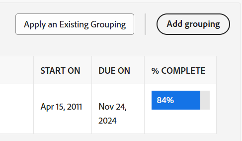

# 사용자 지정 보고서 만들기

보고서를 만드는 방법을 이해하면 Adobe Workfront 내에서 조직에서 필요로 하는 정보에 액세스할 수 있는 권한을 제공합니다. Workfront에서 사용할 수 있는 기본 제공 보고서를 사용하거나 처음부터 고유한 보고서를 작성할 수 있습니다.

기본 제공 보고서에 대한 자세한 내용은 [Adobe Workfront 기본 제공 보고서 사용](../../../reports-and-dashboards/reports/using-built-in-reports/use-workfront-built-in-reports.md). 보고서를 복사하여 만드는 방법에 대한 자세한 내용은 [보고서 사본 만들기](../../../reports-and-dashboards/reports/creating-and-managing-reports/create-copy-report.md).

## 액세스 요구 사항

이 문서의 절차를 수행하려면 다음 액세스 권한이 있어야 합니다.

<table style="table-layout:auto"> 
 <col> 
 <col> 
 <tbody> 
  <tr> 
   <td role="rowheader">Adobe Workfront 플랜*</td> 
   <td> 
모든
 </td> 
  </tr> 
  <tr> 
   <td role="rowheader">Adobe Workfront 라이선스*</td> 
   <td> 
플랜 
 </td> 
  </tr> 
  <tr> 
   <td role="rowheader">액세스 수준 구성*</td> 
   <td> 
보고서, 대시보드, 달력에 대한 액세스 편집
 
필터, 보기, 그룹화에 대한 액세스 편집
 
참고: 여전히 액세스 권한이 없는 경우 Workfront 관리자에게 액세스 수준에서 추가 제한 사항을 설정하는지 문의하십시오. Workfront 관리자가 액세스 수준을 수정하는 방법에 대한 자세한 내용은 <a href="../../../administration-and-setup/add-users/configure-and-grant-access/create-modify-access-levels.md" class="MCXref xref">사용자 정의 액세스 수준 만들기 또는 수정</a>.
 </td> 
  </tr> 
  <tr> 
   <td role="rowheader">개체 권한</td> 
   <td> 
생성한 보고서에 대한 관리 권한을 가져옵니다
 
추가 액세스 요청에 대한 자세한 내용은 <a href="../../../workfront-basics/grant-and-request-access-to-objects/request-access.md" class="MCXref xref">개체에 대한 액세스 요청 </a>.
 </td> 
  </tr> 
 </tbody> 
</table>

&#42;어떤 계획, 라이선스 유형 또는 액세스 권한을 보유하고 있는지 알아보려면 Workfront 관리자에게 문의하십시오.

## 보고서 만들기 {#create-a-report}

보고서를 만드는 방법에 대한 비디오를 보려면 다음을 참조하십시오 [사용자 지정 보고서 만들기](#Walk-thr) 아래의 제품에서 사용할 수 있습니다.

1. 을(를) 클릭합니다. **기본 메뉴** 아이콘  오른쪽 위 모서리에서 을(를) 클릭하고 **보고서**.
1. 클릭 **새 보고서**&#x200B;를 선택한 다음 보고서에 사용할 개체 유형을 선택합니다.

   Report Builder가 로드됩니다.

   사용 가능한 개체 보고서에 대한 특정 정보는 섹션을 참조하십시오 [객체에 대한 보고서](../../../workfront-basics/navigate-workfront/workfront-navigation/understand-objects.md#reporting-on-objects) 기사 [Adobe Workfront의 개체 이해](../../../workfront-basics/navigate-workfront/workfront-navigation/understand-objects.md).

   

   >[!TIP]
   >
   >기존 보고서의 사본을 만들어 보고서를 만들 수도 있습니다. 자세한 내용은 [보고서 사본 만들기](../../../reports-and-dashboards/reports/creating-and-managing-reports/create-copy-report.md).

1. Report Builder에서 다음 내용을 보고서에 추가합니다.

   <table style="table-layout:auto"> 
    <col> 
    <col> 
    <thead> 
     <tr> 
      <th>기능</th> 
      <th>설명</th> 
     </tr> 
    </thead> 
    <tbody> 
     <tr> 
      <td>열(조회)</td> 
      <td> 
보고서에 열을 추가하면 보고서에 포함된 정보가 결정됩니다.
 
열을 추가하는 방법에 대해 알아보려면 <a href="#add-columns-view-to-a-report" class="MCXref xref">보고서에 열(보기) 추가</a>. 
 </td> 
     </tr> 
     <tr> 
      <td>그룹화</td> 
      <td> 
보고서에 그룹화를 추가하면 보고서가 구성되는 방식이 결정됩니다.
 
그룹을 추가하는 방법에 대해 알아보려면 <a href="#add-groupings-to-a-report" class="MCXref xref">보고서에 그룹화 추가</a>.
 </td> 
     </tr> 
     <tr> 
      <td>필터</td> 
      <td> 
보고서에 필터 규칙을 추가하면 보고서에 표시되는 정보가 결정됩니다.
 
필터를 추가하는 방법에 대해 알아보려면 <a href="#add-filters-to-a-report" class="MCXref xref">보고서에 필터 추가</a>.
 </td> 
     </tr> 
     <tr> 
      <td>차트</td> 
      <td> 
보고서에 차트를 추가하면 보고서의 정보가 시각적으로 표시되는 방식이 결정됩니다.
 
차트를 추가하는 방법에 대해 알아보려면 <a href="#add-a-chart-to-a-report" class="MCXref xref">보고서에 차트 추가</a>.
 </td> 
     </tr> 
    </tbody> 
   </table>

1. 보고서 생성 프로세스 중에 언제든지 **적용** 변경 사항을 저장하려면 을 클릭합니다.
1. 완료되면 를 클릭합니다 **저장 + 닫기**.

### 보고서에 열(보기) 추가 {#add-columns-view-to-a-report}

1. 에 설명된 대로 보고서 만들기를 시작합니다. [보고서 만들기](#create-a-report) 섹션에 자세히 설명되어 있습니다.
1. Report Builder에서 **열(보기)** 탭에서 보고서에 표시할 열을 식별합니다.
1. (선택 사항) **기존 보기 적용** 기존 보기를 사용하려면

   새 보기 만들기에 대한 자세한 내용은 [Adobe Workfront의 보기 개요](../../../reports-and-dashboards/reports/reporting-elements/views-overview.md).

1. 새 열을 추가하려면 **열 추가**.

   또는

   기존 열을 변경하려면 변경할 열을 선택한 다음 현재 이름 옆에 있는 (x)를 클릭합니다.

1. 추가할 필드 입력을 시작합니다. 필드를 사용할 수 있으면 필드를 연결할 수 있는 각 개체에 대해 채워집니다. 필드 이름을 클릭하여 열에 추가합니다.

   열에 표시되는 필드에 대한 자세한 내용은 [Adobe Workfront 용어 설명](../../../workfront-basics/navigate-workfront/workfront-navigation/workfront-terminology-glossary.md).

   

1. (선택 사항)에서 **열 설정** 영역, 선택 **이 열 기준 정렬** 열의 값을 내림차순으로 오름차순으로 정렬하려면 목록에서 이 열을 첫 번째 정렬로 사용해야 하는지 여부를 지정합니다.

   한 열의 값, 두 번째 열의 값 등으로 정렬하려면 보고서 보기에 여러 수준의 정렬을 가질 수 있습니다.

   여러 결과가 첫 번째 정렬 기준에 따라 동일하면 두 번째 정렬 기준의 순서로 정렬됩니다. 복수의 결과가 제1 및 제2 정렬 기준에 따라 동일하면, 제3 정렬 등에 따라 정렬됩니다.

   >[!NOTE]
   >
   >보고 중인 개체에서 너무 멀리 제거된 개체를 참조하는 필드를 추가하는 경우 이 필드를 기준으로 정렬할 수 없습니다.\
   >예를 들어, 문제 보고서는 3개의 추가 객체를 참조하므로 프로젝트 소유자 필드로 정렬할 수 없습니다. 프로젝트, 소유자 및 이름 하지만 이 필드를 문제 보고서에 추가하고 해당 정보에 대한 정보를 계속 볼 수 있습니다.\
   >보고서의 개체 간 참조에 대한 자세한 내용은 [보고서 및 대시보드 학습 경로](https://one.workfront.com/s/learningpath2/workfront-reporting-MC7MZT2BOL2ZC2LMJ4MA3EMHOCNY?tabset-dc70e=2).

1. (선택 사항) 그룹화를 사용 중이며 열에 있는 정보를 요약(집계)하려면 **다음 방법으로 이 열 요약** 의 드롭다운 목록 **열 설정** 영역에서 정보를 집계하는 데 사용할 옵션을 선택합니다.

   집계된 정보는 그룹화 행의 열에 표시됩니다.

   

   열의 데이터 요약에 대한 자세한 내용은 [Adobe Workfront의 보기 개요](../../../reports-and-dashboards/reports/reporting-elements/views-overview.md).

   >[!NOTE]
   >
   >다음 필드에 대한 값을 그룹화하면 상위 객체(예: 상위 작업)에 다음 예외가 적용됩니다.
   >
   >* 실제 시간(예: 계획/실제 노무비, 계획/실제 비용, 계획/실제 비용, 계획/실제 비용, 계획 시간)을 제외한 모든 숫자 및 통화 필드는 하위 태스크 및 독립형 태스크에 대한 값만 집계합니다. 상위 작업 또는 상위 항목에 대한 값을 집계하지 않습니다.
   >* 실제 시간은 주 상위 및 독립형 작업의 값을 집계합니다. 상위 작업 또는 하위 작업의 상위 항목에 대한 숫자를 집계하지 않습니다.
   >* 숫자 및 통화 값에 대한 사용자 지정 데이터 필드는 모든 작업을 집계합니다. 부모, 자녀, 부모의 부모 및 독립형 작업

   보고서에서 그룹화를 사용하는 방법에 대한 자세한 내용은 [Adobe Workfront의 그룹화 개요](../../../reports-and-dashboards/reports/reporting-elements/groupings-overview.md).

1. (선택 사항) **고급 옵션** 열에 대해 다음 정보를 지정하려면

   <table style="table-layout:auto"> 
    <col> 
    <col> 
    <tbody> 
     <tr> 
      <td role="rowheader">사용자 정의 열 레이블</td> 
      <td> 
열에 대한 사용자 지정 레이블을 지정합니다. 이 레이블은 기본 레이블을 대체합니다.
 </td> 
     </tr> 
     <tr> 
      <td role="rowheader">필드 형식</td> 
      <td> 
열의 필드에 값을 표시할 형식을 선택합니다.
 </td> 
     </tr> 
     <tr> 
      <td role="rowheader">대시보드에 있을 때 이 열 표시</td> 
      <td> 
보고서가 다른 보고서와 나란히 표시될 때 대시보드에 이 열을 표시하려면 이 옵션을 선택합니다. 이 옵션을 선택하지 않으면 보고서가 나란히 표시되는 대시보드에서 보고서를 볼 때에는 이 열이 표시되지 않습니다.
 </td> 
     </tr> 
     <tr> 
      <td role="rowheader">열 규칙</td> 
      <td> 
클릭 <strong>이 열에 대한 규칙 추가</strong> 조건부 서식을 열에 추가하려면 규칙을 추가한 후 해당 규칙과 일치하는 필드가 표시되는 방식에 대한 필드 및 텍스트 스타일을 정의할 수 있습니다. 클릭 <strong>규칙 추가</strong> 규칙 정의를 완료하면 됩니다. 보기의 조건부 서식에 대한 자세한 내용은 <a href="../../../reports-and-dashboards/reports/reporting-elements/use-conditional-formatting-views.md" class="MCXref xref">보기에서 조건부 서식 사용</a>.
 </td> 
     </tr> 
    </tbody> 
   </table>

1. 클릭 **적용** 지금까지 변경 사항을 적용하고 다음 옵션을 사용하여 보고서를 계속 편집합니다.

   클릭 **저장 + 닫기** 보고서의 열 편집을 완료하고 보고서를 저장하려는 경우.

### 보고서에 그룹화 추가 {#add-groupings-to-a-report}

1. 에 설명된 대로 보고서 만들기를 시작합니다. [보고서 만들기](#create-a-report) 섹션에 자세히 설명되어 있습니다.
1. Report Builder에서 **그룹화** 탭에서 항목을 그룹화할 방법을 확인합니다.
1. 클릭 **그룹화 추가** 새 그룹을 추가하려면

   또는

   선택 **기존 그룹 적용** 기존 그룹을 선택하려면
   

1. 그룹으로 추가할 필드 입력을 시작합니다. 필드를 사용할 수 있으면 필드를 연결할 수 있는 각 개체에 대해 채워집니다. 필드 이름을 클릭하여 해당 그룹에 추가합니다.
1. (선택 사항) 텍스트 모드에서 그룹을 작성할 때 **텍스트 모드로 전환**. 텍스트 모드 사용에 대한 자세한 내용은 [텍스트 모드 개요](../../../reports-and-dashboards/reports/text-mode/understand-text-mode.md).

   새 그룹화 만들기에 대한 자세한 내용은 다음을 참조하십시오 [Adobe Workfront의 그룹화 개요](../../../reports-and-dashboards/reports/reporting-elements/groupings-overview.md).

1. (선택 사항) 선택 **기본적으로 이 그룹을 축소합니다.** 이 그룹의 결과를 확대하지 않고 축소하려면 다음을 수행하십시오.

   이 설정은 기본적으로 비활성화되며 그룹화 결과는 항상 확장된 목록에 표시됩니다.

   >[!TIP]
   >
   >* 목록을 볼 때 수동으로 그룹화를 조정하면 Workfront은 로그아웃할 때까지 수동 환경 설정을 기억합니다. 다시 로그인하면 이 설정에 따라 목록이 표시됩니다.
   >* 그룹 결과는 차트 요소에서 액세스한 후 항상 확장되어 표시됩니다.

1. (선택 사항) 표 형식으로 결과를 표시하도록 매트릭스 그룹을 작성하도록 선택할 수 있습니다.

   매트릭스 보고서 작성에 대한 자세한 내용은 다음을 참조하십시오 [매트릭스 보고서 만들기](../../../reports-and-dashboards/reports/creating-and-managing-reports/create-matrix-report.md).

1. 클릭 **적용** 지금까지 변경 사항을 적용하고 다음 옵션을 사용하여 보고서를 계속 편집합니다.

   클릭 **저장 + 닫기** 보고서의 그룹화 편집을 완료하고 보고서를 저장하려는 경우

### 보고서에 필터 추가 {#add-filters-to-a-report}

1. 에 설명된 대로 보고서 만들기를 시작합니다. [보고서 만들기](#create-a-report) 섹션에 자세히 설명되어 있습니다.
1. Report Builder에서 **필터** 탭하여 보고서를 포함할 정보 양을 식별합니다.
1. 클릭 **필터 규칙 추가** 사용자 지정 필터를 추가하려면\
   또는\
   선택 **기존 필터 적용** 기존 필터를 사용합니다.

   

1. 클릭한 경우 **필터 규칙 추가**&#x200B;을(를) 필터로 추가할 필드 입력을 시작합니다. 필드를 사용할 수 있으면 필드를 연결할 수 있는 각 개체에 대해 채워집니다. 필드 이름을 클릭하여 해당 필터에 추가합니다.\
   필터 한정자를 사용하여 필터를 빌드합니다. 필터 수정자에 대한 자세한 내용은 [필터 및 조건 수정자](../../../reports-and-dashboards/reports/reporting-elements/filter-condition-modifiers.md).

   새 필터 만들기에 대한 자세한 내용은 [Adobe Workfront의 필터 개요](../../../reports-and-dashboards/reports/reporting-elements/filters-overview.md).

1. (선택 사항) **텍스트 모드로 전환**.

   텍스트 모드 사용에 대한 자세한 내용은 [텍스트 모드 개요](../../../reports-and-dashboards/reports/text-mode/understand-text-mode.md).

1. 클릭 **적용** 보고서에서 필터 편집을 완료하여 지금까지 변경 사항을 적용하고 다음 옵션을 사용하여 보고서를 계속 편집합니다.

   클릭 **저장 + 닫기** 보고서를 저장하고 싶을 경우.

### 보고서에 차트 추가 {#add-a-chart-to-a-report}

1. 에 설명된 대로 보고서 만들기를 시작합니다. [보고서 만들기](#create-a-report) 섹션에 자세히 설명되어 있습니다.
1. Report Builder에서 **차트** 탭을 클릭한 다음 추가할 차트 유형을 선택합니다.

   

   보고서에서 차트 만들기에 대한 자세한 내용은 [보고서에 차트 추가](../../../reports-and-dashboards/reports/creating-and-managing-reports/add-chart-report.md).

1. 클릭 **적용** 지금까지 변경 사항을 적용하고 다음 옵션을 사용하여 보고서를 계속 편집합니다.

   클릭 **저장 + 닫기** 보고서 편집을 완료하고 보고서를 저장하려는 경우.
