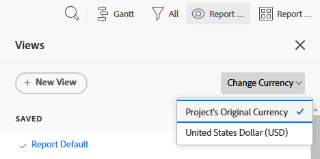

# 고유 환율로 재무 데이터 보고서 만들기

<!-- Audited: 11/2024 -->

Adobe Workfront에 여러 환율이 구성된 경우 기본 통화 이외의 통화로 표시하도록 보고서 및 목록의 재무 값을 설정할 수 있습니다.

>[!IMPORTANT]
>
>보기에서 기본 통화 이외의 통화를 선택하면 프로젝트 목록 맨 아래에 더 이상 **작업 추가** 및 **문제 추가** 링크가 표시되지 않습니다.

특정 프로젝트의 기본 통화를 변경하는 방법에 대한 자세한 내용은 [프로젝트 통화 변경](../../../manage-work/projects/project-finances/change-project-currency.md)을 참조하십시오.

보고서에 단일 통화를 사용하는 프로젝트가 있는 경우 그룹화의 합계도 시스템 기본 통화로 표시됩니다.

## 액세스 요구 사항

+++ 을 확장하여 이 문서의 기능에 대한 액세스 요구 사항을 봅니다.

이 문서의 단계를 수행하려면 다음 액세스 권한이 있어야 합니다.

<table style="table-layout:auto"> 
 <col> 
 <col> 
 <tbody> 
  <tr> 
   <td role="rowheader">Adobe Workfront 플랜*</td> 
   <td> 
임의
 </td> 
  </tr> 
  <tr> 
   <td role="rowheader">Adobe Workfront 라이센스*</td> 
   <td> 
      
신규:

         <ul>
         <li>
표준
</li>
         </ul>
      
현재:

         <ul>
         <li>
플랜
</li>
         </ul>
   </td>
  </tr> 
  <tr> 
   <td role="rowheader">액세스 수준 구성*</td> 
   <td> 
보고서, 대시보드, 캘린더에 대한 액세스 편집
 
필터, 보기, 그룹화에 대한 액세스 편집
</td> 
  </tr> 
  <tr> 
   <td role="rowheader">개체 권한*</td> 
   <td> 
보고서에 대한 권한 관리
</td> 
  </tr> 
 </tbody> 
</table>

*자세한 내용은 [Workfront 설명서의 액세스 요구 사항](/help/quicksilver/administration-and-setup/add-users/access-levels-and-object-permissions/access-level-requirements-in-documentation.md)을 참조하십시오.

+++

## 전제 조건

이 섹션에 설명된 대로 대체 통화를 보려면 먼저 Workfront 관리자가 Workfront의 설정 영역에서 여러 통화를 활성화하고 구성해야 합니다. 자세한 내용은 [환율 설정](../../../administration-and-setup/manage-workfront/exchange-rates/set-up-exchange-rates.md)을 참조하세요.

## 보고서에 재무 값 적용 {#apply-financial-values-to-a-report}

보고서 작업 시 통화 간에 재무 값을 변환하려면 다음을 수행합니다.

1. 재무 값을 다른 통화로 변환할 보고서로 이동합니다.
1. **보기** 드롭다운 목록을 클릭하고 **통화 변경**&#x200B;을 클릭한 다음, 다음 통화 중 재무 값을 표시할 통화를 선택하십시오.

   * 프로젝트의 원래 통화
   * 다른 통화 중 하나

     >[!TIP]
     >
     >설정에서 이전에 선택한 통화만 선택할 수 있습니다.

   이 옵션을 사용하면 보고서에서 환율 값 간에 재무 값을 빠르게 변환할 수 있습니다.

   

   <!--
   
(NOTE: drafted this tip because I think this is confusing; this is in the step above.)

   -->

   <!--
   <note type="tip">
   You can also select the Change Currency option to convert financial values in other lists.
    
   
    
    
   </note>
   -->

## 다른 통화를 사용하는 여러 프로젝트에 기본 통화 표시

프로젝트 수준에서 통화를 사용자 정의하고 동일한 보고서에 모든 프로젝트의 정보를 표시하려는 경우 다음과 같은 시나리오가 있습니다.

* 다른 통화가 적용된 둘 이상의 프로젝트에서 재무 정보를 가져오는 보고서를 생성하는 경우 기본적으로 그룹화 요약은 Workfront 관리자가 선택한 시스템의 기본 통화를 반영합니다.
* 통화가 같지만 시스템의 기본 통화와 다른 둘 이상의 프로젝트에 대한 보고서를 생성하면 그룹화의 합계가 시스템 기본 통화를 사용하여 표시됩니다.
* 통화 재정의와 연관된 작업 역할 할당이 있는 둘 이상의 프로젝트에 대한 보고서를 생성하는 경우 Workfront은 작업 역할의 재정의된 통화 비율의 재무 정보를 프로젝트 통화(보기에서 프로젝트의 원래 통화를 선택할 때)나 보고서를 볼 때 선택하는 다른 통화로 변환합니다. 작업 역할의 통화 재정의에 대한 자세한 내용은 [작업 역할 만들기 및 관리](../../../administration-and-setup/set-up-workfront/organizational-setup/create-manage-job-roles.md)를 참조하십시오.

보고서에 사용자 지정 통화를 사용하는 두 개의 프로젝트를 표시하려면:

1. 다른 통화가 적용된 두 개의 프로젝트를 만듭니다.

   

1. 두 프로젝트에 시간을 기록합니다.

   로깅 시간에 대한 자세한 내용은 [로그 시간](../../../timesheets/create-and-manage-timesheets/log-time.md)을 참조하십시오.

1. **기본 메뉴** 아이콘 을(를) 클릭한 다음 **보고**&#x200B;를 클릭합니다.
1. **새 보고서**&#x200B;를 클릭한 다음 **프로젝트 보고서**&#x200B;를 클릭합니다.
1. **열(보기)** 탭에서 **실제 비용** 열을 추가하고 **합계**&#x200B;로 요약합니다.

   열을 만드는 방법에 대한 자세한 내용은 [Adobe Workfront의 보기 개요](../../../reports-and-dashboards/reports/reporting-elements/views-overview.md)를 참조하십시오.

1. **그룹화** 탭에서 **계획된 완료 일자** 그룹화를 적용합니다.

   그룹화를 만드는 방법에 대한 자세한 내용은 Adobe Workfront의 [그룹화 개요](../../../reports-and-dashboards/reports/reporting-elements/groupings-overview.md)를 참조하십시오.

1. **필터** 탭에서 **프로젝트 이름**&#x200B;에 대한 필터를 추가하고 통화가 다른 두 프로젝트를 선택합니다.

   필터를 만드는 방법에 대한 자세한 내용은 [필터 개요](../../../reports-and-dashboards/reports/reporting-elements/filters-overview.md)를 참조하십시오.

1. **저장 및 닫기**&#x200B;를 클릭합니다.

   보고서의 프로젝트 통화에 관계없이 시스템 기본 통화를 사용하여 그룹화에서 총 **실제 비용**&#x200B;이(가) 표시됩니다.

   두 프로젝트의 통화가 서로 다른 경우 보고서 그룹화에도 시스템 기본 통화가 표시됩니다.

## 프로젝트 수준의 보고서에 프로젝트 통화 표시

그룹화가 프로젝트 내의 작업 또는 시간 목록에 적용되는 경우 그룹화의 합계는 프로젝트 통화로 표시됩니다.

1. 시스템 기본 통화가 아닌 사용자 지정 통화로 프로젝트를 만듭니다.
1. 프로젝트로 이동하여 작업에 기록된 시간이 포함되어 있는지 확인합니다.

   로깅 시간에 대한 자세한 내용은 [로그 시간](../../../timesheets/create-and-manage-timesheets/log-time.md)을 참조하십시오.

   >[!NOTE]
   >
   >작업은 시간당 비용 비율이 있는 사용자 또는 작업 역할에 할당되어야 합니다.

1. **작업**&#x200B;을 클릭합니다.
1. **보기** 드롭다운 메뉴를 확장하고 **새 보기**&#x200B;를 선택합니다.
1. 새 보기에 **실제 비용**&#x200B;을(를) 새 열로 추가하고 **합계**&#x200B;로 요약합니다.
1. **완료**&#x200B;를 클릭한 다음 **보기 저장**&#x200B;을 클릭합니다.
1. **그룹화** 드롭다운 메뉴를 확장하고 **새 그룹화**&#x200B;을 선택합니다.
1. 새 그룹화에 **실제 완료 날짜**&#x200B;를 새 필드로 추가한 다음 **그룹화 저장**&#x200B;을 클릭합니다.

   **실제 비용** 열은 새 그룹화에 요약되고 합계를 프로젝트 통화로 표시합니다.

## 고유 통화로 보고서 편집

프로젝트의 원래 통화를 표시하도록 보고서 설정을 변경할 때까지 보고서의 재무 필드를 편집할 수 없습니다.

보고서에서 재무 필드를 인라인 편집하려면:

1. 보고서로 이동합니다.

   >[!NOTE]
   >
   >목록에 대해 다른 영역에 기본 통화가 표시되지 않는 경우 보기를 편집하여 기본 통화를 표시할 수 있습니다.\
   >보기에서 통화를 변경하는 방법에 대한 자세한 내용은 이 문서 [보고서에 재무 값 적용](#apply-financial-values-to-a-report)의 섹션을 참조하십시오.

1. **보고서 동작**&#x200B;을 클릭한 다음 **편집**&#x200B;을 선택합니다.
1. **보고서 설정**&#x200B;을 클릭합니다.
1. **기본 통화** 드롭다운을 클릭한 다음 **프로젝트의 원래 통화**&#x200B;를 선택합니다.

   

1. **완료**&#x200B;를 클릭합니다.
