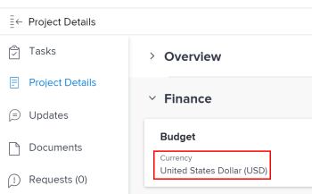

# 고유한 환율을 사용하여 재무 데이터 보고서 만들기

Adobe Workfront에 여러 환율이 구성된 경우 보고서 및 목록의 재무 값이 기본 통화 이외의 통화로 표시되도록 설정할 수 있습니다.

>[!IMPORTANT]
>
>보기에서 기본 통화 이외의 통화를 선택하면 더 이상 링크가 표시되지 않습니다 **추가 작업** 및 **추가 문제** 를 클릭합니다.

주어진 프로젝트에 대한 기본 통화를 변경하는 방법에 대한 자세한 내용은 [프로젝트 통화 변경](../../../manage-work/projects/project-finances/change-project-currency.md).

보고서에 단일 통화를 사용하는 프로젝트가 있는 경우 그룹화된 합계도 시스템 기본 통화로 표시됩니다.

## 액세스 요구 사항

이 문서의 절차를 수행하려면 다음 액세스 권한이 있어야 합니다.

<table style="table-layout:auto"> 
 <col> 
 <col> 
 <tbody> 
  <tr> 
   <td role="rowheader">Adobe Workfront 플랜*</td> 
   <td> 
모든
 </td> 
  </tr> 
  <tr> 
   <td role="rowheader">Adobe Workfront 라이선스*</td> 
   <td> 
플랜 
 </td> 
  </tr> 
  <tr> 
   <td role="rowheader">액세스 수준 구성*</td> 
   <td> 
보고서, 대시보드, 달력에 대한 액세스 편집
 
필터, 보기, 그룹화에 대한 액세스 편집
 
참고: 여전히 액세스 권한이 없는 경우 Workfront 관리자에게 액세스 수준에서 추가 제한 사항을 설정하는지 문의하십시오. Workfront 관리자가 액세스 수준을 수정하는 방법에 대한 자세한 내용은 <a href="../../../administration-and-setup/add-users/configure-and-grant-access/create-modify-access-levels.md" class="MCXref xref">사용자 정의 액세스 수준 만들기 또는 수정</a>.
 </td> 
  </tr> 
  <tr> 
   <td role="rowheader">개체 권한</td> 
   <td> 
보고서에 대한 권한 관리
 
추가 액세스 요청에 대한 자세한 내용은 <a href="../../../workfront-basics/grant-and-request-access-to-objects/request-access.md" class="MCXref xref">개체에 대한 액세스 요청 </a>.
 </td> 
  </tr> 
 </tbody> 
</table>

&#42;어떤 계획, 라이선스 유형 또는 액세스 권한을 보유하고 있는지 알아보려면 Workfront 관리자에게 문의하십시오.

## 전제 조건

이 섹션에 설명된 대로 대체 통화를 보려면 먼저 Workfront 관리자가 Workfront의 설정 영역에서 여러 통화를 활성화하고 구성해야 합니다. 자세한 내용은 [환율 설정](../../../administration-and-setup/manage-workfront/exchange-rates/set-up-exchange-rates.md).

## 보고서에 재무 값 적용 {#apply-financial-values-to-a-report}

보고서를 사용하여 작업할 때 통화 간에 재무 값을 변환하려면

1. 재무 값을 다른 통화로 변환할 보고서로 이동합니다.
1. 을(를) 클릭합니다. **보기** 드롭다운 목록에서 **통화 변경**&#x200B;을 선택한 다음, 재무 값을 표시할 다음 통화 중 하나를 선택합니다.

   * 프로젝트의 원래 통화
   * 다른 모든 통화

      >[!TIP]
      >
      >설정에서 이전에 선택한 통화만 선택할 수 있습니다.
   이 옵션을 사용하면 보고서의 재무 값을 환율 값 간에 빠르게 변환할 수 있습니다.

   

   <!--
   
(NOTE: drafted this tip because I think this is confusing; this is in the step above.)

   -->

   <!--
   <note type="tip">
   You can also select the Change Currency option to convert financial values in other lists.
    
   
    
    
   </note>
   -->

## 통화가 다른 여러 프로젝트의 기본 통화 표시

프로젝트 수준에서 통화를 사용자 지정하고 동일한 보고서에 있는 모든 프로젝트의 정보를 표시하려는 경우 다음 시나리오가 있습니다.

* 통화가 다른 두 개 이상의 프로젝트에서 재무 정보를 가져오는 보고서를 생성하는 경우 기본적으로 그룹화 요약에 Workfront 관리자가 선택한 시스템의 기본 통화가 반영됩니다.
* 통화가 동일하지만 시스템의 기본 통화와 다른 두 개 이상의 프로젝트에 대해 보고서를 만들면 그룹의 합계가 시스템 기본 통화를 사용하여 표시됩니다.
* 통화 대체와 연관된 Job 역할 할당이 있는 둘 이상의 프로젝트에 대한 보고서를 생성하는 경우 Workfront은 Job 역할의 대체된 통화 환율에서 재무 정보를 프로젝트의 통화(뷰에서 프로젝트의 최초 통화를 선택한 경우) 또는 보고서를 볼 때 선택하는 다른 통화로 변환합니다. Job 역할의 통화 재지정에 대한 자세한 내용은 [작업 역할 만들기 및 관리](../../../administration-and-setup/set-up-workfront/organizational-setup/create-manage-job-roles.md).

보고서에 사용자 지정 통화가 있는 두 프로젝트를 표시하려면 다음을 수행하십시오.

1. 다른 통화가 적용된 두 개의 프로젝트를 만듭니다.

   

1. 두 프로젝트에 대한 시간을 기록합니다.

   로깅 시간에 대한 자세한 내용은 [로그 시간](../../../timesheets/create-and-manage-timesheets/log-time.md).

1. 을(를) 클릭합니다. **기본 메뉴** 아이콘 를 클릭한 다음 **보고**.
1. 클릭 **새 보고서**, 그런 다음 **프로젝트 보고서**.
1. 에서 **열(보기)** 탭에서 추가 **실제 비용** 열 및 다음을 통해 요약 **합계**.

   열을 만드는 방법에 대한 자세한 내용은 [Adobe Workfront의 보기 개요](../../../reports-and-dashboards/reports/reporting-elements/views-overview.md).

1. 에서 **그룹화** 탭, 적용 **계획 완료 일자** 그룹화.

   그룹을 만드는 방법에 대한 자세한 내용은 [Adobe Workfront의 그룹화 개요](../../../reports-and-dashboards/reports/reporting-elements/groupings-overview.md).

1. 에서 **필터** 탭에서 필터 추가 **프로젝트 이름** 통화가 다른 두 프로젝트를 선택합니다.

   필터를 만드는 방법에 대한 자세한 내용은 [Adobe Workfront의 필터 개요](../../../reports-and-dashboards/reports/reporting-elements/filters-overview.md).

1. 클릭 **저장 + 닫기**.

   합계 **실제 비용** 는 보고서에 있는 프로젝트의 통화와 관계없이 시스템 기본 통화를 사용하여 그룹화에 표시됩니다.

   

   두 프로젝트에 서로 다른 통화가 있는 경우 시스템 기본 통화도 보고서 그룹화에 표시됩니다.

## 프로젝트 수준의 보고서에 프로젝트 통화 표시

그룹화가 프로젝트 내의 작업 또는 시간 목록에 적용되면 그룹화의 합계가 프로젝트 통화로 표시됩니다.

1. 시스템 기본 통화와 다른 사용자 지정 통화를 사용하여 프로젝트를 만듭니다.
1. 프로젝트로 이동하여 작업에 대해 기록된 시간이 포함되어 있는지 확인합니다.

   로깅 시간에 대한 자세한 내용은 [로그 시간](../../../timesheets/create-and-manage-timesheets/log-time.md).

   >[!NOTE]
   >
   >작업은 시간 당 비용 비율이 있는 사용자 또는 작업 역할에 할당되어야 합니다.

1. 클릭 **작업**.
1. 를 확장합니다. **보기** 드롭다운 메뉴를 선택하고 **새 보기**.
1. 추가 **실제 비용** 새 View에서 새 열로 요약하고 **합계**.
1. 클릭 **완료**&#x200B;를 클릭한 다음 **보기 저장**.
1. 를 확장합니다. **그룹화** 드롭다운 메뉴를 선택하고 **새 그룹화**.
1. 추가 **실제 완료 날짜** 새 그룹으로 새 필드를 만든 후 **그룹화 저장**.

   다음 **실제 비용** 열은 새 그룹화에 요약되며 합계를 프로젝트 통화로 표시합니다.

## 고유한 통화로 보고서 편집

프로젝트의 원래 통화를 표시하도록 보고서 설정을 변경할 때까지 보고서의 재무 필드를 편집할 수 없습니다.

보고서에서 재무 필드를 인라인 편집하려면

1. 보고서로 이동합니다.

   >[!NOTE]
   >
   >다른 영역의 목록에 대해 기본 통화가 표시되지 않으면 뷰를 편집하여 기본 통화를 표시할 수 있습니다.\
   >보기에서 통화를 변경하는 방법에 대한 자세한 내용은 이 문서의 섹션을 참조하십시오 [보고서에 재무 값 적용](#apply-financial-values-to-a-report).

1. 클릭 **보고서 작업**&#x200B;를 선택하고 을 선택합니다. **편집**.
1. 클릭 **보고서 설정**.
1. 을(를) 클릭합니다. **기본 통화** 드롭다운을 선택한 다음 **프로젝트의 원래 통화**.

   

1. 클릭 **완료**.
