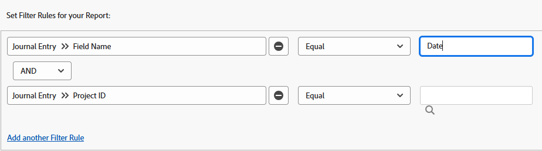

# 업데이트 영역에 대한 보고서

<!-- Audited: 11/2024 -->

저널 게시물 보고서는 이전에 Adobe Workfront API를 통해서만 사용할 수 있었던 프로젝트, 작업, 문제 및 기타 개체의 업데이트 영역에서 시스템 업데이트를 표시합니다. 특정 사용 사례를 위한 고급 보고서이지만, 보다 간편한 형식을 사용하면 Workfront 내의 프로젝트 활동 및 시스템 업데이트에 대해 보다 쉽게 보고할 수 있습니다.

>[!TIP]
>
>분개 기입 보고서에는 객체의 갱신 영역에 있는 시스템 갱신만 포함됩니다. 업데이트 영역에 남아 있는 댓글에 대해 보고하려면 메모 보고서를 사용해야 합니다.\
>메모 보고서에 대한 자세한 내용은 [메모 보고서의 모든 업데이트 보기](../../../workfront-basics/updating-work-items-and-viewing-updates/view-all-updates-in-a-report.md)를 참조하십시오‍.

분개 입력 보고서에는 다음이 표시됩니다.

* 얼마나 많은 상태 변경 발생
* 작업 또는 문제가 삭제된 경우
* 프로젝트의 수명 주기 과정에 따라 중요한 사용자 정의 필드의 값이 변경되는 방식
* 프로젝트의 수명 주기 과정에 따라 변경된 중요한 일자
* 프로젝트 소유자가 변경된 경우

## 액세스 요구 사항

+++ 을 확장하여 이 문서의 기능에 대한 액세스 요구 사항을 봅니다.

이 문서의 단계를 수행하려면 다음 액세스 권한이 있어야 합니다.

<table style="table-layout:auto"> 
 <col> 
 <col> 
 <tbody> 
  <tr> 
   <td role="rowheader">Adobe Workfront 플랜</td> 
   <td> 
임의
 </td> 
  </tr> 
  <tr> 
   <td role="rowheader">Adobe Workfront 라이선스</td> 
      <td> 
      
신규:

         <ul>
         <li>
표준
</li>
         </ul>
      
현재:

         <ul>
         <li>
플랜
</li>
         </ul>
   </td> 
  </tr> 
  <tr> 
   <td role="rowheader">액세스 수준 구성</td> 
   <td> 
보고서, 대시보드, 캘린더에 대한 액세스 편집
 
필터, 보기, 그룹화에 대한 액세스 편집
 </td> 
  </tr> 
  <tr> 
   <td role="rowheader">개체 권한</td> 
   <td> 
보고서에 표시하는 분개 항목이 포함된 객체에 대한 권한 보기
 
보고서를 만들면 보고서에 대한 관리 권한을 갖게 됩니다
 </td> 
  </tr> 
 </tbody> 
</table>

*자세한 내용은 [Workfront 설명서의 액세스 요구 사항](/help/quicksilver/administration-and-setup/add-users/access-levels-and-object-permissions/access-level-requirements-in-documentation.md)을 참조하십시오.

+++

## 전제 조건

이 문서에 설명된 작업을 수행하려면 먼저 다음 사항을 확인해야 합니다.

* 보고할 모든 필드(사용자 지정 필드 포함)는 Workfront에서 추적됩니다. 추적되는 업데이트 영역의 데이터만 보고할 수 있습니다.

  Workfront에서 추적할 필드를 추가하는 방법에 대한 자세한 내용은 [시스템 업데이트 구성](../../../administration-and-setup/set-up-workfront/system-tracked-update-feeds/configure-system-updates.md)을 참조하십시오.

## 분개 기입 보고서 개요

분개 기입 보고서는 시스템 업데이트를 쿼리하므로 상당한 수의 결과를 반환할 수 있습니다. 따라서 보고서를 생성할 때 프로젝트, 프로그램, 포트폴리오, 그룹 등과 같은 특정 개체를 필터링하는 것이 좋습니다.

Workfront의 다양한 개체 유형에 대해 자세히 알아보려면 [Adobe Workfront의 개체 이해](../../../workfront-basics/navigate-workfront/workfront-navigation/understand-objects.md)를 참조하십시오.

>[!NOTE]
>
>분개 기입 보고서는 너무 많은 데이터를 반환하므로 내보내기 및 예약된 보고서 전달은 지원되지 않습니다.

이 보고서의 기본 보기에는 다음 열이 포함되어 있습니다.

<table style="table-layout:auto"> 
 <col> 
 <col> 
 <thead> 
  <tr> 
   <th>필드</th> 
   <th>설명</th> 
  </tr> 
 </thead> 
 <tbody> 
  <tr> 
   <td><strong>필드 이름</strong> </td> 
   <td> 
영향을 받는 필드의 이름입니다. 보고서 설정 방법에 따라 이 열에는 상태, 소유자 ID, 작업 이름, 계획된 완료 날짜 또는 기타 필드가 포함될 수 있습니다. 
 
When <strong>DE</strong>:이(가) 이 열에 표시되면 나열된 필드가 사용자 지정 필드임을 나타냅니다.
 </td> 
  </tr> 
  <tr> 
   <td><strong>유형 변경</strong> </td> 
   <td> 
영향을 받는 필드의 변경 유형입니다. 설정한 필터 규칙 및 사용자가 수행한 작업에 따라 이 필드에 다음과 같은 항목이 나타날 수 있습니다.
 
    <ul> 
     <li> 
추가
 </li> 
     <li> 
감사
 </li> 
     <li> 
삭제
 </li> 
     <li> 
다이제스트
 </li> 
     <li> 
편집
 </li> 
     <li> 
복원
 </li> 
    </ul> </td> 
  </tr> 
  <tr> 
   <td><strong>상위 ObjCode</strong> </td> 
   <td> 
계층에서 가장 높은 상위 개체입니다.
 </td> 
  </tr> 
  <tr> 
   <td><strong>범위</strong> </td> 
   <td> 
변경된 객체의 유형입니다.
 </td> 
  </tr> 
  <tr> 
   <td><strong>시작 날짜</strong> </td> 
   <td> 
필드가 변경된 날짜입니다.
 </td> 
  </tr> 
  <tr> 
   <td><strong>이름이 편집함</strong> </td> 
   <td> 
필드를 변경한 사용자입니다.
 </td> 
  </tr> 
 </tbody> 
</table>

이 보고서에서 정보를 구성하려면 Project라는 기본 제공 그룹화를 사용할 수 있습니다. 프로젝트 그룹화는 프로젝트 이름의 기본 그룹화와 입력 일자의 보조 그룹화를 제공합니다. 보고서 생성 중에 이 기존 그룹화를 적용하거나 보고서를 볼 때 적용할 수 있습니다.

보고서에 사용할 보기, 필터 및 그룹화를 설정하는 방법에 대해 알아보려면 관련 섹션을 참조하십시오.

<!--

(NOTE: from&nbsp;Luke: Take this for what it's worth, but part of me wonders if all of these subsections should be separate articles.

The biggest reason for breaking these up would be searchability, in my mind. For example, as a user, I might want to know how to see if the owner of a project changed. If I search the help site for that, I would be a lot more likely to find a separate article called "See if the owner of a project changed" vs an article titled "Create a Journal Entry report" because "Journal Entry" might mean nothing to me.) 

-->

* [상태 변경 내용 보기](#see-what-status-changes-occurred)
* [작업 또는 문제가 삭제된 경우 확인](#see-when-a-task-or-issue-was-deleted)
* [프로젝트 수명 주기 동안 사용자 정의 필드가 어떻게 변경되었는지 확인](#see-how-custom-fields-changed-over-the-course-of-a-project-s-life-cycle)
* [프로젝트 수명 주기 과정에서 계획된 완료 날짜가 어떻게 변경되었는지 확인](#see-how-the-planned-completion-date-changed-over-the-course-of-a-project-s-life-cycle)
* [프로젝트 소유자가 변경되었는지 확인](#see-if-the-owner-of-a-project-changed)

## 발생한 상태 변경 사항 확인 {#see-what-status-changes-occurred}

분개 입력 보고서를 설정하여 다음을 표시할 수 있습니다.

* 프로젝트, 작업 또는 문제에 대한 상태 변경 횟수입니다.

* 변경 전의 이전 상태
* 상태를 변경한 사람
* 상태 변경 발생 시기

프로젝트의 상태를 보려면 프로젝트 **상태** 필드를 사용하여 동일한 정보를 표시하도록 보고서를 설정할 수도 있습니다.

이 정보는 감사에 도움이 되고 사용자와 조직이 얼마나 계획을 잘 세우고 있는지를 나타내는 데 사용될 수 있습니다.

<!--

(NOTE:&nbsp;for tip below: When analytics adds the status option, update this note to say "these entries (status or condition changes)")

-->

>[!TIP]
>
>조건 변경 사항 간의 일 차이를 비교하려면 고급 분석을 사용할 수 있습니다.\
>향상된 분석에 대한 자세한 내용은 [향상된 분석 개요](../../../enhanced-analytics/enhanced-analytics-overview.md)를 참조하세요.

1. Adobe Workfront의 오른쪽 상단에 있는 **[!UICONTROL 주 메뉴]** 아이콘 을 클릭하거나(가능한 경우) 왼쪽 상단에 있는 **[!UICONTROL 주 메뉴]** 아이콘 을 클릭한 다음 **보고서**&#x200B;를 클릭합니다.
1. **새 보고서**&#x200B;를 클릭한 다음 **저널 게시물**&#x200B;을 선택합니다.

   

   Report Builder가 로드됩니다.

1. **열(보기)** 탭에서 다음 열을 추가합니다.

   <table style="table-layout:auto"> 
    <col> 
    <col> 
    <thead> 
     <tr> 
      <th>열</th> 
      <th>설명</th> 
     </tr> 
    </thead> 
    <tbody> 
     <tr> 
      <td> 
필드 이름
 </td> 
      <td> 
영향을 받는 필드의 이름. 이 경우 <strong>status</strong>이(가) 이 열에 표시됩니다.
 </td> 
     </tr> 
     <tr> 
      <td> 
유형 변경
 </td> 
      <td> 
영향을 받는 필드의 변경 유형(예: <strong>추가</strong>, <strong>삭제</strong> 또는 <strong>편집</strong>).
 </td> 
     </tr> 
     <tr> 
      <td> 
이름으로 편집됨
 </td> 
      <td> 
상태를 업데이트한 사용자의 이름입니다.
 </td> 
     </tr> 
     <tr> 
      <td> 
입력 일자
 </td> 
      <td> 
상태가 변경된 날짜입니다.
 </td> 
     </tr> 
     <tr> 
      <td> 
이전 텍스트 값
 </td> 
      <td> 
이전 상태에 대한 키입니다. 다음은 기본 프로젝트 상태에 대한 상태 키입니다.
 
       <ul> 
        <li> 
 <strong>현재</strong>: 현재
 </li> 
        <li> 
<strong>DED</strong>: 중단
 </li> 
        <li> 
<strong>ONH</strong>: 보류 중
 </li> 
        <li> 
<strong>계획</strong>: 계획 중
 </li> 
        <li> 
<strong>CPL</strong>: 완료
 </li> 
        <li> 
<strong>요청</strong>: 요청됨
 </li> 
        <li> 
<strong>4월</strong>: 승인됨
 </li> 
        <li> 
<strong>REJ</strong>: 거부됨
 </li> 
        <li> 
<strong>아이디어</strong>:
 </li> 
       </ul> 
조직에서 사용자 정의 상태를 설정한 경우 다른 상태 키가 이 열에 표시될 수 있습니다. 상태 키와 관련된 사용자 지정 상태에 대해 알아보려면 Workfront 관리자 또는 그룹 관리자에게 문의하십시오.
 </td> 
     </tr> 
     <tr> 
      <td> 
새 텍스트 값
 </td> 
      <td> 
업데이트된 상태에 대한 키입니다.
 </td> 
     </tr> 
     <tr> 
      <td> 
상위 ObjCode
 </td> 
      <td> 
상태가 변경된 필드의 가장 높은 상위 개체입니다.
 </td> 
     </tr> 
     <tr> 
      <td> 
범위
 </td> 
      <td> 
상태가 변경된 객체의 유형입니다.
 </td> 
     </tr> 
     <tr> 
      <td> 
문제 이름 (선택 사항)
 </td> 
      <td> 
상태가 변경된 문제의 이름.
 </td> 
     </tr> 
     <tr> 
      <td> 
작업 이름 (선택 사항)
 </td> 
      <td> 
상태가 변경된 작업의 이름입니다.
 </td> 
     </tr> 
    </tbody> 
   </table>

   열 추가에 대한 자세한 내용은 [Adobe Workfront의 보기 개요](../../../reports-and-dashboards/reports/reporting-elements/views-overview.md)를 참조하십시오.

1. **필터** 탭에서 **필터 규칙 추가**&#x200B;를 클릭한 다음 **필드 이름** > **같음** > **상태**&#x200B;를 추가합니다.

   

   >[!TIP]
   >
   >조건 변경 사항을 보고하려면 대신 필터 규칙 **필드 이름** > **같음** > **조건**&#x200B;을 추가할 수 있습니다.

   필터 추가에 대한 자세한 내용은 [필터 개요](../../../reports-and-dashboards/reports/reporting-elements/filters-overview.md)를 참조하세요.

1. (선택 사항) 보고서 포커스를 좁히고 로드 시간을 줄이려면 프롬프트를 추가합니다.

   또는

   특정 프로젝트, 작업 또는 문제를 포함하는 추가 필터 규칙을 만듭니다.

   >[!IMPORTANT]
   >
   >**포함** 한정자를 사용하는 필터 규칙을 만들면 실제로 로드 시간이 늘어날 수 있습니다. 따라서 가능하면 **Equal**&#x200B;과 같은 다른 한정자를 사용하여 특정 프로젝트 또는 더 높은 수준의 개체 ID를 필터링하는 것이 좋습니다.

   프롬프트를 추가하는 방법은 [보고서에 프롬프트 추가](../../../reports-and-dashboards/reports/creating-and-managing-reports/add-prompt-report.md)를 참조하십시오.

1. **그룹화** 탭에서 **기존 그룹화 적용**&#x200B;을 클릭한 다음 **프로젝트**&#x200B;을 선택합니다.

   그룹화 추가에 대한 자세한 내용은 Adobe Workfront의 [그룹화 개요](../../../reports-and-dashboards/reports/reporting-elements/groupings-overview.md)를 참조하십시오.

1. **저장 및 닫기**&#x200B;를 클릭합니다.

   새 보고서가 로드됩니다.

## 작업 또는 문제가 삭제된 시간 확인 {#see-when-a-task-or-issue-was-deleted}

분개 입력 보고서를 설정하여 다음을 표시할 수 있습니다.

* 삭제된 작업 또는 문제
* 작업 또는 문제를 삭제한 사용자

작업 또는 문제가 삭제된 시간을 보려면 다음 작업을 수행하십시오.

1. Adobe Workfront의 오른쪽 상단에 있는 **[!UICONTROL 주 메뉴]** 아이콘 을 클릭하거나(가능한 경우) 왼쪽 상단에 있는 **[!UICONTROL 주 메뉴]** 아이콘 을 클릭한 다음 **보고서**&#x200B;를 클릭합니다.
1. **새 보고서**&#x200B;를 클릭한 다음 **저널 게시물**&#x200B;을 선택합니다.

   

   Report Builder가 로드됩니다.

1. **열(보기)** 탭에서 다음 열을 추가합니다.

   <table style="table-layout:auto"> 
    <col> 
    <col> 
    <thead> 
     <tr> 
      <th>열</th> 
      <th>설명</th> 
     </tr> 
    </thead> 
    <tbody> 
     <tr> 
      <td> 
범위
 </td> 
      <td> 
삭제된 개체의 유형입니다.
 </td> 
     </tr> 
     <tr> 
      <td> 
유형 변경
 </td> 
      <td> 
발생한 변경 유형. <strong>Delete</strong> 변경 내용이 이 열에 표시됩니다.
 </td> 
     </tr> 
     <tr> 
      <td> 
입력 일자
 </td> 
      <td> 
작업 또는 문제가 삭제된 날짜입니다.
 </td> 
     </tr> 
     <tr> 
      <td> 
이름으로 편집됨
 </td> 
      <td> 
작업 또는 문제를 삭제한 사용자의 이름입니다.
 </td> 
     </tr> 
     <tr> 
      <td> 
프로젝트 이름
 </td> 
      <td> 
작업 또는 문제가 삭제된 프로젝트의 이름입니다.
 </td> 
     </tr> 
    </tbody> 
   </table>

   열 추가에 대한 자세한 내용은 [Adobe Workfront의 보기 개요](../../../reports-and-dashboards/reports/reporting-elements/views-overview.md)를 참조하십시오.

1. **필터** 탭에서 **필터 규칙 추가**&#x200B;를 클릭한 후 다음 필터를 추가합니다.

   * **유형 변경** > **같음** > **삭제**
   * **프로젝트 ID** > **같음** > **`<project>`**

     <!--WRITER check link; this png file has spaces
     -->

   필터 추가에 대한 자세한 내용은 [필터 개요](../../../reports-and-dashboards/reports/reporting-elements/filters-overview.md)를 참조하세요.

1. (선택 사항) 보고서 포커스를 좁히고 로드 시간을 줄이려면 프롬프트를 추가합니다.

   또는

   특정 프로젝트, 작업 또는 문제를 포함하는 추가 필터 규칙을 만듭니다.

   >[!IMPORTANT]
   >
   >**포함** 한정자를 사용하는 필터 규칙을 만들면 실제로 로드 시간이 늘어날 수 있습니다. 따라서 가능하면 **Equal**&#x200B;과 같은 다른 한정자를 사용하여 특정 프로젝트 또는 더 높은 수준의 개체 ID를 필터링하는 것이 좋습니다.

   프롬프트를 추가하는 방법은 [보고서에 프롬프트 추가](../../../reports-and-dashboards/reports/creating-and-managing-reports/add-prompt-report.md)를 참조하십시오.

1. (선택 사항) **그룹화** 탭에서 **기존 그룹화 적용**&#x200B;을 클릭한 다음 **프로젝트**&#x200B;을 선택합니다.

   그룹화 추가에 대한 자세한 내용은 Adobe Workfront의 [그룹화 개요](../../../reports-and-dashboards/reports/reporting-elements/groupings-overview.md)를 참조하십시오.

1. **저장 및 닫기**&#x200B;를 클릭합니다.

   새 보고서가 로드됩니다.

## 프로젝트의 수명 주기 과정에서 사용자 정의 필드가 어떻게 변경되었는지 확인합니다 {#see-how-custom-fields-changed-over-the-course-of-a-project-s-life-cycle}

프로젝트 진행 과정에서 중요한 필드 변경 사항을 추적할 수 있습니다. 이렇게 하려면 추적할 분개 입력을 설정할 수 있습니다.

* 특정 사용자 정의 필드가 추가, 업데이트 또는 편집된 경우
* 이러한 변경 사항이 발생한 경우
* 변경한 사람

프로젝트의 라이프 사이클 과정에서 사용자 정의 필드가 어떻게 변경되었는지 확인하려면 다음을 수행하십시오.

1. Adobe Workfront의 오른쪽 상단에 있는 **[!UICONTROL 주 메뉴]** 아이콘 을 클릭하거나(가능한 경우) 왼쪽 상단에 있는 **[!UICONTROL 주 메뉴]** 아이콘 을 클릭한 다음 **보고서**&#x200B;를 클릭합니다.
1. **새 보고서**&#x200B;를 클릭한 다음 **저널 게시물**&#x200B;을 선택합니다.

   

   Report Builder가 로드됩니다.

1. **열(보기)** 탭에서 다음 열을 추가합니다.

   <table style="table-layout:auto"> 
    <col> 
    <col> 
    <thead> 
     <tr> 
      <th>열</th> 
      <th>설명</th> 
     </tr> 
    </thead> 
    <tbody> 
     <tr> 
      <td> 
필드 이름
 </td> 
      <td> 
영향을 받는 사용자 지정 필드의 이름입니다.
 
When <strong>DE</strong>:이(가) 이 열에 표시되면 나열된 필드가 사용자 지정 필드임을 나타냅니다.
 </td> 
     </tr> 
     <tr> 
      <td> 
유형 변경
 </td> 
      <td> 
영향을 받는 필드의 변경 유형(예: <strong>추가</strong>, <strong>삭제</strong> 또는 <strong>편집</strong>).
 </td> 
     </tr> 
     <tr> 
      <td> 
이름으로 편집됨
 </td> 
      <td> 
사용자 정의 필드를 업데이트한 사용자의 이름입니다.
 </td> 
     </tr> 
     <tr> 
      <td> 
입력 일자
 </td> 
      <td> 
사용자 정의 필드의 값이 변경된 날짜입니다.
 
이 필드별로 내림차순으로 정렬해야 합니다.
 </td> 
     </tr> 
     <tr> 
      <td> 
이전 숫자 값
 </td> 
      <td> 
사용자 정의 필드의 이전 숫자 값.
 </td> 
     </tr> 
     <tr> 
      <td> 
새 숫자 값
 </td> 
      <td> 
사용자 정의 필드의 현재 숫자 값입니다.
 </td> 
     </tr> 
     <tr> 
      <td> 
이전 일자 값
 </td> 
      <td> 
사용자 정의 필드의 이전 날짜 값.
 </td> 
     </tr> 
     <tr> 
      <td> 
새 일자 값
 </td> 
      <td> 
사용자 정의 필드의 현재 날짜 값입니다.
 </td> 
     </tr> 
     <tr> 
      <td> 
이전 텍스트 값
 </td> 
      <td> 
사용자 정의 필드의 이전 텍스트 값.
 </td> 
     </tr> 
     <tr> 
      <td> 
새 텍스트 값
 </td> 
      <td> 
사용자 정의 필드의 현재 텍스트 값입니다.
 
사용자 지정 필드가 자동 완성 필드인 경우 <strong>새 텍스트 값</strong> 열에 개체 ID가 표시됩니다.
 </td> 
     </tr> 
    </tbody> 
   </table>

   열 추가에 대한 자세한 내용은 [Adobe Workfront의 보기 개요](../../../reports-and-dashboards/reports/reporting-elements/views-overview.md)를 참조하십시오.

1. **필터** 탭에서 **필터 규칙 추가**&#x200B;를 클릭한 후 다음 필터를 추가합니다.

   * **저널 게시물 필드 이름** > **포함** > **DE**

     >[!TIP]
     >
     >이 보고서를 특정 사용자 지정 필드로 제한하려면 필터 규칙 **저널 게시물 필드 이름** > **같음** > **`<custom field>`**&#x200B;을(를) 추가하십시오.

   * **프로젝트 ID** > **같음** > **`<project>`**

   

   필터 추가에 대한 자세한 내용은 [필터 개요](../../../reports-and-dashboards/reports/reporting-elements/filters-overview.md)를 참조하세요.

1. (선택 사항) 보고서 포커스를 좁히고 로드 시간을 줄이려면 프롬프트를 추가합니다.

   또는

   특정 프로젝트, 작업 또는 문제를 포함하는 추가 필터 규칙을 만듭니다.

   >[!IMPORTANT]
   >
   >**포함** 한정자를 사용하는 필터 규칙을 만들면 실제로 로드 시간이 늘어날 수 있습니다. 따라서 가능하면 **Equal**&#x200B;과 같은 다른 한정자를 사용하여 특정 프로젝트 또는 더 높은 수준의 개체 ID를 필터링하는 것이 좋습니다.

   프롬프트를 추가하는 방법은 [보고서에 프롬프트 추가](../../../reports-and-dashboards/reports/creating-and-managing-reports/add-prompt-report.md)를 참조하십시오.

1. **그룹화** 탭에서 **기존 그룹화 적용**&#x200B;을 클릭한 다음 **프로젝트**&#x200B;을 선택합니다.

   그룹화 추가에 대한 자세한 내용은 Adobe Workfront의 [그룹화 개요](../../../reports-and-dashboards/reports/reporting-elements/groupings-overview.md)를 참조하십시오.

1. **저장 및 닫기**&#x200B;를 클릭합니다.

   새 보고서가 로드됩니다.

## 프로젝트의 수명 주기 과정에서 계획된 완료 일자가 어떻게 변경되었는지 확인합니다. {#see-how-the-planned-completion-date-changed-over-the-course-of-a-project-s-life-cycle}

분개 입력 보고서를 설정하여 프로젝트 수명 경과에 따라 계획된 완료 일자가 변경되는 빈도를 표시할 수 있습니다.

1. Adobe Workfront의 오른쪽 상단에 있는 **[!UICONTROL 주 메뉴]** 아이콘 을 클릭하거나(가능한 경우) 왼쪽 상단에 있는 **[!UICONTROL 주 메뉴]** 아이콘 을 클릭한 다음 **보고서**&#x200B;를 클릭합니다.
1. **새 보고서**&#x200B;를 클릭한 다음 **저널 게시물**&#x200B;을 선택합니다.

   

   Report Builder가 로드됩니다.

1. **열(보기)** 탭에서 다음 열을 추가합니다.

   <table style="table-layout:auto"> 
    <col> 
    <col> 
    <thead> 
     <tr> 
      <th>열</th> 
      <th>설명</th> 
     </tr> 
    </thead> 
    <tbody> 
     <tr> 
      <td> 
필드 이름
 </td> 
      <td> 
영향을 받는 필드의 이름.
 
When <strong>DE</strong>:이(가) 이 열에 표시되면 나열된 필드가 사용자 지정 필드임을 나타냅니다.
 </td> 
     </tr> 
     <tr> 
      <td> 
유형 변경
 </td> 
      <td>발생한 변경 유형(예: <strong>추가</strong>, <strong>삭제</strong> 또는 <strong>편집</strong>).</td> 
     </tr> 
     <tr> 
      <td> 
이름으로 편집됨
 </td> 
      <td> 
프로젝트의 계획된 완료 일자를 업데이트한 사용자의 이름입니다.
 </td> 
     </tr> 
     <tr> 
      <td> 
입력 일자
 </td> 
      <td> 
프로젝트의 계획된 완료 일자가 변경된 일자입니다.
 
이 필드별로 내림차순으로 정렬해야 합니다.
 </td> 
     </tr> 
     <tr> 
      <td> 
상위 ObjCode
 </td> 
      <td> 
계획된 완료 일자가 변경된 필드의 가장 높은 상위 객체입니다.
 </td> 
     </tr> 
     <tr> 
      <td> 
범위
 </td> 
      <td> 
계획된 완료 일자가 변경된 객체입니다.
 </td> 
     </tr> 
     <tr> 
      <td> 
이전 일자 값
 </td> 
      <td> 
계획된 완료 일자에 대한 이전 값.
 </td> 
     </tr> 
     <tr> 
      <td> 
새 일자 값
 </td> 
      <td> 
계획된 완료 일자의 현재 값입니다.
 </td> 
     </tr> 
     <tr> 
      <td> 
프로젝트 이름
 
(선택 사항)
 </td> 
      <td> 
계획된 완료 일자가 변경된 프로젝트의 이름입니다.
 </td> 
     </tr> 
     <tr> 
      <td> 
작업 이름
 
(선택 사항)
 </td> 
      <td> 
계획된 완료 일자가 변경된 프로젝트의 작업 이름입니다.
 </td> 
     </tr> 
     <tr> 
      <td> 
문제 이름
 
(선택 사항)
 </td> 
      <td>계획된 완료 일자가 변경된 프로젝트의 문제의 이름.</td> 
     </tr> 
    </tbody> 
   </table>

   열 추가에 대한 자세한 내용은 [Adobe Workfront의 보기 개요](../../../reports-and-dashboards/reports/reporting-elements/views-overview.md)를 참조하십시오.

1. **필터** 탭에서 **필터 규칙 추가**&#x200B;를 클릭한 후 다음을 추가하십시오.

   * **필드 이름** > **같음** > **날짜**
   * **프로젝트 ID** > **같음** > **`<project>`**

   

   필터 추가에 대한 자세한 내용은 [필터 개요](../../../reports-and-dashboards/reports/reporting-elements/filters-overview.md)를 참조하세요.

1. (선택 사항) 보고서 포커스를 좁히고 로드 시간을 줄이려면 프롬프트를 추가합니다.

   또는

   특정 프로젝트, 작업 또는 문제를 포함하는 추가 필터 규칙을 만듭니다.

   >[!IMPORTANT]
   >
   >**포함** 한정자를 사용하는 필터 규칙을 만들면 실제로 로드 시간이 늘어날 수 있습니다. 따라서 가능하면 **Equal**&#x200B;과 같은 다른 한정자를 사용하여 특정 프로젝트 또는 더 높은 수준의 개체 ID를 필터링하는 것이 좋습니다.

   프롬프트를 추가하는 방법은 [보고서에 프롬프트 추가](../../../reports-and-dashboards/reports/creating-and-managing-reports/add-prompt-report.md)를 참조하십시오.

1. **그룹화** 탭에서 **기존 그룹화 적용**&#x200B;을 클릭한 다음 **프로젝트**&#x200B;을 선택합니다.

   그룹화 추가에 대한 자세한 내용은 Adobe Workfront의 [그룹화 개요](../../../reports-and-dashboards/reports/reporting-elements/groupings-overview.md)를 참조하십시오.

1. **저장 및 닫기**&#x200B;를 클릭합니다.

   새 보고서가 로드됩니다.

## 프로젝트 소유자가 변경되었는지 확인 {#see-if-the-owner-of-a-project-changed}

분개 기입 보고서를 설정하여 프로젝트 수명 경과에 따라 프로젝트 소유자(또는 프로젝트 관리자)가 변경되는 횟수를 표시할 수 있습니다.

1. Adobe Workfront의 오른쪽 상단에 있는 **[!UICONTROL 주 메뉴]** 아이콘 을 클릭하거나(가능한 경우) 왼쪽 상단에 있는 **[!UICONTROL 주 메뉴]** 아이콘 을 클릭한 다음 **보고서**&#x200B;를 클릭합니다.
1. **새 보고서**&#x200B;를 클릭한 다음 **저널 게시물**&#x200B;을 선택합니다.

   

   Report Builder가 로드됩니다.

1. **열(보기)** 탭에서 다음 열을 추가합니다.

   <table style="table-layout:auto"> 
    <col> 
    <col> 
    <thead> 
     <tr> 
      <th>열</th> 
      <th>설명</th> 
     </tr> 
    </thead> 
    <tbody> 
     <tr> 
      <td> 
필드 이름
 </td> 
      <td>영향을 받는 필드의 이름. <strong>ownerID</strong>이(가) 이 열에 표시됩니다.</td> 
     </tr> 
     <tr> 
      <td> 
유형 변경
 </td> 
      <td> 
발생한 변경 유형(예: <strong>추가</strong>, <strong>삭제</strong> 또는 <strong>편집</strong>).
 </td> 
     </tr> 
     <tr> 
      <td> 
상위 ObjCode
 </td> 
      <td> 
프로젝트 소유자가 업데이트된 프로젝트의 가장 높은 상위 개체입니다.
 </td> 
     </tr> 
     <tr> 
      <td> 
입력 일자
 </td> 
      <td>프로젝트 소유자가 변경된 날짜입니다. 내림차순으로 이 필드를 정렬해야 합니다.</td> 
     </tr> 
     <tr> 
      <td> 
이름으로 편집됨
 </td> 
      <td> 
프로젝트 소유자를 업데이트한 사용자의 이름입니다.
 </td> 
     </tr> 
     <tr> 
      <td> 
추가 정보 1
 </td> 
      <td> 
프로젝트의 현재 프로젝트 소유자입니다.
 </td> 
     </tr> 
     <tr> 
      <td> 
추가 정보 2
 </td> 
      <td> 
프로젝트의 이전 프로젝트 소유자입니다.
 </td> 
     </tr> 
     <tr> 
      <td> 
프로젝트 이름
 </td> 
      <td> 
프로젝트 소유자 필드가 업데이트된 프로젝트입니다.
 </td> 
     </tr> 
    </tbody> 
   </table>

   열 추가에 대한 자세한 내용은 [Adobe Workfront의 보기 개요](../../../reports-and-dashboards/reports/reporting-elements/views-overview.md)를 참조하십시오.

1. **필터** 탭에서 **필터 규칙 추가**&#x200B;를 클릭한 후 다음을 추가하십시오.

   * **필드 이름** > **같음** > **소유자 ID**
   * **프로젝트 ID** > **같음** > **`<project name>`**

   

   필터 추가에 대한 자세한 내용은 [필터 개요](../../../reports-and-dashboards/reports/reporting-elements/filters-overview.md)를 참조하세요.

1. (선택 사항) 보고서 포커스를 좁히고 로드 시간을 줄이려면 프롬프트를 추가합니다.

   또는

   특정 프로젝트, 작업 또는 문제를 포함하는 추가 필터 규칙을 만듭니다.

   >[!IMPORTANT]
   >
   >**포함** 한정자를 사용하는 필터 규칙을 만들면 실제로 로드 시간이 늘어날 수 있습니다. 따라서 가능하면 **Equal**&#x200B;과 같은 다른 한정자를 사용하여 특정 프로젝트 또는 더 높은 수준의 개체 ID를 필터링하는 것이 좋습니다.

   프롬프트를 추가하는 방법은 [보고서에 프롬프트 추가](../../../reports-and-dashboards/reports/creating-and-managing-reports/add-prompt-report.md)를 참조하십시오.

1. (선택 사항) **그룹화** 탭에서 **기존 그룹화 적용**&#x200B;을 클릭한 다음 **프로젝트**&#x200B;을 선택합니다.

   그룹화 추가에 대한 자세한 내용은 Adobe Workfront의 [그룹화 개요](../../../reports-and-dashboards/reports/reporting-elements/groupings-overview.md)를 참조하십시오.

1. **저장 및 닫기**&#x200B;를 클릭합니다.

   새 보고서가 로드됩니다.
