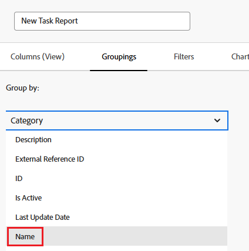

# 보고서에서 사용자 정의 양식 참조

해당 오브젝트에 대한 보고서의 보기, 필터 및 그룹화에서 오브젝트의 사용자 정의 양식을 참조할 수 있습니다.

보고서에 포함할 사용자 정의 양식의 콘텐츠를 참조하거나 보고서에 포함할 사용자 정의 양식 자체에 대한 정보를 참조할 수 있습니다.

## 액세스 요구 사항

이 문서의 단계를 수행하려면 다음 액세스 권한이 있어야 합니다.

<table style="table-layout:auto"> 
 <col> 
 <col> 
 <tbody> 
  <tr> 
   <td role="rowheader">Adobe Workfront 플랜*</td> 
   <td> 
임의
 </td> 
  </tr> 
  <tr> 
   <td role="rowheader">Adobe Workfront 라이센스*</td> 
   <td> 
플랜 
 </td> 
  </tr> 
  <tr> 
   <td role="rowheader">액세스 수준 구성*</td> 
   <td> 
보고서, 대시보드, 캘린더에 대한 액세스 편집
 
필터, 보기, 그룹화에 대한 액세스 편집
 
참고: 여전히 액세스 권한이 없는 경우 Workfront 관리자에게 액세스 수준에서 추가 제한을 설정하는지 문의하십시오. Workfront 관리자가 액세스 수준을 수정하는 방법에 대한 자세한 내용은 <a href="../../../administration-and-setup/add-users/configure-and-grant-access/create-modify-access-levels.md" class="MCXref xref">사용자 지정 액세스 수준 만들기 또는 수정</a>을 참조하십시오.
 </td> 
  </tr> 
  <tr> 
   <td role="rowheader">개체 권한</td> 
   <td> 
보고서에 대한 권한 관리
 
추가 액세스 요청에 대한 자세한 내용은 <a href="../../../workfront-basics/grant-and-request-access-to-objects/request-access.md" class="MCXref xref">개체 </a>에 대한 액세스 요청 을 참조하십시오.
 </td> 
  </tr> 
 </tbody> 
</table>

&#42;보유 중인 플랜, 라이선스 유형 또는 액세스 권한을 확인하려면 Workfront 관리자에게 문의하십시오.

## 전제 조건

보고서에서 사용자 정의 양식을 참조하려면 먼저 사용자 정의 양식이 있어야 합니다.

사용자 정의 양식 만들기에 대한 자세한 내용은 [사용자 정의 양식 만들기 또는 편집](../../../administration-and-setup/customize-workfront/create-manage-custom-forms/create-or-edit-a-custom-form.md)을 참조하십시오.

## 사용자 정의 양식의 콘텐츠 참조

사용자 정의 양식 내에서 필드를 참조할 수 있습니다. 사용자 정의 양식을 오브젝트에 적용하면 해당 사용자 정의 양식과 연결된 모든 필드를 오브젝트의 다른 필드와 마찬가지로 보고서에서 참조할 수 있습니다.

>[!NOTE]
>
>여러 옵션이 있는 필드의 경우, 숨겨진 옵션을 포함하여 보고서의 필터 및 프롬프트에서 모든 옵션을 사용할 수 있습니다.\
>여러 옵션이 있는 사용자 정의 필드에서 선택 항목을 숨기는 방법에 대한 자세한 내용은 문서 [사용자 정의 양식 만들기 또는 편집](../../../administration-and-setup/customize-workfront/create-manage-custom-forms/create-or-edit-a-custom-form.md)을 참조하십시오.

보고서를 만들 때 양식의 개체 유형을 필드 소스로 사용하고 사용자 정의 필드의 이름을 필드 이름으로 사용하면 됩니다.

예를 들어 사용자 정의 필드 **컨설턴트**&#x200B;를 포함하는 모든 프로젝트에 사용자 정의 양식이 적용되어 있을 수 있습니다. Olivia Kim이 컨설턴트인 모든 프로젝트를 나열하는 보고서를 만들려면 **프로젝트** 개체 유형을 필드 소스로 사용하고 **컨설턴트**&#x200B;를 필드 이름으로 사용합니다. 필터 한정자를 **Equal**(으)로 설정한 다음 Olivia Kim을 입력하십시오.

보고서 만들기에 대한 자세한 내용은 문서 [사용자 지정 보고서 만들기](../../../reports-and-dashboards/reports/creating-and-managing-reports/create-custom-report.md)를 참조하십시오.

## 사용자 정의 양식에 대한 참조 정보

개체와 연결된 사용자 정의 양식의 이름 등 사용자 정의 양식에 대한 정보를 참조할 수 있습니다.

요소&#x200B;(보기, 필터 또는 그룹화)에 따라 다음 중 하나를 참조할 수 있습니다.

* 오브젝트에 적용되는 기본 사용자 정의 양식:

  객체의 세부내용 페이지에 가장 먼저 나타나는 양식입니다.

* 모든 사용자 정의 양식(둘 이상의 사용자 정의 양식이 오브젝트에 적용된 경우)

보기, 필터 및 그룹화에서 사용자 정의 양식을 참조할 수 있습니다.

* [보고서 보기(열)에서 사용자 정의 양식을 참조](#reference-custom-forms-in-a-report-view-column)
* [보고서 필터에서 사용자 정의 양식 참조](#reference-custom-forms-in-a-report-filter)
* [보고서 그룹화에서 사용자 정의 양식 참조](#reference-custom-forms-in-a-report-grouping)

### 보고서 보기에서 사용자 정의 양식 참조(열) {#reference-custom-forms-in-a-report-view-column}

객체와 연관된 모든 사용자 정의 양식을 표시하려면 다음과 같이 하십시오.

1. [사용자 지정 보고서 만들기](../../../reports-and-dashboards/reports/creating-and-managing-reports/create-custom-report.md) 문서에 설명된 대로 보고서 만들기를 시작합니다.
1. **열** 탭에서 참조할 사용자 정의 양식이 적용되는 개체 유형을 확장한 다음 **범주 이름**&#x200B;을 클릭합니다.\
   예를 들어 작업과 연결된 모든 사용자 정의 양식을 표시하려면 **작업** 필드 원본을 확장한 다음 **범주 이름** 필드 이름을 클릭합니다.\
   

객체와 연관된 기본 사용자 정의 양식만 표시하려면 다음을 수행합니다.

1. [사용자 지정 보고서 만들기](../../../reports-and-dashboards/reports/creating-and-managing-reports/create-custom-report.md) 문서에 설명된 대로 보고서 만들기를 시작합니다.
1. **열** 탭에서 **Category** 필드 원본을 확장한 다음 **이름** 필드 이름을 클릭합니다.\
   

### 보고서 필터에서 사용자 정의 양식 참조 {#reference-custom-forms-in-a-report-filter}

객체 유형과 연관된 모든 사용자 정의 양식을 필터링하려면 다음을 수행합니다.

1. [사용자 지정 보고서 만들기](../../../reports-and-dashboards/reports/creating-and-managing-reports/create-custom-report.md) 문서에 설명된 대로 보고서 만들기를 시작합니다.
1. **필터** 탭에서 **범주**&#x200B;을 확장한 다음 **이름**&#x200B;을 클릭합니다.\
   

1. 사용할 조건 한정자를 선택합니다.

   * 비어 있음
   * 비어 있지 않음
   * 포함
   * 포함하지 않음
   * 같음
   * 다음과 같지 않음

   각 한정자에 대한 자세한 내용은 [필터 및 조건 수정자](../../../reports-and-dashboards/reports/reporting-elements/filter-condition-modifiers.md) 문서를 참조하십시오.

   >[!NOTE]
   >
   >필터링하려는 필드에 여러 옵션이 있고 **같지 않음** 또는 **포함하지 않음** 한정자를 사용하는 경우 이 한정자는 지정한 선택 사항만 포함하는 결과를 필터링합니다. 필드에 지정된 옵션을 포함한 추가 옵션이 포함되어 있으면 해당 결과가 보고서에서 필터링되지 않습니다. 여기에는 여러 사용자 지정 Forms이 동일한 오브젝트에 첨부된 경우 필터링이 포함됩니다.

1. 필터링할 사용자 정의 양식의 이름을 입력한 다음 드롭다운 목록에 표시될 때 이름을 클릭합니다.
1. (선택 사항) **다른 필터 규칙 추가**&#x200B;를 클릭한 다음 2-4단계를 반복하여 추가 필터 규칙을 만듭니다.
1. **저장+닫기**&#x200B;를 클릭합니다.

객체 유형과 연관된 기본 사용자 정의 양식에서만 필터링하려면

1. [사용자 지정 보고서 만들기](../../../reports-and-dashboards/reports/creating-and-managing-reports/create-custom-report.md) 문서에 설명된 대로 보고서 만들기를 시작합니다.
1. **필터** 탭에서 **Category** 필드 원본을 확장한 다음 **이름** 필드 이름을 클릭합니다.\
   

1. 사용할 조건 한정자를 선택합니다.

   * 비어 있음
   * 비어 있지 않음
   * 포함
   * 포함하지 않음
   * 같음
   * 다음과 같지 않음

   각 한정자에 대한 자세한 내용은 [필터 및 조건 수정자](../../../reports-and-dashboards/reports/reporting-elements/filter-condition-modifiers.md) 문서를 참조하십시오.

1. 필터링할 사용자 정의 양식의 이름을 입력한 다음 드롭다운 목록에 표시될 때 이름을 클릭합니다.
1. (선택 사항) **다른 필터 규칙 추가**&#x200B;를 클릭한 다음 2-4단계를 반복하여 추가 필터 규칙을 만듭니다.
1. **저장+닫기**&#x200B;를 클릭합니다.

### 보고서 그룹화에서 사용자 정의 양식 참조 {#reference-custom-forms-in-a-report-grouping}

>[!NOTE]
>
>항목과 연결된 기본 사용자 정의 양식으로만 항목을 그룹화할 수 있으며, 객체와 연결된 모든 양식으로는 항목을 그룹화할 수 없습니다.

1. [사용자 지정 보고서 만들기](../../../reports-and-dashboards/reports/creating-and-managing-reports/create-custom-report.md) 문서에 설명된 대로 보고서 만들기를 시작합니다.
1. **그룹화** 탭에서 **범주**&#x200B;을 확장한 다음 **이름**&#x200B;을 클릭합니다.\
   
