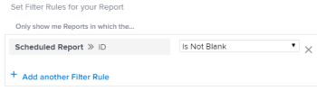

# 보고서 배달 개요

<!--

(NOTE: This is linked to the UI in the Send Report box inside the Preview sandbox. If you change title, log bug for Dev to fix the link) 

-->

보고서를 정의된 일정에 따라 사용자에게 자동으로 배달하도록 예약하거나 보고서를 한 번에 수동으로 전송할 수 있습니다. Adobe Workfront에서 보고서를 보내면 사용자는 별도의 첨부 파일로 Workfront 보고서가 포함된 이메일을 받게 됩니다.

배달할 보고서 설정에 대한 자세한 내용은 문서를 참조하십시오 [자동 보고서 배달 예약](../../../reports-and-dashboards/reports/creating-and-managing-reports/set-up-automatic-report-delivery.md).

보고서 배달을 예약하거나 미리 보기 샌드박스 환경에서 수동으로 제공할 수 없습니다. 미리 보기 샌드박스에 대한 자세한 내용은 문서를 참조하십시오 [Adobe Workfront 미리 보기 샌드박스 환경](../../../administration-and-setup/set-up-workfront/workfront-testing-environments/wf-preview-sandbox-environment.md).\
미리 보기 샌드박스 환경에서 보고서를 제공하는 방법에 대한 자세한 내용은 문서를 참조하십시오 [미리 보기 샌드박스 환경에서 보고서 보내기](../../../reports-and-dashboards/reports/creating-and-managing-reports/send-report-preview-sandbox-environment.md).

## 보고서 배달 제한

<!--

(NOTE: [! This information is shared between "Exporting Data" and "Setting Up Report Deliveries."])

-->

보고서 배달을 예약할 때 다음 사항을 고려하십시오.

* 주어진 보고서에 대해 최대 10개의 반복 보고서 배달을 예약할 수 있습니다.
* 보고서 작성자인 경우에만 보고서를 배달하도록 예약할 수 있습니다. 만들지 않은 보고서를 전송해야 하는 경우 수동으로 전송할 수 있습니다.

## 내보내기 제한

보고서가 Workfront에 표시되는 방식과 수동 내보내기, 배달된 보고서 또는 API를 통해 내보내는 방식에 영향을 주는 몇 가지 크기 제한이 있습니다.

* **5MB 파일 크기:** 배달하도록 예약된 내보낸 보고서의 파일 크기 제한. 전자 메일에 첨부된 내보낸 파일이 5MB보다 큰 경우 첨부된 내보낸 보고서 대신 파일을 다운로드할 수 있는 링크가 이메일로 전송됩니다. 

   >[!NOTE]
   >
   >5MB보다 큰 Excel .xlsx 파일은 이메일을 생성하지 않습니다. 보고서를 수동으로 이 형식으로 내보낼 수 있습니다. 보고서 내보내기에 대한 자세한 내용은 [데이터 내보내기](../../../reports-and-dashboards/reports/creating-and-managing-reports/export-data.md).

* **50,000개 행:** .pdf 및 탭으로 구분된 파일에 대해 보고서 내보내기에서 허용되는 데이터 행 수입니다.

   Excel.xls 파일의 경우 이 제한은 다음과 같습니다 **65,000개 행**.

   Excel .xlsx 파일의 경우 이 제한은 다음과 같습니다 **100,000개 행**.

   이러한 제한은 열 제목과 보고서 그룹의 행을 제외합니다. 예를 들어 보고서에 6개의 그룹화가 있고 50,000개의 행 또는 데이터가 있는 경우 내보낸 파일에 50,000개의 행이 있습니다.

   보고서에 이러한 제한보다 많은 항목이 있는 경우 보고서 내보내기 및 배달이 실패했다는 오류가 표시됩니다. 화면에 표시되는 항목 수를 이러한 제한보다 작거나 같은 수로 줄여 결과를 제공할 수 있습니다. 모든 데이터를 내보내려면 필터를 사용하여 더 작은 데이터 로드를 가져온 다음 여러 내보내기를 수행하는 것이 좋습니다. 자세한 내용은 [Adobe Workfront의 필터 개요](../../../reports-and-dashboards/reports/reporting-elements/filters-overview.md).

   이러한 제한은 다음과 같은 경우에 적용됩니다.

   * 보고서의 수동 내보내기.
   * 예약된 보고서입니다.
   * API 통합을 통한 내보내기. 
   * 킥시작을 통해 데이터를 내보냅니다.

      kick-starts를 통해 데이터를 내보내는 방법에 대한 자세한 내용은 문서를 참조하십시오 [킥스타트를 통해 Adobe Workfront에서 데이터 내보내기](../../../administration-and-setup/manage-workfront/using-kick-starts/export-data-from-wf-via-kick-starts.md).

      >[!NOTE]
      kick-start 파일로 50,000개의 행을 내보낼 수 있지만 Excel 형식 파일만 내보낼 수 있습니다. 

   * 프로젝트에 대한 활용률 정보 내보내기

      프로젝트에 대한 활용률 정보 내보내기에 대한 자세한 내용은 [자원 가동률 보고서 개요](../../../reports-and-dashboards/reports/using-built-in-reports/resource-utilization-report.md).

* **65,530개의 하이퍼링크:** 이는 65,530개 이상의 하이퍼링크가 포함된 문서에 대해 Excel에서 적용하는 제한입니다. 이러한 문서를 수동으로 내보내거나 전달된 보고서에서 전송할 때는 열 수 없습니다. Excel 문서에는 200개의 데이터 행만 있을 수 있지만 문서 내에 65,530개가 넘는 링크가 있는 경우 문서가 열리지 않습니다. 이 제한은 Excel 파일에만 있고, 지원되는 다른 형식에는 없습니다. 
* **256열**: 256개 이상의 열이 포함된 문서에 대해 Excel이 적용하는 제한입니다. 이러한 문서를 수동으로 내보내거나 전달된 보고서에서 전송할 수 없습니다. 이 제한은 Excel 파일에만 있고, 지원되는 다른 형식에는 없습니다. 

제한 이상으로 데이터를 내보내려고 하면 내보내기에서 예상 데이터를 모두 받지 못할 수 있습니다. 대신, 수정된 보고서가 제한 내에 생성됩니다. 

또한 실행하는 데 60분 이상 걸리는 보고서가 중지됩니다.

제한 사항에 대한 우려나 문제가 있는 경우 Workfront 기술 지원에 문의하십시오.

## 게재된 보고서의 타임스탬프 이해

<!--

(NOTE: Note about if this is delivered at a time based on the user's time zone settings?)

-->

보고서를 이메일로 받을 때 보고서 전송 시점과 동시에 Workfront에서 보고서를 보는 경우 보고서의 타임스탬프 및 시간 형식이 Workfront의 보고서와 일치하지 않을 수 있습니다. 

다음 사항을 고려하십시오. 

* 브라우저에서 보고서를 볼 때 보고서의 타임스탬프 및 형식은 브라우저의 설정에 정의된 대로 브라우저의 로케일 및 시간대와 일치합니다.
* 보고서가 이메일로 전달되면 Workfront 프로필에 지정된 사용자 로케일 및 시간대와 일치하는 타임스탬프 및 포맷으로 보고서가 전달됩니다.\
   Workfront의 사용자 로케일 및 시간대에 대한 자세한 내용은 문서를 참조하십시오 [사용자 프로필 편집](../../../administration-and-setup/add-users/create-and-manage-users/edit-a-users-profile.md).

## 특별한 보기가 있는 보고서 {#reports-with-a-special-view}

보고서에 특수 보기를 적용하면 Workfront에서 보고서의 세부 사항 탭에 특수 보기가 표시됩니다.

특수 보기가 있는 보고서 배달을 예약하면 기본 세부 사항 탭이 특수 보기 대신 보낸 전자 메일의 첨부 파일에 전달됩니다.

다음은 특수 보기로 간주됩니다.

* 프로젝트 보고서의 이정표 보기
* 프로젝트 또는 작업 보고서의 간트 보기
* 차트를 기본 탭으로 사용하는 보고서

>[!NOTE]
보고서에 특수 보기가 있는 기본 탭 외에도 보고서에 매트릭스 탭이 있으면 매트릭스 탭에 표시되는 대로 보고서가 전달됩니다.

보고서에 특수 보기를 적용하는 방법에 대한 자세한 내용은 문서를 참조하십시오 [사용자 지정 보고서 만들기](../../../reports-and-dashboards/reports/creating-and-managing-reports/create-custom-report.md).

## 배달된 파일 사용

 Workfront에서 보고서를 전송하면 사용자는 별도의 첨부 파일로 보고서가 포함된 이메일을 받게 됩니다. 

* [제목 줄, 첨부 파일 이름 및 보고서 제목](#subject-line-attachment-name-and-report-title)
* [타임스탬프](#timestamps)
* [브랜딩](#branding)
* [서식](#formatting)
* [링크](#links)

### 제목 줄, 첨부 파일 이름 및 보고서 제목 {#subject-line-attachment-name-and-report-title}

배달된 보고서 이메일의 제목란에 대한 자세한 내용은 [자동 보고서 배달 예약](../../../reports-and-dashboards/reports/creating-and-managing-reports/set-up-automatic-report-delivery.md).

첨부된 보고서의 이름은 다음과 같습니다. *The_Name_Of_The_Report*&#x200B;내보낸 파일 형식을 따릅니다. 

배달된 보고서 형식을 PDF 또는 HTML 파일로 지정하도록 예약한 경우 보고서의 제목은 다음과 같습니다.

*보고서 이름.*

Excel, Excel(.xlsx) 또는 TSV 형식으로 배달되도록 예약된 보고서에는 제목이 없습니다.

>[!NOTE]
보고서에 설명이 있는 경우 내보낸 파일에 파일 형식이 PDF 또는 HTML 파일로 지정된 경우 포함됩니다.

### 타임스탬프 {#timestamps}

파일 형식이 .pdf인 경우에만 첨부된 파일에 타임스탬프가 표시됩니다. 타임스탬프가 첨부된 파일의 바닥글에 있습니다.

타임스탬프는 다음과 같습니다.

* 일자
* 시간
* 보고서를 보낸 시간대

### 브랜딩 {#branding}

Workfront 관리자가 Workfront 인스턴스에 사용자 지정된 브랜딩을 추가한 경우 .pdf 형식으로 전송된 보고서에 개인화된 로고도 포함됩니다.

다른 모든 형식으로 전송된 보고서는 로고로 개인화할 수 없습니다.

Workfront 인스턴스 브랜딩에 대한 자세한 내용은 문서를 참조하십시오 [Adobe Workfront 인스턴스 브랜딩](../../../administration-and-setup/customize-workfront/brand-workfront/brand-your-workfront-instance.md).

### 서식 {#formatting}

보고서에 특별한 보기가 없는 한 보고서 전송 또는 배달 예약 시 보고서의 기본 탭을 항상 받습니다.

웹 응용 프로그램에서 보고서에 특수 서식이 있는 경우 .pdf 및 Excel 파일에 대해서만 세부 정보 및 매트릭스 탭이 전달되는 경우 보고서에 특수 서식이 지정되어 있어야 합니다.

보고서의 필터, 보기 또는 그룹화는 배달된 파일에 포함되지 않습니다. 보고서 설명은 보고서를 PDF 파일로 보낼 때만 포함됩니다.

특수 보기의 보고서 수집에 대한 자세한 내용은 문서를 참조하십시오 [특별한 보기가 있는 보고서](#reports-with-a-special-view).\
보고서의 기본 탭 선택 및 특수 서식에 대한 자세한 내용은 [사용자 지정 보고서 만들기](../../../reports-and-dashboards/reports/creating-and-managing-reports/create-custom-report.md).

### 링크 {#links}

보고서를 Workfront에서 PDF 또는 Excel 형식으로 보내면 원래 문서에 있는 모든 작업 링크는 전송된 파일에서 활성 상태로 유지됩니다. 링크는 연결을 지원하는 Workfront의 모든 개체를 가리킬 수 있습니다.

이메일 메시지에 포함된 보고서 이름도 링크입니다.

## 예약된 보고서에 대한 보고서

다음을 만들어 보고서를 전달하도록 구성했는지 여부를 확인할 수 있습니다.

* **보기** 목록의 보고서 객체 또는 보고서의 경우 보고서 목록이나 보고서 세트에 대한 보기를 만들고 다음 열을 보기에 추가합니다.\
   *예약된 보고서 이름.\
   *해당 보고서에 예약된 모든 게재의 이름은 글머리 기호 목록의 열에 나열됩니다.\
   

* **필터** 보고서 객체의 경우: 다음 문을 사용하여 보고서 목록이나 보고서에 필터를 생성합니다. *예약된 보고서 ID가 비어 있지 않습니다.*.\
   이 경우 목록이나 보고서에 예약된 보고서만 표시됩니다.\
   \
   보고서 만들기에 대한 자세한 내용은 [사용자 지정 보고서 만들기](../../../reports-and-dashboards/reports/creating-and-managing-reports/create-custom-report.md). 보고서에 대한 보고서 만들기에 대한 내용은 [보고 활동에 대한 보고서 만들기](../../../reports-and-dashboards/reports/report-usage/create-report-reporting-activities.md).

<!--
<h2 data-mc-conditions="QuicksilverOrClassic.Draft mode">Scheduling a Repeating&nbsp;Report Delivery</h2>
-->

<!--

You can schedule up to 10 repeating report deliveries for any given report.

-->

<!--

You can schedule a report to be delivered only if you are the creator of the report. If you need to send a report that you did not create, you can send it on a manual basis.

-->

<!--

To schedule&nbsp;a report for automatic delivery or to edit an existing report delivery:&nbsp;​

-->

<!--
   <li value="1" data-mc-conditions="QuicksilverOrClassic.Draft mode">Navigate to and click the name of the report for which you want to schedule delivery.&nbsp;</li>
   -->

<!--
   <li value="2" data-mc-conditions="QuicksilverOrClassic.Draft mode">Click <strong>Report Actions</strong>, then&nbsp;<strong>Send Report</strong>.  The <strong>Send Report</strong> dialog box is displayed.</li>
   -->

<!--
   <li value="3" data-mc-conditions="QuicksilverOrClassic.Draft mode">Select the <strong>Repeating Deliveries</strong>&nbsp;tab. </li>
   -->

<!--
   <li value="4" data-mc-conditions="QuicksilverOrClassic.Draft mode">(Conditional)&nbsp;To modify an existing repeating report delivery, select the report delivery in the <strong>Repeating Deliveries</strong>&nbsp;section.</li>
   -->

<!--
   <li value="5" data-mc-conditions="QuicksilverOrClassic.Draft mode">Specify the following information:
   <ul>
   <li data-mc-conditions="QuicksilverOrClassic.Draft mode"><strong>Send to:</strong> Begin typing the name of the user, group, team, or role who you want to send&nbsp;the report to, then click the name when it appears in the drop-down list. Or Specify the email address of a person external to the Workfront system who you want to have access to the report.  Repeat this process to send the report to multiple users, groups, teams, or roles.</li>
   <li data-mc-conditions="QuicksilverOrClassic.Draft mode"><strong>Email Subject:</strong> Specify a subject for the email notification.  By default, the email subject is: <em>Workfront Report: <Name of the report> Date of the Export</em>.<strong></strong></li>
   <li data-mc-conditions="QuicksilverOrClassic.Draft mode"><strong>Email Message:</strong> Specify a message to include in the email. By default, the email message is:&nbsp;<em>Attached is the <report frequency> report <Name of the report> generated by Workfront on <Date>.</em> 
   <note type="note">
   For reports delivered as an Excel file only, the following message is also added to the email: "Please be aware that with MS Excel (XLS) file types, there is a limit (65,530) on the number of hyperlinks these file types support. If you exceed those limits, your file will not open and it is recommended to resend without the hyperlinks.&nbsp;Please go back to the report scheduler&nbsp;to remove hyperlinks and resend the report." The "please go back to the report scheduler" phrase is a link back to the report.&nbsp;
   </note>
   </li>
   <li data-mc-conditions="QuicksilverOrClassic.Draft mode"><strong>Deliver this report with the Access Rights of:</strong>&nbsp;Begin typing the name of a user who has access to the report, then click the name when it appears&nbsp;in the drop-down list. Users who receive the report will be granted the same level of access to the report as the user that you specify&nbsp;here.  For more information, see <a href="../../../reports-and-dashboards/reports/creating-and-managing-reports/run-deliver-report-access-rights-another-user.md" class="MCXref xref">Run and deliver a report with the access rights of another user</a>
   <note type="note">
   This field does not support wildcards. For example, using the wildcard $$User.ID does not run the report with the access rights of the user who is receiving the report.
   </note>
   </li>
   <li data-mc-conditions="QuicksilverOrClassic.Draft mode"><strong>Format:</strong> Select in which of the following formats you want the report to be delivered:
   <ul>
   <li data-mc-conditions="QuicksilverOrClassic.Draft mode"> HTML</li>
   <li data-mc-conditions="QuicksilverOrClassic.Draft mode">PDF</li>
   <li data-mc-conditions="QuicksilverOrClassic.Draft mode">MS&nbsp;Excel</li>
   <li data-mc-conditions="QuicksilverOrClassic.Draft mode">MS Excel (.xlsx)</li>
   <li data-mc-conditions="QuicksilverOrClassic.Draft mode">TSV &nbsp;</li>
   </ul></li>
   <li data-mc-conditions="QuicksilverOrClassic.Draft mode"><strong>Include Links:</strong>&nbsp;This option is available&nbsp;only when <strong>MS Excel</strong> is selected in the <strong>Format</strong> drop-down menu. When this option is enabled, any hyperlinks are included in the exported Excel document.  Documents that contain more than 65,530 links cannot be opened. If the exported document will contain more than 65,530 links, deselect this option. This option is enabled by default.&nbsp;</li>
   <li data-mc-conditions="QuicksilverOrClassic.Draft mode"><strong>Summary:</strong> Displays a summary of when the delivery repeats.</li>
   <li data-mc-conditions="QuicksilverOrClassic.Draft mode"><strong>Repeats:</strong> Select whether the report should be delivered daily, weekly, monthly, or yearly.</li>
   <li data-mc-conditions="QuicksilverOrClassic.Draft mode"><strong>Repeats Every:</strong> Select the frequency with which you want&nbsp;the delivery to repeat. The value you select for this option is&nbsp;based on the option that is selected in the <strong>Repeats</strong>&nbsp;drop-down list.</li>
   <li data-mc-conditions="QuicksilverOrClassic.Draft mode"><strong>Time:</strong> Select the time of day for the delivery to be sent.</li>
   
<strong>Repeats On:</strong>&nbsp;This option is available when the <strong>Repeats</strong>&nbsp;option is set to either <strong>Weekly</strong>&nbsp;or <strong>Monthly</strong>.

   <li data-mc-conditions="QuicksilverOrClassic.Draft mode">When the <strong>Repeats</strong>&nbsp;option is set to <strong>Weekly</strong>: Select the days of the week that the delivery is sent.</li>
   <li data-mc-conditions="QuicksilverOrClassic.Draft mode">When the <strong>Repeats</strong>&nbsp;option is set to <strong>Monthly</strong>: Select whether the delivery is sent on the day of the month, day of the week, or last day of the month (these options leverage the date that you select in the <strong>Starts On</strong>&nbsp;field).</li>
   <li data-mc-conditions="QuicksilverOrClassic.Draft mode"><strong>Starts On:</strong> Select the date for the scheduled delivery to begin.</li>
   <li data-mc-conditions="QuicksilverOrClassic.Draft mode"><strong>Ends On:</strong> Select a date for the scheduled delivery to end.  Or</li>
   <li data-mc-conditions="QuicksilverOrClassic.Draft mode">Select <strong>Never</strong>&nbsp;if you want the scheduled delivery to last indefinitely.</li>
   -->

<!--
   <li value="6" data-mc-conditions="QuicksilverOrClassic.Draft mode">Click <strong>Save</strong>&nbsp;to save the report delivery.  The report is saved in the <strong>Repeating Deliveries</strong>&nbsp;section&nbsp;(in the <strong>Send Report</strong> dialog box).  The report will be sent at the schedule time Or To manually send the report, click <strong>Send Now</strong>. For more information about sending the report instantly or manually, see&nbsp;.</li>
   -->

<!--
<h2 data-mc-conditions="QuicksilverOrClassic.Draft mode">Deleting a Scheduled Report Delivery</h2>
-->

<!--
   <li value="1" data-mc-conditions="QuicksilverOrClassic.Draft mode">Go to the report with the delivery you want to delete.</li>
   -->

<!--
   <li value="2" data-mc-conditions="QuicksilverOrClassic.Draft mode">Click <strong>Report Actions</strong>, then <strong>Send Report</strong>.&nbsp;</li>
   -->

<!--
   <li value="3" data-mc-conditions="QuicksilverOrClassic.Draft mode">Click <strong>Repeating Deliveries</strong>.&nbsp;</li>
   -->

<!--
   <li value="4" data-mc-conditions="QuicksilverOrClassic.Draft mode">Click the name of the scheduled delivery you want to delete, then click <strong>Delete</strong>. The report is no longer set up for the scheduled delivery.&nbsp;</li>
   -->

<!--
<h2 data-mc-conditions="QuicksilverOrClassic.Draft mode">Sending a Report Manually, on a One-Time Basis</h2>
-->

<!--

You can manually send a report&nbsp;that has been previously scheduled, or you can create a single-use report delivery.​

-->

<!--
  <li data-mc-conditions="QuicksilverOrClassic.Draft mode"><a title="Setting Up Report Deliveries" href="#sending-a-scheduled-report-now" class="MCXref xref">Sending a Scheduled Report Now</a> </li>
  -->

<!--
  <li data-mc-conditions="QuicksilverOrClassic.Draft mode"><a title="Setting Up Report Deliveries" href="#sending-a-report-one-time-only" class="MCXref xref">Sending a Report (One Time Only)</a> </li>
  -->

<!--
<h3 data-mc-conditions="QuicksilverOrClassic.Draft mode" id="sending-a-scheduled-report-now">Sending a Scheduled Report Now</h3>
-->

<!--

After a scheduled report has been set up, you can manually send the report rather than&nbsp;waiting until the scheduled time.

-->

<!--
   <li value="1" data-mc-conditions="QuicksilverOrClassic.Draft mode">Navigate to and click the name of the report that you want to send now.</li>
   -->

<!--
   <li value="2" data-mc-conditions="QuicksilverOrClassic.Draft mode">Click <strong>Report Actions</strong>, then&nbsp;<strong>Send Report</strong>.  The Send Report dialog box is displayed.</li>
   -->

<!--
   <li value="3" data-mc-conditions="QuicksilverOrClassic.Draft mode">Click the <strong>Repeating Deliveries</strong> tab.</li>
   -->

<!--
   <li value="4" data-mc-conditions="QuicksilverOrClassic.Draft mode">In the <strong>Repeating Deliveries</strong>&nbsp;section, select the report delivery that was previously created. </li>
   -->

<!--
   <li value="5" data-mc-conditions="QuicksilverOrClassic.Draft mode">Click <strong>Send Now</strong>.  The report is sent to all users identified in the scheduled delivery.</li>
   -->

<!--
<h3 data-mc-conditions="QuicksilverOrClassic.Draft mode" id="sending-a-report-one-time-only">Sending a Report (One Time Only)</h3>
-->

<!--

You can manually send a report at any time. When you send a report in this way, delivery information (such as&nbsp;the users you are sending to and&nbsp;the email subject) are not saved. If you want to create a report delivery that you can save for later use, create a repeating scheduled report.&nbsp;

-->

<!--

To send a report to users (one time only):

-->

<!--
   <li value="1" data-mc-conditions="QuicksilverOrClassic.Draft mode">Navigate to and click the name of the report that you want to send now.</li>
   -->

<!--
   <li value="2" data-mc-conditions="QuicksilverOrClassic.Draft mode">Click <strong>Report Actions</strong>, then&nbsp;<strong>Send Report</strong>.  The <strong>Send Report</strong> dialog box is displayed. </li>
   -->

<!--
   <li value="3" data-mc-conditions="QuicksilverOrClassic.Draft mode">On the <strong>Send Now</strong>&nbsp;tab, specify the following information:
   <ul>
   <li data-mc-conditions="QuicksilverOrClassic.Draft mode"><strong>Send to:</strong> Begin typing the name of the user, group, team, or role who you want to send&nbsp;the report to, then click the name when it appears in the drop-down list.&nbsp;Or, specify the email address of a person external to the Workfront system who you want to have access to the report.  Repeat this process to send the report to multiple users, groups, teams, or roles.</li>
   <li data-mc-conditions="QuicksilverOrClassic.Draft mode"><strong>Email Subject:</strong> Specify a subject for the email notification.  By default, the email subject is: <em>Workfront Report: <Name of the report> Date of the Export</em>.</li>
   <li data-mc-conditions="QuicksilverOrClassic.Draft mode"><strong>Email Message:</strong> Specify a message to include in the email. By default, the email message is:&nbsp;<em>Attached is the <report frequency> report <Name of the report> generated by Workfront on <Date>.</em> 
   <note type="note">
   For reports delivered as an Excel file only, the following message is also added to the email: "Please be aware that with MS Excel (XLS) file types, there is a limit (65,530) on the number of hyperlinks these file types support. If you exceed those limits, your file will not open and it is recommended to resend without the hyperlinks.&nbsp;Please go back to the report scheduler&nbsp;to remove hyperlinks and resend the report." The "please go back to the report scheduler" phrase is a link back to the report.&nbsp;
   </note>
   </li>
   <li data-mc-conditions="QuicksilverOrClassic.Draft mode"><strong>Deliver this report with the Access Rights of:</strong>&nbsp;Begin typing the name of a user who has access to the report, then click the name when it appears&nbsp;in the drop-down list. Users who receive the report will be granted the same level of access to the report as the user that you specify&nbsp;here.  For more information, see <a href="../../../reports-and-dashboards/reports/creating-and-managing-reports/run-deliver-report-access-rights-another-user.md" class="MCXref xref">Run and deliver a report with the access rights of another user</a>.
   <note type="note">
   This field does not support wildcards. For example, using the wildcard $$User.ID does not run the report with the access rights of the user who is receiving the report.
   </note>
   </li>
   <li data-mc-conditions="QuicksilverOrClassic.Draft mode"><strong>Format:</strong> Select in which of the following formats you want the report to be delivered:
   <ul>
   <li data-mc-conditions="QuicksilverOrClassic.Draft mode"> HTML</li>
   <li data-mc-conditions="QuicksilverOrClassic.Draft mode">PDF</li>
   <li data-mc-conditions="QuicksilverOrClassic.Draft mode">MS Excel</li>
   <li data-mc-conditions="QuicksilverOrClassic.Draft mode">MS&nbsp;Excel (.xlsx)</li>
   <li data-mc-conditions="QuicksilverOrClassic.Draft mode">TSV</li>
   </ul></li>
   <li data-mc-conditions="QuicksilverOrClassic.Draft mode"><strong>Include Links:</strong>&nbsp;This option is available&nbsp;only when <strong>MS Excel</strong> is selected in the <strong>Format</strong> drop-down menu. When this option is enabled, any hyperlinks are included in the exported Excel document.  Documents that contain more than 65,000 links cannot be opened. If the exported document will contain more than 65,000 links, deselect this option. This option is enabled by default.</li>
   </ul></li>
   -->

<!--
   <li value="4" data-mc-conditions="QuicksilverOrClassic.Draft mode">Click <strong>Send Now</strong>.  The report is sent to all users that you identified.  Or  Click <strong>Make Repeating Delivery</strong>&nbsp;if you want to set up&nbsp;a scheduled delivery with this same information, then complete the additional information regarding the frequency of when the report is sent.</li>
   -->
