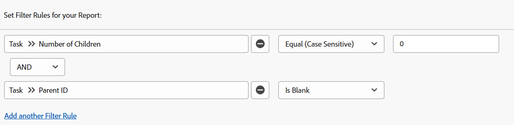

# 필터: 상위 작업 표시

<!--Audited: 10/2024-->

아래 작업 필터를 적용하여 작업 작업을 표시할 수 있습니다. 작업 작업은 독립적으로 작업할 수 있는 작업이며 다른 작업의 상위 작업이 아닙니다. 한 예에서 필터는 상위 자신일 수 있는 하위 작업을 식별합니다. 이 경우 작업이 아닙니다.

>[!TIP]
>
>* 보고서에 필터를 두 개 이상 추가하는 것이 좋다면 Report Builder 인터페이스를 사용하여 모든 필터를 추가하고, 다른 필터 규칙이 모두 추가된 후 텍스트 모드로 전환을 클릭하는 것이 좋습니다. 그런 다음 위에 언급된 대로 상위 작업 필터에 대한 코드를 추가할 수 있습니다. 
>* 또한 보고서를 읽기 쉽게 하려면 프로젝트 이름에 대한 그룹화를 추가하는 것이 좋습니다. 보고서에 그룹화를 추가하는 방법에 대한 자세한 내용은 문서 [Adobe Workfront의 그룹화 개요](../../../reports-and-dashboards/reports/reporting-elements/groupings-overview.md)를 참조하십시오.
>

## 액세스 요구 사항

+++ 을 확장하여 이 문서의 기능에 대한 액세스 요구 사항을 봅니다.

이 문서의 단계를 수행하려면 다음 액세스 권한이 있어야 합니다.

<table style="table-layout:auto"> 
 <col> 
 <col> 
 <tbody> 
  <tr> 
   <td role="rowheader">Adobe Workfront 플랜</td> 
   <td> <p>임의</p> </td> 
  </tr> 
  <tr> 
   <td role="rowheader">Adobe Workfront 라이센스*</td> 
   <td> 
    <p>신규:</p>
   <ul><li><p>필터를 수정하는 기여자 </p></li>
   <li><p>보고서를 수정하는 표준</p></li> </ul>

<p>현재:</p>
   <ul><li><p>필터 수정 요청 </p></li>
   <li><p>보고서 수정 계획</p></li> </ul></td> 
  </tr> 
  <tr> 
   <td role="rowheader">액세스 수준 구성</td> 
   <td> <p>보고서, 대시보드, 캘린더에 대한 액세스 권한을 편집하여 보고서 수정</p> <p>필터, 보기, 그룹화에 대한 액세스 권한을 편집하여 필터 수정</p> </td> 
  </tr> 
  <tr> 
   <td role="rowheader">개체 권한</td> 
   <td> <p>보고서에 대한 권한 관리</p>  </td> 
  </tr> 
 </tbody> 
</table>

*자세한 내용은 [Workfront 설명서의 액세스 요구 사항](/help/quicksilver/administration-and-setup/add-users/access-levels-and-object-permissions/access-level-requirements-in-documentation.md)을 참조하십시오.

+++

## 하위 항목이 없는 작업 표시(상위 항목이 있을 수 있음)

다음 필터를 작업 보고서에 적용하여 하위 항목이 없는 작업을 표시할 수 있습니다. 그들은 그들 자신의 부모를 가질 수 있고 다른 과제의 자식이 될 수 있다.

1. 오른쪽 상단의 **주 메뉴**  또는 왼쪽 상단의 **주 메뉴** 에서 사용 가능한 경우 **보고서**&#x200B;를 클릭하십시오.

1. **새 보고서**&#x200B;를 클릭합니다.
1. **작업 보고서**&#x200B;를 선택하십시오.
1. **필터**&#x200B;를 클릭합니다.
1. **필터 규칙 추가**&#x200B;를 클릭합니다.
1. **필드 이름 입력 시작...** 줄에서 **하위 항목 수**&#x200B;를 입력한 다음 목록에 표시되면 **작업 >> 하위 항목 수**&#x200B;를 클릭합니다.

1. 수정자에 대해 **같음(대/소문자 구분)**&#x200B;을 선택한 다음, 하위 항목 수에 대해 **0**&#x200B;을(를) 입력하십시오.\
   

   또는

   **텍스트 모드로 전환**&#x200B;을 클릭하고 텍스트 편집 창에서 다음 텍스트를 복사하여 붙여 넣습니다.

   ```
   numberOfChildren=0
   numberOfChildren_Mod=eq
   ```


1. **저장 및 닫기**&#x200B;를 클릭합니다.

   이렇게 하면 시스템에서 작업 중인 모든 작업에 대한 보고서를 가져옵니다. 이러한 작업 중 일부는 상위 항목을 가질 수 있지만 상위 작업 자체는 아닙니다.

## 부모와 함께 작업 표시(자녀가 있을 수 있음)

작업 보고서에 다음 필터를 적용하여 상위 작업(하위 작업)을 표시할 수 있습니다. 단, 이러한 작업은 필터가 하위 항목을 제외하지 않으므로 하위 항목도 가질 수 있습니다. 다른 작업의 부모가 되는 하위 작업은 작업 작업으로 간주되지 않습니다.

1. 오른쪽 상단의 **주 메뉴**  또는 왼쪽 상단의 **주 메뉴** 에서 사용 가능한 경우 **보고서**&#x200B;를 클릭하십시오.

1. **새 보고서**&#x200B;를 클릭합니다.
1. **작업 보고서**&#x200B;를 선택하십시오.
1. **필터**&#x200B;를 클릭합니다.
1. **필터 규칙 추가**&#x200B;를 클릭합니다.
1. **필드 이름 입력 시작...** 줄에서 **상위 ID**&#x200B;을(를) 입력한 다음 목록에 표시될 때 **작업 >> 상위 ID**&#x200B;을(를) 선택합니다.
1. 한정자에 대해 **Is Not Blank**&#x200B;을(를) 선택하십시오.

   

   또는

   **텍스트 모드로 전환**&#x200B;을 클릭하고 텍스트 편집 창에서 다음 텍스트를 복사하여 붙여 넣습니다. 

   `parentID_Mod=notblank`

1. **저장 및 닫기**&#x200B;를 클릭합니다.

   이렇게 하면 상위가 있고 해당 상위의 하위 작업이 있는 시스템의 모든 작업에 대한 보고서를 가져옵니다. 이러한 작업 중 일부는 상위 자체가 될 수 있습니다.

## 하위 항목과 상위 항목이 없는 작업 표시(독립 실행형 작업)

다음 필터를 작업 보고서에 적용하여 독립형 작업 작업을 표시할 수 있습니다. 이러한 작업에는 상위가 없으며 자신의 하위 항목도 없습니다.

1. 오른쪽 상단의 **주 메뉴**  또는 왼쪽 상단의 **주 메뉴** 에서 사용 가능한 경우 **보고서**&#x200B;를 클릭하십시오.

1. **새 보고서**&#x200B;를 클릭합니다.
1. **작업 보고서**&#x200B;를 선택하십시오.
1. **필터**&#x200B;를 클릭합니다.
1. **필터 규칙 추가**&#x200B;를 클릭합니다.
1. **필드 이름 입력 시작...** 줄에서 **하위 항목 수**&#x200B;를 입력한 다음 목록에서 **작업 >> 하위 항목 수**&#x200B;를 선택합니다.
1. 수정자에 대해 **같음(대/소문자 구분)**&#x200B;을 선택한 다음, 하위 항목 수에 대해 **0**&#x200B;을(를) 입력하십시오.
1. **다른 필터 규칙 추가**&#x200B;를 클릭합니다.
1. **필드 이름 입력 시작...** 줄에서 **상위 ID**&#x200B;을(를) 입력한 다음 목록에서 **작업 >> 상위 ID**&#x200B;을(를) 선택합니다.
1. 한정자에 대해 **Is Blank**&#x200B;를 선택합니다.

   

   또는

   6~10단계 <!--ensure steps above stay accurate--> 대신 **텍스트 모드로 전환**&#x200B;을 클릭하고 텍스트 편집 창에서 다음 텍스트를 복사하여 붙여 넣습니다.

   ```
   numberOfChildren=0
   numberOfChildren_Mod=eq
   parentID_Mod=isblank
   ```

1. **저장 및 닫기**&#x200B;를 클릭합니다.

   이렇게 하면 상위 항목이나 하위 항목이 없는 시스템의 모든 작업에 대한 보고서를 가져옵니다. 독립 실행형 작업 작업입니다.
