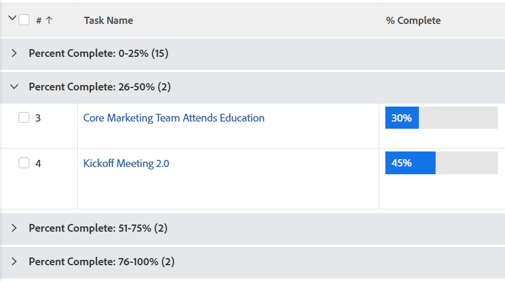

# Grouping: organize list results by a calculated value common to all objects in the grouping

<!--Audited: 10/2024-->

You might want to view your tasks grouped by Percent Complete in ranges of 0-25, 26-50, 51-75, 75-99, and 100. You can create a grouping using text mode to do this.



## 액세스 요구 사항

+++ 이 문서의 기능에 대한 액세스 요구 사항을 보려면 확장하십시오. 

<table style="table-layout:auto"> 
 <col> 
 <col> 
 <tbody> 
  <tr> 
   <td role="rowheader">Adobe Workfront 패키지</td> 
   <td> <p>Any</p> </td> 
  </tr> 
  <tr> 
   <td role="rowheader">Adobe Workfront 라이센스</td> 
   <td> 
   <p>참여자 또는 필터 수정 요청 </p>
   <p>표준 또는 계획: 보고서 수정</p>
  </tr> 
  <tr> 
   <td role="rowheader">액세스 수준 구성</td> 
   <td> <p>보고서, 대시보드, 달력에 대한 액세스 권한을 편집하여 보고서 수정</p> <p>필터, 보기, 그룹화에 대한 액세스를 편집하여 필터 수정</p> </td> 
  </tr> 
  <tr> 
   <td role="rowheader">개체 권한</td> 
   <td> <p>보고서에 대한 권한 관리</p>  </td> 
  </tr> 
 </tbody> 
</table>

이 표에 있는 정보에 대한 자세한 내용은 [Workfront 설명서의 액세스 요구 사항](/help/quicksilver/administration-and-setup/add-users/access-levels-and-object-permissions/access-level-requirements-in-documentation.md)을 참조하십시오.

+++

## Organize list results by a calculated value common to all objects in the grouping

To apply this grouping to a list of tasks:

1. 작업 목록으로 이동합니다.
1. From the **Grouping** drop-down menu, select **New Grouping**.

1. Click **Switch to Text Mode**.
1. In the available space, add the following code:

   ```
   textmode=true
   group.0.valueexpression=IF({percentComplete}>=0&&{percentComplete}<=25,'0-25%',IF({percentComplete}>25&&{percentComplete}<=50,'26-50%',IF({percentComplete}>50&&{percentComplete}<=75,'51-75%',IF({percentComplete}>75&&{percentComplete}<=100,'76-100%',''))))
   group.0.linkedname=direct
   group.0.valueformat=doubleAsString
   group.0.namekey=percentComplete
   ```

1. Click **Done**, then **Save Grouping**.
1. (Optional) Update the grouping name, then click **Save Grouping**.
