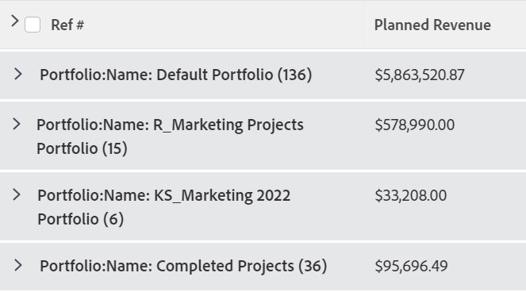

# 그룹화: 그룹화에서 표시 이름 편집

그룹화의 이름을 사용자에게 보다 친숙한 이름으로 바꿀 수 있습니다.

예를 들어 표준 Portfolio 이름 그룹화를 프로젝트 목록에 적용할 때 그룹화의 이름은 다음과 같이 표시됩니다. *Portfolio: 이름:`<name of portfolio>`*.



텍스트 모드를 사용하여 이 그룹화를 수정하여 읽기 쉬운 이름을 표시할 수 있습니다.


## 액세스 요구 사항

이 문서의 단계를 수행하려면 다음 액세스 권한이 있어야 합니다.

<table style="table-layout:auto"> 
 <col> 
 <col> 
 <tbody> 
  <tr> 
   <td role="rowheader">Adobe Workfront 플랜*</td> 
   <td> <p>모든</p> </td> 
  </tr> 
  <tr> 
   <td role="rowheader">Adobe Workfront 라이센스*</td> 
   <td> <p>그룹화 수정 요청 </p>
   <p>보고서 수정 계획</p> </td> 
  </tr> 
  <tr> 
   <td role="rowheader">액세스 수준 구성*</td> 
   <td> <p>보고서, 대시보드, 캘린더에 대한 액세스 권한을 편집하여 보고서 수정</p> <p>필터, 보기, 그룹화에 대한 액세스 권한을 편집하여 그룹화 수정</p> <p><b>메모</b>

여전히 액세스 권한이 없는 경우 Workfront 관리자에게 액세스 수준에 추가 제한을 설정하는지 문의하십시오. Workfront 관리자가 액세스 수준을 수정하는 방법에 대한 자세한 내용은 <a href="../../../administration-and-setup/add-users/configure-and-grant-access/create-modify-access-levels.md" class="MCXref xref">사용자 정의 액세스 수준 만들기 또는 수정</a>.</p> </td>
</tr>  
  <tr> 
   <td role="rowheader">개체 권한</td> 
   <td> <p>보고서에 대한 권한 관리</p> <p>추가 액세스 요청에 대한 자세한 내용은 <a href="../../../workfront-basics/grant-and-request-access-to-objects/request-access.md" class="MCXref xref">오브젝트에 대한 액세스 요청 </a>.</p> </td> 
  </tr> 
 </tbody> 
</table>

&#42;보유 중인 플랜, 라이선스 유형 또는 액세스 권한을 확인하려면 Workfront 관리자에게 문의하십시오.

## 그룹화에서 표시 이름 편집

프로젝트 그룹화에서 표시 이름을 변경하려면 다음과 같이 하십시오.

1. 프로젝트 목록으로 이동합니다.
1. 다음에서 **그룹화**&#x200B;드롭다운 메뉴에서 다음을 선택합니다. **새 그룹화**.

1. 클릭 **그룹화 추가**&#x200B;을(를) 클릭하고 다음에 &quot;Portfolio 이름&quot;을(를) 입력하십시오. **첫 번째 작성자:** 필드를 선택한 다음 목록에 표시될 때 선택합니다.

1. 클릭 **텍스트 모드로 전환**.
1. 다음 중 하나를 수행합니다.

   * 에서 사용할 수 있는 기존 텍스트에 다음 코드를 추가합니다 **보고서 그룹화** 상자:

      ```
      group.0.displayname=Your
      ```

      ```
      Value
      ```

      또는 이 경우:

      ```
      group.0.displayname=Portfolio
      ```

   * 그룹화의 텍스트 모드 인터페이스에서 단어 &quot;name&quot;이 포함된 모든 줄을 제거한 다음 줄을 추가합니다.

      ```
      group.0.name=Your Value
      ```

      또는 이 경우:

      ```
      group.0.name=Portfolio
      ```

      다음을 떠날 수도 있습니다.

      ```
      group.0.name
      ```

      빈 줄. 이 경우 그룹화에는 그룹화할 값의 이름이 표시됩니다.

      

1. 클릭 **완료**, 그런 다음 **그룹화 저장**.
