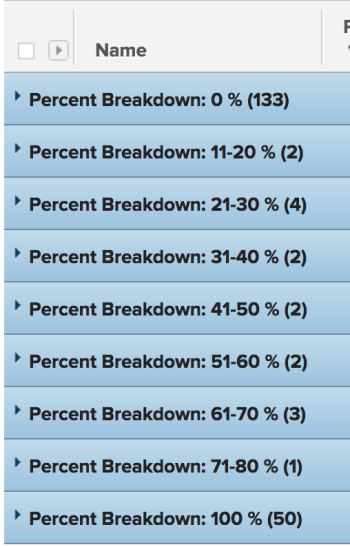

# 그룹화: 작업 퍼센트 분류 2

이 사용자 지정 작업 그룹화에서는 완료율 값 범위별로 그룹화된 작업을 표시할 수 있습니다. 분류는 10% 포인트 증가의 완료율을 보여줍니다. 1~10%, 11~20% 등

다음 그룹화는 완료율 값을 기준으로 프로젝트를 다음 그룹 중 하나로 구성합니다.

* 0%
* 1 - 10%
* 11-20%
* 21-30%
* 31-40%
* 41-50%
* 51-60%
* 61-70%
* 71-80%
* 81-90%
* 91-99%
* 100%

## 액세스 요구 사항

이 문서의 절차를 수행하려면 다음 액세스 권한이 있어야 합니다.

<table style="table-layout:auto"> 
 <col> 
 <col> 
 <tbody> 
  <tr> 
   <td role="rowheader">Adobe Workfront 플랜*</td> 
   <td> 
모든
 </td> 
  </tr> 
  <tr> 
   <td role="rowheader">Adobe Workfront 라이선스*</td> 
   <td> 
플랜 
 </td> 
  </tr> 
  <tr> 
   <td role="rowheader">액세스 수준 구성*</td> 
   <td> 
보고서, 대시보드, 달력에 대한 액세스 편집
 
필터, 보기, 그룹화에 대한 액세스 편집
 
참고: 여전히 액세스 권한이 없는 경우 Workfront 관리자에게 액세스 수준에서 추가 제한 사항을 설정하는지 문의하십시오. Workfront 관리자가 액세스 수준을 수정하는 방법에 대한 자세한 내용은 <a href="../../../administration-and-setup/add-users/configure-and-grant-access/create-modify-access-levels.md" class="MCXref xref">사용자 정의 액세스 수준 만들기 또는 수정</a>.
 </td> 
  </tr> 
  <tr> 
   <td role="rowheader">개체 권한</td> 
   <td> 
보고서에 대한 권한 관리
 
추가 액세스 요청에 대한 자세한 내용은 <a href="../../../workfront-basics/grant-and-request-access-to-objects/request-access.md" class="MCXref xref">개체에 대한 액세스 요청 </a>.
 </td> 
  </tr> 
 </tbody> 
</table>

&#42;어떤 계획, 라이선스 유형 또는 액세스 권한을 보유하고 있는지 알아보려면 Workfront 관리자에게 문의하십시오.

## 작업 백분율 분류별로 그룹화

이 그룹을 적용하려면

1. 작업 목록으로 이동합니다.
1. 에서 **그룹화** 드롭다운 메뉴에서 **새 그룹화**.

1. 클릭 **텍스트 모드로 전환**.
1. 에서 텍스트 제거 **보고서 그룹화** 영역.
1. 텍스트를 다음 코드로 바꿉니다.

   <pre>group.0.linkedname=direct group.0.name=백분율 분류 group.0.notime=false group.0.valueexpression=IF({percentComplete}=0,"0%",IF({percentComplete}&lt;=11,"1-10%",IF({percentComplete}&lt;=21,"11-20%",IF({percentComplete}&lt;=31,"21-30%",IF({percentComplete}&lt;41},"31-40%",IF(&lt;1441%&gt;%&gt;%",","%) - 50%",IF({percentComplete}&lt;61,"51-60%",IF({percentComplete}&lt;71,"61-70%",IF({percentComplete}&lt;81,"71-80%",IF({percentComplete}&lt;91,"81-90%",IF({1000),"91-90%"), %"))))))))))))))))))))))))))))))))))))) ())))))))))))))))))))))) ()))))))))))))))))))))))))))))))) ()))))))))))) ()))))))))))))))))))) ())))))))))))))))))))))))))))))))))))))))))))))))))))))))))))))))))))))) ())))))))))))))))))) ())))))))))))))))))))))))))))) ( textmode=true</pre>

1. 클릭 **그룹화 저장**.
