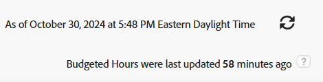

# 보고서: 예산 시간

<!--Audited: 10/2024-->

<!--

(NOTE: From&nbsp;Alina: This is my article, but since it's about building a report, it is in the Reporting section. Please don't remove it -it's linked to Resource Management and it is super important.) 

-->

리소스 플래너에 대한 액세스 권한이 없는 다른 사용자와 예산 시간 정보를 공유하려면 예산 시간 보고서를 작성하여 공유할 수 있습니다. 그런 다음 보고서를 해당 사용자와 공유할 수 있습니다.

>[!IMPORTANT]
>
>예산 시간은 일반적으로 Adobe Workfront 데이터베이스에서 매시간마다 업데이트됩니다(드물게 최대 3시간이 소요될 수 있습니다). 보고서를 새로 고쳐도 해당 보고서 내의 시간 정보가 새로 고쳐지지 않습니다. 모든 예산 시간 보고서의 오른쪽 상단 모서리에서 마지막 업데이트 이후 경과한 시간을 볼 수 있습니다. 보고서를 새로 고치면 마지막 업데이트 후 1시간 이상 경과한 경우에만 보고서 내의 정보가 새로 고침됩니다.
>
>

## 액세스 요구 사항

+++ 을 확장하여 이 문서의 기능에 대한 액세스 요구 사항을 봅니다.

이 문서의 단계를 수행하려면 다음 액세스 권한이 있어야 합니다.

<table style="table-layout:auto"> 
 <col> 
 <col> 
 <tbody> 
  <tr> 
   <td role="rowheader">Adobe Workfront 플랜</td> 
   <td> 
임의
 </td> 
  </tr> 
  <tr> 
   <td role="rowheader">Adobe Workfront 라이센스*</td> 
   <td> 
    
신규:

   <ul><li>
필터를 수정하는 기여자 
</li>
   <li>
보고서를 수정하는 표준
</li> </ul>

현재:

   <ul><li>
필터 수정 요청 
</li>
   <li>
보고서 수정 계획
</li> </ul></td> 
  </tr> 
  <tr> 
   <td role="rowheader">액세스 수준 구성</td> 
   <td> 
보고서, 대시보드, 캘린더에 대한 액세스 권한을 편집하여 보고서 수정
 
필터, 보기, 그룹화에 대한 액세스 권한을 편집하여 필터 수정
 </td> 
  </tr> 
  <tr> 
   <td role="rowheader">개체 권한</td> 
   <td> 
보고서에 대한 권한 관리
  </td> 
  </tr> 
 </tbody> 
</table>

*자세한 내용은 [Workfront 설명서의 액세스 요구 사항](/help/quicksilver/administration-and-setup/add-users/access-levels-and-object-permissions/access-level-requirements-in-documentation.md)을 참조하십시오.

+++

## 예산 시간 보고서 작성

1. 오른쪽 상단의 **주 메뉴** 아이콘 을(를) 클릭하거나 왼쪽 상단의 **주 메뉴** 아이콘 을(를) 클릭합니다(사용 가능한 경우). 그런 다음 **보고서**&#x200B;를 클릭합니다.

1. **새 보고서** > **자세히** > **예산 시간**&#x200B;을 클릭합니다.

   기본 보기가 보고서에 적용됩니다.

1. (선택 사항) 보고서를 더 쉽게 읽으려면 **버드를 클릭합니다. 시간** 열을 클릭한 다음 **텍스트 모드로 전환**&#x200B;한 다음 **텍스트 모드 편집**&#x200B;을 클릭합니다.
1. `valuefield` 줄을 `valueexpreesion`(으)로 변경하고 반올림 식을 입력하십시오.

   이렇게 하면 예산 시간이 지정한 소수 자릿수로 반올림됩니다.

   Workfront에서 숫자를 반올림하는 방법에 대한 자세한 내용은 문서 [계산된 데이터 식의 개요](../../../reports-and-dashboards/reports/calc-cstm-data-reports/calculated-data-expressions.md)를 참조하십시오.

1. **완료**&#x200B;를 클릭합니다.
1. (선택 사항) 열을 추가하려면 **열 추가**&#x200B;를 클릭합니다.
1. (선택 사항) 보고서를 더 쉽게 읽을 수 있도록 보고서 세트에 그룹화를 추가하는 것이 좋습니다. 다음 그룹화를 제안합니다.

   **그룹화** 탭을 클릭한 다음 다음 다음 중 하나 또는 여러 작업을 수행합니다.

   * **그룹화 추가**&#x200B;를 클릭하고 &quot;프로젝트 이름&quot;을 입력한 다음 목록에 나타나면 선택하십시오.
   * **그룹화 추가**&#x200B;를 클릭하고 &quot;작업 역할 이름&quot;을 입력한 다음 목록에 나타나면 선택하십시오.
   * **그룹화 추가**&#x200B;를 클릭하고 &quot;할당 날짜&quot;를 입력한 다음 목록에 표시될 때 선택한 다음 **그룹화 날짜** 필드에서 그룹화할 시간대를 선택합니다.

1. (선택 사항) 보고서에 필터를 추가하려면 **필터**&#x200B;를 클릭합니다.
1. (선택 사항) 보고서에 차트를 추가하려면 **차트**&#x200B;를 클릭하십시오.
1. **저장 및 닫기**&#x200B;를 클릭합니다.

## 예산 시간 보고서 검토

예산 시간 보고서에서 기본적으로 다음 정보를 사용할 수 있습니다.

<table style="table-layout:auto"> 
 <col> 
 <col> 
 <tbody> 
  <tr> 
   <td role="rowheader">프로젝트 </td> 
   <td>예산 시간과 연관된 프로젝트의 이름입니다.</td> 
  </tr> 
  <tr> 
   <td role="rowheader"> 
작업 역할
 </td> 
   <td>예산 시간과 연관된 작업 역할의 이름입니다. </td> 
  </tr> 
  <tr> 
   <td role="rowheader">사용자</td> 
   <td>예산 시간과 연관된 사용자의 이름입니다.</td> 
  </tr> 
  <tr> 
   <td role="rowheader">할당 일자</td> 
   <td> 
할당 날짜입니다. 이는 시간 예산을 책정한 주의 첫째 날(일요일)입니다.
 
팁:  
한 주가 2개월 동안 걸리면 보고서에 두 개의 행이 생성됩니다. 하나는 첫 번째 요일(첫 번째 달 동안 있는 주의 일요일)에 해당하고 두 번째 하나는 두 번째 달의 첫 번째 요일(해당 주의 어떤 요일일 수 있음)에 해당합니다.
 
예를 들어, 6월 30일(일요일) - 7월 6일(토요일) 주에 대해 사용자에 대해 8시간을 책정하는 경우 두 행에 할당 일자가 6월 30일과 7월 1일로 표시됩니다.
 
 </td> 
  </tr> 
  <tr> 
   <td role="rowheader">예산 시간</td> 
   <td>리소스 플래너에서 사용자에게 할당된 예산 시간입니다.</td> 
  </tr> 
  <tr> 
   <td role="rowheader">계획됨. 예산 시간</td> 
   <td>리소스 플래너의 작업 역할 또는 프로젝트에 할당된 예산 시간입니다.</td> 
  </tr> 
 </tbody> 
</table>
