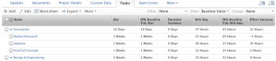

# 보기: 작업 보기의 기간 및 계획 작업에 대한 베이스라인 차이

이 보기는 작업 보기에 다음을 표시합니다.

* 초기 계획 작업 정보가 있는 작업 정보입니다.
* 지속 시간과 기본 베이스라인 지속 기간의 차이입니다.
* 계획 작업량과 기본 베이스라인 계획 작업물 간의 차이입니다.

>[!NOTE]
>
> 다음 보기에 표시된 데이터는 실제 작업 값을 기본 베이스라인 작업과 연관된 값과 비교합니다.

 

## 액세스 요구 사항

이 문서의 절차를 수행하려면 다음 액세스 권한이 있어야 합니다.

<table style="table-layout:auto"> 
 <col> 
 <col> 
 <tbody> 
  <tr> 
   <td role="rowheader">Adobe Workfront 플랜*</td> 
   <td> 
모든
 </td> 
  </tr> 
  <tr> 
   <td role="rowheader">Adobe Workfront 라이선스*</td> 
   <td> 
플랜 
 </td> 
  </tr> 
  <tr> 
   <td role="rowheader">액세스 수준 구성*</td> 
   <td> 
보고서, 대시보드, 달력에 대한 액세스 편집
 
필터, 보기, 그룹화에 대한 액세스 편집
 
참고: 여전히 액세스 권한이 없는 경우 Workfront 관리자에게 액세스 수준에서 추가 제한 사항을 설정하는지 문의하십시오. Workfront 관리자가 액세스 수준을 수정하는 방법에 대한 자세한 내용은 <a href="../../../administration-and-setup/add-users/configure-and-grant-access/create-modify-access-levels.md" class="MCXref xref">사용자 정의 액세스 수준 만들기 또는 수정</a>.
 </td> 
  </tr> 
  <tr> 
   <td role="rowheader">개체 권한</td> 
   <td> 
보고서에 대한 권한 관리
 
추가 액세스 요청에 대한 자세한 내용은 <a href="../../../workfront-basics/grant-and-request-access-to-objects/request-access.md" class="MCXref xref">개체에 대한 액세스 요청 </a>.
 </td> 
  </tr> 
 </tbody> 
</table>

&#42;어떤 계획, 라이선스 유형 또는 액세스 권한을 보유하고 있는지 알아보려면 Workfront 관리자에게 문의하십시오.

## 작업 뷰에서 기간 및 계획 작업의 베이스라인 차이 보기

1. 작업 목록으로 이동합니다.
1. 에서 **보기** 드롭다운 메뉴에서 **새 보기**.

1. 첫 번째 열을 제외하고 뷰의 모든 열을 제거합니다.
1. 첫 번째 열을 선택한 상태에서 **텍스트 모드로 전환**.
1. 아래 텍스트를 복사하여 보기의 첫 번째 열에 붙여넣습니다.

   <pre>column.0.descriptionkey=name column.0.link.linkproperty.0.name=ID column.0.link.linkproperty.0.valuefield=ID column.0.link.linkproperty.0.valueformat=int column.0.link.lookup=link.view column.0.link.valuefield=objCode column.0.link.valueformat=val column.0.linkedname=direct column.0.listsort=string(name) column.0.namekey=name.abbr column.0.querysort=name column.0.shortview=false column.0.stretch=100 column.0.valufield=name column.0.valueformat=HTML column.0.width=150 column.0.displayname=작업 이름 column.1.descriptionkey=duration column.1.linkedname=direct column.1.listsort=intAsInt(durationMinutes) column.1.namekey=duration.abbr column.1.querysort=durationMinutes column.1.shortview=false column.1.stretch=0 column.1.valuefield=durationFieldLong column.1.valueformat=compound column.1.viewalias=duration column.1.width=100 column.1.displayname=작업 기간 column.2.descriptionkey=view.relatedcolumn column.2.description keyargkey.0=defaultbaselinetask column.2.descriptionkeyargkey.1=duration column.2.linkedname=defaultBaselineTask column.2.listsort=intAsInt(durationMinutes) column.2.namekey=duration column.2.namekeyargkey.0=defaultbaselinetask.abbr column.2.namekeyargkey.1=duration.abr column.2.querysort=defaultBaselineTask:durationMinutes column.2.shortview=false column.2.stretch=0 column.2.valuefield=defaultBaselineTask:durationFieldLong column.2.valueformat=compound column.2.viewalias=defaultBaselineTask:duration column.2.width=100 column.2.displayname=Dflt 기준선 태그: 기간 column.2.durationunitfield=durationUnit.value column.3.description=Duration Variance"column.3.linkedname=direct column.3.listsort=intAsInt(durationMinutes) column.3.name=기간 차이 column.3.querysort=durationMinutes column.3.shortview=false column.3.stretch=0 column.3.valueexpression=CONCAT(SUB({duration},{defaultBaselineTask}).{duration})/480,"일") column.3.valueformat=HTML column.3.viviewalias=duration column.3.width=100 column.3.displayname=Duration Variance column.4.description-key=workrequired column.4.linkedname=direct column.4.listsort=doubleAsDouble(workRequired) column.4.namekey=workrequired.abber column.4.querysort=workRequired column.4.shortview=false column.4.stretch=0 column.4.valuefield=workFieldLong column.4.valueformat=compound column.4.viewalias=workrequired column.4.width=100 column.4.displayname=Wrk Req column.5.descriptionkey=view.relatedcolumn column.5.description keyargkey.0=defaultbaselinetask column.5.descriptionkeyargkey.1=workrequired column.5.linkedname=defaultBaselineTask column.5.listsort=doubleAsDouble(workRequired) column.5.namekey=view.relatedcolumn column.5.namekeyargkey.0=defaultbaselinetask.abbr column.5.namekeyargkey.1=workrequired.abbr column.5.querysort=defaultBaselineTask:workRequired column.5.shortview=false column.5.stretch=0 column.5.valuefield=defaultBaselineTask:workFieldLong column.5.valueformat=compound column.5.viewalias=defaultBaselineTask:workrequired column.5.width=100 column.5.displayname=Dflt 기준선 태그: Req 작업 column.6.descriptionkey=workrequired column.6.linkedname=direct column.6.listsort=doubleAsDouble(workRequired) column.6.name=작업량 분산 column.6.querysort=workRequired column.6.shortview=false column.6.stretch=0 column.6.valueexpression=CONCAT(SUB({workRequired},{defaultBaselineTask}).{workRequired})/60," Hours") column.6.valueformat=HTML column.6.viewalias=workrequired column.6.width=100 column.6.displayname=투입 분산</pre>

1. 클릭 **보기 저장**.\
   
