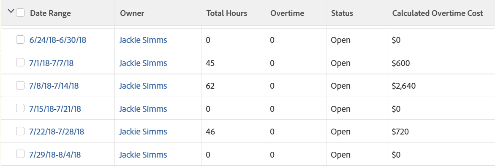

# 보기: 타임시트 보기에서 초과 작업 비용 계산

초과 근무는 Adobe Workfront에서 기본적으로 계산되지 않지만 초과 근무를 계산하는 타임시트 보고서를 만들 수 있습니다.

사용자가 프로필의 시간당 비용 비율과 연관되어 있으면 해당 사용자의 초과 작업 시간에 대한 비용을 계산할 수도 있습니다.\
사용자를 시간당 비용과 연결하는 방법에 대한 자세한 내용은 문서 를 참조하십시오 [내 설정 구성](../../../workfront-basics/manage-your-account-and-profile/configuring-your-user-profile/configure-my-settings.md).

>[!NOTE]
>
>목록 또는 보고서에서 타임시트 보기에 추가할 수 있는 초과 작업 시간 필드에는 타임시트의 초과 작업 시간 필드에 있는 정보가 표시됩니다. 이 정보는 타임시트를 수정할 수 있는 액세스 권한이 있는 사용자가 수동으로 업데이트합니다. 타임시트의 초과 작업 시간 필드에 대한 자세한 내용은 이 문서 를 참조하십시오 [타임시트 레이아웃 개요](../../../timesheets/timesheets/timesheet-layout.md).

## 액세스 요구 사항

이 문서의 단계를 수행하려면 다음 액세스 권한이 있어야 합니다.

<table style="table-layout:auto"> 
 <col> 
 <col> 
 <tbody> 
  <tr> 
   <td role="rowheader">Adobe Workfront 플랜*</td> 
   <td> 
임의
 </td> 
  </tr> 
  <tr> 
   <td role="rowheader">Adobe Workfront 라이센스*</td> 
   <td> 
보기 수정 요청 

   
보고서 수정 계획
 </td> 
  </tr> 
  <tr> 
   <td role="rowheader">액세스 수준 구성*</td> 
   <td> 
보고서, 대시보드, 캘린더에 대한 액세스 권한을 편집하여 보고서 수정
 
필터, 보기, 그룹화에 대한 액세스 권한을 편집하여 보기 수정
 
<b>메모</b>

여전히 액세스 권한이 없는 경우 Workfront 관리자에게 액세스 수준에 추가 제한을 설정하는지 문의하십시오. Workfront 관리자가 액세스 수준을 수정하는 방법에 대한 자세한 내용은 <a href="../../../administration-and-setup/add-users/configure-and-grant-access/create-modify-access-levels.md" class="MCXref xref">사용자 정의 액세스 수준 만들기 또는 수정</a>.
 </td>
</tr> 
  <tr> 
   <td role="rowheader">개체 권한</td> 
   <td> 
보고서에 대한 권한 관리
 
추가 액세스 요청에 대한 자세한 내용은 <a href="../../../workfront-basics/grant-and-request-access-to-objects/request-access.md" class="MCXref xref">오브젝트에 대한 액세스 요청 </a>.
 </td> 
  </tr> 
 </tbody> 
</table>

&#42;보유 중인 플랜, 라이선스 유형 또는 액세스 권한을 확인하려면 Workfront 관리자에게 문의하십시오.

## 타임시트 보기에서 초과 작업 비용 계산

타임시트 보기에 계산된 초과 작업 시간 열을 추가하려면 다음을 수행합니다.

1. 타임시트 목록으로 이동하거나 타임시트 보고서를 만듭니다.

   보고서 만들기에 대한 자세한 내용은 문서 를 참조하십시오 [사용자 지정 보고서 만들기](../../../reports-and-dashboards/reports/creating-and-managing-reports/create-custom-report.md).

1. 클릭 **보기 맞춤화** 타임시트 목록.

   또는

   다음 항목 선택 **열(보기)** 타임시트 보고서의 탭

1. **열 추가**&#x200B;를 클릭합니다.
1. 클릭 **텍스트 모드로 전환**.
1. 다음에서 **이 열에 표시** 영역, 클릭 **텍스트를 편집하려면 클릭**.
1. 다음 텍스트 모드 코드를 복사하여 **텍스트 모드** 대화 상자.
   <pre>displayname=계산된 초과 작업 비용 linkedname=direct namekey=totalHours querysort=totalHours  textmode=true valueexpression=IF({totalHours}&gt;40,({totalHours}-40)*{user}.{costPerHour},{totalHours}*{user}.{costPerHour}) valueformat=currencyStringCurrencyRounded</pre>

   >[!NOTE]
   >
   >이 계산에서는 사용자가 일반적으로 일주일에 40시간 일한다고 가정합니다.

1. 클릭 **저장**&#x200B;를 클릭한 다음 새 보기의 이름을 지정하고 을 클릭합니다. **보기 저장** 타임시트 목록.

   또는

   클릭 **저장 + 닫기** 타임시트 보고서에서 참조할 수 있습니다.

1. (선택 사항 및 조건부) 타임시트 보고서를 작성하는 경우 보고서 이름을 지정하고 **보고서 저장**.

   각 사용자의 초과 근무 비용은 **계산된 초과 작업 비용** 열.

   
