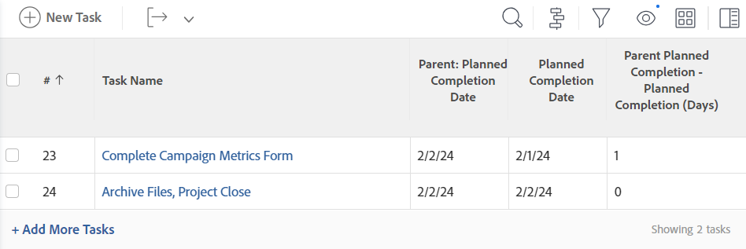

# 보기: 시간 및 날짜 차이 계산

<!-- Audited: 11/2024 -->

>[!IMPORTANT]
>
>Adobe Workfront에서 같은 종류의 서로 다른 두 개체 간 시간 및 날짜 차이를 계산할 수 없습니다. 예를 들어, 서로 다른 두 프로젝트, 태스크 또는 문제에 대해서는 두 일자 간의 시간 및 일자 차이를 계산할 수 없습니다.

다음 항목 간의 차이를 계산할 수 있습니다.

* 동일한 오브젝트에 있는 두 날짜 필드 간의 시간 및 날짜 차이
* 개체의 필드와 부모 개체의 다른 필드 사이의 시간 및 날짜 차이입니다

>[!TIP]
>
>이 계산에는 두 날짜 사이의 일 수가 표시됩니다. 결과는 일 단위로 표시됩니다. 날짜 필드의 타임스탬프도 고려되며, 타임스탬프가 일치하지 않으면 일 수 뒤에 소수가 올 수 있습니다. 작업이 늦게 완료된 경우 일 수가 음수 값으로 표시됩니다.

## 액세스 요구 사항

+++ 이 문서의 기능에 대한 액세스 요구 사항을 보려면 확장하십시오.

<table style="table-layout:auto"> 
 <col> 
 <col> 
 <tbody> 
  <tr> 
   <td role="rowheader">Adobe Workfront 패키지</td> 
   <td> <p>Any</p> </td> 
  </tr> 
  <tr> 
   <td role="rowheader">Adobe Workfront 라이선스</td> 
   <td> 
   <p>참여자 또는 필터 수정 요청 </p>
   <p>표준 또는 보고서 수정 계획</p>
  </tr> 
  <tr> 
   <td role="rowheader">액세스 수준 구성</td> 
   <td> <p>보고서, 대시보드, 캘린더에 대한 액세스 권한을 편집하여 보고서 수정</p> <p>필터, 보기, 그룹화에 대한 액세스 권한을 편집하여 필터 수정</p> </td> 
  </tr> 
  <tr> 
   <td role="rowheader">개체 권한</td> 
   <td> <p>보고서에 대한 권한 관리</p>  </td> 
  </tr> 
 </tbody> 
</table>

이 표의 정보에 대한 자세한 내용은 [Workfront 설명서의 액세스 요구 사항](/help/quicksilver/administration-and-setup/add-users/access-levels-and-object-permissions/access-level-requirements-in-documentation.md)을 참조하십시오.

+++

## 동일한 개체에 있는 두 날짜 필드 간의 시간 및 날짜 차이 계산

예를 들어, 태스크의 계획 완료 일자와 실제 완료 일자 간의 차이를 계산할 수 있습니다.


1. 작업 목록으로 이동합니다.
1. **보기** 드롭다운 메뉴에서 **새 보기**&#x200B;를 클릭합니다.

1. **열 추가**&#x200B;를 클릭하고 **이 열에 표시** 필드에 &quot;계획된 완료 일자&quot;를 입력한 다음 목록에 표시될 때 선택합니다.

1. **열 추가**&#x200B;를 클릭하고 **이 열에 표시** 필드에 &quot;실제 완료 날짜&quot;를 입력한 다음 목록에 표시될 때 선택합니다.

1. **열 추가**&#x200B;를 클릭한 다음 **텍스트 모드로 전환**&#x200B;을 클릭합니다.

1. 텍스트 모드 영역 위로 마우스를 가져간 후 **텍스트를 편집하려면 클릭**&#x200B;합니다.
1. **텍스트 모드** 상자에서 찾은 텍스트를 제거하고 다음 코드로 바꿉니다.

   ```
    displayname=Planned-Actual Completion Date
    linkedname=direct
    querysort=plannedCompletionDate
    textmode=true
    valueexpression=ROUND(DATEDIFF({plannedCompletionDate},{actualCompletionDate}),2)
    valueformat=HTML
   ```

1. **저장**&#x200B;을 클릭한 다음 **보기 저장**&#x200B;을 클릭하세요.

## 개체의 필드와 부모 개체의 다른 필드 간에 시간 및 날짜 차이를 계산합니다.

개체 및 해당 부모 목록은 [Adobe Workfront에서 개체 이해](../../../workfront-basics/navigate-workfront/workfront-navigation/understand-objects.md)의 &quot;개체의 상호 종속성 및 계층 구조 이해&quot; 섹션을 참조하십시오.\
예를 들어, 태스크의 계획 완료 일자와 해당 상위 태스크 또는 태스크가 있는 프로젝트의 계획 완료 일자 간의 차이를 계산할 수 있습니다.



1. 작업 목록으로 이동합니다.
1. **보기** 드롭다운 메뉴에서 **새 보기**&#x200B;를 클릭합니다.

1. **열 추가**&#x200B;를 클릭하고 **이 열에 표시** 필드에 &quot; 프로젝트 계획 완료 날짜&quot; 또는 &quot;상위 완료 날짜&quot;를 입력한 다음 목록에 표시될 때 선택합니다.

1. **열 추가**&#x200B;를 클릭하고 **이 열에 표시** 필드에 &quot;계획된 완료 일자&quot;를 입력한 다음 목록에 표시될 때 선택합니다.

1. **열 추가**&#x200B;를 클릭한 다음 **텍스트 모드로 전환** > **텍스트 모드 편집**&#x200B;을 클릭합니다.
1. **텍스트 모드 편집** 상자에서 찾은 텍스트를 제거하고 다음 코드 중 하나로 바꿉니다.

   * 프로젝트의 계획 완료 일자와 태스크의 계획 완료 일자 간의 차이를 표시하려면

     ```
      displayname=Project Planned Completion - Task Planned Completion (Days)
      textmode=true
      valueexpression=ROUND(DATEDIFF({project}.{plannedCompletionDate},{plannedCompletionDate}),2)
      valueformat=HTML
     ```

   * 상위 태스크의 계획 완료 일자와 태스크의 계획 완료 일자 간의 차이를 표시하려면

     ```
      valueexpression=ROUND(DATEDIFF({parent}.{plannedCompletionDate},{plannedCompletionDate}),2)
      textmode=true<br>valueformat=HTML
      displayname=Parent Planned Completion - Planned Completion (Days)
     ```

1. **완료**&#x200B;를 클릭한 다음 **보기 저장**&#x200B;을 클릭합니다.
