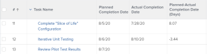

# 보기: 시간 및 날짜 차이 계산

>[!IMPORTANT]
>
>같은 종류의 서로 다른 두 개체 간에 Adobe Workfront의 시간 및 날짜 차이를 계산할 수 없습니다. 예를 들어, 서로 다른 두 프로젝트, 작업 또는 문제에 대해 두 날짜 간의 시간 및 날짜 차이를 계산할 수 없습니다.

다음 간 차이를 계산할 수 있습니다.

* 동일한 개체에 있는 두 날짜 필드 간의 시간 및 날짜 차이입니다
* 개체의 필드와 상위 개체의 다른 필드 간의 시간 및 날짜 차이입니다

>[!TIP]
>
>이러한 계산은 두 날짜 사이의 일자 수를 표시합니다. 결과가 일 단위로 표시됩니다. 날짜 필드의 타임스탬프도 고려되며, 타임스탬프가 일치하지 않는 경우 일 수 뒤에 소수 자릿수가 올 수 있습니다. 작업이 늦게 완료된 경우 일 수가 음수 값으로 표시됩니다.

## 액세스 요구 사항

이 문서의 절차를 수행하려면 다음 액세스 권한이 있어야 합니다.

<table style="table-layout:auto"> 
 <col> 
 <col> 
 <tbody> 
  <tr> 
   <td role="rowheader">Adobe Workfront 플랜*</td> 
   <td> <p>모든</p> </td> 
  </tr> 
  <tr> 
   <td role="rowheader">Adobe Workfront 라이선스*</td> 
   <td> <p>플랜 </p> </td> 
  </tr> 
  <tr> 
   <td role="rowheader">액세스 수준 구성*</td> 
   <td> <p>보고서, 대시보드, 달력에 대한 액세스 편집</p> <p>필터, 보기, 그룹화에 대한 액세스 편집</p> <p>참고: 여전히 액세스 권한이 없는 경우 Workfront 관리자에게 액세스 수준에서 추가 제한 사항을 설정하는지 문의하십시오. Workfront 관리자가 액세스 수준을 수정하는 방법에 대한 자세한 내용은 <a href="../../../administration-and-setup/add-users/configure-and-grant-access/create-modify-access-levels.md" class="MCXref xref">사용자 정의 액세스 수준 만들기 또는 수정</a>.</p> </td> 
  </tr> 
  <tr> 
   <td role="rowheader">개체 권한</td> 
   <td> <p>보고서에 대한 권한 관리</p> <p>추가 액세스 요청에 대한 자세한 내용은 <a href="../../../workfront-basics/grant-and-request-access-to-objects/request-access.md" class="MCXref xref">개체에 대한 액세스 요청 </a>.</p> </td> 
  </tr> 
 </tbody> 
</table>

&#42;어떤 계획, 라이선스 유형 또는 액세스 권한을 보유하고 있는지 알아보려면 Workfront 관리자에게 문의하십시오.

## 동일한 개체에 있는 두 날짜 필드 간의 시간 및 날짜 차이를 계산합니다

예를 들어, 계획 완료 일자와 작업의 실제 완료 일자 간의 차이를 계산할 수 있습니다.



1. 작업 목록으로 이동합니다.
1. 에서 **보기** 드롭다운 메뉴에서 **새 보기**.

1. 클릭 **열 추가** 그리고 &quot;계획된 완료 날짜&quot;를 **이 열에 표시** 필드를 선택한 다음 목록에 표시될 때 선택합니다.

1. 클릭 **열 추가** 그리고 &quot;실제 완료 날짜&quot;를 **이 열에 표시** 필드를 선택한 다음 목록에 표시될 때 선택합니다.

1. 클릭 **열 추가**&#x200B;를 클릭한 다음 **텍스트 모드로 전환**.

1. 텍스트 모드 영역을 마우스로 가리킨 다음 **텍스트를 편집하려면 클릭하십시오.**.
1. 에서 찾을 텍스트를 제거합니다. **텍스트 모드** 상자를 열고 다음 코드로 바꿉니다.

   ```
   displayname=Planned-Actual Completion Date<br>linkedname=direct<br>querysort=plannedCompletionDate<br>textmode=true<br>valueexpression=ROUND(DATEDIFF({plannedCompletionDate},{actualCompletionDate}),2)<br>valueformat=HTML
   ```

1. 클릭 **저장**, 그런 다음 **보기 저장**.

## 개체의 필드와 상위 개체의 다른 필드 간의 시간 및 날짜 차이를 계산합니다

객체 및 그 상위 목록에 대해서는 [Adobe Workfront의 개체 이해](../../../workfront-basics/navigate-workfront/workfront-navigation/understand-objects.md).\
예를 들어, 태스크의 계획 완료 일자와 상위 태스크의 계획 완료 일자 또는 태스크가 설정된 프로젝트의 차이를 계산할 수 있습니다.


1. 작업 목록으로 이동합니다.
1. 에서 **보기** 드롭다운 메뉴에서 **새 보기**.

1. 클릭 **열 추가** 그리고 &quot;프로젝트 계획 완료 날짜&quot; 또는 &quot;상위 완료 날짜&quot;를 입력하기 시작합니다 **이 열에 표시** 필드를 선택한 다음 목록에 표시될 때 선택합니다.

1. 클릭 **열 추가** 그리고 &quot;계획된 완료 날짜&quot;를 **이 열에 표시** 필드를 선택한 다음 목록에 표시될 때 선택합니다.

1. 클릭 **열 추가**&#x200B;를 클릭한 다음 **텍스트 모드로 전환**.

1. 텍스트 모드 영역을 마우스로 가리킨 다음 **텍스트를 편집하려면 클릭하십시오.**.
1. 에서 찾을 텍스트를 제거합니다. **텍스트 모드** 상자를 열고 다음 코드 중 하나로 바꿉니다.

   * 프로젝트의 계획 완료 일자와 태스크의 차이를 표시하려면

      ```
      displayname=Project Planned Completion - Task Planned Completion (Days)<br>textmode=true<br>valueexpression=ROUND(DATEDIFF({project}.{plannedCompletionDate},{plannedCompletionDate}),2)<br>valueformat=HTML
      ```

   * 상위 태스크의 계획 완료 일자와 태스크의 차이 표시 방법:

      ```
      valueexpression=ROUND(DATEDIFF({parent}.{plannedCompletionDate},{plannedCompletionDate}),2)<br>textmode=true<br>valueformat=HTML<br>displayname=Parent Planned Completion - Planned Completion (Days)
      ```

1. 클릭 **저장**, 그런 다음 **보기 저장**.
