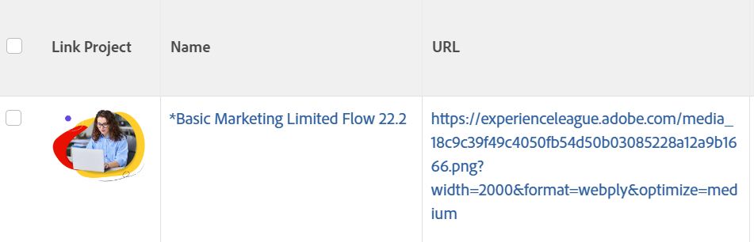

# 보기: 열에 문자열 대신 이미지 표시

<!--Audited: 11/2024-->

텍스트 모드를 사용하여 뷰의 개체 이름을 이미지로 바꿀 수 있습니다. 교체하는 오브젝트를 열 수 있는 이미지에 링크를 추가할 수도 있습니다.

>[!NOTE]
>
>이미지는 실제 해상도로 나타나므로 작은 이미지를 사용하십시오.



## 액세스 요구 사항

+++ 을 확장하여 이 문서의 기능에 대한 액세스 요구 사항을 봅니다.

이 문서의 단계를 수행하려면 다음 액세스 권한이 있어야 합니다.

<table style="table-layout:auto"> 
 <col> 
 <col> 
 <tbody> 
  <tr> 
   <td role="rowheader">Adobe Workfront 플랜</td> 
   <td> <p>임의</p> </td> 
  </tr> 
  <tr> 
   <td role="rowheader">Adobe Workfront 라이센스*</td> 
   <td> 
    <p>신규:</p>
   <ul><li><p>필터를 수정하는 기여자 </p></li>
   <li><p>보고서를 수정하는 표준</p></li> </ul>

<p>현재:</p>
   <ul><li><p>필터 수정 요청 </p></li>
   <li><p>보고서 수정 계획</p></li> </ul></td> 
  </tr> 
  <tr> 
   <td role="rowheader">액세스 수준 구성</td> 
   <td> <p>보고서, 대시보드, 캘린더에 대한 액세스 권한을 편집하여 보고서 수정</p> <p>필터, 보기, 그룹화에 대한 액세스 권한을 편집하여 필터 수정</p> </td> 
  </tr> 
  <tr> 
   <td role="rowheader">개체 권한</td> 
   <td> <p>보고서에 대한 권한 관리</p>  </td> 
  </tr> 
 </tbody> 
</table>

*자세한 내용은 [Workfront 설명서의 액세스 요구 사항](/help/quicksilver/administration-and-setup/add-users/access-levels-and-object-permissions/access-level-requirements-in-documentation.md)을 참조하십시오.

+++

## 예: 프로젝트 보기의 프로젝트 이름을 이미지로 바꿉니다.

1. Adobe Workfront 외부의 웹 사이트 또는 서버에 이미지를 업로드합니다. 웹 브라우저를 사용하여 이미지에 액세스할 수 있어야 합니다.

   >[!TIP]
   >
   >* 모든 브라우저 유형은 다르지만 모두 URL을 표시할 수 있습니다.
   >* Workfront에 업로드된 이미지를 사용하지 마십시오. Workfront에 저장된 이미지는 공개적으로 사용할 수 없으며 일정 시간이 지나면 만료되는 액세스 키가 있으므로 시간이 지남에 따라 보기에서 이미지가 표시되지 않습니다.
   >* 컴퓨터에 저장된 이미지에 고유한 URL이 없습니다. 이미지 호스팅을 제공하는 사이트를 찾아 해당 사이트에서 이미지를 호스팅합니다. 조직에 이미 이러한 사이트가 있을 수 있습니다.

1. 웹 브라우저를 사용하여 저장한 이미지로 이동합니다.
1. 다음을 수행하여 이미지의 URL을 얻습니다.

   <!--
   <p data-mc-conditions="QuicksilverOrClassic.Draft mode">(NOTE: I used this blog post to document what kind of image we need for this: https://www.canto.com/blog/image-url/ (consulting uses this)) </p>
   -->

   1. 마우스 오른쪽 단추를 클릭하고 브라우저에 따라 **이미지 위치 복사** 또는 **링크 가져오기**&#x200B;를 선택합니다. 이제 해당 특정 이미지에 대한 URL이 있으며 클립보드에서 붙여넣을 수 있습니다.
   1. 해당 링크를 가진 모든 사람이 링크로 이동하여 이미지를 볼 수 있는 권한이 있고, 링크에 액세스하기 위해 로그인하지 않아도 되는지 확인하십시오.

1. 프로젝트로 이동하여 프로젝트 이름 옆에 있는 **자세히** 메뉴 을(를) 클릭한 다음 **편집**&#x200B;을(를) 클릭합니다.

1. **URL** 필드에서 이미지에 링크를 추가합니다.
1. 프로젝트 목록에서 프로젝트 보기로 이동합니다.
1. **보기** 드롭다운 메뉴를 클릭한 다음 **새 보기**&#x200B;를 클릭합니다.
1. **프로젝트 이름**&#x200B;에 대한 열의 헤더를 클릭한 다음 **텍스트 모드로 전환**&#x200B;을 클릭합니다.

1. 열에 다음 코드를 기존 코드에 추가합니다.

   ```
   displayname=Link Project
   image.name=Link Project
   image.valuefield=URL
   link.linkproperty.0.name=projectID
   link.linkproperty.0.value=ID
   link.lookup=link.edit
   link.page=/view
   link.valuefield=objCode
   link.valueformat=val
   textmode=true
   type=image
   valueformat=
   ```

1. **완료** > **보기 저장**을 클릭합니다.
선택한 이미지는 프로젝트 보기에서 프로젝트 이름을 대체하며 이미지는 프로젝트에 대한 링크입니다.