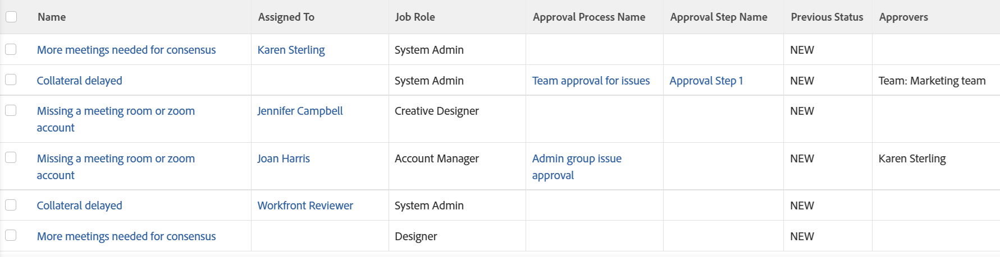

# 보기: 승인 정보 관련 문제

다음 문제 보기에는 승인 프로세스, 단계, 승인자 이름 및 승인이 승인되기 전 문제의 상태가 표시됩니다. 이러한 필드 중 일부는 표준 인터페이스 빌더를 통해 액세스할 수 없습니다.

## 액세스 요구 사항

이 문서의 단계를 수행하려면 다음 액세스 권한이 있어야 합니다.

<table style="table-layout:auto"> 
 <col> 
 <col> 
 <tbody> 
  <tr> 
   <td role="rowheader">Adobe Workfront 플랜*</td> 
   <td> 
모든
 </td> 
  </tr> 
  <tr> 
   <td role="rowheader">Adobe Workfront 라이센스*</td> 
   <td> 
보기 수정 요청 

   
보고서 수정 계획
 </td> 
  </tr> 
  <tr> 
   <td role="rowheader">액세스 수준 구성*</td> 
   <td> 
보고서, 대시보드, 캘린더에 대한 액세스 권한을 편집하여 보고서 수정
 
필터, 보기, 그룹화에 대한 액세스 권한을 편집하여 보기 수정
 
<b>메모</b>

여전히 액세스 권한이 없는 경우 Workfront 관리자에게 액세스 수준에 추가 제한을 설정하는지 문의하십시오. Workfront 관리자가 액세스 수준을 수정하는 방법에 대한 자세한 내용은 <a href="../../../administration-and-setup/add-users/configure-and-grant-access/create-modify-access-levels.md" class="MCXref xref">사용자 정의 액세스 수준 만들기 또는 수정</a>.
 </td>
</tr> 
  <tr> 
   <td role="rowheader">개체 권한</td> 
   <td> 
보고서에 대한 권한 관리
 
추가 액세스 요청에 대한 자세한 내용은 <a href="../../../workfront-basics/grant-and-request-access-to-objects/request-access.md" class="MCXref xref">오브젝트에 대한 액세스 요청 </a>.
 </td> 
  </tr> 
 </tbody> 
</table>

&#42;보유 중인 플랜, 라이선스 유형 또는 액세스 권한을 확인하려면 Workfront 관리자에게 문의하십시오.

## 승인 정보 관련 문제 보기

1. 문제 목록으로 이동합니다.
1. 다음에서 **보기** 드롭다운 메뉴에서 다음을 선택합니다. **새 보기**.

1. 다음에서&#x200B;**열 미리보기** 영역을 제외한 모든 열을 제거합니다.
1. 나머지 열의 헤더를 클릭한 다음 **텍스트 모드로 전환**.
1. 텍스트 모드 영역 위로 마우스를 가져간 다음 **텍스트를 편집하려면 클릭**.
1. 에서 찾은 텍스트 제거 **텍스트 모드** 확인란을 선택하고 다음 코드로 바꿉니다.
   <pre style="font-style: normal;">column.0.descriptionkey=name column.0.link.linkproperty.0.name=ID column.0.link.linkproperty.0.valuefield=ID column.0.link.linkproperty.0.valueformat=int column.0.link.lookup=link.view column.0.link.valuefield=objCode column.0.link.valueformat=val column.0.linkedname=direct column.0.listsort=string(name) column.0.namekey=name.abbr column.0.querysort=name column.0.shortview=false column.0.stretch=40 column.0.valuefield=name column.0.valueformat=HTML column.0.width=220 column.1.descriptionkey=assignedto column.1.linkedname=assignedTo column.1.listsort=nested(assignedTo).string(name) column.1.namekey=assignedto column.1.querysort=assignedTo:name column.1.shortview=true column.1.stretch=0 column.1.valuefield=assignedTo:name column.1.valueformat=HTML column.1.width=150 column.2.descriptionkey=role column.2.linkedname=role column.2.listsort=nested(role).string(name) column.2.namekey=role column.2.querysort=role:name column.2.shortview=false column.2.stretch=25 column.2.valuefield=role:name column.2.valueformat=HTML column.2.width=150 column.3.description=승인 프로세스 이름 column.3.linkedname=direct column.3.listsort=string(name) column.3.name=승인 프로세스 이름 column.3.querysort=name column.3.shortview=false column.3.stretch=35 column.3.valuefield=approvalProcess:name column.3.valueformat=HTML column.3.width=220 column.4.description=승인 단계 이름 column.4.linkedname=direct column.4.listsort=string(name) column.4.name=승인 단계 이름 column.4.querysort=name column.4.shortview=false column.4.stretch=0 column.4.valuefield=currentApprovalStep:name column.4.valueformat=HTML column.4.width=220 column.5.description=이전 상태 column.5.linkedname=direct column.5.listsort=string(name) column.5.name=이전 상태 column.5.querysort=name column.5.shortview=false column.5.stretch=0 column.5.valuefield=previousStatus column.5.valueformat=HTML column.5.width=220 column.6.linkedname=direct column.6.listsort=HTML(approversString) column.6.namekey=approver.plural.abbr column.6.querysort=approversString column.6.shortview=false column.6.stretch=0 column.6.valuefield=approversString column.6.valueformat=HTML column.6.viewalias=approver.plural column.6.width=200 </pre>

1. 클릭 **보기 저장**.
