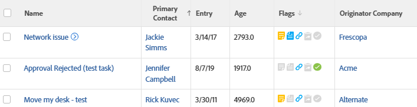

# 보기: 작성자의 회사 이름 관련 문제

<!--Audit: 11/2024-->

이 문제 보기에는 문제를 제출한 사용자와 연결된 회사 이름이 표시됩니다.



## 액세스 요구 사항

+++ 을 확장하여 이 문서의 기능에 대한 액세스 요구 사항을 봅니다.

이 문서의 단계를 수행하려면 다음 액세스 권한이 있어야 합니다.

<table style="table-layout:auto"> 
 <col> 
 <col> 
 <tbody> 
  <tr> 
   <td role="rowheader">Adobe Workfront 플랜</td> 
   <td> <p>임의</p> </td> 
  </tr> 
  <tr> 
   <td role="rowheader">Adobe Workfront 라이선스</td> 
   <td> <p>신규:<ul><li>보기를 수정하는 기여자</li><li>보고서를 수정하는 표준</li></ul></p><p>또는</p>현재:<ul><li>보기 수정 요청</li><li>보고서 수정 계획</li></ul></p> </td> 
  </tr> 
  <tr> 
   <td role="rowheader">액세스 수준 구성</td> 
   <td> <p>보고서, 대시보드, 캘린더에 대한 액세스 권한을 편집하여 보고서 수정</p> <p>필터, 보기, 그룹화에 대한 액세스 권한을 편집하여 보기 수정</p> </td> 
  </tr>  
  <tr> 
   <td role="rowheader">개체 권한</td> 
   <td> <p>보고서에 대한 권한 관리</p> </td> 
  </tr> 
 </tbody> 
</table>

이 표의 정보에 대한 자세한 내용은 [Workfront 설명서의 액세스 요구 사항](/help/quicksilver/administration-and-setup/add-users/access-levels-and-object-permissions/access-level-requirements-in-documentation.md)을 참조하십시오.

+++

## 작성자의 회사 이름과 관련된 문제 보기

1. 문제 목록으로 이동합니다.
1. **보기** 드롭다운 메뉴에서 **새 보기**&#x200B;를 선택합니다.
1. **열 미리 보기** 영역에서 열을 제외한 모든 열을 제거하십시오.
1. 나머지 열의 머리글을 클릭하고 **텍스트 모드로 전환**&#x200B;을 클릭한 다음 **텍스트 모드 편집**&#x200B;을 클릭합니다.
1. **텍스트 모드 편집** 상자에서 찾은 텍스트를 제거하고 다음 코드로 바꿉니다.


   ```
   column.0.descriptionkey=name
   column.0.link.linkproperty.0.name=ID
   column.0.link.linkproperty.0.valuefield=ID
   column.0.link.linkproperty.0.valueformat=val
   column.0.link.lookup=link.view
   column.0.link.value=val(objCode)
   column.0.listsort=string(name)
   column.0.namekey=name
   column.0.querysort=name
   column.0.valuefield=name
   column.0.valueformat=HTML
   column.0.width=140
   column.1.descriptionkey=originator
   column.1.link.linkproperty.0.name=ID
   column.1.link.linkproperty.0.valuefield=ownerID
   column.1.link.linkproperty.0.valueformat=int
   column.1.link.lookup=link.view
   column.1.link.valuefield=owner:objCode
   column.1.link.valueformat=val
   column.1.listsort=nested(owner).string(name)
   column.1.namekey=originator.abbr
   column.1.querysort=owner:name
   column.1.valuefield=owner:name
   column.1.valueformat=HTML
   column.1.width=151
   column.2.descriptionkey=entrydate
   column.2.listsort=atDateAsAtDate(entryDate)
   column.2.namekey=entrydate.abbr
   column.2.querysort=entryDate
   column.2.valuefield=entryDate
   column.2.valueformat=atDate
   column.2.width=75
   column.3.descriptionkey=age
   column.3.listsort=doubleAsDouble(age)
   column.3.namekey=age
   column.3.querysort=age
   column.3.valuefield=howOld
   column.3.valueformat=val
   column.3.width=80
   column.4.viewalias=statusicons
   column.4.displayname=Flags
   column.4.linkedname=direct
   column.4.namekey=statusicons
   column.4.valuefield=
   column.4.valueformat=HTML
   column.4.querysort=
   column.4.tile.name=component.issuestatusicons
   column.4.tile.pdfcomponent=issueStatusIcons
   column.4.delimiter=
   column.4.tile.template=/WEB-INF/jsp/lists/components/issueStatusIcons.jsp
   column.5.description=Originator's Company Name
   column.5.link.linkproperty.0.name=ID
   column.5.link.linkproperty.0.valuefield=owner:companyID
   column.5.link.linkproperty.0.valueformat=int
   column.5.link.lookup=link.view
   column.5.link.valuefield=owner:company:objCode
   column.5.link.valueformat=val
   column.5.listsort=nested(owner:company).string(name)
   column.5.name=Originator Company
   column.5.querysort=owner:company:name
   column.5.valuefield=owner:company:name
   column.5.valueformat=HTML
   column.5.width=151
   ```

1. **완료** > **보기 저장**&#x200B;을 클릭합니다.
1. (선택 사항) 보기 이름을 업데이트한 다음 **보기 저장**&#x200B;을 클릭합니다.
