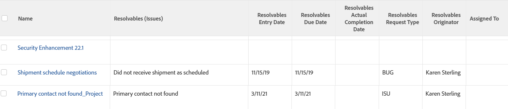

# 보기: 작업 및 프로젝트에 대한 시작 문제 세부 정보

문제를 작업 또는 프로젝트로 전환하면 작업 또는 프로젝트와 문제 간에 해결 중인 오브젝트 관계가 설정됩니다. 이 보기에는 작업 또는 프로젝트가 완료될 때 자동으로 완료되는 문제의 다음 필드가 표시됩니다.

* 이름
* 시작 날짜
* 계획된 완료 일자
* 실제 완료 일자
* 요청 유형
* 작성자 이름
* 할당 대상 사용자

자세한 내용은 [보기: 작업 및 프로젝트 목록에 원래 문제 정보 표시](../../../reports-and-dashboards/reports/custom-view-filter-grouping-samples/view-display-original-issue-info-task-project-list.md).

## 액세스 요구 사항

이 문서의 단계를 수행하려면 다음 액세스 권한이 있어야 합니다.

<table style="table-layout:auto"> 
 <col> 
 <col> 
 <tbody> 
  <tr> 
   <td role="rowheader">Adobe Workfront 플랜*</td> 
   <td> 
모든
 </td> 
  </tr> 
  <tr> 
   <td role="rowheader">Adobe Workfront 라이센스*</td> 
   <td> 
플랜 
 </td> 
  </tr> 
  <tr> 
   <td role="rowheader">액세스 수준 구성*</td> 
   <td> 
보고서, 대시보드, 캘린더에 대한 액세스 편집
 
필터, 보기, 그룹화에 대한 액세스 편집
 
참고: 여전히 액세스 권한이 없는 경우 Workfront 관리자에게 액세스 수준에서 추가 제한을 설정하는지 문의하십시오. Workfront 관리자가 액세스 수준을 수정하는 방법에 대한 자세한 내용은 <a href="../../../administration-and-setup/add-users/configure-and-grant-access/create-modify-access-levels.md" class="MCXref xref">사용자 정의 액세스 수준 만들기 또는 수정</a>.
 </td> 
  </tr> 
  <tr> 
   <td role="rowheader">개체 권한</td> 
   <td> 
보고서에 대한 권한 관리
 
추가 액세스 요청에 대한 자세한 내용은 <a href="../../../workfront-basics/grant-and-request-access-to-objects/request-access.md" class="MCXref xref">오브젝트에 대한 액세스 요청 </a>.
 </td> 
  </tr> 
 </tbody> 
</table>

&#42;보유 중인 플랜, 라이선스 유형 또는 액세스 권한을 확인하려면 Workfront 관리자에게 문의하십시오.

## 작업 및 프로젝트에 대한 원래 문제 세부 정보 보기

1. 작업 목록 또는 프로젝트 목록으로 이동합니다.
1. 다음에서 **보기** 드롭다운 메뉴에서 다음을 선택합니다. **새 보기**.

1. 다음에서&#x200B;**열 미리보기** 영역을 제외한 모든 열을 제거합니다.
1. 나머지 열의 헤더를 클릭한 다음 **텍스트 모드로 전환**.
1. 텍스트 모드 영역 위로 마우스를 가져간 다음 **텍스트를 편집하려면 클릭**.
1. 에서 찾은 텍스트 제거 **텍스트 모드** 확인란을 선택하고 다음 코드로 바꿉니다.

   <!-- [Copy](javascript:void(0);) -->
   <pre></pre>

1. 클릭 **보기 저장**.
